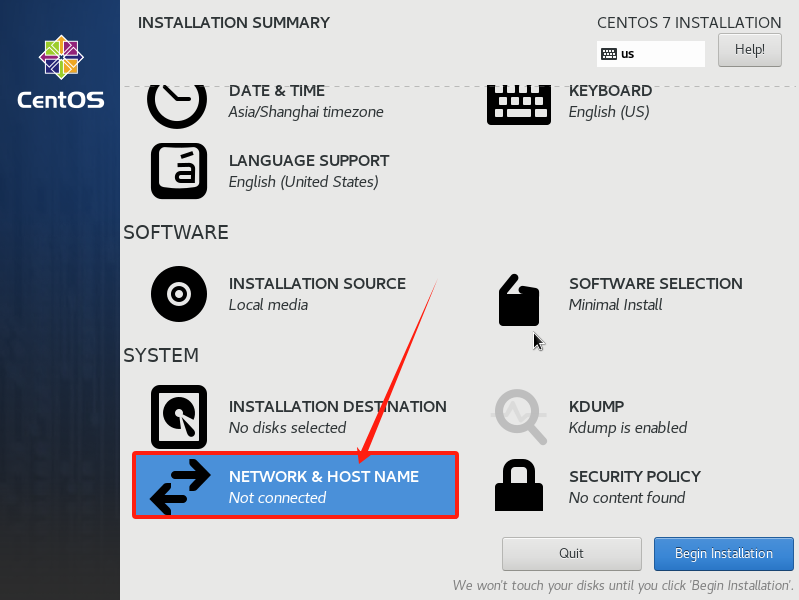
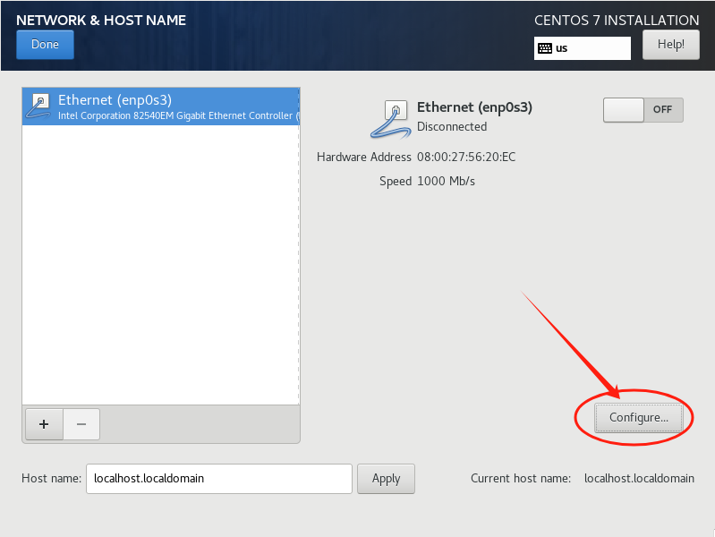
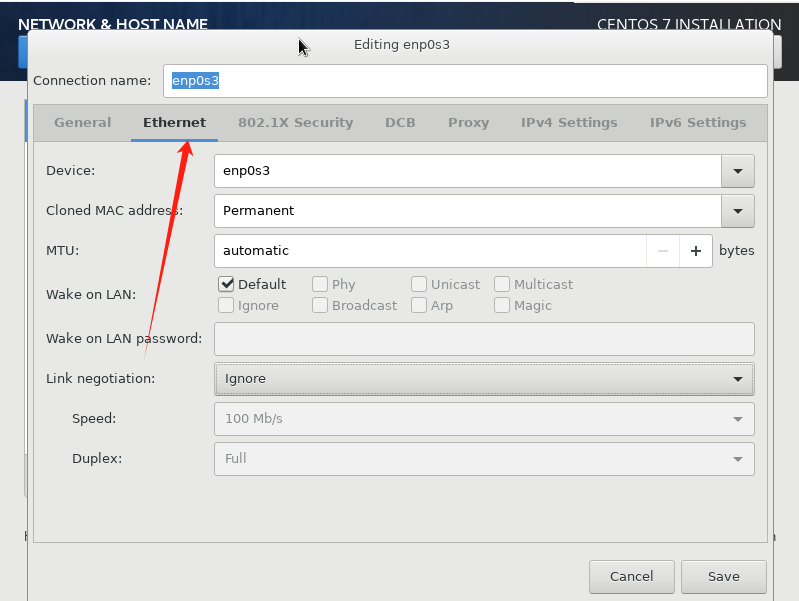
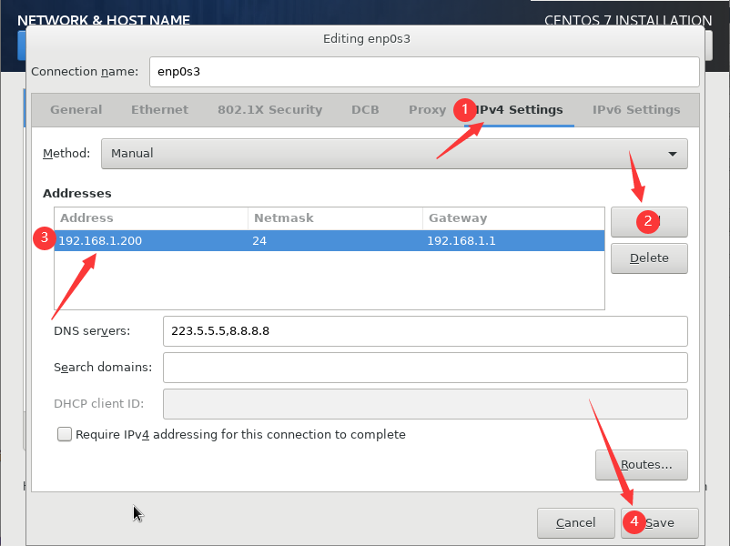
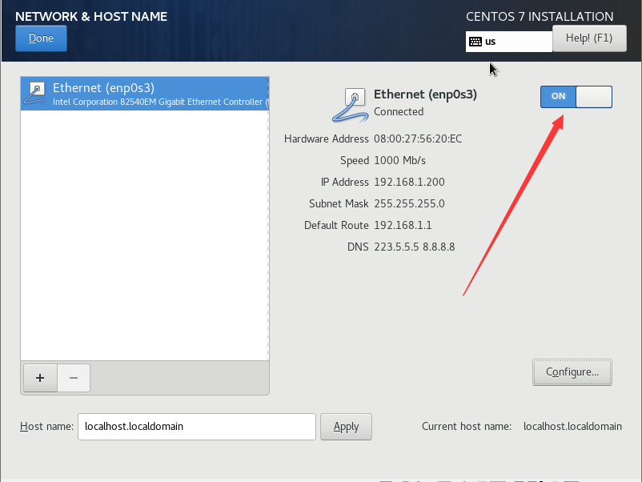
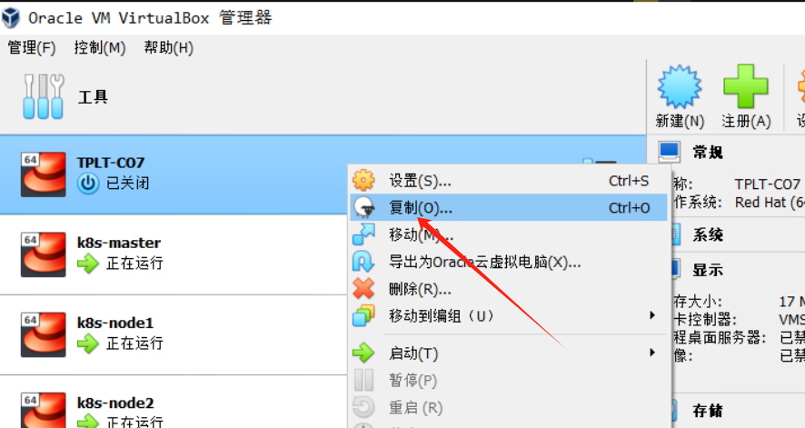
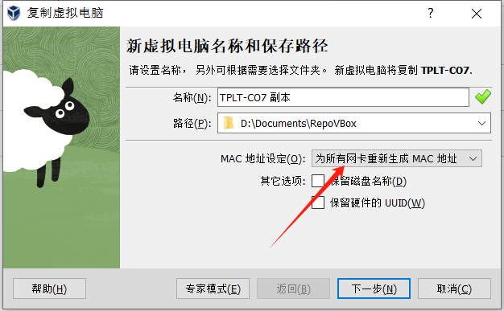

# VirtualBox安装COS7

## 初始化(最终方案)

折腾了`初始化方式1`和初`始化方式2`一个下午，最后发现：

只要在安装到界面的时候在`网络和主机名`中打开网络即可实现联网

下面是安装配置的步骤：

> 下面是安装的全过程，有的步骤不知道会不会有影响，反正全部都记录下来

### 安装CentOS7

- 安装过程中进入UI界面选择语言之后：

  - 选择`网络和主机名`，配置网络连接信息，包括IP、NETMASK、DNS、GATEWAY、Mac等信息

    

    

    

    

    

  - 其他的该怎么做就怎么做


### 测试配置

- 安装完成后修改虚拟机的网络连接为`桥接网络`

  - 根据桥接下面的MAC地址，修改系统网络配置中的`HWADDRESS`(这个操作可有可无)

- 测试网络连接

  - 虚拟机`ping`宿主机：`ping -c 4 192.168.1.3`
  - 宿主机`ping`虚拟机：`ping 192.168.1.100`
  - 虚拟机`ping`外网：`ping -c 4 www.baidu.com`

- 网卡默认配置

  ```properties
  TYPE="Ethernet"
  PROXY_METHOD="none"
  BROWSER_ONLY="no"
  BOOTPROTO="static"
  DEFROUTE="yes"
  IPV4_FAILURE_FATAL="no"
  IPV6INIT="yes"
  IPV6_AUTOCONF="yes"
  IPV6_DEFROUTE="yes"
  IPV6_FAILURE_FATAL="no"
  IPV6_ADDR_GEN_MODE="stable-privacy"
  NAME="enp0s3"
  UUID="88b5d3c2-91f5-4372-9665-7c33504e5fc2"
  DEVICE="enp0s3"
  ONBOOT="yes"
  IPADDR="192.168.1.200"
  PREFIX="24"
  GATEWAY="192.168.1.1"
  DNS1="223.5.5.5"
  DNS2="8.8.8.8"
  IPV6_PRIVACY="no"
  ```

- 网卡代理配置

  ```properties
  NAME="enp0s3"
  TYPE="Ethernet"
  PROXY_METHOD="none"
  BROWSER_ONLY="no"
  BOOTPROTO="static"
  DEFROUTE="yes"
  IPV4_FAILURE_FATAL="no"
  IPV6INIT="yes"
  IPV6_AUTOCONF="yes"
  IPV6_DEFROUTE="yes"
  IPV6_FAILURE_FATAL="no"
  IPV6_ADDR_GEN_MODE="stable-privacy"
  IPV6_PRIVACY="no"
  UUID="88b5d3c2-91f5-4372-9665-7c33504e5fc2"
  DEVICE="enp0s3"
  IPADDR="192.168.1.200"
  PREFIX="24"
  GATEWAY="192.168.1.1"
  DNS1="223.5.5.5"
  DNS2="8.8.8.8"
  ONBOOT="yes"
  
  HTTP_PROXY="http://192.168.1.3:10809"
  HTTPS_PROXY="https://192.168.1.3:10809"
  PROXY_USER="long"
  PROXY_PASS="123456"
  ```

### VBox虚拟机复制

在安装测试完毕之后需要复制虚拟机，有以下几个注意点：

1. 在设置源虚拟机的时候，注意删除掉Linux系统网络卡配置的UUID

2. 在复制虚拟机的时候，注意选项选择，完成之后需要修改网卡中的IP地址：

   

   

## 初始化方式1

> 本案例的结果：失败
>
> 网关能ping通，但是无法ping通外网

### VBox网络初始化

在安装完成后, 对于网络需要配置, 有两个地方需要配置

#### 添加网络适配器

1. 菜单 "管理 → 工具 → 网络管理器"
2. 记录 HostOnly 的 IP & 网路掩码，如：192.168.99.1/24
3. 打开 NAT 网络选项卡，没有网卡点击创建，记录 IP & 网路掩码，如：192.168.88.1/24

#### Linux虚拟机网络初始化

1. 左侧选择安装好的虚拟机，在右侧选择设置，在弹出的选项对话框中的左侧选择网络
2. 启用**网卡1**，并设置连接方式为 NAT 网络
3. 启用**网卡2**，并设置连接方式为 Host Only 网络

### Linux环境初始化

1. 查看网卡状态

   ```sh
   nmcli
   ```

   - 其中`enp0s3`与`enp0s8`为网卡名称

2. 查看网卡配置文件

   - 其中`ifcfg-enp0s3`为之前虚拟机网卡对应的第1张网卡的配置文件
   - 而`enp0s8`网卡配置文件需要后续创建

   ```bash
   ls /etc/sysconfig/network-scripts/
   
   #查看配置文件内容
   cat /etc/sysconfig/network-scripts/ifcfg-enp0s3
   ```

3. 配置NAT网卡

   ```sh
   nmcli con modify enp0s3 \
   ipv4.method manual \
   ipv4.address 192.168.88.10/24 \
   ipv4.gateway 192.168.88.1 \
   ipv4.dns 223.5.5.5
   autoconnect yes
   
   # 查看配置后的配置文件变化
   cat /etc/sysconfig/network-scripts/ifcfg-enp0s3
   ```

4. 配置仅主机网卡

   ```sh
   # 添加第2张网卡配置文件,enp0s8为网卡名
   nmcli con add con-name enp0s8 type ethernet ifname enp0s8
   
   # 查看配置后的配置文件变化
   cat /etc/sysconfig/network-scripts/ifcfg-enp0s3
   
   # 配置第2张网卡，查看之前仅主机网络对应的IPv4地址和子网掩码
   nmcli con modify enp0s8 \
   ipv4.method manual \
   ipv4.address 192.168.99.10/24 \
   ipv4.gateway 192.168.99.1 \
   ipv4.dns 223.5.5.5
   autoconnect yes
   ```

5. 重启网络服务和网卡

   ```sh
   # 两张网卡配置完成后重启网卡
   nmcli con reload
   nmcli con up enp0s3
   nmcli con up enp0s8
   ```

## 初始化方式2

> 利用仅主机实现连接外网：成功

### 安装CentOS7

在安装的时候不要设置**网络和主机名**

### 设置网卡连接方式

1. 左侧选择安装好的虚拟机，在右侧选择设置，在弹出的选项对话框中的左侧选择网络
2. 启用**网卡1**，并设置连接方式为 Host Only 网络
3. 启用**网卡2**，并设置连接方式为 NAT 网络

### 记录网关IP

网卡1设置的IP即为网关IP

记录网关，在设置Linux静态IP的时候会用到

### 设置静态IP

利用minimal安装都自带的`nmcli`设置静态IP的参数

1. 查询网卡名称

   ```sh
   $ nmcli
   ```

2. 设置静态IP

   ```sh
   nmcli con modify enp0s3 \
   ipv4.method manual \
   ipv4.address 192.168.99.10/24 \
   ipv4.gateway 192.168.99.1 \
   ipv4.dns 223.5.5.5
   autoconnect yes
   ```

### 重启网卡

```sh
service network restart
```

### 测试

```sh
ping www.baidu.com
```

# VBoxManage操作

## 命令详解

VBoxManage 是 VirtualBox 的命令行管理工具，用于创建、启动、关闭和管理虚拟机。以下是 VBoxManage 的一些常用命令及其用法：

1. **列出所有虚拟机**：
   - `VBoxManage list vms`：列出当前注册的所有虚拟机的名称及其对应的UUID 。
   - `VBoxManage list runningvms`：列出当前正在运行的所有虚拟机 。
2. **查看虚拟机信息**：
   - `VBoxManage showvminfo uuid|vmname`：显示指定UUID或名称的虚拟机详细信息 。
3. **创建新虚拟机**：
   - `VBoxManage createvm --name <vm_name> --register`：创建一个新的虚拟机并将其注册到 VirtualBox 中 。
4. **启动虚拟机**：
   - `VBoxManage startvm uuid|vmname`：启动指定的虚拟机 。
   - `VBoxManage startvm uuid|vmname --type headless`：以无图形界面的方式启动虚拟机 。
   - `VBoxManage startvm uuid|vmname -type vrdp`：以远程桌面协议（RDP）模式启动虚拟机 。
5. **关闭虚拟机**：
   - `VBoxManage controlvm uuid|vmname poweroff`：强制关闭指定的虚拟机 。
6. **修改虚拟机配置**：
   - `VBoxManage modifyvm --vm name --vram 8182 --boot1 disk://<path> --boot2 network --host-dnsmasq-dnsA "192.168.56.1"`：修改虚拟机的内存、启动顺序等配置 。
7. **导入和导出虚拟机**：
   - `VBoxManage importvm <filename>`：导入一个 OVA 文件到 VirtualBox 中 。
   - `VBoxManage exportvm <vm_name> --ova <output_file>`：导出指定的虚拟机为 OVA 文件 。
8. **设置全局数据**：
   - `VBoxManage setextradata global|<uuid>|<key> <value>`：设置全局或指定UUID的虚拟机的额外数据 。
9. **管理扩展包**：
   - `VBoxManage extpack install <.vbox-extpack>`：安装一个新的扩展包 。
   - `VBoxManage extpack uninstall <name>`：卸载指定的扩展包 。
10. **其他高级操作**：
    - `VBoxManage discardstate uuid|vmname`：丢弃指定虚拟机的保存状态 。
    - `VBoxManage adoptstate uuid|vmname <state_file>`：从指定的保存状态中恢复虚拟机 。

通过这些命令，可以实现对 VirtualBox 虚拟机的几乎所有操作，包括创建、启动、关闭、配置修改以及高级管理等功能。

# 相关配置

## 桌面环境初始化

```sh
#开启防火墙
systemctl start firewalld
#开机自动启动防火墙
systemctl enable firewalld

#启动ssh服务
systemctl start sshd
#开机自动启动ssh服务
systemctl enable sshd

# 放开ssh服务的端口22 设置ssh端口开启，永久生效
firewall-cmd --add-service=ssh --permanent

#满口使用状态
netstat -ntlup

#检查网卡
ip a

#远程连接
ssh root@192.168.1.12

#安装桌面程序
yum group list -v
yum group install -y gnome-desktop-environment

# 安装完成后默认启动
systemctl start gdm
systemct1 enable gdm
```

## 增强插件

> 1. [聊聊virtualbox6安装centos增强功能问题_VirtualBox](https://www.ab62.cn/article/5090.html)
> 2. [安装visualbox的增强工具报了太多的错，总算都给解决了](https://www.zeelis.com/t/318.html)

安装总结：

1. 首先查询kernel-devel的内核版本，命令：`rpm -qa|grep kernel-devel` 或者 `ls /usr/src/kernels`
2. 其次查询本机的内核版本，命令：`uname -r`
3. 根据查询出的kernel-devel版本来安装，命令：`yum install -y "kernel-devel-uname-r == $(uname -r)"`
4. 挂载即可：`mount -t vboxsf {共享名称} {共享文件夹在CentOS中的路径}`
