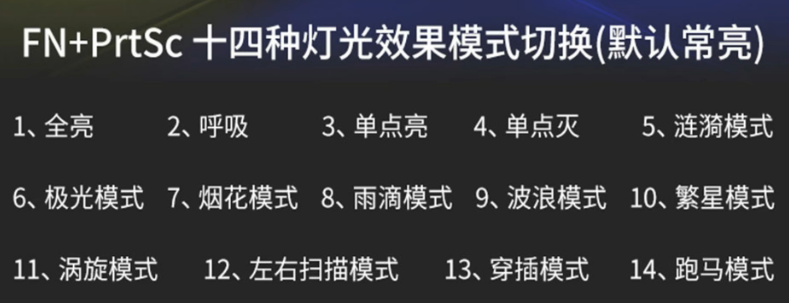

# K10g键盘

## 快捷键

### 关闭/开启灯光

`Fn`+`ESC`

### 灯光模式切换

`Fn`+`PrtSc`

### 旋钮灯光模式

`Fn`+`Ins`

### 灯光设置重置

`Fn`+`Del`连按直至灯光闪烁

### 灯光敏感度调节

连续点按`Fn`+`↑`/`↓`

## 宏按键编辑

1. `Fn`+`Pause`长按直至灯光闪烁
2. 选择`F1`~`F5`任意一个作为宏主键
3. 按照顺序按下按键, 进行宏设定
4. 最后再次点击`Fn`+`Pause`保存宏设定