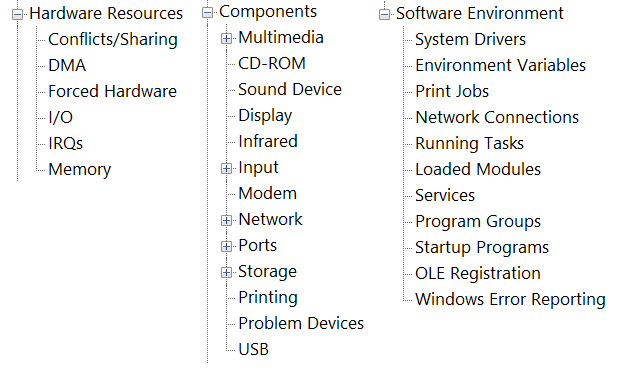
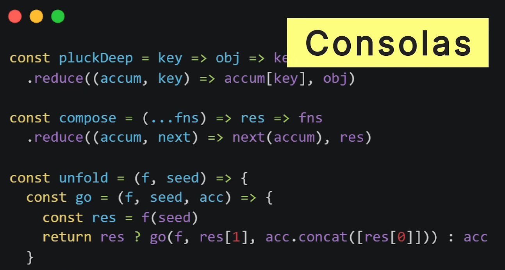
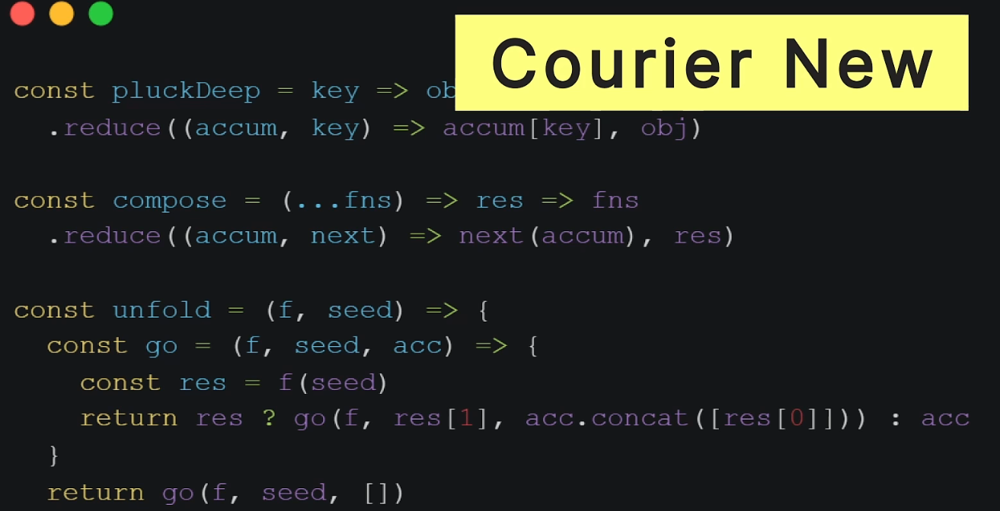
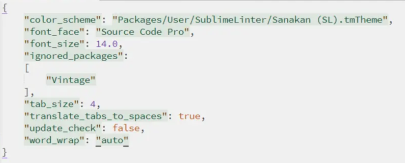

# 常见操作

## 端口占用

```powershell
netstat -ano | findstr 8091
tasklist | findstr 12096
```

## 快捷键

### 杂记

- `Win+A` 打开侧边栏
- `Win+W` 打开Ink Setting
- `Win+V` 粘贴板
- `Win+I` 打开设置
- `Win+Shift+S` 截屏
- `Win + ;` 表情符号面板

### 浏览器

- 定位地址栏
  Alt + d / Ctrl + L

### 外接显示器

- 快速将窗口在主屏和外接显示器上移动: `Win` + `Shift` + `→` | `←`

### Win自带恶意软件清除工具

- `Win` + `R`
- `mrt`：Microsoft Windows Malicious Software Removal Tool：恶意软件删除工具

Win+R能用的命令

| 命令 | 说明 |
| ---- | ---- |
|winver                  |检查Windows版本 |
|wmimgmt.msc             |打开windows管理体系结构(WMI) |
|wupdmgr                 |windows更新程序 |
|wscript                 |windows脚本宿主设置 |
|write                   |写字板 |
|winmsd                  |系统信息 |
|wiaacmgr                |扫描仪和照相机向导 |
|winchat                 |XP自带局域网聊天 |
|mem.exe                 |显示内存使用情况 |
|msconfig                |系统配置实用程序 |
|mplayer2                |简易widnows media player |
|mspaint                 |画图板 |
|mstsc                   |远程桌面连接 |
|mplayer2                |媒体播放机 |
|magnify                 |放大镜实用程序 |
|mmc                     |打开控制台 |
|mobsync                 |同步命令 |
|dxdiag                  |检查DirectX信息 |
|drwtsn32                |系统医生 |
|devmgmt.msc             |设备管理器 |
|dfrg.msc                |磁盘碎片整理程序 |
|diskmgmt.msc            |磁盘管理实用程序 |
|dcomcnfg                |打开系统组件服务 |
|ddeshare                |打开DDE共享设置 |
|dvdplay                 |DVD播放器 |
|net stop messenger      |停止信使服务 |
|net start messenger     |开始信使服务 |
|notepad                 |打开记事本 |
|nslookup                |网络管理的工具向导 |
|ntbackup                |系统备份和还原 |
|narrator                |屏幕"讲述人" |
|ntmsmgr.msc             |移动存储管理器 |
|ntmsoprq.msc            |移动存储管理员C作请求 |
|netstat -an             |(TC)命令检查接口 |
|syncapp                 |创建一个公文包 |
|sysedit                 |系统配置编辑器 |
|sigverif                |文件签名验证程序 |
|sndrec32                |录音机 |
|shrpubw                 |创建共享文件夹 |
|secpol.msc              |本地安全策略 |
|syskey                  |系统加密，一旦加密就不能解开，保护windows xp系统的双重密码 |
|services.msc            |本地服务设置 |
|Sndvol32                |音量控制程序 |
|sfc.exe                 |系统文件检查器 |
|sfc /scannow            |windows文件保护 |
|tsshutdn                |60秒倒计时关机命令 |
|shutdown -a             |关机解除 |
|tourstart               |xp简介(安装完成后出现的漫游xp程序) |
|taskmgr                 |任务管理器 |
|eventvwr                |事件查看器 |
|eudcedit                |造字程序 |
|explorer                |打开资源管理器 |
|packager                |对象包装程序 |
|perfmon.msc             |计算机性能监测程序 |
|progman                 |程序管理器 |
|regedit.exe             |注册表 |
|rsop.msc                |组策略结果集 |
|regedt32                |注册表编辑器 |
|rononce -p              |15秒关机 |
|regsvr32 /u \*.dll       |停止dll文件运行 |
|regsvr32 /u zipfldr.dll |取消ZIP支持 |
|cmd.exe                 |CMD命令提示符 |
|chkdsk.exe              |Chkdsk磁盘检查 |
|certmgr.msc             |证书管理实用程序 |
|calc                    |启动计算器 |
|charmap                 |启动字符映射表 |
|cliconfg                |SQL SERVER 客户端网络实用程序 |
|Clipbrd                 |剪贴板查看器 |
|conf                    |启动netmeeting |
|compmgmt.msc            |计算机管理 |
|cleanmgr                |垃圾整理 |
|ciadv.msc               |索引服务程序 |
|osk                     |打开屏幕键盘 |
|odbcad32                |ODBC数据源管理器 |
|oobe/msoobe /a          |检查XP是否激活 |
|lusrmgr.msc             |本机用户和组 |
|logoff                  |注销命令 |
|iexpress                |木马捆绑工具，系统自带 |
|Nslookup                |IP地址侦测器 |
|fsmgmt.msc              |共享文件夹管理器 |
|utilman                 |辅助工具管理器 |
|gpedit.msc              |组策略 |
|wupdmgr                 |WIDNOWS UPDATE |
|...                     |(三个半角点) 我的电脑 |
|dvdplay                 |DVD播放器 |
|..                      |(两点)打开系统盘用户目录 |
|.                       |(一点)打开当前用户的家目录 |
|calc                    |计算器 |
|control                 |打开控制面板 |
|eventvwr                |事件查看器 |

定制
定制你的运行输入框
  在Windows里面，Microsoft提供了一个新的快捷启动程序的方法：运行
  打开[开始]------[运行]，里面可以直接启动一些特定的程序，如：输入notepad.exe启动记事本，输入xdict.exe启动金山词霸等等。
启动的原理是什么呢？
  很简单，在注册表HKEY_LOCAL_MACHINE\SOFTWARE\Microsoft\Windows\CurrentVersion\App Paths下面，可以看到很多次级主键，每一个次级主键就对应着一个能够在运行里面输入的内容。以ACDSee.exe主键为例：右边有2个字符串，默认对应的是这个程序的绝对路径，而Path对应的是这个程序所处的目录。
定制的方法：
  在App Paths下新建一个不同名的次级主键(例如：Smallfrogs.EXE)，然后修改右边的默认为你要启动的程序的路径(例如：C:\Program Files\My APP\Smallfrogs.EXE)，然后新建一个字符串Path，修改为那个程序所处的目录(例如::C:\Program Files\My APP\)。然后就可以在运行里面输入：Smallfrogs.EXE来启动C:\Program Files\My APP\Smallfrogs.EXE这个程序了。
  注意！系统是*次级主键的名字来辨认程序的，即使你不使用Smallfrogs.EXE建立次级主键，而使用SSSSS.EXE建立次级主键，如果莫任何Path的内容和上例一样的话，输入SSSSS.EXE启动的程序仍然是C:\Program Files\My APP\Smallfrogs.EXE这个程序。

## 隐藏功能

1. 上帝模式：
  - 新建文件夹
  - 重命名为:`n`
2. 卓越性能模式：
  - powershell管理员模式执行：powercfg -duplicatescheme e9a42b02-d5df-448d-aa00-03f14749eb61
  - 电源选项会有 卓越性能模式

## 禁止鼠标唤醒

这里有一个通用的办法。如果你电脑经常被无故唤醒，可以键入如下命令行：
`powercfg /devicequery wake_armed`

然后系统就会告诉你哪些设备可以唤醒电脑。此时你再键入如下命令就可以禁止该设备唤醒电脑了。注意第二个命令需要管理员权限。
`powercfg /devicedisablewake "设备名"`

键入如下命令就可以打开该设备唤醒电脑了。注意第三个命令需要管理员权限。
`powercfg /deviceenablewake "设备名"`

## 重置网络

```bash
netsh winsock reset
```

作用是重置 Winsock 目录。

如果一台机器上的Winsock协议配置有问题的话将会导致网络连接等问题，就需要用`netsh winsock reset`命令来重置Winsock目录借以恢复网络。这个命令可以重新初始化网络环境，以解决由于软件冲突、病毒原因造成的参数错误问题。

## 资源管理器

### List模式的列宽

在资源管理器上方有个设置，Size all columns fit

但是目前电脑上有很多的选项是灰色的，不可操作，可能是我关闭了很多功能造成的

## 任务栏

1. 一个应用只有一个切换页面

   

## 取消开机密码

开始菜单**搜索**：`netplwiz`或者`Control Userpasswords2`

即可根据选项选择

> 如果没有选项：`要使用本计算机，用户必须输入用户和密码的选项`，那么修改注册表：`Computer\HKEY_LOCAL_MACHINE\SOFTWARE\Microsoft\Windows NT\CurrentVersion\PasswordLess\Device`
>
> 完成之后重启，再**搜索**上面的命令

## 获取PC的WIFI密码

- 第一步，我们需要来到我们的电脑在搜索栏目里输入CMD，以管理员身份运行！
- 第二步，输入 `netsh wlan show profile` 回车 会得到WIFI无线网络信息
- 第三步，输入 `netsh wlan export profile folder=C:\ key=clear` 它就会给你保存到C盘
- 第四步：打开C盘 找到自己WIFI 右键用记事本打开！

## 资源管理器

### 打开资源管理器地址栏历史记录

1. 按下Win+R组合键，在运行命令输入框中输入“gpedit.msc”后回车。
2. 在本地组策略编辑器界面，在左侧面板依次展开“用户配置”-》"管理模版”-)Windows组件”-》“文件资源管理器”，点击选中后，在右侧窗口中找到并双击“在Windows资源管理器搜索框中关闭最近搜索条目的显示”
3. 在Windows资源管理器搜索框中关闭最近搜索条目的显示界面，点击选中“已启用”后点击底部确定退出设置界面即可。

## 制作软链接

```
mklink /j <link-path> <des-path>
```

## 右下角日期

Short Date：`MM/dd ddd`

Long Date：`yyyy/MM/dd ddd`

## 常用系统命令

| 用途              | 命令                   | 备注                   |
| ----------------- | ---------------------- | ---------------------- |
| 查看系统信息      | msinfo32               | 具体信息请查看表后附图 |
| 查看系统磁盘格式  | diskpart<br/>list disk | 两条命令分别输入       |
| 转换磁盘格式为GPT | convert gpt            |                        |



## 常用文件夹命令

1. 打开开机启动文件夹
   - 当前用户生效：shell:startup
   - 所有用户生效：shell:common startup
2. 打开字体安装目录
   - shell:fonts
3. 打开开始菜单目录
   - shell:programs
   - shell:common programs
4. 打开本机安装的所有软件列表
   - shell:AppsFolder
5. 打开快速启动/固定任务栏的图标文件夹
   - shell:Quick Launch
6. 打开Sendto文件夹
   - shell:sendto

### 总结：

| 命令                        | 解释                                              |
| --------------------------- | ------------------------------------------------- |
| shell:desktop               | 用户的桌面文件夹                                  |
| shell:sendto                | "发送到"菜单中的文件夹                            |
| shell:startup               | 启动文件夹,用户登录时会自动运行这个文件夹中的程序 |
| shell:programs              | "开始"菜单中的程序文件夹                          |
| shell:appdata               | 应用程序数据文件夹,存储应用程序的配置文件等       |
| shell:recent                | 最近使用的文件列表                                |
| shell:favorites             | 收藏夹文件夹                                      |
| shell:fonts                 | 字体文件夹                                        |
| shell:templates             | 模板文件夹                                        |
| shell:my music              | 用户的音乐文件夹                                  |
| shell:my pictures           | 用户的图片文件夹                                  |
| shell:my videos             | 用户的视频文件夹                                  |
| shell:start menu            | 用户的开始菜单                                    |
| shell:ProgramFiles          | 用户的Program Files                               |
| shell:ProgramFilesCommon    | 通用的的Program Files                             |
| shell:ProgramFilesX86       | 用户的Program Files(x86)                          |
| shell:ProgramFilesCommonX86 | 通用的Program Files(x86)                          |
| shell:Libraries             | 公用库 （图片照片文档视频等）                     |
| shell:UsersLibrariesFolder  | 用户的库（图片照片文档视频等）                    |
| shell:RecycleBinFolder      | 回收站                                            |
| shell:UsersFilesFolder      | 用户的配置文件夹                                  |


# 常见问题

## 图标异常

### 开始菜单

1. 在磁贴上点击右键，更多，打开文件位置，找到快捷方式所在目录。

2. 使用管理员权限打开cmd，定位到2所在目录

3. 运行以下命令

   ```cmd
   for %f in (*.*) do copy /b "%f" +,,
   ```

4. 此时磁贴图标恢复

### 任务栏

> `%AppDATA%\Microsoft\Internet Explorer\Quick Launch\User Pinned\TaskBar`

暂时未解决


## Bookmarks

### Chrome书签位置

> chrome://version/

C:\Users\Shreker\AppData\Local\Google\Chrome\User Data\Default\Bookmarks

### Edge书签位置

> edge://version/

C:\Users\Shreker\AppData\Local\Microsoft\Edge\User Data\Default\Bookmarks

## Edge导入密码

> 不好使了

1. edge://flags/#PasswordImport
2. ~~Password import~~
3. 启用、重启


# 安全问题

## 安全模式

运行`msconfig`命令选择引导启动即可

## BIOS

1. Forza进入启动项的快捷键
   - BIOS Setup: `F2`
   - Boot Menu: `F7`


# 注册表

## 注册表简介

1. `HKEY_CLASSES_ROOT`
   - 主要记录文件后缀名
2. `HKEY_CURRENT_USER`
   - 计算机当前用户信息
3. `HKEY_LOCAL_MACHINE`
   - 记录计算机硬件的配置
4. `HKEY_USERS`
   - 记录计算机中所有用户的信息
5. `HKEY_CURRENT_CONFIG`

# 系统定制封装

## NTLite

```
Win自带应用全名称
PackageFullName
---------------
Microsoft.Windows.CloudExperienceHost_10.0.22000.1_neutral_neutral_cw5n1h2txyewy
Microsoft.BioEnrollment_10.0.19586.1000_neutral__cw5n1h2txyewy
Microsoft.AAD.BrokerPlugin_1000.19580.1000.0_neutral_neutral_cw5n1h2txyewy
Microsoft.Windows.OOBENetworkConnectionFlow_10.0.21302.1000_neutral__cw5n1h2txyewy
Microsoft.Windows.OOBENetworkCaptivePortal_10.0.21302.1000_neutral__cw5n1h2txyewy
Microsoft.UI.Xaml.CBS_2.62107.16001.0_x64__8wekyb3d8bbwe
MicrosoftWindows.Client.CBS_1000.22000.194.0_x64__cw5n1h2txyewy
Microsoft.Windows.StartMenuExperienceHost_10.0.22000.37_neutral_neutral_cw5n1h2txyewy
Microsoft.Windows.ShellExperienceHost_10.0.22000.71_neutral_neutral_cw5n1h2txyewy
windows.immersivecontrolpanel_10.0.6.1000_neutral_neutral_cw5n1h2txyewy
Microsoft.Windows.Search_1.16.0.22000_neutral_neutral_cw5n1h2txyewy
Microsoft.549981C3F5F10_2.2106.2807.0_x64__8wekyb3d8bbwe
Microsoft.NET.Native.Framework.2.2_2.2.29512.0_x64__8wekyb3d8bbwe
Microsoft.NET.Native.Runtime.2.2_2.2.28604.0_x64__8wekyb3d8bbwe
Microsoft.VCLibs.140.00.UWPDesktop_14.0.29231.0_x64__8wekyb3d8bbwe
Microsoft.MicrosoftEdge_44.22000.120.0_neutral__8wekyb3d8bbwe
Microsoft.Windows.ContentDeliveryManager_10.0.22000.1_neutral_neutral_cw5n1h2txyewy
Microsoft.Getstarted_10.2.41172.0_x64__8wekyb3d8bbwe
Microsoft.UI.Xaml.2.4_2.42007.9001.0_x64__8wekyb3d8bbwe
Microsoft.VCLibs.140.00_14.0.29231.0_x64__8wekyb3d8bbwe
MicrosoftWindows.Client.WebExperience_321.14700.0.9_x64__cw5n1h2txyewy
Microsoft.ScreenSketch_11.2104.2.0_x64__8wekyb3d8bbwe
microsoft.windowscommunicationsapps_16005.12827.20400.0_x64__8wekyb3d8bbwe
Microsoft.Paint_10.2104.17.0_x64__8wekyb3d8bbwe
Microsoft.Windows.Photos_21.21030.25003.0_x64__8wekyb3d8bbwe
Microsoft.WindowsCamera_2020.503.58.0_x64__8wekyb3d8bbwe
Microsoft.WindowsNotepad_10.2102.13.0_x64__8wekyb3d8bbwe
Microsoft.WindowsStore_12104.1001.1.0_x64__8wekyb3d8bbwe
Microsoft.XboxIdentityProvider_12.50.6001.0_x64__8wekyb3d8bbwe
Microsoft.Windows.CallingShellApp_1000.22000.1.0_neutral_neutral_cw5n1h2txyewy
Microsoft.Windows.CapturePicker_10.0.19580.1000_neutral__cw5n1h2txyewy
Microsoft.Windows.NarratorQuickStart_10.0.22000.1_neutral_neutral_8wekyb3d8bbwe
Microsoft.Windows.AssignedAccessLockApp_1000.22000.1.0_neutral_neutral_cw5n1h2txyewy
Microsoft.Windows.PeopleExperienceHost_10.0.22000.1_neutral_neutral_cw5n1h2txyewy
Microsoft.Windows.SecureAssessmentBrowser_10.0.22000.1_neutral_neutral_cw5n1h2txyewy
Microsoft.MicrosoftEdgeDevToolsClient_1000.22000.1.0_neutral_neutral_8wekyb3d8bbwe
Microsoft.LockApp_10.0.22000.1_neutral__cw5n1h2txyewy
1527c705-839a-4832-9118-54d4Bd6a0c89_10.0.19640.1000_neutral_neutral_cw5n1h2txyewy
c5e2524a-ea46-4f67-841f-6a9465d9d515_10.0.22000.1_neutral_neutral_cw5n1h2txyewy
Microsoft.Windows.XGpuEjectDialog_10.0.22000.1_neutral_neutral_cw5n1h2txyewy
Microsoft.XboxGameCallableUI_1000.22000.1.0_neutral_neutral_cw5n1h2txyewy
E2A4F912-2574-4A75-9BB0-0D023378592B_10.0.19640.1000_neutral_neutral_cw5n1h2txyewy
Microsoft.Win32WebViewHost_10.0.22000.1_neutral_neutral_cw5n1h2txyewy
Microsoft.CredDialogHost_10.0.19595.1001_neutral__cw5n1h2txyewy
Microsoft.Windows.PinningConfirmationDialog_1000.22000.1.0_neutral__cw5n1h2txyewy
Microsoft.Windows.ParentalControls_1000.22000.1.0_neutral_neutral_cw5n1h2txyewy
F46D4000-FD22-4DB4-AC8E-4E1DDDE828FE_10.0.22000.1_neutral_neutral_cw5n1h2txyewy
Microsoft.AccountsControl_10.0.22000.1_neutral__cw5n1h2txyewy
Microsoft.AsyncTextService_10.0.22000.1_neutral__8wekyb3d8bbwe
Microsoft.Windows.Apprep.ChxApp_1000.22000.1.0_neutral_neutral_cw5n1h2txyewy
Windows.PrintDialog_6.2.1.0_neutral_neutral_cw5n1h2txyewy
Windows.CBSPreview_10.0.19580.1000_neutral_neutral_cw5n1h2txyewy
NcsiUwpApp_1000.22000.1.0_neutral_neutral_8wekyb3d8bbwe
MicrosoftWindows.UndockedDevKit_10.0.22000.1_neutral_neutral_cw5n1h2txyewy
Microsoft.ECApp_10.0.22000.1_neutral__8wekyb3d8bbwe
Microsoft.WindowsAlarms_1.0.36.0_x64__8wekyb3d8bbwe
Microsoft.ZuneVideo_10.21012.10511.0_x64__8wekyb3d8bbwe
Microsoft.ZuneMusic_10.21012.10511.0_x64__8wekyb3d8bbwe
Microsoft.YourPhone_0.19051.7.0_x64__8wekyb3d8bbwe
Microsoft.XboxSpeechToTextOverlay_1.17.29001.0_x64__8wekyb3d8bbwe
Microsoft.XboxGamingOverlay_2.50.24002.0_x64__8wekyb3d8bbwe
Microsoft.XboxGameOverlay_1.46.11001.0_x64__8wekyb3d8bbwe
Microsoft.Xbox.TCUI_1.23.28002.0_x64__8wekyb3d8bbwe
Microsoft.WindowsTerminal_1.6.10571.0_x64__8wekyb3d8bbwe
Microsoft.WindowsSoundRecorder_1.0.38.0_x64__8wekyb3d8bbwe
Microsoft.WindowsMaps_1.0.22.0_x64__8wekyb3d8bbwe
Microsoft.WindowsFeedbackHub_1.2103.1172.0_x64__8wekyb3d8bbwe
Microsoft.WindowsCalculator_10.2012.21.0_x64__8wekyb3d8bbwe
Microsoft.WebpImageExtension_1.0.32731.0_x64__8wekyb3d8bbwe
Microsoft.WebMediaExtensions_1.0.40831.0_x64__8wekyb3d8bbwe
Microsoft.VP9VideoExtensions_1.0.41182.0_x64__8wekyb3d8bbwe
Microsoft.Todos_0.33.33351.0_x64__8wekyb3d8bbwe
Microsoft.StorePurchaseApp_12008.1001.1.0_x64__8wekyb3d8bbwe
Microsoft.SecHealthUI_1000.22000.1.0_neutral__8wekyb3d8bbwe
Microsoft.PowerAutomateDesktop_1.0.65.0_x64__8wekyb3d8bbwe
Microsoft.People_10.1909.12456.0_x64__8wekyb3d8bbwe
Microsoft.MicrosoftStickyNotes_4.0.2.0_x64__8wekyb3d8bbwe
Microsoft.MicrosoftSolitaireCollection_4.6.3102.0_x64__8wekyb3d8bbwe
Microsoft.MicrosoftOfficeHub_18.2104.12721.0_x64__8wekyb3d8bbwe
Microsoft.HEIFImageExtension_1.0.40978.0_x64__8wekyb3d8bbwe
Microsoft.GetHelp_10.2008.32311.0_x64__8wekyb3d8bbwe
Microsoft.GamingApp_2105.900.24.0_x64__8wekyb3d8bbwe
Microsoft.DesktopAppInstaller_1.0.42251.0_x64__8wekyb3d8bbwe
Microsoft.BingWeather_1.0.6.0_x64__8wekyb3d8bbwe
Microsoft.BingNews_1.0.6.0_x64__8wekyb3d8bbwe
Microsoft.MicrosoftEdge.Stable_95.0.1020.30_neutral__8wekyb3d8bbwe
```

- 下载地址：https://www.ntlite.com/download/
- 微软不定下载网址：https://catalog.update.microsoft.com/home.aspx
- 导出Windows目前使用的驱动程序：Dism++

# 系统驱动

## Intel Driver Assistant

一般情况下, 大部分的驱动程序都会自动安装, 尽量使用官方的驱动安装器, 三方都是利益方, 都会进行捆绑等行为

如果你的电脑上有很多的`Intel`的硬件, 那么安装`Intel Driver & Support Assistant`是最好的


# 删除服务

> 来源: https://sysin.org/blog/delete-windows-service-in-powershell/

## CMD 删除Windows服务

```bat
sc delete "<service-name>"
```

在 PowerShell 中执行上述命令并没有报错(没有任何提示)，但是实际上服务并没有被删除。

## PowerShell 删除Windows服务

在 PowerShell 中，sc 是 cmdlet `Set-Content` 的别名，应该这样使用(加上 .exe)：

```powershell
sc.exe delete "<service-name>"
```

[PowerShell v6 开始增加了一个新的 cmdlet](https://docs.microsoft.com/en-us/powershell/scripting/whats-new/what-s-new-in-powershell-core-60?view=powershell-6#cmdlet-updates) `Remove-Service`，可惜 Windows 10 包括 Server 2016、2019 内置的 PowerShell 5.1 并无法识别这个命令。有 `Start-Service`、`Stop-Service` 而没有 `Remove-Service` 显然是"巨硬"的失误。

### Win删除服务总结

| 功能                | 启动服务                             | 停止服务                           | 删除服务                                                     |
| :------------------ | :----------------------------------- | :--------------------------------- | :----------------------------------------------------------- |
| CDM                 | sc start "<service-name>"            | sc stop "<service-name>"           | sc delete "<service-name>"                                   |
| PowerShell 调用 CMD | sc.exe start "<service-name>"        | sc.exe stop "<service-name>"       | sc.exe delete "<service-name>"                               |
| PowerShell          | Start-Service -name "<service-name>" | Stop-Service-name "<service-name>" | Remove-Service-name "<service-name>" <br/>(慎用！仅在 PS v6 及以上有效) |

# 装机动作

## 激活

> 工具激活
>
> yishimei.cn

> 手动激活
>
> slmgr /ipk <key>
>
> slmgr /skms skms.03k.org
>
> slmgr /ato

## 检查驱动

- 检查驱动的自动更新

## 系统配置

### 设置Region

> 可以在以下操作完成之后进行

1. 设置时区

   ```cmd
   # https://www.windowscentral.com/how-change-your-device-time-zone-settings-windows-10#change_timezone_cmd_windows10
   
   # 查询当前时区
   tzutil /g
   
   # 时区列表
   tzutil /l
   
   # 设置时区
   tzutil /s "China Standard Time"
   ```

2. 设置日期时间格式

   - 利用注册表进行修改，例如

     - 使用国家代码应用当地的时间、货币等默认样式

       ```cmd
       REG ADD "HKCU\Control Panel\International" /t REG_SZ /v LocaleName /d en-GB /f
       ```
   
     - 每一项都可以单独修改
   
       ```cmd
       REG ADD "HKCU\Control Panel\International" /t REG_SZ /v sLongDate /d yyyy/MM/dd /f
       REG ADD "HKCU\Control Panel\International" /t REG_SZ /v sShortDate /d yyyy/MM/dd /f
       REG ADD "HKCU\Control Panel\International" /t REG_SZ /v sTimeFormat /d HH:mm:ss /f
       REG ADD "HKCU\Control Panel\International" /t REG_SZ /v sShortTime /d HH:mm:ss /f
       
       RUNDLL32.EXE USER32.DLL,UpdatePerUserSystemParameters ,1 ,True
       ```
   
   - 案例说明
   
     ```
     [BAT]批处理自动修改区域和语言选项
     open a cmd window and type reg query "HKCU\Control Panel\International" which will show you the values as you want them.
     
     Then to modify them, use REG ADD "HKCU\Control Panel\International" /t REG_SZ /v LocaleName /d es-Mx /f for each value replacing what is after /v with the appropriate name and what is after /d with the appropriate value.
     
     For example:
     
     reg query "HKCU\Control Panel\International
     REG ADD "HKCU\Control Panel\International" /t REG_SZ /v LocaleName /d en-GB /f
     REG ADD "HKCU\Control Panel\International" /t REG_SZ /v sCountry /d "United Kingdom" /f
     
     The other option is to just export the HKCU\Control Panel\International hive to a .reg file and just import it into the registry using regedit /s ImportFile.reg
     
     You may need to refresh the registry after the import to see the changes. This usually involves a reboot but try adding the following as the last line in your batch file instead. RUNDLL32.EXE USER32.DLL,UpdatePerUserSystemParameters ,1 ,True
     ```
   
      - 可设置的项目(cmd运行`reg query "HKCU\Control Panel\International`可查看)：
   
        | Item          | Type   | Example    |
        | ------------- | ------ | ---------- |
        | Locale        | REG_SZ | 00000409   |
        | LocaleName    | REG_SZ | en-US      |
        | sLongDate     | REG_SZ | yyyy/MM/dd |
        | sNativeDigits | REG_SZ | 0123456789 |
        | sShortDate    | REG_SZ | yyyy/MM/dd |
        | sTimeFormat   | REG_SZ | HH:mm:ss   |
        | sShortTime    | REG_SZ | HH:mm      |
   

### 设置第二语言

暂时没有找到

### Quick Access Unpin

> 先进行这项设置，否则后面修改系统文件夹之后就难以Unpin了

## 软件配置

### 安装必要软件

> 推荐 腾讯软件中心：[腾讯软件中心-海量软件高速下载 (qq.com)](https://pc.qq.com/)
>
> 直接搜索下载即可，就没有必要安装软件了

##### 安装并配置Git

- 解压GitEE/GitHub配置文件
- 复制config文件
- 运行配置脚本：`git-config-global.sh`

#### 配置Maven

- 解压相关配置文件到Home目录

#### 配置Python环境变量

1. 配置环境变量
2. 创建Python的虚拟环境

## 检查环境变量

D:\Programs\Tools

## 设置命令别名

```cmd
doskey ll=ls -l
```

## 优化UI设置

1. 开始页
2. 任务栏
3. 显示器

## 设置系统文件夹

> 这个部分已经发现利用魔方的工具可以自助进行备份和恢复

| 名称   | 目标文件夹                  |
| ------ | --------------------------- |
| 桌面   | D:\Desktop                  |
| 收藏夹 | D:\QLRepo\QLNotes\Favorites |
| 音乐   | D:\QLMedias\Musics          |
| 图片   | D:\QLMedias\Pictures        |
| 视频   | D:\QLMedias\Videos          |
| 文档   | D:\Documents                |
| 下载   | D:\Downloads                |

## 其他

1. 系统配置对话框：msconfig

# 新机开荒

## 开机

1. 插电源，后开机
2. 跳过联网，联网就会自动激活，七天无理由失效
   - 按照开机引导直至联网界面
   - 打开命令行工具
     - 不同机器动作不一样，一般是：Shift + F10 / Shift + FN + F10
     - 输入命令：`OOBE\ByPassnro`，回车，之后系统会重新启动
     - 系统重新启动完成后，按照引导跳过联网

## 开荒

### 检查电池

```cmd
powercfg /batteryreport
```


# 浏览器相关

## 快捷键

> [Keyboard shortcuts in Microsoft Edge - Microsoft Support](https://support.microsoft.com/en-us/microsoft-edge/keyboard-shortcuts-in-microsoft-edge-50d3edab-30d9-c7e4-21ce-37fe2713cfad)

| 快捷键                             | 功能                                                         |
| ---------------------------------- | ------------------------------------------------------------ |
| **Ctrl** + **Shift** + **B**       | Show or hide the favorites bar                               |
| **Alt** + **Shift** + **B**        | Set focus on the first item in the favorites bar             |
| **Ctrl** + **D**                   | Save the current tab as a favorite                           |
| **Ctrl** + **Shift** + **D**       | Save all open tabs as favorites in a new folder              |
| **Ctrl** + **Shift** + **E**       | Open search in sidebar                                       |
| **Alt** + **D**                    | Select the URL in the address bar to edit                    |
| **Ctrl** + **E**                   | Open a search query in the address bar                       |
| **Alt** + **E**                    | Open the Settings and more menu                              |
| **Ctrl** + **F**                   | Open find on page                                            |
| **Alt** + **F**                    | Open the Settings and more menu                              |
| **Ctrl** + **G**                   | Jump to the next result for find on page                     |
| **Ctrl** + **Shift** + **G**       | Jump to the previous result for find on page                 |
| **Ctrl** + **H**                   | Open History                                                 |
| **Ctrl** + **Shift** + **I**       | Open Developer Tools                                         |
| **Alt** + **Shift** + **I**        | Open the Send feedback dialog                                |
| **Ctrl** + **J**                   | Open Downloads                                               |
| **Ctrl** + **K**                   | Open a search query in the address bar                       |
| **Ctrl** + **Shift** + **K**       | Duplicate the current tab                                    |
| **Ctrl** + **L**                   | Select the URL in the address bar to edit                    |
| **Ctrl** + **Shift** + **L**       | Paste and search or Paste and go (if it's a URL)             |
| **Ctrl** + **M**                   | Mute the current tab (toggle)                                |
| **Ctrl** + **Shift** + **M**       | Sign in as a different user or browse as a Guest             |
| **Ctrl** + **N**                   | Open a new window                                            |
| **Ctrl** + **Shift** + **N**       | Open a new InPrivate window                                  |
| **Ctrl** + **O**                   | Open a file from your computer in Edge                       |
| **Ctrl** + **Shift** + **O**       | Open Favorites                                               |
| **Ctrl** + **P**                   | Print the current page                                       |
| **Ctrl** + **Shift** + **P**       | Print using the system dialog                                |
| **Ctrl + R**                       | Reload the current page                                      |
| **Ctrl** + **Shift** + **R**       | Reload the current page, ignoring cached content             |
| **Ctrl** + **S**                   | Save the current page                                        |
| **Ctrl** + **T**                   | Open a new tab and switch to it                              |
| **Ctrl** + **Shift** + **T**       | Reopen the last closed tab, and switch to it                 |
| **Alt** + **Shift** + **T**        | Set focus on the first item in the app bar toolbar           |
| **Ctrl** + **U**                   | View source                                                  |
| **Ctrl** + **Shift** + **U**       | Start or stop Read Aloud                                     |
| **Ctrl** + **Shift** + **V**       | Paste without formatting                                     |
| **Ctrl** + **W**                   | Close the current tab                                        |
| **Ctrl** + **Shift** + **W**       | Close the current window                                     |
| **Ctrl** + **Shift** + **Y**       | Open Collections                                             |
| **Ctrl** + **0** (zero)            | Reset page zoom level                                        |
| **Ctrl** + **1**, **2**, ... **8** | Switch to a specific tab                                     |
| **Ctrl** + **9**                   | Switch to the last tab                                       |
| **Ctrl** + **Enter**               | Add www. to the beginning and .com to the end of text typed in the address bar |
| **Ctrl** + **Tab**                 | Switch to the next tab                                       |
| **Ctrl** + **Shift** + **Tab**     | Switch to the previous tab                                   |
| **Ctrl** + **Plus** (**+**)        | Zoom in                                                      |
| **Ctrl** + **Minus** (**-**)       | Zoom out                                                     |
| **Ctrl** + **\** (in a PDF)        | Toggle PDF between fit to page / fit to width                |
| **Ctrl** + **[** (in a PDF)        | Rotate PDF counter-clockwise 90*                             |
| **Ctrl** + **]** (in a PDF)        | Rotate PDF clockwise 90*                                     |
| **Ctrl** + **Shift** + **Delete**  | Open clear browsing data options                             |
| **Alt**                            | Set focus on the Settings and more button                    |
| **Alt** + **Left arrow**           | Go back                                                      |
| **Alt** + **Right arrow**          | Go forward                                                   |
| **Alt** + **Home**                 | Open your home page in the current tab                       |
| **Alt** + **F4**                   | Close the current window                                     |
| **F1**                             | Open Help                                                    |
| **F3**                             | Find in the current tab                                      |
| **F4**                             | Select the URL in the address bar                            |
| **Ctrl** + **F4**                  | Close the current tab                                        |
| **F5**                             | Reload the current tab                                       |
| **Shift** + **F5**                 | Reload the current tab, ignoring cached content              |
| **F6**                             | Move focus to next pane                                      |
| **Shift** + **F6**                 | Move focus to previous pane                                  |
| **Ctrl** + **F6**                  | Move focus to the web content pane                           |
| **F7**                             | Turn caret browsing on or off                                |
| **F9**                             | Enter or exit Immersive Reader                               |
| **F10**                            | Set focus on the Settings and more button                    |
| **F10** + **Enter**                | Open Setting and more menu                                   |
| **Shift** + **F10**                | Open context menu                                            |
| **F11**                            | Enter full screen (toggle)                                   |
| **F12**                            | Open Developer Tools                                         |
| **Esc**                            | Stop loading page; close dialog or pop-up                    |
| **Spacebar**                       | Scroll down webpage, one screen at a time                    |
| **Shift** + **Spacebar**           | Scroll up webpage, one screen at a time                      |
| **PgDn**                           | Scroll down webpage, one screen at a time                    |
| **Ctrl** + **PgDn**                | Switch to the next tab                                       |
| **PgUp**                           | Scroll up webpage, one screen at a time                      |
| **Ctrl** + **PgUp**                | Switch to the previous tab                                   |
| **Home**                           | Go to the top of the page, Move keyboard focus to first item of pane |
| **End**                            | Go to the bottom of the page, Move keyboard focus to last item of pane |
| **Tab**                            | Go to next tab stop                                          |
| **Shift** + **Tab**                | Go to previous tab stop                                      |

## 同步开关

1. chrome://sync-internals

## 关闭QUIC

> chrome://flags → 搜索 quic 选择关闭 → 优化国内环境对外部流媒体播放

## 好用插件

> Edge 插件文件夹：C:\Users\Shreker\AppData\Local\Microsoft\Edge\User Data\Default\Extensions

> Chrome插件快捷键设置页面：chrome://extensions/shortcuts

1. 油猴
2. 沉浸式翻译：PDF翻译

## 下载crx

> 首先每个Chrome.上的插件都有一个ID，是该插件网址上最后--串字符串，将这个ID拷贝下来。然后在下面的这个链接中，把ID替换到\<extension-id>处
>
> ```
> https://clients2.google.com/service/update2/crx?response=redirect&os=win&arch=x64&os_arch=x86_64&nacl_arch=x86-64&prod=chromecrx&prodchannel=&prodversion=77.0.3865.90&lang=zh-CN&acceptformat=crx2,crx3&x=id%3D<extension-id>%26installsource%3Dondemand%26uc
> ```

# 常用工具

## 本地搜索工具

### Everything

#### 使用小技巧

> 在菜单的帮助中有所有的使用手册

1. 搜索文件夹内存：`<路径> <关键词>`
2. 逻辑搜索，与或非
   - 非：搜索时排除文件夹：`!<路径> <关键词>`
   - 与：空格
   - 或：`|`
   - 案例：搜索包含`阅读`的所有`apk`文件：`阅读 *.apk`
3. 搜索文件：`file:<关键词>`
4. 搜索目录：`folder:<关键词>`
5. 限制文件大小：
   1. 大于500MB：`<关键词> size:>500mb`
   2. 在100~500MB之间：`<关键词> size:100mb~500mb`

### Wox

### Listary

### uTools

### 火柴(火萤酱)

### Rubick

- [GitHub - rubickCenter/rubick: 🔧 Electron based open source toolbox, free integration of rich plug-ins. 基于 electron 的开源工具箱，自由集成丰富插件。](https://github.com/rubickCenter/rubick)
- [RUBICK 快速启动软件，让你的效率提高100%-423下载站 (423xz.com)](https://www.423xz.com/jiaocheng/2623.html)

这款 Rubick 软件基于 Electron 开发，所以它支持了跨平台，包括有 Windows、MacOS、Linux 版本。作者表示因为 uTools 没有开源，公司内部的工具库无法发布到 utools 插件中，所以他做了一款类似的快捷启动器，并且开源了，支持安装各种功能插件。

按下快捷键 **Alt + R** 就可以快速呼出搜索栏，输入相关的文件名称就会出现索引列表，支持中文搜索和拼音、拼音首字母搜索。

安装快捷命令的插件，还可以实现批处理、Shell、Python、JS、PHP、Ruby、新增自定义快捷命令等，这对于码农来说绝对是效率功能。

**插件中心：**虽然目前提供的插件不多，但都还算蛮实用的，包括有：文本对比、二维码生成、图床、斗图、词典查询等，根据你需求来安装即可。

另外 Rubick 也是支持 utools 的插件，可以到 utools 论坛或者 github 上寻找更多插件安装。

安装方法：只需要将插件的代码 Clone 下来后，复制 plugin.json 粘贴进入搜索框，选择新建即可。

**超级面板功能：**在任意地方长按鼠标右键就可以呼起超级面板，可以根据当前选择中的内容，匹配相关的插件。

例如选中文本内容后，长按右键会出现文本翻译，或者在图片上长按右键可以上传到图床。

其它功能方面，支持设置快捷键/全局、开机自动启动、本地搜索功能、超级面板触发的响应时间。

功能特色

- 支持远程下载安装插件，支持插件开发者模式
- 支持插件分离
- 支持系统命令取色、截屏、帮助
- 支持超级面板，长按右击呼出
- 支持全局快捷键设置
- 支持搜索本地已安装 app 或 偏好设置
- macos touchBar 唤起插件

**总结**

对于键盘党来说这种快捷启动软件绝对是效率神器，不需要键盘鼠标来回折腾，只用键盘就能搞定很多繁琐的操作。

但普通用户使用起来可能觉得麻烦，因为你还需要记住一些执行的命令，好在Rubick 支持各种实用的小工具/插件，你也可以把它当作一个万能的工具箱来用。

### 闪电搜索

### AnyTX

它不是根据文名来查找文件，而是通过文档中的关键词定位获取文件。与Word中的查找功能类似，还可以切换上一处、下一处，使查找更加准确。

### 查找文本

和AnyTX一样，也是一个文本查找与定位工具。软件设置非常细致，可以通过磁盘盘符、文件后缀、名称、内容来精准定位文档。

借助精细化查找，搜到的文件与关键词也是高度匹配的。

# 字体汇总

> - Identifont 的 “等宽字体” 列表
>   [http://www.identifont.com/equal-width.html](https://link.uisdc.com/?redirect=http%3A%2F%2Fwww.identifont.com%2Fequal-width.html)
>   
> - David Sudweeks 的 “通用字体集”
>   [https://www.fontshop.com/people/david-sudweeks/fontlists/uniwidth-typefaces](https://link.uisdc.com/?redirect=https%3A%2F%2Fwww.fontshop.com%2Fpeople%2Fdavid-sudweeks%2Ffontlists%2Funiwidth-typefaces)
>   
> - Indra Kupferschmid 在 Fontstand 上整理的一组 “等宽字体”：
>   [https://fontstand.com/collections/69697/ab1ddd85e26deaf6647be009be6a1337](https://link.uisdc.com/?redirect=https%3A%2F%2Ffontstand.com%2Fcollections%2F69697%2Fab1ddd85e26deaf6647be009be6a1337)
>   
> - 可商用字体汇总：公众号：Adobe素材助手
>
>   https://docs.qq.com/sheet/DYU5WY3ZPY2pCRHBy?tab=BB08J2&scode=&_t=1704433221533&u=7e8373aede2b436591a8bf6c1eca1548

## 概述

| 字体特征   | 说明   |
| ---------- | ------ |
| Mono       | 等宽   |
| Serif      | 有衬线 |
| Sans-Sreif | 无衬线 |


## 等宽字体

### 一般等宽字体

| Name                                                      | 说明                                          | 备注                                                         |
| --------------------------------------------------------- | --------------------------------------------- | ------------------------------------------------------------ |
| Uniwidth                                                  |                                               | [快收藏！15 款 UI 设计常用的等宽英文字体 - 优设网 - 学设计上优设 (uisdc.com)](https://www.uisdc.com/15-ui-fonts) |
| Recursive                                                 |                                               | [www.recursive.design](https://link.uisdc.com/?redirect=http%3A%2F%2Fwww.recursive.design) |
| Golos UI                                                  |                                               | [www.paratype.com/fonts/pt/golos-ui](https://link.uisdc.com/?redirect=http%3A%2F%2Fwww.paratype.com%2Ffonts%2Fpt%2Fgolos-ui) |
| Angus                                                     |                                               | [black-foundry.com/fonts/angus](https://link.uisdc.com/?redirect=http%3A%2F%2Fblack-foundry.com%2Ffonts%2Fangus) |
| Menlo                                                     | Mac自带                                       |  |
| Consolas                                                  | Win10自带                                     |  |
| Monaco                                                    | Mac自带                                       |  |
| Monospace                                                 |                                               |                                                              |
| Courier                                                   |                                               |                                                              |
| Courier new                                               | Win10自带                                     |  |
| Cascadia                                                  |                                               | [GitHub - microsoft/cascadia-code](https://github.com/microsoft/cascadia-code) |
| SF Mono                                                   | Mac自带                                       |  |
| Source Code Pro                                           |                                               |  |
| Fira Code                                                 |                                               |  |
| <span style="white-space:nowrap;">Droid Sans Mono</span>  |                                               |  |
| <span style="white-space:nowrap;">Source Han Sans </span> | 开源免费 adobe-fonts/source-sans-hans         |  |
| Source Code Pro                                           | https://fonts.adobe.com/fonts/source-code-pro |  |
| Fira Code                                                 |                                               | Fira Code是一种非常受欢迎的开源字体，它具有等宽的特点，并且支持中文字符 |

### 0.5等宽字体

> 【Noto Sans Mono: 最佳编程字体】https://www.bilibili.com/video/BV19r4y1W74d?vd_source=9ea3ddc4cd6185ce0bf48843c9cc3e78

为了使得代码显示的更为整洁，出现了一种0.5等宽字体，即两个英文字幕的宽度正好是一个汉字的宽度

| 名称                                                | 备注                                                         |
| --------------------------------------------------- | ------------------------------------------------------------ |
| ~~Noto Fonts/Noto Sans Mono/Noto Sans Mono CJK SC~~ | !!**Windows 用户注意**!!<br/>1、需要下载下面的 All Variable TTF/OTC 文件(因为 Win 对OTF支持的不够好)<br/>2、解压里面的Variable/TTF/Mono/NotoSansMonoCJKsc-VF.ttf;<br/>3、右键菜单选择“为所有用户安装”(不要选“安装”)<br/>4、即可解决“显示效果差”和“字体选择里找不到”的问题<br/>https://github.com/notofonts/noto-cjk<br/>经过实验，该字体不是半宽字体 |
| Sarasa Gothic Mono                                  | 等距更纱黑体，看起来比较好，已经安装`Sarasa Mono SC.ttf`<br/>https://github.com/be5invis/Sarasa-Gothic<br/>https://mirrors.tuna.tsinghua.edu.cn/github-release/be5invis/Sarasa-Gothic/ |
| Inconsolata                                         | Google Fonts                                                 |
| Ubuntu Mono                                         |                                                              |


## 字体合并

> YaHeiMono

### 开源的或者免费的子体编辑工具

对于寻找开源或免费的字体编辑工具，以下是一些推荐的选项：

1. Font Creator
   - 界面友好
   - 属性标识不清：导出的字体名与软件设置不一致
2. FontLab
   - 界面友好
   - 导出字体贼慢，难以置信的慢

## Win10字体修改工具

> [Tatsu-syo/noMeiryoUI: No!! MeiryoUI is Windows system font setting tool on Windows 8.1/10/11. (github.com)](https://github.com/Tatsu-syo/noMeiryoUI)


# 办公软件问题

## WPS表格

### 保护工作表

1. 锁定全部单元格：全选工作表，点击 审阅 → 锁定单元格
2. 排除允许编辑的单元格：选中所有允许编辑的单元格，点击 审阅 → 锁定单元格
3. 添加密码保护：点击 审阅 → 保护工作表，输入密码即可

### 删除审阅密码

> [取消工作表审阅密码的方法](https://zhuanlan.zhihu.com/p/607065425)

1. 打开对应的工作表

2. 开发工具 → VB编辑器

3. 左侧找到对应的工作表，右键插入 → 模块，粘入以下代码：

   ```visual basic
   Sub DeletePassWord()
   
   ActiveSheet.Protect DrawingObjects:=True, Contents:=True, AllowFiltering:=True
   
   ActiveSheet.Protect DrawingObjects:=False, Contents:=True, AllowFiltering:=True
   
   ActiveSheet.Protect DrawingObjects:=True, Contents:=True, AllowFiltering:=True
   
   ActiveSheet.Protect DrawingObjects:=False, Contents:=True, AllowFiltering:=True
   
   ActiveSheet.Unprotect
   
   End Sub
   ```

4. 选中代码运行即可

## VBA报错

1. 添加控件之后双击报错：`'VBE6EXT.OLB' 不能被加载。`
   - 解决方案(https://blog.csdn.net/qq_41615394/article/details/126340482)：
     1. 打开注册表定位到：`计算机\HKEY_CLASSES_ROOT\TypeLib\{0002E157-0000-0000-C000-000000000046}\5.3\0\`
     2. 如果没有`win32`或者`win64`，那就新建key，若有则进入下一步
     3. 在电脑中查找`VBE6EXT.OLB`，一般都是在`C:\Program Files (x86)\Common Files\Microsoft Shared\VBA\VBA6\VBE6EXT.OLB`，不是每台电脑都一样
     4. 把第2步的值都修改成这个值，资源管理器中终止程序再启动WPS即可

## PS无法拖入图片

> 要修改的是一个风险项，建议不要修改

1. `Win+R` 运行“ regedit“打开注册表
2. `Computer\HKEY_LOCAL_MACHINE\SOFTWARE\Microsoft\Windows\CurrentVersion\Policies\System` 这里面找到`EableLUA`双击打开
3. 数值数据修改为"0"
4. 重启电脑以后就可以了，然后就可以拖拽了

# Win Batch的路径

## 各种路径

1. %~d0：
   - 神奇变量%n包含用于调用文件的参数：%0是bat文件本身的路径，%1是后面的第一个参数，%2是第二个参数，依此类推。
   - 由于参数通常是文件路径，因此有一些额外的语法来提取路径的一部分。\~d是驱动器，\~p是路径（没有驱动器），\~n是文件名。它们可以组合在一起，因此~dp驱动器+路径。
   - %~dp0 因此在bat中非常有用：它是执行bat文件所在的文件夹。
   - 您还可以获得有关该文件的其他类型的元信息：\~t是时间戳，~z是大小。
   - 看看这里为所有命令行命令的参考。代字号幻代码下所描述的。
