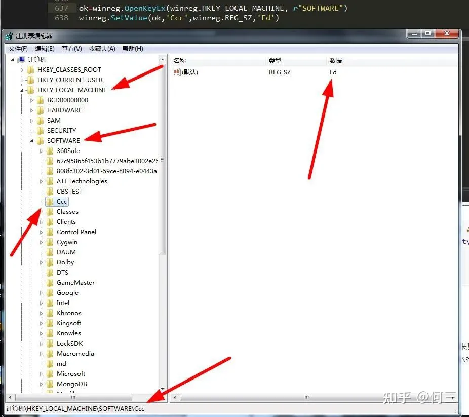

# WinReg

> [python内置模块winreg操作注册表 - 知乎 (zhihu.com)](https://zhuanlan.zhihu.com/p/474712424)
>
> [winreg --- Windows 注册表访问 — Python 3.9.16 文档](https://docs.python.org/zh-cn/3.9/library/winreg.html)

## 说明

python内置模块winreg

在Python中就有这么一个神奇的模块，它可以用来操作注册表。它就是-----"winreg"，一个Python自带的操作注册表的模块。

## 基础知识

### winreg常量

"winreg"总有很多有用的方法，基本上就是操作注册表中的键值，我们挑几个重要的来说说。首先我们来了解下"winreg"中的各个常量：

```python
winreg.HKEY_CLASSES_ROOT     #存储应用和shell的信息
winreg.HKEY_CURRENT_USER     #当前用户自定义的信息
winreg.HKEY_LOCAL_MACHINE    #计算机系统所有的信息
winreg.HKEY_USERS            #所有用户信息
winreg.HKEY_PERFORMANCE_DATA #性能数据
winreg.HKEY_CURRENT_CONFIG   #本地计算机系统的硬件配置文件
winreg.HKEY_DYN_DATA         #windows98后的版本无法使用
```

### 访问权限

```python
winreg.KEY_ALL_ACCESS           #所有权限
winreg.KEY_WRITE                #可写
winreg.KEY_READ                 #可读
winreg.KEY_EXECUTE              #可执行相当于
KEY_READwinreg.KEY_QUERY_VALUE  #查询注册表键值
winreg.KEY_SET_VALUE            #创建、删除或设置一组注册表值
winreg.KEY_CREATE_SUB_KEY       #创建一个注册表子项的注册表键
winreg.KEY_ENUMERATE_SUB_KEYS   #枚举注册表子项所需的注册表键
winreg.KEY_NOTIFY               #修改注册表键时的提示
winreg.KEY_CREATE_LINK          #创建一个链接，预留给系统用
```

### 64位或32位系统

```python
winreg.KEY_WOW64_64KEY  #在64位Windows应用程序应该运行在64位注册表视图
winreg.KEY_WOW64_32KEY  #在64位Windows应用程序应该运行在32位注册表视图
```

### 值类型

```python
winreg.REG_BINARY                      #任何形式的二进制数据
winreg.REG_DWORD                       #32位的数
winreg.REG_DWORD_LITTLE_ENDIAN         #32位的数字在低位优先的格式，相当于
REG_DWORDwinreg.REG_DWORD_BIG_ENDIAN   #32位的数字在高位优先的格式winreg.REG_EXPAND_SZ #以null结尾的字符串包含环境变量的引用(% %)
winreg.REG_LINK                        #Unicode符号链接
winreg.REG_MULTI_SZ                    #一个以null结尾的字符串序列,由两个空字符结束
winreg.REG_NONE                        #没有定义的值类型
winreg.REG_QWORD                       #64位的数
winreg.REG_QWORD_LITTLE_ENDIAN         #在低位优先一个64位的数字格式，相当于REG_QWORD
winreg.REG_RESOURCE_LIST               #设备驱动器资源列表
winreg.REG_FULL_RESOURCE_DESCRIPTOR    #硬件设置
winreg.REG_RESOURCE_REQUIREMENTS_LIST  #硬件资源列表
winreg.REG_SZ                          #一个以null结尾的字符串
```

## 基础操作

### 远程操作注册表

```python
reg=winreg.ConnectRegistry('\\计算机名',winreg.HKEY_LOCAL_MACHINE)#返回值是所开打键的句柄
#第一个参数是指远程计算机名，第二个参数是指注册表中的键，如HKEY_LOCAL_MACHINE，它是winreg中的常量。
```

不过我们在这里要注意的是，如果远程注册表没有系统管理员权限，是无法正常访问注册表的。所以我们先要判断下它的访问权限。这里就要用到我们之前讲的"ctypes"模块中的判断用户是否是管理员用户的方法了。

```python
import ctypes
import sys
def admin():
    aa=ctypes.windll.shell32.IsUserAnAdmin()
    return aa
if admin()==1: #有管理员权限可打开远程注册表
    winreg.ConnectRegistry('\\计算机名',winreg.HKEY_LOCAL_MACHINE)
else:
    if sys.version_info[0]==3: #python版本是3以上的版本
        ctypes.windll.shell32.ShellExecuteW(None, "runas", sys.executable, __file__, None, 1)
    else: #python2 版本
        ctypes.windll.shell32.ShellExecuteW(None, u"runas", unicode(sys.executable), unicode(__file__), None, 1)
```

### 关闭连接注册表

连接之后我们不想用了，就要随手把它给关闭了，也很简单，只要拿到打开注册表的句柄，就可以关闭了。

```python
winreg.CloseKey(reg)
# 或者
reg.Close()
```

注册对象还支持上下文和分离处理对象周期：

```python
reg.detach() #返回一个整数，记录当前对象的生命周期，如果关闭注册句柄对象，那么则为0
```

### 打开注册表键

```python
#打开指定的键,返回一个处理对象
winreg.OpenKey(key, sub_key, reserved=0, access=winreg.KEY_READ)
winreg.OpenKeyEx(key, sub_key, reserved=0, access=winreg.KEY_READ)
#key:HKEY_ 常量
#sub_key:指定键的子键
#reserved:一个保留的证书，必须是零。默认值为零
#access:访问权限
```

### 创建新的注册表键

```python
winreg.CreateKey(key,sub_key)
winreg.CreateKeyEx(key,sub_key,reserved=0,access=winreg.KEY_WRITE)
#key:HKEY_ 常量
#sub_key:指定键的子键
#reserved:一个保留的证书，必须是零。默认值为零
#access:访问权限
```


### 删除注册表中指定的键

```pythonpy
winreg.DeleteKey( key,sub_key) #不能删除带有子项的键
winreg.DeleteKeyEx(key,sub_key,reserved=0,access=winreg.KEY_WOW64_64KEY)#不能删除带有子项的键
winreg.DeleteValue(key, value)#从某个注册键中删除一个命名值项
#用法与上面相同，只是结果是删除罢了
```


可以看到”cnm“已经被删除了。如果键不存在，删除会报错。

### 枚举注册表键

```pythonpy
winreg.EnumKey(key,index) #枚举打开的注册表键的子键，并返回一个字符串
winreg.EnumValue(key,index)#枚举打开的注册表键值，并返回一个元组
#index：一个整数，用于标识所获取键的索引
```


### 刷新注册表键

```pythonpy
winreg.FlushKey(key)  #同步某个键的所有属性写入注册表
```

### 读取注册表

```pythonpy
winreg.LoadKey(key,sub_key,file_name)#file_name:读取注册表的数据的文件名
```

### 查找注册表键

```python
winreg.QueryInfoKey(key) #返回一个3元素元组的键的信息
winreg.QueryValue(key,sub_key) #用一个字符串来检索一个键的值
winreg.QueryValueEx(key,value_name) #检索与开放权限的注册表键相关联的指定值的数据类型和名称
```


### 保存注册表键

```pythonpy
winreg.SaveKey(key, file_name) #保存指定的键和所有指定文件的注册表子项
```

### 启用禁用注册表

```python
winreg.DisableReflectionKey(key) #禁用
winreg.EnableReflectionKey(key)  #启用
```

### 反射状态是否禁用

```python
winreg.QueryReflectionKey(key) #结果为True 则表示禁用
```

### 在指定键上关联值

```python
winreg.SetValue(key, sub_key, type, value) #添加键和值
winreg.SetValueEx(key,value_name,reserved,type,value)#将数据存储在一个开放的注册表键值字段
#value_name:该字符串名称的注册表子键
#type:值类型
#value：子键的键值
```




可以看出它们的区别，而且前者值类型只能指定为“winreg.REG_SZ”，而后者什么类型都可以。

## 案例

### 打开应用程序

前面我们介绍了"winreg"几乎所有的方法，现在我们就来具体做一个应用练练手，就拿我们的360安全卫士为例，我们尝试着通过注册表先找到它的位置然后打开它。那么接下来小编开始表演了：

1. 定位360安全卫士的注册表项：

   - 打开系统注册表编辑器，然后进行搜索关键字：

     

   - 定位到注册表路径

     

2. 打开注册表键

   通过我们找到的子键然后对其进行查找操作，得到处理对象的句柄“reg”

   ```python
   reg=winreg.OpenKey(winreg.HKEY_LOCAL_MACHINE,r"SOFTWARE\WOW6432Node\Microsoft\Windows\CurrentVersion\Uninstall\360安全卫士")
   ```

3. 找到应用的绝对路径并打印

   通过数值名称找到数值数据

   ```python
   path=winreg.QueryValueEx(reg,'DisplayIcon')
   ```

   这样就找到了这个应用的绝对路径了，返回值是一个元祖，我们使用索引访问：

   ```python
   path[0]
   ```

   

   可以看到我们已经成功打印出了我们要找的应用程序的绝对路径了，接下来就可以愉快的打开它了。打开的方法多种多样，什么“os”，“subprocess”,"ctypes","pywin32",一大堆的方法，不过小编还是觉得“os”最方便。

   ```python
   os.popen(path[0])
   ```

   

4.   关闭对象处理句柄

   ```python
   #两种方法都可以关闭
   winreg.CloseKey(reg)
   reg.Close()
   ```

```python
reg=winreg.OpenKey(winreg.HKEY_LOCAL_MACHINE,r"SOFTWARE\WOW6432Node\Microsoft\Windows\CurrentVersion\Uninstall\360安全卫士")
path=winreg.QueryValueEx(reg,'DisplayIcon')
os.popen(path[0])
reg.Close()
```

### 系统网络代理模式

```python
import winreg
import ctypes


KEY_ProxyEnable = "ProxyEnable"
KEY_ProxyServer = "ProxyServer"
KEY_ProxyOverride = "ProxyOverride"
KEY_XPATH = "Software\Microsoft\Windows\CurrentVersion\Internet Settings"

#设置刷新
internet_option_refresh = 37
internet_option_settings_changed = 39

def win_start_proxy(proxyIp, ignore_ip = '*<-loopback>'):
    try:
        hKey = winreg.OpenKey(winreg.HKEY_CURRENT_USER, KEY_XPATH, 0, winreg.KEY_ALL_ACCESS)
        winreg.SetValueEx(hKey, KEY_ProxyEnable, 0, winreg.REG_DWORD, 1)
        winreg.SetValueEx(hKey, KEY_ProxyServer, 0, winreg.REG_SZ, proxyIp)
        winreg.SetValueEx(hKey, KEY_ProxyOverride, 0, winreg.REG_SZ, ignore_ip)
        winreg.CloseKey(hKey)
        hKey.Close()
    except Exception as e:
        print(e)
    #刷新
    internet_set_option = ctypes.windll.Wininet.InternetSetOptionW
    internet_set_option(0, internet_option_refresh, 0, 0)
    internet_set_option(0, internet_option_settings_changed, 0, 0)
    print('开启系统代理模式：', proxyIp)
    print('当前嗅探模式状态:', win_proxy_status())

def win_disable_proxy():
    try:
        hKey = winreg.OpenKey(winreg.HKEY_CURRENT_USER, KEY_XPATH, 0, winreg.KEY_ALL_ACCESS)
        winreg.SetValueEx(hKey, KEY_ProxyEnable, 0, winreg.REG_DWORD, 0)
        winreg.SetValueEx(hKey, KEY_ProxyServer, 0, winreg.REG_SZ, '')
        winreg.SetValueEx(hKey, KEY_ProxyOverride, 0, winreg.REG_SZ, '')
        winreg.CloseKey(hKey)
        hKey.Close()
    except Exception as e:
        print(e)
    #刷新
    internet_set_option = ctypes.windll.Wininet.InternetSetOptionW
    internet_set_option(0, internet_option_refresh, 0, 0)
    internet_set_option(0, internet_option_settings_changed, 0, 0)
    print('关闭代理模式')
    print('当前嗅探模式状态:', win_proxy_status())

def win_set_proxy_override(ignore_ip = '<-loopback>'):
    '''
    设置系统忽略代理地址
    '''
    try:
        hKey = winreg.OpenKey(winreg.HKEY_CURRENT_USER, KEY_XPATH, 0, winreg.KEY_ALL_ACCESS)
        winreg.SetValueEx(hKey, KEY_ProxyOverride, 0, winreg.REG_SZ, ignore_ip)
        winreg.CloseKey(hKey)
        hKey.Close()
    except Exception as e:
        print(e)

# 获取当前代理状态
def win_proxy_status():
    hKey = winreg.OpenKey(winreg.HKEY_CURRENT_USER, KEY_XPATH, 0, winreg.KEY_READ)
    retVal = winreg.QueryValueEx(hKey, KEY_ProxyEnable)
    winreg.CloseKey(hKey)
    hKey.Close()
    return int(retVal[0])==1


if __name__ == "__main__":

    if win_proxy_status():
        win_disable_proxy()
        print('关闭代理')
    else:
        win_start_proxy('127.0.0.1:8000')
        print('打开代理')

    print(win_proxy_status())
```

### 访问用户账户列表

具体代码如下,可访问用户账户列表： 该设置位于`HKEY_LOCAL_MACHINESOFTWAREMicrosoftWindows NTCurrentVersionProfileList`

```python
# encoding:utf-8
from winreg import *
import sys

# 1.连接注册表根键，以HKEY_LOCAL_MACHINE为例
regRoot = ConnectRegistry(None, HKEY_LOCAL_MACHINE)

subDir = r'SOFTWARE\Microsoft\Windows NT\Current\Version\ProfileList'
# 2.获取指定目录下所有键的控制(可用于遍历)
keyHandle = OpenKey(regRoot, subDir)
count = QueryInfoKey(keyHandle)[0] # 获取该目录下所有键的个数(0-下属键个数;1-当前键值个数)
for i in range(count):
    # 3.穷举每个键，获取键名
    subKeyName = EnumKey(keyHandle, i)
    subDir_2 = r'%s%s' % (subDir, subKeyName)
    # 4.根据获取的键名拼接之前的路径作为参数，获取当前键下所属键的控制
    keyHandle_2 = OpenKey(regRoot, subDir_2)
    count2 = QueryInfoKey(keyHandle_2)[1]
    for j in range(count2):
        # 5.穷举每个键，获取键名、键值以及数据类型
        name, value, type = EnumValue(keyHandle_2, j)
        if('ProfileImagePath' in name and 'Users' in value):
            print(value)
    CloseKey(keyHandle_2) # 读写操作结束后关闭键

CloseKey(keyHandle)
CloseKey(regRoot)
```

我们可以通过读取含有Users字段的数据，从而间接获取用户账户信息

### 开关防火墙

修改注册表中防火墙的**公网**和**家用网络**的**开启和关闭**

该设置位于`HKEY_LOCAL_MACHINESYSTEMCurrentControlSetServicesSharedAccessParametersFirewallPolicy`

```python
# encoding:utf-8
from __future__ import print_function
from winreg import *
import ctypes, sys

subDir = r'SYSTEM\CurrentControlSetServicesSharedAccessParametersFirewallPolicy'
standard = r'StandardProfile'
public = r'PublicProfile'
enableKey = 'EnableFirewall'
value = 1

def is_admin():
    try:
        return ctypes.windll.shell32.IsUserAnAdmin()
    except:
        return False

def updateFireWall(keyName):
    # 1.连接注册表根键
    regRoot = ConnectRegistry(None, HKEY_LOCAL_MACHINE)
    # 2.获取指定目录下键的控制
    keyHandel = OpenKey(regRoot, subDir+keyName)
    if is_admin():
        # 3.设置该键的指定键值enableKey为value
        SetValueEx(keyHandel, enableKey, value, REG_DWORD, value)
    else:
        if sys.version_info[0] == 3:
            ctypes.windll.shell32.ShellExecuteW(None, "runas", sys.executable, __file__, None, 1)
    # 4.关闭键的控制
    CloseKey(keyHandel)
    CloseKey(regRoot)

if __name__ == '__main__':
    updateFireWall(standard)
    updateFireWall(public)
```

## [代码示例](https://vimsky.com/examples/detail/python-module-winreg.html)

**`winreg`**共有29个方法/函数/属性，点击链接查看相应的源代码示例。

1. [winreg.OpenKey()](https://vimsky.com/examples/detail/python-method-winreg.OpenKey.html) ，238个项目使用
2. [winreg.QueryValueEx()](https://vimsky.com/examples/detail/python-method-winreg.QueryValueEx.html) ，208个项目使用
3. [winreg.HKEY_LOCAL_MACHINE](https://vimsky.com/examples/detail/python-attribute-winreg.HKEY_LOCAL_MACHINE.html) ，112个项目使用
4. [winreg.HKEY_CURRENT_USER](https://vimsky.com/examples/detail/python-attribute-winreg.HKEY_CURRENT_USER.html) ，85个项目使用
5. [winreg.EnumKey()](https://vimsky.com/examples/detail/python-method-winreg.EnumKey.html) ，72个项目使用
6. [winreg.EnumValue()](https://vimsky.com/examples/detail/python-method-winreg.EnumValue.html) ，69个项目使用
7. [winreg.KEY_READ](https://vimsky.com/examples/detail/python-attribute-winreg.KEY_READ.html) ，56个项目使用
8. [winreg.CloseKey()](https://vimsky.com/examples/detail/python-method-winreg.CloseKey.html) ，53个项目使用
9. [winreg.REG_SZ](https://vimsky.com/examples/detail/python-attribute-winreg.REG_SZ.html) ，47个项目使用
10. [winreg.ConnectRegistry()](https://vimsky.com/examples/detail/python-method-winreg.ConnectRegistry.html) ，40个项目使用
11. [winreg.KEY_WOW64_64KEY](https://vimsky.com/examples/detail/python-attribute-winreg.KEY_WOW64_64KEY.html) ，35个项目使用
12. [winreg.OpenKeyEx()](https://vimsky.com/examples/detail/python-method-winreg.OpenKeyEx.html) ，34个项目使用
13. [winreg.error()](https://vimsky.com/examples/detail/python-method-winreg.error.html) ，32个项目使用
14. [winreg.SetValueEx()](https://vimsky.com/examples/detail/python-method-winreg.SetValueEx.html) ，31个项目使用
15. [winreg.QueryInfoKey()](https://vimsky.com/examples/detail/python-method-winreg.QueryInfoKey.html) ，30个项目使用
16. [winreg.KEY_WOW64_32KEY](https://vimsky.com/examples/detail/python-attribute-winreg.KEY_WOW64_32KEY.html) ，26个项目使用
17. [winreg.REG_EXPAND_SZ](https://vimsky.com/examples/detail/python-attribute-winreg.REG_EXPAND_SZ.html) ，18个项目使用
18. [winreg.QueryValue()](https://vimsky.com/examples/detail/python-method-winreg.QueryValue.html) ，17个项目使用
19. [winreg.CreateKey()](https://vimsky.com/examples/detail/python-method-winreg.CreateKey.html) ，15个项目使用
20. [winreg.KEY_ALL_ACCESS](https://vimsky.com/examples/detail/python-attribute-winreg.KEY_ALL_ACCESS.html) ，14个项目使用
21. [winreg.DeleteValue()](https://vimsky.com/examples/detail/python-method-winreg.DeleteValue.html) ，13个项目使用
22. [winreg.HKEY_CLASSES_ROOT](https://vimsky.com/examples/detail/python-attribute-winreg.HKEY_CLASSES_ROOT.html) ，11个项目使用
23. [winreg.HKEY_USERS](https://vimsky.com/examples/detail/python-attribute-winreg.HKEY_USERS.html) ，9个项目使用
24. [winreg.KEY_WRITE](https://vimsky.com/examples/detail/python-attribute-winreg.KEY_WRITE.html) ，9个项目使用
25. [winreg.REG_DWORD](https://vimsky.com/examples/detail/python-attribute-winreg.REG_DWORD.html) ，9个项目使用
26. [winreg.KEY_QUERY_VALUE](https://vimsky.com/examples/detail/python-attribute-winreg.KEY_QUERY_VALUE.html) ，6个项目使用
27. [winreg.DeleteKey()](https://vimsky.com/examples/detail/python-method-winreg.DeleteKey.html) ，6个项目使用
28. [winreg.ExpandEnvironmentStrings()](https://vimsky.com/examples/detail/python-method-winreg.ExpandEnvironmentStrings.html) ，5个项目使用
29. [winreg.CreateKeyEx()](https://vimsky.com/examples/detail/python-method-winreg.CreateKeyEx.html) ，5个项目使用
