# 图解操作系统


# 前言


## 作者介绍

大家好，我是小林，是这本「图解系统」电子书的作者，电子书的内容都是整理于我公众号「小林coding」里的图解文章。


还没关注的朋友，可以微信搜索「小林coding」，关注我的公众号，后续最新版本的 PDF 会在我的公众号第一时间发布，而且会有更多其他系列的图解文章，比如操作系统、计算机组成、数据库、算法等等。之前小林公众号也发布过「图解网络」，还没领取的小伙伴，关注我公众号后，回复「网络」就可以获取啦。

简单介绍下这个图解系统 PDF，这本电子书共有 15W 字 + 400 张图，文字都是小林一个字一个字敲出来的，图片都是小林一个点一条线画出来的，非常的不容易。

这本书图解系统适合什么群体呢？

这本书写的网络知识主要是面向程序员的，因为小林本身也是个程序员，所以涉及到的知识主要是关于程序员日常工作或者面试的操作系统知识。

非常适合有一点操作系统，但是又不怎么扎实，或者知识点串不起来的同学，说白这本图解系统就是为了拯救半桶水的同学而出来。

因为小林写的图解系统就四个字，通俗易懂！

相信你在看这本图解系统的时候，你心里的感受会是：

- 「卧槽，原来是这样，大学老师教知识原来是这么理解」

- 「卧槽，我的操作系统知识串起来了」

- 「卧槽，我感觉面试稳了」

- 「卧槽，相见恨晚」

当然，也适合面试突击操作系统知识时拿来看，不敢说 100 % 涵盖了面试的网络问题，但是至少 90% 是有的，而且内容的深度应对大厂也是搓搓有余的，有非常多的读者跑来感激小林的图解系统，帮助他们拿到了国内很多一线大厂的 offer。

这本书图解系统要怎么阅读呢？

很诚恳的告诉你，这本书不是教科书。

而是我在公众号里写的图解系统文章的整合，所以肯定是没有教科书那么细致和全面，当然也不就不会有很多废话，而且有的知识点书上看不到。

图解系统 PDF 不仅仅只有操作系统的知识，还涉及计算机组成和 Linux 系统、命令的知识。

阅读的顺序可以不用从头读到尾，你可以根据你想要了解的知识点，去看哪个章节的文章就好，可以随意阅读任何章节的文章。

下面这张思维导图是整个电子书的目录结构：

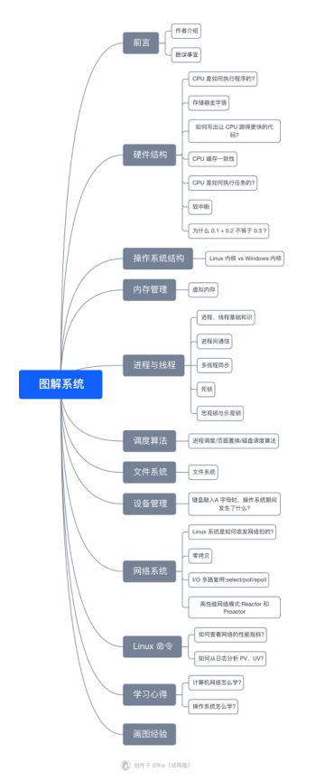

## 勘误事宜

小林是个手残党，可能文中会有不少错别字，所以在学习这份电子书的同学，如果你发现有任何错误或者疑惑的地方，欢迎你通过下方的邮箱反馈给小林，小林会逐个修正，然后发布新版本的图解系统 PDF，一起迭代出更好的图解系统人！

勘误邮箱：xiaolincoding@163.com


# 一、硬件结构


## 1.1 CPU 是如何执行程序的？

代码写了那么多，你知道 a = 1 + 2这条代码是怎么被 CPU 执行的吗？

软件用了那么多，你知道软件的 32 位和 64 位之间的区别吗？再来 32 位的操作系统可以运行在 64 位的电脑上吗？64 位的操作系统可以运行在 32 位的电脑上吗？如果不行，原因是什么？

CPU 看了那么多，我们都知道 CPU 通常分为 32 位和 64 位，你知道 64 位相比 32 位 CPU 的优势在哪吗？64 位 CPU 的计算性能一定比 32 位 CPU 高很多吗？

不知道也不用慌张，接下来就循序渐进的、一层一层的攻破这些问题。

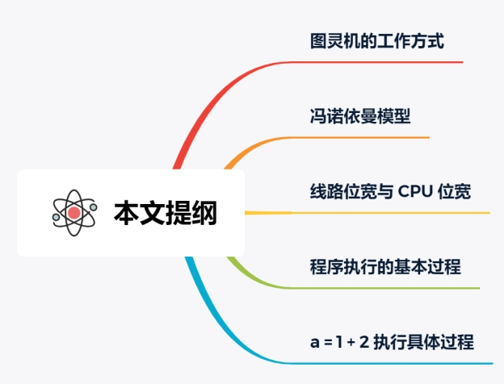


### 图灵机的工作方式

要想知道程序执行的原理，我们可以先从「图灵机」说起，图灵的基本思想是用机器来模拟人们用纸笔进行数学运算的过程，而且还定义了计算机由哪些部分组成，程序又是如何执行的。

图灵机长什么样子呢？你从下图可以看到图灵机的实际样子：

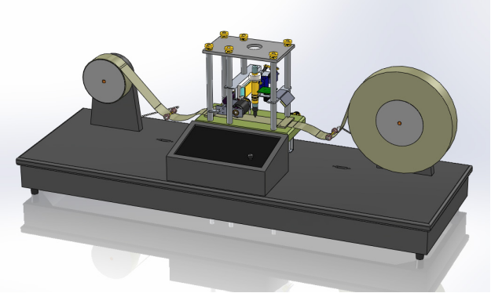

图灵机的基本组成如下：

- 有一条「纸带」，纸带由一个个连续的格子组成，每个格子可以写入字符，纸带就好比内存，而纸带上的格子的字符就好比内存中的数据或程序；

- 有一个「读写头」，读写头可以读取纸带上任意格子的字符，也可以把字符写入到纸带的格子；

- 读写头上有一些部件，比如存储单元、控制单元以及运算单元：1、存储单元用于存放数据； 2、控制单元用于识别字符是数据还是指令，以及控制程序的流程等； 3、运算单元用于执行运算指令；

知道了图灵机的组成后，我们以简单数学运算的 1 + 2作为例子，来看看它是怎么执行这行代码的。

- 首先，用读写头把 「1、2、+」这 3 个字符分别写入到纸带上的 3 个格子，然后读写头先停在 1 字符对应的格子上；

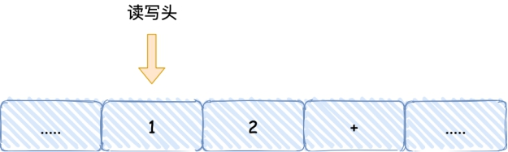

- 接着，读写头读入 1 到存储设备中，这个存储设备称为图灵机的状态；

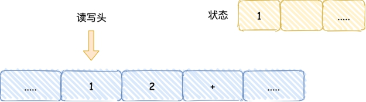

- 然后读写头向右移动一个格，用同样的方式把 2 读入到图灵机的状态，于是现在图灵机的状态中存储着两个连续的数字， 1 和 2；

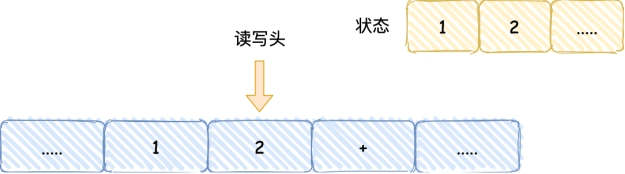

- 读写头再往右移动一个格，就会碰到 + 号，读写头读到 + 号后，将 + 号传输给「控制单元」，控制单元发现是一个 + 号而不是数字，所以没有存入到状态中，因为 +号是运算符指令，作用是加和目前的状态，于是通知「运算单元」工作。运算单元收到要加和状态中的值的通知后，就会把状态中的 1 和 2 读入并计算，再将计算的结果 3 存放到状态中；

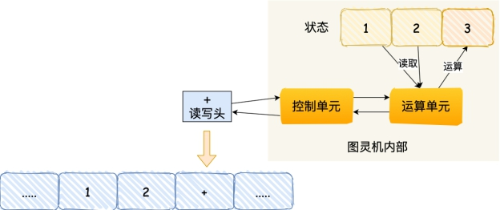

- 最后，运算单元将结果返回给控制单元，控制单元将结果传输给读写头，读写头向右移动，把结果 3 写入到纸带的格子中；

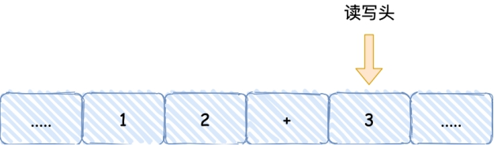


通过上面的图灵机计算 1 + 2 的过程，可以发现图灵机主要功能就是读取纸带格子中的内容，然后交给控制单元识别字符是数字还是运算符指令，如果是数字则存入到图灵机状态中，如果是运算符，则通知运算符单元读取状态中的数值进行计算，计算结果最终返回给读写头，读写头把结果写入到纸带的格子中。

事实上，图灵机这个看起来很简单的工作方式，和我们今天的计算机是基本一样的。接下来，我们一同再看看当今计算机的组成以及工作方式。


### 冯诺依曼模型

在 1945 年冯诺依曼和其他计算机科学家们提出了计算机具体实现的报告，其遵循了图灵机的设计，而且还提出用电子元件构造计算机，并约定了用二进制进行计算和存储，还定义计算机基本结构为 5 个部分，分别是中央处理器（CPU）、内存、输入设备、输出设备、总线。

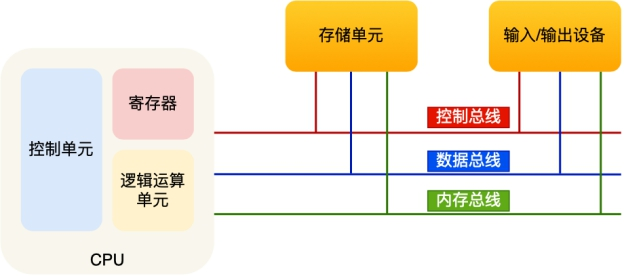

这 5 个部分也被称为冯诺依曼模型，接下来看看这 5 个部分的具体作用。


#### 内存

我们的程序和数据都是存储在内存，存储的区域是线性的。

数据存储的单位是一个二进制位（**bit**），即 0 或 1。最小的存储单位是字节（**byte**），1 字节等于 8 位。

内存的地址是从 0 开始编号的，然后自增排列，最后一个地址为内存总字节数 - 1，这种结构好似我们程序里的数组，所以内存的读写任何一个数据的速度都是一样的。


#### 中央处理器

中央处理器也就是我们常说的 CPU，32 位和 64 位 CPU 最主要区别在于一次能计算多少字节数据：

- 32 位 CPU 一次可以计算 4 个字节；
- 64 位 CPU 一次可以计算 8 个字节；

这里的 32 位和 64 位，通常称为 CPU 的位宽。

之所以 CPU 要这样设计，是为了能计算更大的数值，如果是 8 位的 CPU，那么一次只能计算 1 个字节 0~255范围内的数值，这样就无法一次完成计算 10000 ** 500，于是为了能一次计算大数的运算，CPU 需要支持多个 byte 一起计算，所以 CPU 位宽越大，可以计算的数值就越大，比如说 32 位 CPU 能计算的最大整数是 4294967295。

CPU 内部还有一些组件，常见的有寄存器、控制单元和逻辑运算单元等。其中，控制单元负责控制 CPU 工作，逻辑运算单元负责计算，而寄存器可以分为多种类，每种寄存器的功能又不尽相同。

CPU 中的寄存器主要作用是存储计算时的数据，你可能好奇为什么有了内存还需要寄存器？原因很简单，因为内存离 CPU 太远了，而寄存器就在 CPU 里，还紧挨着控制单元和逻辑运算单元，自然计算时速度会很快。

常见的寄存器种类：

- **通用寄存器**，用来存放需要进行运算的数据，比如需要进行加和运算的两个数据。

- **程序计数器**，用来存储 CPU 要执行下一条指令「所在的内存地址」，注意不是存储了下一条要执行的指令，此时指令还在内存中，程序计数器只是存储了下一条指令的地址。

- **指令寄存器**，用来存放程序计数器指向的指令，也就是指令本身，指令被执行完成之前，指令都存储在这里。


#### 总线

总线是用于 CPU 和内存以及其他设备之间的通信，总线可分为 3 种：

-  **地址总线**，用于指定 CPU 将要操作的内存地址；

- **数据总线**，用于读写内存的数据；

- **控制总线**，用于发送和接收信号，比如中断、设备复位等信号，CPU 收到信号后自然进行响应，这时也需要控制总线；

当 CPU 要读写内存数据的时候，一般需要通过两个总线：

- 首先要通过「地址总线」来指定内存的地址；

- 再通过「数据总线」来传输数据；


#### 输入、输出设备

输入设备向计算机输入数据，计算机经过计算后，把数据输出给输出设备。期间，如果输入设备是键盘，按下按键时是需要和 CPU 进行交互的，这时就需要用到控制总线了。


### 线路位宽与 CPU 位宽

数据是如何通过线路传输的呢？其实是通过操作电压，低电压表示 0，高压电压则表示 1。

如果构造了高低高这样的信号，其实就是 101 二进制数据，十进制则表示 5，如果只有一条线路，就意味着每次只能传递 1 bit 的数据，即 0 或 1，那么传输 101 这个数据，就需要 3 次才能传输完成，这样的效率非常低。

这样一位一位传输的方式，称为串行，下一个 bit 必须等待上一个 bit 传输完成才能进行传输。当然，想一次多传一些数据，增加线路即可，这时数据就可以并行传输。

为了避免低效率的串行传输的方式，线路的位宽最好一次就能访问到所有的内存地址。 CPU 要想操作的内存地址就需要地址总线，如果地址总线只有 1 条，那每次只能表示 「0 或 1」这两种情况，所以 CPU 一次只能操作 2 个内存地址，如果想要 CPU 操作 4G 的内存，那么就需要 32 条地址总线，因为 2 ^ 32 = 4G。

知道了线路位宽的意义后，我们再来看看 CPU 位宽。

CPU 的位宽最好不要小于线路位宽，比如 32 位 CPU 控制 40 位宽的地址总线和数据总线的话，工作起来就会非常复杂且麻烦，所以 32 位的 CPU 最好和 32 位宽的线路搭配，因为 32 位 CPU 一次最多只能操作 32 位宽的地址总线和数据总线。

如果用 32 位 CPU 去加和两个 64 位大小的数字，就需要把这 2 个 64 位的数字分成 2 个低位 32 位数字和 2 个高位 32 位数字来计算，先加个两个低位的 32 位数字，算出进位，然后加和两个高位的 32 位数字，最后再加上进位，就能算出结果了，可以发现 32 位 CPU 并不能一次性计算出加和两个 64 位数字的结果。

对于 64 位 CPU 就可以一次性算出加和两个 64 位数字的结果，因为 64 位 CPU 可以一次读入 64 位的数字，并且 64 位 CPU 内部的逻辑运算单元也支持 64 位数字的计算。

但是并不代表 64 位 CPU 性能比 32 位 CPU 高很多，很少应用需要算超过 32 位的数字，所以如果计算的数额不超过 32 位数字的情况下，32 位和 64 位 CPU 之间没什么区别的，只有当计算超过 32 位数字的情况下，64 位的优势才能体现出来。

另外，32 位 CPU 最大只能操作 4GB 内存，就算你装了 8 GB 内存条，也没用。而 64 位 CPU 寻址范围则很大，理论最大的寻址空间为 2^64。


### 程序执行的基本过程

在前面，我们知道了程序在图灵机的执行过程，接下来我们来看看程序在冯诺依曼模型上是怎么执行的。

程序实际上是一条一条指令，所以程序的运行过程就是把每一条指令一步一步的执行起来，负责执行指令的就是 CPU 了。

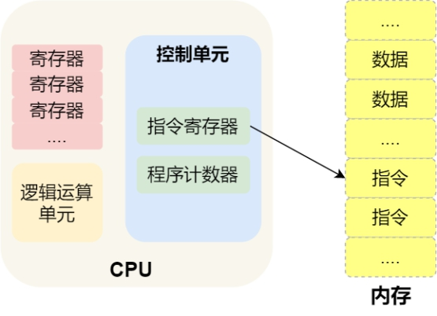

那 CPU 执行程序的过程如下：

- 第一步，CPU 读取「程序计数器」的值，这个值是指令的内存地址，然后 CPU 的「控制单元」操作「地址总线」指定需要访问的内存地址，接着通知内存设备准备数据，数据准备好后通过「数据总线」将指令数据传给 CPU，CPU 收到内存传来的数据后，将这个指令数据存入到「指令寄存器」。

- 第二步，CPU 分析「指令寄存器」中的指令，确定指令的类型和参数，如果是计算类型的指令，就把指令交给「逻辑运算单元」运算；如果是存储类型的指令，则交由「控制单元」执行；

- 第三步，CPU 执行完指令后，「程序计数器」的值自增，表示指向下一条指令。这个自增的大小，由 CPU 的位宽决定，比如 32 位的 CPU，指令是 4 个字节，需要 4 个内存地址存放，因此「程序计数器」的值会自增 4；

简单总结一下就是，一个程序执行的时候，CPU 会根据程序计数器里的内存地址，从内存里面把需要执行的指令读取到指令寄存器里面执行，然后根据指令长度自增，开始顺序读取下一条指令。

CPU 从程序计数器读取指令、到执行、再到下一条指令，这个过程会不断循环，直到程序执行结束，这个不断循环的过程被称为 CPU 的指令周期。


### a = 1 + 2 执行具体过程

知道了基本的程序执行过程后，接下来用 a = 1 + 2 的作为例子，进一步分析该程序在冯诺伊曼模型的执行过程。

CPU 是不认识 a = 1 + 2 这个字符串，这些字符串只是方便我们程序员认识，要想这段程序能跑起来，还需要把整个程序翻译成汇编语言的程序，这个过程称为编译成汇编代码。

针对汇编代码，我们还需要用汇编器翻译成机器码，这些机器码由 0 和 1 组成的机器语言，这一条条机器码，就是一条条的计算机指令，这个才是 CPU 能够真正认识的东西。

下面来看看 a = 1 + 2 在 32 位 CPU 的执行过程。

程序编译过程中，编译器通过分析代码，发现 1 和 2 是数据，于是程序运行时，内存会有个专门的区域来存放这些数据，这个区域就是「数据段」。如下图，数据 1 和 2 的区域位置：

- 数据 1 被存放到 0x100 位置；

- 数据 2 被存放到 0x104 位置；

注意，数据和指令是分开区域存放的，存放指令区域的地方称为「正文段」。

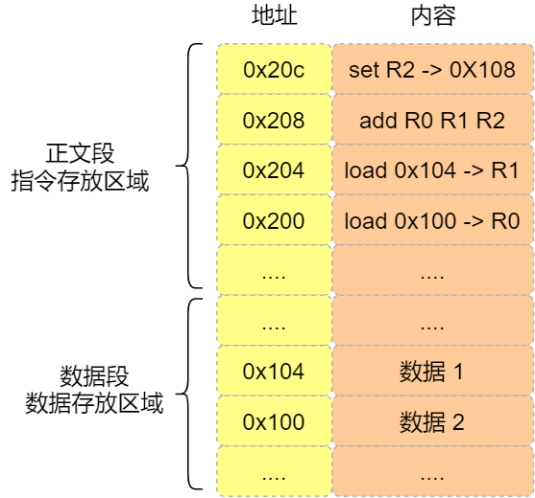

编译器会把 a = 1 + 2 翻译成 4 条指令，存放到正文段中。如图，这 4 条指令被存放到了 0x200 ~ 0x20c 的区域中：

- 0x200 的内容是 load 指令将 0x100 地址中的数据 1 装入到寄存器 R0；
- 0x204 的内容是 load 指令将 0x104 地址中的数据 2 装入到寄存器 R1 ；
- 0x208 的内容是 add 指令将寄存器 R0和 R1的数据相加，并把结果存放到寄存器 R2 ；
- 0x20c 的内容是 store 指令将寄存器 R2中的数据存回数据段中的 0x108 地址中，这个地址也就是变量 a内存中的地址；

编译完成后，具体执行程序的时候，程序计数器会被设置为 0x200 地址，然后依次执行这 4 条指令。

上面的例子中，由于是在 32 位 CPU 执行的，因此一条指令是占 32 位大小，所以你会发现每条指令间隔 4 个字节。

而数据的大小是根据你在程序中指定的变量类型，比如 int 类型的数据则占 4 个字节，char 类型的数据则占 1 个字节。


#### 指令

上面的例子中，图中指令的内容我写的是简易的汇编代码，目的是为了方便理解指令的具体内容，事实上指令的内容是一串二进制数字的机器码，每条指令都有对应的机器码，CPU 通过解析机器码来知道指令的内容。

不同的 CPU 有不同的指令集，也就是对应着不同的汇编语言和不同的机器码，接下来选用最简单的 MIPS 指集，来看看机器码是如何生成的，这样也能明白二进制的机器码的具体含义。

MIPS 的指令是一个 32 位的整数，高 6 位代表着操作码，表示这条指令是一条什么样的指令，剩下的 26 位不同指令类型所表示的内容也就不相同，主要有三种类型R、I 和 J。

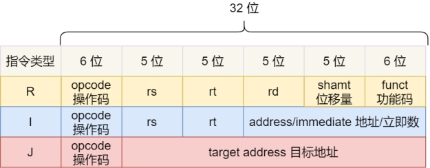

一起具体看看这三种类型的含义：

- **R 指令**，用在算术和逻辑操作，里面由读取和写入数据的寄存器地址。如果是逻辑位移操作，后面还有位移操作的「位移量」，而最后的「功能码」则是再前面的操作码不够的时候，扩展操作码来表示对应的具体指令的；

- **I 指令**，用在数据传输、条件分支等。这个类型的指令，就没有了位移量和操作码，也没有了第三个寄存器，而是把这三部分直接合并成了一个地址值或一个常数；

- **J 指令**，用在跳转，高 6 位之外的 26 位都是一个跳转后的地址；

接下来，我们把前面例子的这条指令：「add 指令将寄存器 R0 和 R1 的数据相加，并把结果放入到 R2」，翻译成机器码。

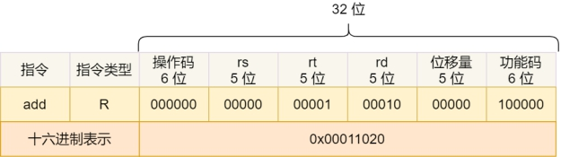

加和运算 add 指令是属于 R 指令类型：

- add 对应的 MIPS 指令里操作码是 000000，以及最末尾的功能码是 100000，这些数值都是固定的，查一下 MIPS 指令集的手册就能知道的；

- rs 代表第一个寄存器 R0 的编号，即 00000；

- rt 代表第二个寄存器 R1 的编号，即 00001；

- rd 代表目标的临时寄存器 R2 的编号，即 00010；

- 因为不是位移操作，所以位移量是 00000

把上面这些数字拼在一起就是一条 32 位的 MIPS 加法指令了，那么用 16 进制表示的机器码则是 0x00011020。

编译器在编译程序的时候，会构造指令，这个过程叫做指令的编码。CPU 执行程序的时候，就会解析指令，这个过程叫作指令的解码。

现代大多数 CPU 都使用来流水线的方式来执行指令，所谓的流水线就是把一个任务拆分成多个小任务，于是一条指令通常分为 4 个阶段，称为 4 级流水线，如下图：

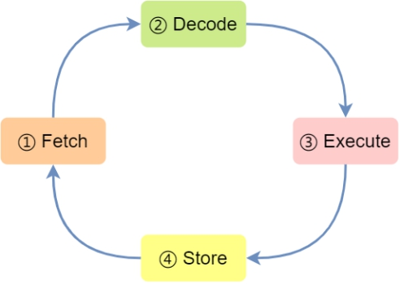

四个阶段的具体含义：

1. CPU 通过程序计数器读取对应内存地址的指令，这个部分称为 Fetch（取得指令）；

2. CPU 对指令进行解码，这个部分称为 Decode（指令译码）；

3. CPU 执行指令，这个部分称为 Execution（执行指令）；

4. CPU 将计算结果存回寄存器或者将寄存器的值存入内存，这个部分称为 Store（数据回写）；

上面这 4 个阶段，我们称为指令周期（**Instrution Cycle**），CPU 的工作就是一个周期接着一个周期，周而复始。

事实上，不同的阶段其实是由计算机中的不同组件完成的：

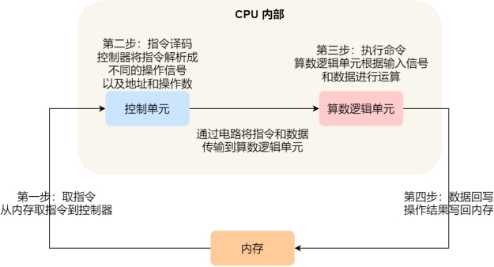

- 取指令的阶段，我们的指令是存放在存储器里的，实际上，通过程序计数器和指令寄存器取出指令的过程，是由控制器操作的；

- 指令的译码过程，也是由控制器进行的；

- 指令执行的过程，无论是进行算术操作、逻辑操作，还是进行数据传输、条件分支操作，都是由算术逻辑单元操作的，也就是由运算器处理的。但是如果是一个简单的无条件地址跳转，则是直接在控制器里面完成的，不需要用到运算器。


#### 指令的类型

指令从功能角度划分，可以分为 5 大类：

- **数据传输类型的指令**，比如 store/load是寄存器与内存间数据传输的指令，mov 是将一个内存地址的数据移动到另一个内存地址的指令；

- **运算类型的指令**，比如加减乘除、位运算、比较大小等等，它们最多只能处理两个寄存器中的数据；

- **跳转类型的指令**，通过修改程序计数器的值来达到跳转执行指令的过程，比如编程中常见的 if-else、swtich-case、函数调用等。

- **信号类型的指令**，比如发生中断的指令 trap；

- **闲置类型的指令**，比如指令 nop，执行后 CPU 会空转一个周期；


#### 指令的执行速度

CPU 的硬件参数都会有 GHz 这个参数，比如一个 1 GHz 的 CPU，指的是时钟频率是 1 G，代表着 1 秒会产生 1G 次数的脉冲信号，每一次脉冲信号高低电平的转换就是一个周期，称为时钟周期。

对于 CPU 来说，在一个时钟周期内，CPU 仅能完成一个最基本的动作，时钟频率越高，时钟周期就越短，工作速度也就越快。

一个时钟周期一定能执行完一条指令吗？答案是不一定的，大多数指令不能在一个时钟周期完成，通常需要若干个时钟周期。不同的指令需要的时钟周期是不同的，加法和乘法都对应着一条 CPU 指令，但是乘法需要的时钟周期就要比加法多。

如何让程序跑的更快？

程序执行的时候，耗费的 CPU 时间少就说明程序是快的，对于程序的 CPU 执行时间，我们可以拆解成 CPU 时钟周期数（**CPU Cycles**）和时钟周期时间（**Clock Cycle Time**）的乘积。


时钟周期时间就是我们前面提及的 CPU 主频，主频越高说明 CPU 的工作速度就越快，比如我手头上的电脑的 CPU 是 2.4 GHz 四核 Intel Core i5，这里的 2.4 GHz 就是电脑的主频，时钟周期时间就是 1/2.4G。

要想 CPU 跑的更快，自然缩短时钟周期时间，也就是提升 CPU 主频，但是今非彼日，摩尔定律早已失效，当今的 CPU 主频已经很难再做到翻倍的效果了。

另外，换一个更好的 CPU，这个也是我们软件工程师控制不了的事情，我们应该把目光放到另外一个乘法因子 —— CPU 时钟周期数，如果能减少程序所需的 CPU 时钟周期数量，一样也是能提升程序的性能的。

对于 CPU 时钟周期数我们可以进一步拆解成：「指令数 x 每条指令的平均时钟周期数（**Cycles Per Instruction**，简称 CPI）」，于是程序的 CPU 执行时间的公式可变成如下：


因此，要想程序跑的更快，优化这三者即可：

- **指令数**，表示执行程序所需要多少条指令，以及哪些指令。这个层面是基本靠编译器来优化，毕竟同样的代码，在不同的编译器，编译出来的计算机指令会有各种不同的表示方式。

- **每条指令的平均时钟周期数 CPI**，表示一条指令需要多少个时钟周期数，现代大多数 CPU 通过流水线技术（Pipline），让一条指令需要的 CPU 时钟周期数尽可能的少；

- **时钟周期时间**，表示计算机主频，取决于计算机硬件。有的 CPU 支持超频技术，打开了超频意味着把 CPU 内部的时钟给调快了，于是 CPU 工作速度就变快了，但是也是有代价的，CPU 跑的越快，散热的压力就会越大，CPU 会很容易奔溃。

很多厂商为了跑分而跑分，基本都是在这三个方面入手的哦，特别是超频这一块。

### 总结

最后我们再来回答开头的问题。

64 位相比 32 位 CPU 的优势在哪吗？64 位 CPU 的计算性能一定比 32 位 CPU 高很多吗？

64 位相比 32 位 CPU 的优势主要体现在两个方面：

- 64 位 CPU 可以一次计算超过 32 位的数字，而 32 位 CPU 如果要计算超过 32 位的数字，要分多步骤进行计算，效率就没那么高，但是大部分应用程序很少会计算那么大的数字，所以只有运算大数字的时候，64 位 CPU 的优势才能体现出来，否则和 32 位 CPU 的计算性能相差不大。

- 64 位 CPU 可以寻址更大的内存空间，32 位 CPU 最大的寻址地址是 4G，即使你加了 8G 大小的内存，也还是只能寻址到 4G，而 64 位 CPU 最大寻址地址是 2^64，远超于 32 位 CPU 最大寻址地址的 2^32。

你知道软件的 32 位和 64 位之间的区别吗？再来 32 位的操作系统可以运行在 64 位的电脑上吗？64 位的操作系统可以运行在 32 位的电脑上吗？如果不行，原因是什么？

64 位和 32 位软件，实际上代表指令是 64 位还是 32 位的：

- 如果 32 位指令在 64 位机器上执行，需要一套兼容机制，就可以做到兼容运行了。但是如果 64 位指令在 32 位机器上执行，就比较困难了，因为 32 位的寄存器存不下 64 位的指令；

- 操作系统其实也是一种程序，我们也会看到操作系统会分成 32 位操作系统、64 位操作系统，其代表意义就是操作系统中程序的指令是多少位，比如 64 位操作系统，指令也就是 64 位，因此不能装在 32 位机器上。

总之，硬件的 64 位和 32 位指的是 CPU 的位宽，软件的 64 位和 32 位指的是指令的位宽。


## 1.2 存储器金字塔

大家如果想自己组装电脑的话，肯定需要购买一个 CPU，但是存储器方面的设备，分类比较多，那我们肯定不能只买一种存储器，比如你除了要买内存，还要买硬盘，而针对硬盘我们还可以选择是固态硬盘还是机械硬盘。

相信大家都知道内存和硬盘都属于计算机的存储设备，断电后内存的数据是会丢失的，而硬盘则不会，因为硬盘是持久化存储设备，同时也是一个 I/O 设备。

但其实 CPU 内部也有存储数据的组件，这个应该比较少人注意到，比如寄存器、CPU L1/L2/L3 Cache 也都是属于存储设备，只不过它们能存储的数据非常小，但是它们因为靠近 CPU 核心，所以访问速度都非常快，快过硬盘好几个数量级别。

问题来了，那机械硬盘、固态硬盘、内存这三个存储器，到底和 CPU L1 Cache 相比速度差多少倍呢？

在回答这个问题之前，我们先来看看「存储器的层次结构」，好让我们对存储器设备有一个整体的认识。

### 存储器的层次结构

我们想象中一个场景，大学期末准备考试了，你前去图书馆临时抱佛脚。那么，在看书的时候，我们的大脑会思考问题，也会记忆知识点，另外我们通常也会把常用的书放在自己的桌子上，当我们要找一本不常用的书，则会去图书馆的书架找。

就是这么一个小小的场景，已经把计算机的存储结构基本都涵盖了。

我们可以把 CPU 比喻成我们的大脑，大脑正在思考的东西，就好比 CPU 中的寄存器，处理速度是最快的，但是能存储的数据也是最少的，毕竟我们也不能一下同时思考太多的事情，除非你练过。

我们大脑中的记忆，就好比 CPU Cache，中文称为 CPU 高速缓存，处理速度相比寄存器慢了一点，但是能存储的数据也稍微多了一些。

CPU Cache 通常会分为 L1、L2、L3 三层，其中 L1 Cache 通常分成「数据缓存」和「指令缓存」，L1 是距离 CPU 最近的，因此它比 L2、L3 的读写速度都快、存储空间都小。我们大脑中短期记忆，就好比 L1 Cache，而长期记忆就好比L2/L3 Cache。

寄存器和 CPU Cache 都是在 CPU 内部，跟 CPU 挨着很近，因此它们的读写速度都相当的快，但是能存储的数据很少，毕竟 CPU 就这么丁点大。

知道 CPU 内部的存储器的层次分布，我们放眼看看 CPU 外部的存储器。

当我们大脑记忆中没有资料的时候，可以从书桌或书架上拿书来阅读，那我们桌子上的书，就好比内存，我们虽然可以一伸手就可以拿到，但读写速度肯定远慢于寄存器，那图书馆书架上的书，就好比硬盘，能存储的数据非常大，但是读写速度相比内存差好几个数量级，更别说跟寄存器的差距了。

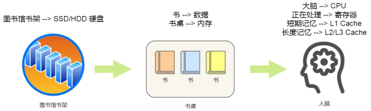

我们从图书馆书架取书，把书放到桌子上，再阅读书，我们大脑就会记忆知识点，然后再经过大脑思考，这一系列过程相当于，数据从硬盘加载到内存，再从内存加载到 CPU 的寄存器和 Cache 中，然后再通过 CPU 进行处理和计算。

对于存储器，它的速度越快、能耗会越高、而且材料的成本也是越贵的，以至于速度快的存储器的容量都比较小。

CPU 里的寄存器和 Cache，是整个计算机存储器中价格最贵的，虽然存储空间很小，但是读写速度是极快的，而相对比较便宜的内存和硬盘，速度肯定比不上 CPU 内部的存储器，但是能弥补存储空间的不足。

存储器通常可以分为这么几个级别：

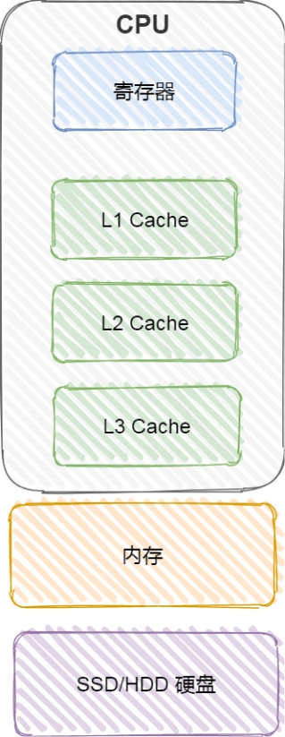

- 寄存器；

- CPU Cache；

1. L1-Cache；

2. L2-Cache；

3. L3-Cahce；

- 内存；

- SSD/HDD 硬盘


#### 寄存器

最靠近 CPU 的控制单元和逻辑计算单元的存储器，就是寄存器了，它使用的材料速度也是最快的，因此价格也是最贵的，那么数量不能很多。

存储器的数量通常在几十到几百之间，每个寄存器可以用来存储一定的字节（byte）的数据。比如：

- 32 位 CPU 中大多数寄存器可以存储 4个字节；

- 64 位 CPU 中大多数寄存器可以存储 8个字节。

寄存器的访问速度非常快，一般要求在半个 CPU 时钟周期内完成读写，CPU 时钟周期跟 CPU 主频息息相关，比如 2 GHz 主频的 CPU，那么它的时钟周期就是 1/2G，也就是 0.5ns（纳秒）。

CPU 处理一条指令的时候，除了读写寄存器，还需要解码指令、控制指令执行和计算。如果寄存器的速度太慢，则会拉长指令的处理周期，从而给用户的感觉，就是电脑「很慢」。


#### CPU Cache

CPU Cache 用的是一种叫 SRAM（**Static Random-Access** Memory，静态随机存储器） 的芯片。

SRAM 之所以叫「静态」存储器，是因为只要有电，数据就可以保持存在，而一旦断电，数据就会丢失了。

在 SRAM 里面，一个 bit 的数据，通常需要 6 个晶体管，所以 SRAM 的存储密度不高，同样的物理空间下，能存储的数据是有限的，不过也因为 SRAM 的电路简单，所以访问速度非常快。

CPU 的高速缓存，通常可以分为 L1、L2、L3 这样的三层高速缓存，也称为一级缓存、二次缓存、三次缓存。


##### L1 高速缓存

L1 高速缓存的访问速度几乎和寄存器一样快，通常只需要 2~4 个时钟周期，而大小在几十 KB 到几百 KB 不等。

每个 CPU 核心都有一块属于自己的 L1 高速缓存，指令和数据在 L1 是分开存放的，所以 L1 高速缓存通常分成指令缓存和数据缓存。

在 Linux 系统，我们可以通过这条命令，查看 CPU 里的 L1 Cache 「数据」缓存的容量大小：

```sh
$ cat /sys/devices/system/cpu/cpu0/cache/index0/size
32K
```

而查看 L1 Cache 「指令」缓存的容量大小，则是：

```sh
$ cat /sys/devices/system/cpu/cpu0/cache/index1/size
32K
```

##### L2 高速缓存

L2 高速缓存同样每个 CPU 核心都有，但是 L2 高速缓存位置比 L1 高速缓存距离 CPU 核心 更远，它大小比 L1 高速缓存更大，CPU 型号不同大小也就不同，通常大小在几百 KB 到几 MB 不等，访问速度则更慢，速度在 10~20 个时钟周期。

在 Linux 系统，我们可以通过这条命令，查看 CPU 里的 L2 Cache 的容量大小：

```sh
$ cat /sys/devices/system/cpu/cpu0/cache/index2/size
256K
```

##### L3 高速缓存

L3 高速缓存通常是多个 CPU 核心共用的，位置比 L2 高速缓存距离 CPU 核心 更远，大小也会更大些，通常大小在几 MB 到几十 MB 不等，具体值根据 CPU 型号而定。

访问速度相对也比较慢一些，访问速度在 20~60
个时钟周期。

在 Linux 系统，我们可以通过这条命令，查看 CPU 里的 L3 Cache 的容量大小：

```sh
$ cat /sys/devices/system/cpu/cpu0/cache/index3/size
3072K
```

#### 内存

内存用的芯片和 CPU Cache 有所不同，它使用的是一种叫作 DRAM （**Dynamic Random Access Memory**，动态随机存取存储器） 的芯片。

相比 SRAM，DRAM 的密度更高，功耗更低，有更大的容量，而且造价比 SRAM 芯片便宜很多。

DRAM 存储一个 bit 数据，只需要一个晶体管和一个电容就能存储，但是因为数据会被存储在电容里，电容会不断漏电，所以需要「定时刷新」电容，才能保证数据不会被丢失，这就是 DRAM 之所以被称为「动态」存储器的原因，只有不断刷新，数据才能被存储起来。

DRAM 的数据访问电路和刷新电路都比 SRAM 更复杂，所以访问的速度会更慢，内存速度大概在 200~300个 时钟周期之间。


#### SSD/HDD 硬盘

SSD（**Solid-state disk**） 就是我们常说的固体硬盘，结构和内存类似，但是它相比内存的优点是断电后数据还是存在的，而内存、寄存器、高速缓存断电后数据都会丢失。内存的读写速度比 SSD 大概快 10~1000 倍。

当然，还有一款传统的硬盘，也就是机械硬盘（**Hard Disk Drive, HDD**），它是通过物理读写的方式来访问数据的，因此它访问速度是非常慢的，它的速度比内存慢 10W 倍左右。

由于 SSD 的价格快接近机械硬盘了，因此机械硬盘已经逐渐被 SSD 替代了。

### 存储器的层次关系

现代的一台计算机，都用上了 CPU Cahce、内存、到 SSD 或 HDD 硬盘这些存储器设备了。

其中，存储空间越大的存储器设备，其访问速度越慢，所需成本也相对越少。

CPU 并不会直接和每一种存储器设备直接打交道，而是每一种存储器设备只和它相邻的存储器设备打交道。

比如，CPU Cache 的数据是从内存加载过来的，写回数据的时候也只写回到内存，CPU Cache 不会直接把数据写到硬盘，也不会直接从硬盘加载数据，而是先加载到内存，再从内存加载到 CPU Cache 中。

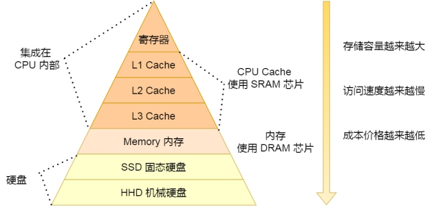

所以，每个存储器只和相邻的一层存储器设备打交道，并且存储设备为了追求更快的速度，所需的材料成本必然也是更高，也正因为成本太高，所以 CPU 内部的寄存器、L1\L2\L3 Cache 只好用较小的容量，相反内存、硬盘则可用更大的容量，这就我们今天所说的存储器层次结构。

另外，当 CPU 需要访问内存中某个数据的时候，如果寄存器有这个数据，CPU 就直接从寄存器取数据即可，如果寄存器没有这个数据，CPU 就会查询 L1 高速缓存，如果 L1 没有，则查询 L2 高速缓存，L2 还是没有的话就查询 L3 高速缓存，L3 依然没有的话，才去内存中取数据。


所以，存储层次结构也形成了缓存的体系。


### 存储器之间的实际价格和性能差距

前面我们知道了，速度越快的存储器，造价成本往往也越高，那我们就以实际的数据来看看，不同层级的存储器之间的性能和价格差异。

下面这张表格是不同层级的存储器之间的成本对比图：


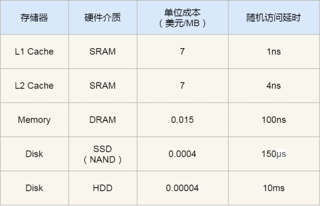


你可以看到 L1 Cache 的访问延时是 1 纳秒，而内存已经是 100 纳秒了，相比 L1 Cache 速度慢了 100 倍。另外，机械硬盘的访问延时更是高达 10 毫秒，相比 L1 Cache 速度慢了 10000000 倍，差了好几个数量级别。

在价格上，每生成 MB 大小的 L1 Cache 相比内存贵了 466 倍，相比机械硬盘那更是贵了 175000 倍。

我在某东逛了下各个存储器设备的零售价，8G 内存 + 1T 机械硬盘 + 256G 固态硬盘的总价格，都不及一块 Intle i5-10400 的 CPU 的价格，这款 CPU 的高速缓存的总大小也就十多 MB。


### 总结

各种存储器之间的关系，可以用我们在图书馆学习这个场景来理解。

CPU 可以比喻成我们的大脑，我们当前正在思考和处理的知识的过程，就好比 CPU 中的寄存器处理数据的过程，速度极快，但是容量很小。而 CPU 中的 L1-L3 Cache 好比我们大脑中的短期记忆和长期记忆，需要小小花费点时间来调取数据并处理。

我们面前的桌子就相当于内存，能放下更多的书（数据），但是找起来和看起来就要花费一些时间，相比 CPU Cache 慢不少。而图书馆的书架相当于硬盘，能放下比内存更多的数据，但找起来就更费时间了，可以说是最慢的存储器设备了。

从 寄存器、CPU Cache，到内存、硬盘，这样一层层下来的存储器，访问速度越来越慢，存储容量越来越大，价格也越来越便宜，而且每个存储器只和相邻的一层存储器设备打交道，于是这样就形成了存储器的层次结构。

再来回答，开头的问题：那机械硬盘、固态硬盘、内存这三个存储器，到底和 CPU L1 Cache 相比速度差多少倍呢？

CPU L1 Cache 随机访问延时是 1 纳秒，内存则是 100 纳秒，所以 CPU L1 Cache 比内存快 100 倍左右。

SSD 随机访问延时是 150 微妙，所以 CPU L1 Cache 比 SSD 快 150000 倍左右。

最慢的机械硬盘随机访问延时已经高达 10 毫秒，我们来看看机械硬盘到底有多「龟速」：

- SSD 比机械硬盘快 70 倍左右；

- 内存比机械硬盘快 100000 倍左右；

- CPU L1 Cache 比机械硬盘快 10000000 倍左右；

我们把上述的时间比例差异放大后，就能非常直观感受到它们的性能差异了。如果 CPU 访问 L1 Cache 的缓存时间是 1 秒，那访问内存则需要大约 2 分钟，随机访问 SSD 里的数据则需要 1.7 天，访问机械硬盘那更久，长达近 4 个月。

可以发现，不同的存储器之间性能差距很大，构造存储器分级很有意义，分级的目的是要构造缓存体系。


## 1.3 如何写出让 CPU 跑得更快的代码？

代码都是由 CPU 跑起来的，我们代码写的好与坏就决定了 CPU 的执行效率，特别是在编写计算密集型的程序，更要注重 CPU 的执行效率，否则将会大大影响系统性能。

CPU 内部嵌入了 CPU Cache（高速缓存），它的存储容量很小，但是离 CPU 核心很近，所以缓存的读写速度是极快的，那么如果 CPU 运算时，直接从 CPU Cache 读取数据，而不是从内存的话，运算速度就会很快。

但是，大多数人不知道 CPU Cache 的运行机制，以至于不知道如何才能够写出能够配合 CPU Cache 工作机制的代码，一旦你掌握了它，你写代码的时候，就有新的优化思路了。

那么，接下来我们就来看看，CPU Cache 到底是什么样的，是如何工作的呢，又该写出让 CPU 执行更快的代码呢？

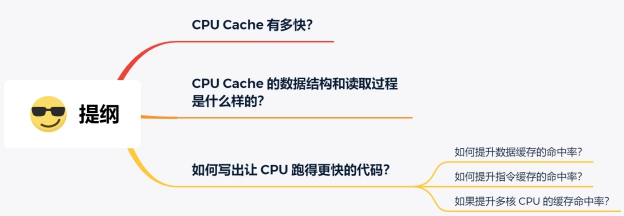


### CPU Cache 有多快？

你可能会好奇为什么有了内存，还需要 CPU Cache？根据摩尔定律，CPU 的访问速度每 18 个月就会翻倍，相当于每年增长 60% 左右，内存的速度当然也会不断增长，但是增长的速度远小于 CPU，平均每年只增长 7% 左右。于是，CPU 与内存的访问性能的差距不断拉大。

到现在，一次内存访问所需时间是 200~300 多个时钟周期，这意味着 CPU 和内存的访问速度已经相差 200~300 多倍了。

为了弥补 CPU 与内存两者之间的性能差异，就在 CPU 内部引入了 CPU Cache，也称高速缓存。

CPU Cache 通常分为大小不等的三级缓存，分别是 L1 Cache、L2 Cache 和 L3 Cache。

由于 CPU Cache 所使用的材料是 SRAM，价格比内存使用的 DRAM 高出很多，在当今每生产 1 MB 大小的 CPU Cache 需要 7 美金的成本，而内存只需要 0.015 美金的成本，成本方面相差了 466 倍，所以 CPU Cache 不像内存那样动辄以 GB 计算，它的大小是以 KB 或 MB 来计算的。

在 Linux 系统中，我们可以使用下图的方式来查看各级 CPU Cache 的大小，比如我这手上这台服务器，离 CPU 核心最近的 L1 Cache 是 32KB，其次是 L2 Cache 是 256KB，最大的 L3 Cache 则是 3MB。

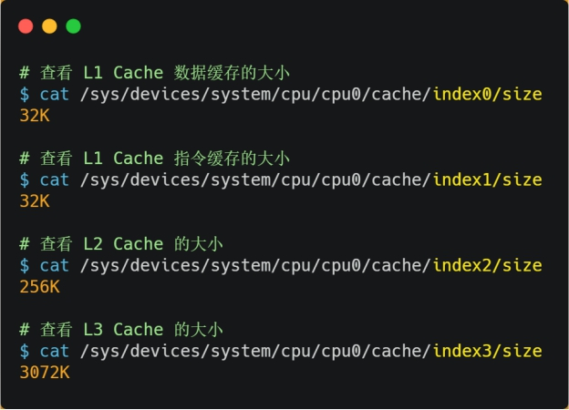

其中，L1 Cache 通常会分为「数据缓存」和「指令缓存」，这意味着数据和指令在 L1 Cache 这一层是分开缓存的，上图中的 index0 也就是数据缓存，而 index1 则是指令缓存，它两的大小通常是一样的。

另外，你也会注意到，L3 Cache 比 L1 Cache 和 L2 Cache 大很多，这是因为 L1 Cache 和 L2 Cache 都是每个 CPU 核心独有的，而 L3 Cache 是多个 CPU 核心共享的。

程序执行时，会先将内存中的数据加载到共享的 L3 Cache 中，再加载到每个核心独有的 L2 Cache，最后进入到最快的 L1 Cache，之后才会被 CPU 读取。它们之间的层级关系，如下图：


越靠近 CPU 核心的缓存其访问速度越快，CPU 访问 L1 Cache 只需要 2~4个时钟周期，访问 L2 Cache 大约 10~20个时钟周期，访问 L3 Cache 大约 20~60个时钟周期，而访问内存速度大概在 200~300个 时钟周期之间。如下表格：

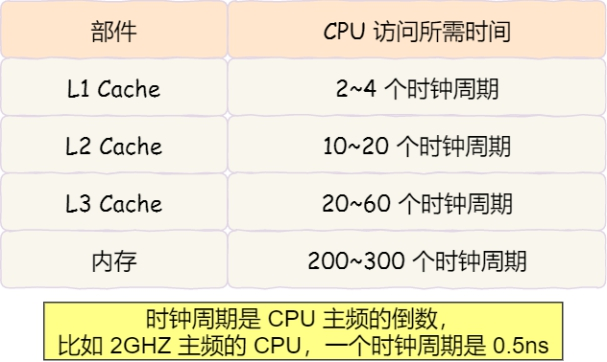

所以，CPU 从 L1 Cache 读取数据的速度，相比从内存读取的速度，会快 100 多倍。


### CPU Cache 的数据结构和读取过程是什么样的？

CPU Cache 的数据是从内存中读取过来的，它是以一小块一小块读取数据的，而不是按照单个数组元素来读取数据的，在 CPU Cache 中的，这样一小块一小块的数据，称为 Cache Line（缓存块）。

你可以在你的 Linux 系统，用下面这种方式来查看 CPU 的 Cache Line，你可以看我服务器的 L1 Cache Line 大小是 64 字节，也就意味着 L1 Cache 一次载入数据的大小是 64 字节。

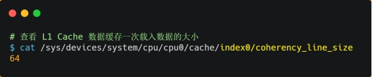

比如，有一个 int array[100] 的数组，当载入 array[0] 时，由于这个数组元素的大小在内存只占 4 字节，不足 64 字节，CPU 就会顺序加载数组元素到 array[15]，意味着 array[0]~array[15] 数组元素都会被缓存在 CPU Cache 中了，因此当下次访问这些数组元素时，会直接从 CPU Cache 读取，而不用再从内存中读取，大大提高了 CPU 读取数据的性能。

事实上，CPU 读取数据的时候，无论数据是否存放到 Cache 中，CPU 都是先访问 Cache，只有当 Cache 中找不到数据时，才会去访问内存，并把内存中的数据读入到 Cache 中，CPU 再从 CPU Cache 读取数据。

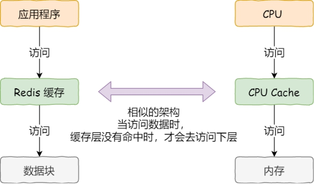

这样的访问机制，跟我们使用「内存作为硬盘的缓存」的逻辑是一样的，如果内存有缓存的数据，则直接返回，否则要访问龟速一般的硬盘。

那 CPU 怎么知道要访问的内存数据，是否在 Cache 里？如果在的话，如何找到 Cache 对应的数据呢？我们从最简单、基础的直接映射 Cache（**Direct Mapped Cache**） 说起，来看看整个 CPU Cache 的数据结构和访问逻辑。

前面，我们提到 CPU 访问内存数据时，是一小块一小块数据读取的，具体这一小块数据的大小，取决于 coherency_line_size 的值，一般 64 字节。在内存中，这一块的数据我们称为内存块（**Block**），读取的时候我们要拿到数据所在内存块的地址。

对于直接映射 Cache 采用的策略，就是把内存块的地址始终「映射」在一个 CPU Line（缓存块） 的地址，至于映射关系实现方式，则是使用「取模运算」，取模运算的结果就是内存块地址对应的 CPU Line（缓存块） 的地址。

举个例子，内存共被划分为 32 个内存块，CPU Cache 共有 8 个 CPU Line，假设 CPU 想要访问第 15 号内存块，如果 15 号内存块中的数据已经缓存在 CPU Line 中的话，则是一定映射在 7 号 CPU Line 中，因为 15 % 8 的值是 7。


机智的你肯定发现了，使用取模方式映射的话，就会出现多个内存块对应同一个 CPU Line，比如上面的例子，除了 15 号内存块是映射在 7 号 CPU Line 中，还有 7 号、23 号、31 号内存块都是映射到 7 号 CPU Line 中。

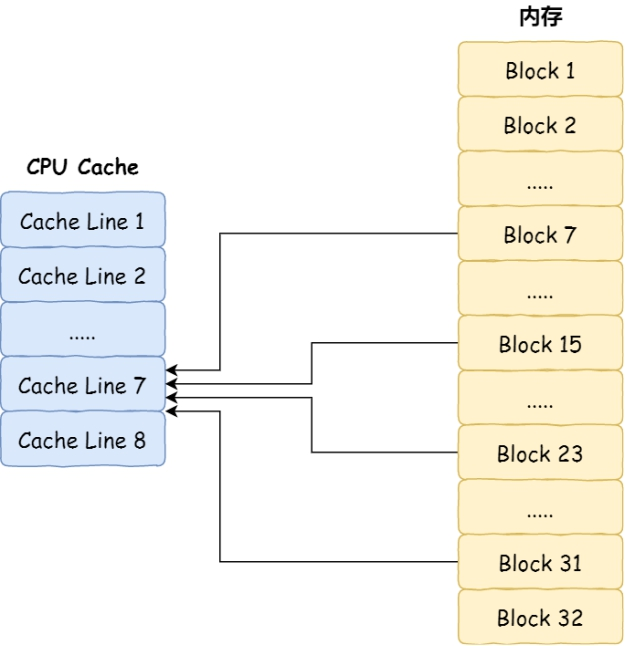

因此，为了区别不同的内存块，在对应的 CPU Line 中我们还会存储一个组标记（Tag）。这个组标记会记录当前 CPU Line 中存储的数据对应的内存块，我们可以用这个组标记来区分不同的内存块。

除了组标记信息外，CPU Line 还有两个信息：

- 一个是，从内存加载过来的实际存放数据（**Data**）。

- 另一个是，有效位（**Valid bit**），它是用来标记对应的 CPU Line 中的数据是否是有效的，如果有效位是 0，无论 CPU Line 中是否有数据，CPU 都会直接访问内存，重新加载数据。

CPU 在从 CPU Cache 读取数据的时候，并不是读取 CPU Line 中的整个数据块，而是读取 CPU 所需要的一个数据片段，这样的数据统称为一个字（**Word**）。那怎么在对应的 CPU Line 中数据块中找到所需的字呢？答案是，需要一个偏移量（Offset）。

因此，一个内存的访问地址，包括组标记、CPU Line 索引、偏移量这三种信息，于是 CPU 就能通过这些信息，在 CPU Cache 中找到缓存的数据。而对于 CPU Cache 里的数据结构，则是由索引 + 有效位 + 组标记 + 数据块组成。

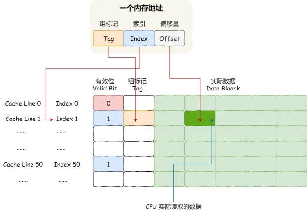


如果内存中的数据已经在 CPU Cahe 中了，那 CPU 访问一个内存地址的时候，会经历这 4 个步骤：

1. 根据内存地址中索引信息，计算在 CPU Cahe 中的索引，也就是找出对应的 CPU Line 的地址；

2. 找到对应 CPU Line 后，判断 CPU Line 中的有效位，确认 CPU Line 中数据是否是有效的，如果是无效的，CPU 就会直接访问内存，并重新加载数据，如果数据有效，则往下执行；

3. 对比内存地址中组标记和 CPU Line 中的组标记，确认 CPU Line 中的数据是我们要访问的内存数据，如果不是的话，CPU 就会直接访问内存，并重新加载数据，如果是的话，则往下执行；

4. 根据内存地址中偏移量信息，从 CPU Line 的数据块中，读取对应的字。

到这里，相信你对直接映射 Cache 有了一定认识，但其实除了直接映射 Cache 之外，还有其他通过内存地址找到 CPU Cache 中的数据的策略，比如全相连 Cache （**Fully Associative Cache**）、组相连 Cache （**Set Associative Cache**）等，这几种策策略的数据结构都比较相似，我们理解了直接映射 Cache 的工作方式，其他的策略如果你有兴趣去看，相信很快就能理解的了。


### 如何写出让 CPU 跑得更快的代码？

我们知道 CPU 访问内存的速度，比访问 CPU Cache 的速度慢了 100 多倍，所以如果 CPU 所要操作的数据在 CPU Cache 中的话，这样将会带来很大的性能提升。访问的数据在 CPU Cache 中的话，意味着缓存命中，缓存命中率越高的话，代码的性能就会越好，CPU 也就跑的越快。

于是，「如何写出让 CPU 跑得更快的代码？」这个问题，可以改成「如何写出 CPU 缓存命中率高的代码？」。

在前面我也提到， L1 Cache 通常分为「数据缓存」和「指令缓存」，这是因为 CPU 会别处理数据和指令，比如 1+1=2 这个运算，+ 就是指令，会被放在「指令缓存」中，而输入数字 1 则会被放在「数据缓存」里。

因此，我们要分开来看「数据缓存」和「指令缓存」的缓存命中率。


#### 如何提升数据缓存的命中率？

假设要遍历二维数组，有以下两种形式，虽然代码执行结果是一样，但你觉得哪种形式效率最高呢？为什么高呢？

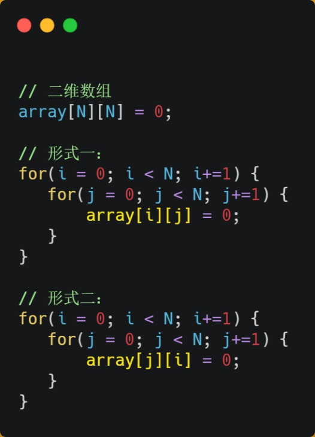

经过测试，形式一 `array[i][j]` 执行时间比形式二 `array[j][i]` 快好几倍。

之所以有这么大的差距，是因为二维数组 array 所占用的内存是连续的，比如长度 N 的指是 2 的话，那么内存中的数组元素的布局顺序是这样的：

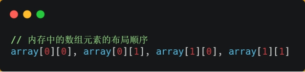


形式一用 `array[i][j]` 访问数组元素的顺序，正是和内存中数组元素存放的顺序一致。当 CPU 访问 `array[0][0]` 时，由于该数据不在 Cache 中，于是会「顺序」把跟随其后的 3 个元素从内存中加载到 CPU Cache，这样当 CPU 访问后面的 3 个数组元素时，就能在 CPU Cache 中成功地找到数据，这意味着缓存命中率很高，缓存命中的数据不需要访问内存，这便大大提高了代码的性能。

而如果用形式二的 `array[j][i]` 来访问，则访问的顺序就是：

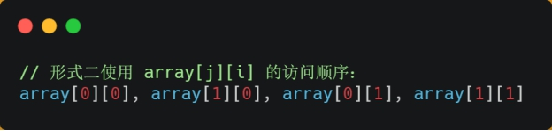

你可以看到，访问的方式跳跃式的，而不是顺序的，那么如果 N 的数值很大，那么操作 `array[j][i]` 时，是没办法把 `array[j+1][i]` 也读入到 CPU Cache 中的，既然 `array[j+1][i]` 没有读取到 CPU Cache，那么就需要从内存读取该数据元素了。很明显，这种不连续性、跳跃式访问数据元素的方式，可能不能充分利用到了 CPU Cache 的特性，从而代码的性能不高。

那访问 `array[0][0]` 元素时，CPU 具体会一次从内存中加载多少元素到 CPU Cache 呢？这个问题，在前面我们也提到过，这跟 CPU Cache Line 有关，它表示 CPU Cache 一次性能加载数据的大小，可以在 Linux 里通过 coherency_line_size 配置查看 它的大小，通常是 64 个字节。


也就是说，当 CPU 访问内存数据时，如果数据不在 CPU Cache 中，则会一次性会连续加载 64 字节大小的数据到 CPU Cache，那么当访问 `array[0][0]` 时，由于该元素不足 64 字节，于是就会往后顺序读取 `array[0][0]`~`array[0][15]` 到 CPU Cache 中。顺序访问的 `array[i][j]` 因为利用了这一特点，所以就会比跳跃式访问的 `array[j][i]` 要快。

因此，遇到这种遍历数组的情况时，按照内存布局顺序访问，将可以有效的利用 CPU Cache 带来的好处，这样我们代码的性能就会得到很大的提升，


#### 如何提升指令缓存的命中率？

提升数据的缓存命中率的方式，是按照内存布局顺序访问，那针对指令的缓存该如何提升呢？

我们以一个例子来看看，有一个元素为 0 到 100 之间随机数字组成的一维数组：

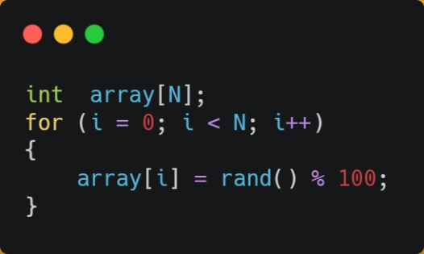

接下来，对这个数组做两个操作：

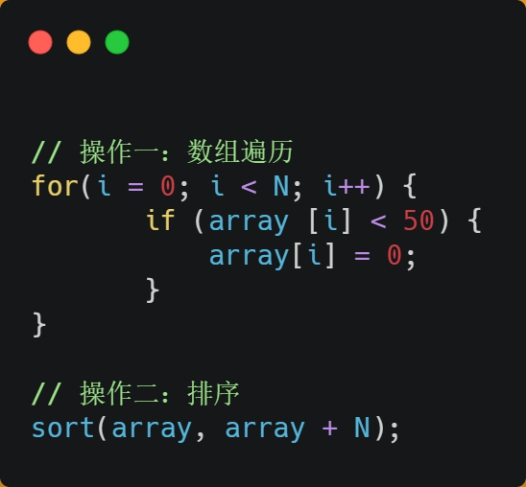

- 第一个操作，循环遍历数组，把小于 50 的数组元素置为 0；

- 第二个操作，将数组排序；

那么问题来了，你觉得先遍历再排序速度快，还是先排序再遍历速度快呢？


在回答这个问题之前，我们先了解 CPU 的分支预测器。对于 if 条件语句，意味着此时至少可以选择跳转到两段不同的指令执行，也就是 if 还是 else 中的指令。那么，如果分支预测可以预测到接下来要执行 if 里的指令，还是 else 指令的话，就可以「提前」把这些指令放在指令缓存中，这样 CPU 可以直接从 Cache 读取到指令，于是执行速度就会很快。

当数组中的元素是随机的，分支预测就无法有效工作，而当数组元素都是是顺序的，分支预测器会动态地根据历史命中数据对未来进行预测，这样命中率就会很高。

因此，先排序再遍历速度会更快，这是因为排序之后，数字是从小到大的，那么前几次循环命中 if < 50 的次数会比较多，于是分支预测就会缓存 if 里的 array[i] = 0 指令到 Cache 中，后续 CPU 执行该指令就只需要从 Cache 读取就好了。

如果你肯定代码中的 if 中的表达式判断为 true 的概率比较高，我们可以使用显示分支预测工具，比如在 C/C++ 语言中编译器提供了 likely 和 unlikely 这两种宏，如果 if 条件为 ture 的概率大，则可以用 likely 宏把 if 里的表达式包裹起来，反之用 unlikely 宏。

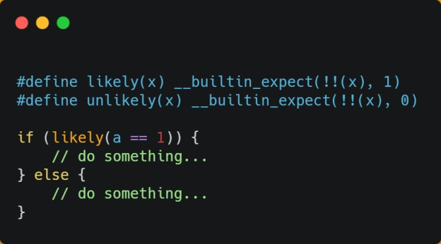

实际上，CPU 自身的动态分支预测已经是比较准的了，所以只有当非常确信 CPU 预测的不准，且能够知道实际的概率情况时，才建议使用这两种宏。


#### 如果提升多核 CPU 的缓存命中率？

在单核 CPU，虽然只能执行一个进程，但是操作系统给每个进程分配了一个时间片，时间片用完了，就调度下一个进程，于是各个进程就按时间片交替地占用 CPU，从宏观上看起来各个进程同时在执行。

而现代 CPU 都是多核心的，进程可能在不同 CPU 核心来回切换执行，这对 CPU Cache 不是有利的，虽然 L3 Cache 是多核心之间共享的，但是 L1 和 L2 Cache 都是每个核心独有的，如果一个进程在不同核心来回切换，各个核心的缓存命中率就会受到影响，相反如果进程都在同一个核心上执行，那么其数据的 L1 和 L2 Cache 的缓存命中率可以得到有效提高，缓存命中率高就意味着 CPU 可以减少访问 内存的频率。

当有多个同时执行「计算密集型」的线程，为了防止因为切换到不同的核心，而导致缓存命中率下降的问题，我们可以把线程绑定在某一个 CPU 核心上，这样性能可以得到非常可观的提升。

在 Linux 上提供了 sched_setaffinity 方法，来实现将线程绑定到某个 CPU 核心这一功能。

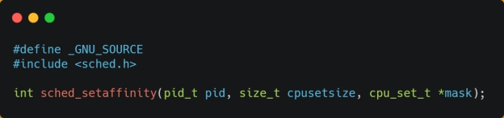


### 总结

由于随着计算机技术的发展，CPU 与 内存的访问速度相差越来越多，如今差距已经高达好几百倍了，所以 CPU 内部嵌入了 CPU Cache 组件，作为内存与 CPU 之间的缓存层，CPU Cache 由于离 CPU 核心很近，所以访问速度也是非常快的，但由于所需材料成本比较高，它不像内存动辄几个 GB 大小，而是仅有几十 KB 到 MB 大小。

当 CPU 访问数据的时候，先是访问 CPU Cache，如果缓存命中的话，则直接返回数据，就不用每次都从内存读取速度了。因此，缓存命中率越高，代码的性能越好。

但需要注意的是，当 CPU 访问数据时，如果 CPU Cache 没有缓存该数据，则会从内存读取数据，但是并不是只读一个数据，而是一次性读取一块一块的数据存放到 CPU Cache 中，之后才会被 CPU 读取。

内存地址映射到 CPU Cache 地址里的策略有很多种，其中比较简单是直接映射 Cache，它巧妙的把内存地址拆分成「索引 + 组标记 + 偏移量」的方式，使得我们可以将很大的内存地址，映射到很小的 CPU Cache 地址里。

要想写出让 CPU 跑得更快的代码，就需要写出缓存命中率高的代码，CPU L1 Cache 分为数据缓存和指令缓存，因而需要分别提高它们的缓存命中率：

- 对于数据缓存，我们在遍历数据的时候，应该按照内存布局的顺序操作，这是因为 CPU Cache 是根据 CPU Cache Line 批量操作数据的，所以顺序地操作连续内存数据时，性能能得到有效的提升；

- 对于指令缓存，有规律的条件分支语句能够让 CPU 的分支预测器发挥作用，进一步提高执行的效率；

另外，对于多核 CPU 系统，线程可能在不同 CPU 核心来回切换，这样各个核心的缓存命中率就会受到影响，于是要想提高进程的缓存命中率，可以考虑把线程绑定 CPU 到某一个 CPU 核心。


## 1.4 CPU 缓存一致性

直接上，不多 BB 了。

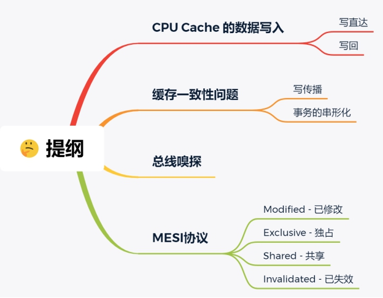


### CPU Cache 的数据写入

随着时间的推移，CPU 和内存的访问性能相差越来越大，于是就在 CPU 内部嵌入了 CPU Cache（高速缓存），CPU Cache 离 CPU 核心相当近，因此它的访问速度是很快的，于是它充当了 CPU 与内存之间的缓存角色。

CPU Cache 通常分为三级缓存：L1 Cache、L2 Cache、L3 Cache，级别越低的离 CPU 核心越近，访问速度也快，但是存储容量相对就会越小。其中，在多核心的 CPU 里，每个核心都有各自的 L1/L2 Cache，而 L3 Cache 是所有核心共享使用的。

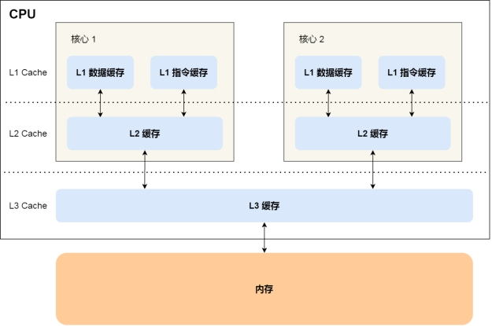

我们先简单了解下 CPU Cache 的结构，CPU Cache 是由很多个 Cache Line 组成的，CPU Line 是 CPU 从内存读取数据的基本单位，而 CPU Line 是由各种标志（Tag）+ 数据块（Data Block）组成，你可以在下图清晰的看到：

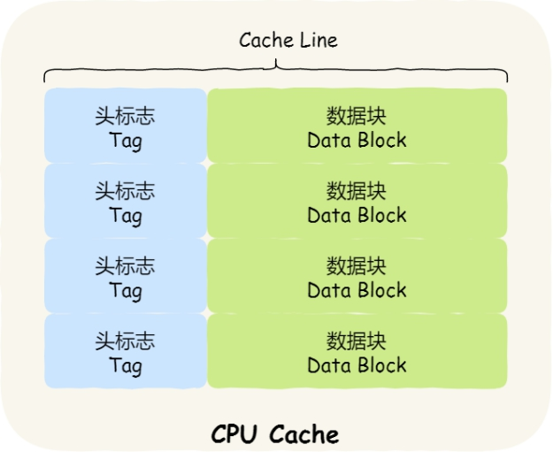


我们当然期望 CPU 读取数据的时候，都是尽可能地从 CPU Cache 中读取，而不是每一次都要从内存中获取数据。所以，身为程序员，我们要尽可能写出缓存命中率高的代码，这样就有效提高程序的性能，具体的做法，你可以参考我上一篇文章[「如何写出让 CPU 跑得更快的代码？」](https://mp.weixin.qq.com/s/-uhAhBD2zGl_h19E4fNJzQ)

事实上，数据不光是只有读操作，还有写操作，那么如果数据写入 Cache 之后，内存与 Cache 相对应的数据将会不同，这种情况下 Cache 和内存数据都不一致了，于是我们肯定是要把 Cache 中的数据同步到内存里的。

问题来了，那在什么时机才把 Cache 中的数据写回到内存呢？为了应对这个问题，下面介绍两种针对写入数据的方法：

- 写直达（**Write Through**）

- 写回（**Write Back**）


#### 写直达

保持内存与 Cache 一致性最简单的方式是，把数据同时写入内存和 Cache 中，这种方法称为写直达（**Write Through**）。

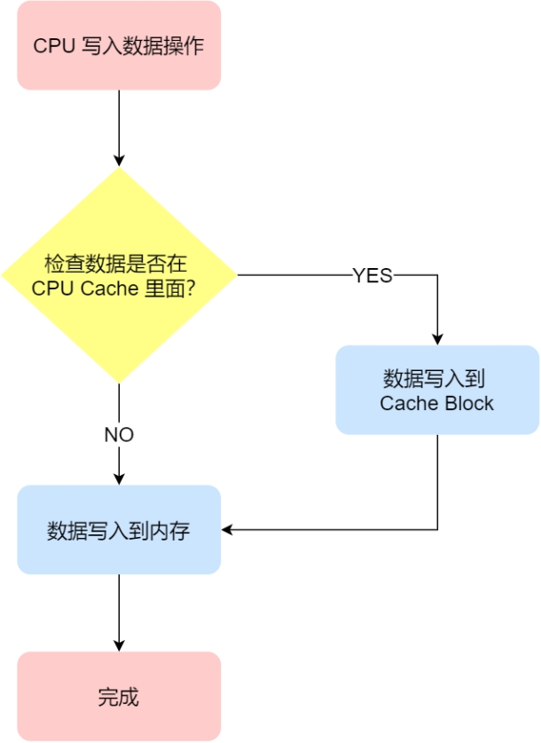

在这个方法里，写入前会先判断数据是否已经在 CPU Cache 里面了：

- 如果数据已经在 Cache 里面，先将数据更新到 Cache 里面，再写入到内存里面；

- 如果数据没有在 Cache 里面，就直接把数据更新到内存里面。

写直达法很直观，也很简单，但是问题明显，无论数据在不在 Cache 里面，每次写操作都会写回到内存，这样写操作将会花费大量的时间，无疑性能会受到很大的影响。


#### 写回

既然写直达由于每次写操作都会把数据写回到内存，而导致影响性能，于是为了要减少数据写回内存的频率，就出现了写回（**Write Back**）的方法。

在写回机制中，当发生写操作时，新的数据仅仅被写入 Cache Block 里，只有当修改过的 Cache Block「被替换」时才需要写到内存中，减少了数据写回内存的频率，这样便可以提高系统的性能。


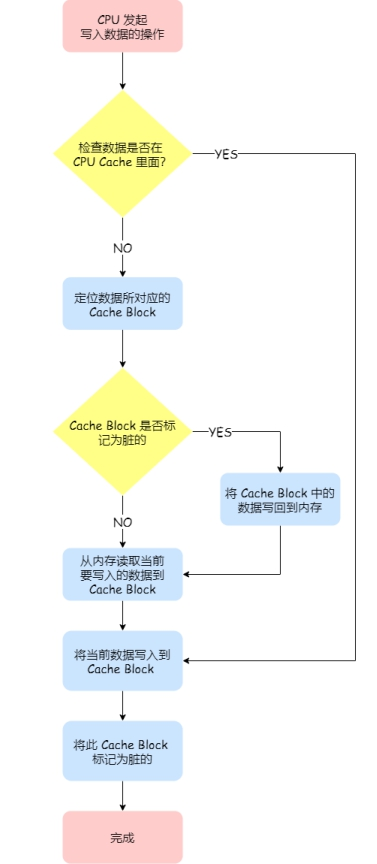

那具体如何做到的呢？下面来详细说一下：

- 如果当发生写操作时，数据已经在 CPU Cache 里的话，则把数据更新到 CPU Cache 里，同时标记 CPU Cache 里的这个 Cache Block 为脏（Dirty）的，这个脏的标记代表这个时候，我们 CPU Cache 里面的这个 Cache Block 的数据和内存是不一致的，这种情况是不用把数据写到内存里的；

- 如果当发生写操作时，数据所对应的 Cache Block 里存放的是「别的内存地址的数据」的话，就要检查这个 Cache Block 里的数据有没有被标记为脏的，如果是脏的话，我们就要把这个 Cache Block 里的数据写回到内存，然后再把当前要写入的数据，写入到这个 Cache Block 里，同时也把它标记为脏的；如果 Cache Block 里面的数据没有被标记为脏，则就直接将数据写入到这个 Cache Block 里，然后再把这个 Cache Block 标记为脏的就好了。

可以发现写回这个方法，在把数据写入到 Cache 的时候，只有在缓存不命中，同时数据对应的 Cache 中的 Cache Block 为脏标记的情况下，才会将数据写到内存中，而在缓存命中的情况下，则在写入后 Cache 后，只需把该数据对应的 Cache Block 标记为脏即可，而不用写到内存里。

这样的好处是，如果我们大量的操作都能够命中缓存，那么大部分时间里 CPU 都不需要读写内存，自然性能相比写直达会高很多。


### 缓存一致性问题

现在 CPU 都是多核的，由于 L1/L2 Cache 是多个核心各自独有的，那么会带来多核心的缓存一致性（**Cache Coherence**） 的问题，如果不能保证缓存一致性的问题，就可能造成结果错误。

那缓存一致性的问题具体是怎么发生的呢？我们以一个含有两个核心的 CPU 作为例子看一看。

假设 A 号核心和 B 号核心同时运行两个线程，都操作共同的变量 i（初始值为 0 ）。

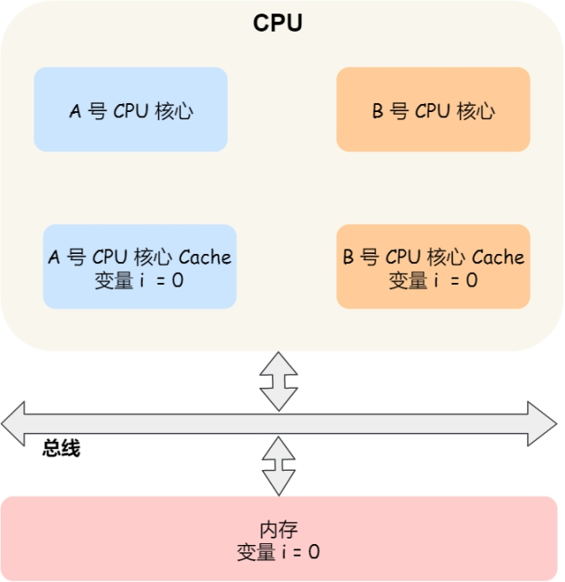

这时如果 A 号核心执行了 i++ 语句的时候，为了考虑性能，使用了我们前面所说的写回策略，先把值为 1 的执行结果写入到 L1/L2 Cache 中，然后把 L1/L2 Cache 中对应的 Block 标记为脏的，这个时候数据其实没有被同步到内存中的，因为写回策略，只有在 A 号核心中的这个 Cache Block 要被替换的时候，数据才会写入到内存里。

如果这时旁边的 B 号核心尝试从内存读取 i 变量的值，则读到的将会是错误的值，因为刚才 A 号核心更新 i 值还没写入到内存中，内存中的值还依然是 0。这个就是所谓的缓存一致性问题，A 号核心和 B 号核心的缓存，在这个时候是不一致，从而会导致执行结果的错误。

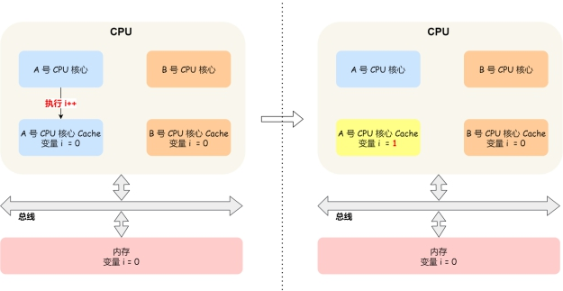

那么，要解决这一问题，就需要一种机制，来同步两个不同核心里面的缓存数据。要实现的这个机制的话，要保证做到下面这 2 点：

- 第一点，某个 CPU 核心里的 Cache 数据更新时，必须要传播到其他核心的 Cache，这个称为写传播（**Wreite Propagation**）；

- 第二点，某个 CPU 核心里对数据的操作顺序，必须在其他核心看起来顺序是一样的，这个称为事务的串形化（**Transaction Serialization**）。

第一点写传播很容易就理解，当某个核心在 Cache 更新了数据，就需要同步到其他核心的 Cache 里。而对于第二点事务事的串形化，我们举个例子来理解它。

假设我们有一个含有 4 个核心的 CPU，这 4 个核心都操作共同的变量 i（初始值为 0 ）。A 号核心先把 i 值变为 100，而此时同一时间，B 号核心先把 i 值变为 200，这里两个修改，都会「传播」到 C 和 D 号核心。

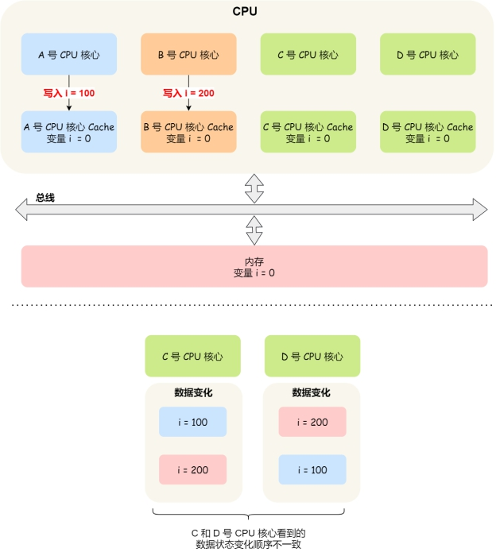

那么问题就来了，C 号核心先收到了 A 号核心更新数据的事件，再收到 B 号核心更新数据的事件，因此 C 号核心看到的变量 i 是先变成 100，后变成 200。

而如果 D 号核心收到的事件是反过来的，则 D 号核心看到的是变量 i 先变成 200，再变成 100，虽然是做到了写传播，但是各个 Cache 里面的数据还是不一致的。

所以，我们要保证 C 号核心和 D 号核心都能看到相同顺序的数据变化，比如变量 i 都是先变成 100，再变成 200，这样的过程就是事务的串形化。

要实现事务串形化，要做到 2 点：

- CPU 核心对于 Cache 中数据的操作，需要同步给其他 CPU 核心；

- 要引入「锁」的概念，如果两个 CPU 核心里有相同数据的 Cache，那么对于这个 Cache 数据的更新，只有拿到了「锁」，才能进行对应的数据更新。

那接下来我们看看，写传播和事务串形化具体是用什么技术实现的。


### 总线嗅探

写传播的原则就是当某个 CPU 核心更新了 Cache 中的数据，要把该事件广播通知到其他核心。最常见实现的方式是总线嗅探（**Bus Snooping**）。

我还是以前面的 i 变量例子来说明总线嗅探的工作机制，当 A 号 CPU 核心修改了 L1 Cache 中 i 变量的值，通过总线把这个事件广播通知给其他所有的核心，然后每个 CPU 核心都会监听总线上的广播事件，并检查是否有相同的数据在自己的 L1 Cache 里面，如果 B 号 CPU 核心的 L1 Cache 中有该数据，那么也需要把该数据更新到自己的 L1 Cache。

可以发现，总线嗅探方法很简单， CPU 需要每时每刻监听总线上的一切活动，但是不管别的核心的 Cache 是否缓存相同的数据，都需要发出一个广播事件，这无疑会加重总线的负载。

另外，总线嗅探只是保证了某个 CPU 核心的 Cache 更新数据这个事件能被其他 CPU 核心知道，但是并不能保证事务串形化。

于是，有一个协议基于总线嗅探机制实现了事务串形化，也用状态机机制降低了总线带宽压力，这个协议就是 MESI 协议，这个协议就做到了 CPU 缓存一致性。


### MESI 协议

MESI 协议其实是 4 个状态单词的开头字母缩写，分别是：

- **Modified**，已修改

- **Exclusive**，独占

- **Shared**，共享

- **Invalidated**，已失效

这四个状态来标记 Cache Line 四个不同的状态。

「已修改」状态就是我们前面提到的脏标记，代表该 Cache Block 上的数据已经被更新过，但是还没有写到内存里。而「已失效」状态，表示的是这个 Cache Block 里的数据已经失效了，不可以读取该状态的数据。

「独占」和「共享」状态都代表 Cache Block 里的数据是干净的，也就是说，这个时候 Cache Block 里的数据和内存里面的数据是一致性的。

「独占」和「共享」的差别在于，独占状态的时候，数据只存储在一个 CPU 核心的 Cache 里，而其他 CPU 核心的 Cache 没有该数据。这个时候，如果要向独占的 Cache 写数据，就可以直接自由地写入，而不需要通知其他 CPU 核心，因为只有你这有这个数据，就不存在缓存一致性的问题了，于是就可以随便操作该数据。

另外，在「独占」状态下的数据，如果有其他核心从内存读取了相同的数据到各自的 Cache ，那么这个时候，独占状态下的数据就会变成共享状态。

那么，「共享」状态代表着相同的数据在多个 CPU 核心的 Cache 里都有，所以当我们要更新 Cache 里面的数据的时候，不能直接修改，而是要先向所有的其他 CPU 核心广播一个请求，要求先把其他核心的 Cache 中对应的 Cache Line 标记为「无效」状态，然后再更新当前 Cache 里面的数据。

我们举个具体的例子来看看这四个状态的转换：

1. 当 A 号 CPU 核心从内存读取变量 i 的值，数据被缓存在 A 号 CPU 核心自己的 Cache 里面，此时其他 CPU 核心的 Cache 没有缓存该数据，于是标记 Cache Line 状态为「独占」，此时其 Cache 中的数据与内存是一致的；

2. 然后 B 号 CPU 核心也从内存读取了变量 i 的值，此时会发送消息给其他 CPU 核心，由于 A 号 CPU 核心已经缓存了该数据，所以会把数据返回给 B 号 CPU 核心。在这个时候， A 和 B 核心缓存了相同的数据，Cache Line 的状态就会变成「共享」，并且其 Cache 中的数据与内存也是一致的；

3. 当 A 号 CPU 核心要修改 Cache 中 i 变量的值，发现数据对应的 Cache Line 的状态是共享状态，则要向所有的其他 CPU 核心广播一个请求，要求先把其他核心的 Cache 中对应的 Cache Line 标记为「无效」状态，然后 A 号 CPU 核心才更新 Cache 里面的数据，同时标记 Cache Line 为「已修改」状态，此时 Cache 中的数据就与内存不一致了。

4. 如果 A 号 CPU 核心「继续」修改 Cache 中 i 变量的值，由于此时的 Cache Line 是「已修改」状态，因此不需要给其他 CPU 核心发送消息，直接更新数据即可。

5. 如果 A 号 CPU 核心的 Cache 里的 i 变量对应的 Cache Line 要被「替换」，发现 Cache Line 状态是「已修改」状态，就会在替换前先把数据同步到内存。

所以，可以发现当 Cache Line 状态是「已修改」或者「独占」状态时，修改更新其数据不需要发送广播给其他 CPU 核心，这在一定程度上减少了总线带宽压力。

事实上，整个 MESI 的状态可以用一个有限状态机来表示它的状态流转。还有一点，对于不同状态触发的事件操作，可能是来自本地 CPU 核心发出的广播事件，也可以是来自其他 CPU 核心通过总线发出的广播事件。下图即是 MESI 协议的状态图：

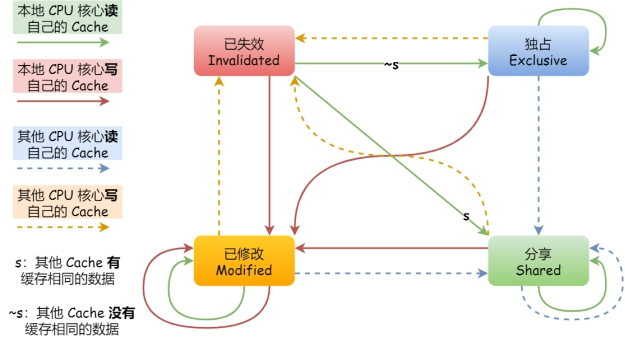

MESI 协议的四种状态之间的流转过程，我汇总成了下面的表格，你可以更详细的看到每个状态转换的原因：


### 总结

CPU 在读写数据的时候，都是在 CPU Cache 读写数据的，原因是 Cache 离 CPU 很近，读写性能相比内存高出很多。对于 Cache 里没有缓存 CPU 所需要读取的数据的这种情况，CPU 则会从内存读取数据，并将数据缓存到 Cache 里面，最后 CPU 再从 Cache 读取数据。

而对于数据的写入，CPU 都会先写入到 Cache 里面，然后再在找个合适的时机写入到内存，那就有「写直达」和「写回」这两种策略来保证 Cache 与内存的数据一致性：

- 写直达，只要有数据写入，都会直接把数据写入到内存里面，这种方式简单直观，但是性能就会受限于内存的访问速度；

- 写回，对于已经缓存在 Cache 的数据的写入，只需要更新其数据就可以，不用写入到内存，只有在需要把缓存里面的脏数据交换出去的时候，才把数据同步到内存里，这种方式在缓存命中率高的情况，性能会更好；

当今 CPU 都是多核的，每个核心都有各自独立的 L1/L2 Cache，只有 L3 Cache 是多个核心之间共享的。所以，我们要确保多核缓存是一致性的，否则会出现错误的结果。

要想实现缓存一致性，关键是要满足 2 点：

- 第一点是写传播，也就是当某个 CPU 核心发生写入操作时，需要把该事件广播通知给其他核心；

- 第二点是事物的串行化，这个很重要，只有保证了这个，才能保障我们的数据是真正一致的，我们的程序在各个不同的核心上运行的结果也是一致的；

基于总线嗅探机制的 MESI 协议，就满足上面了这两点，因此它是保障缓存一致性的协议。

MESI 协议，是已修改、独占、共享、已实现这四个状态的英文缩写的组合。整个 MSI 状态的变更，则是根据来自本地 CPU 核心的请求，或者来自其他 CPU 核心通过总线传输过来的请求，从而构成一个流动的状态机。另外，对于在「已修改」或者「独占」状态的 Cache Line，修改更新其数据不需要发送广播给其他 CPU 核心。


## 1.5 CPU 是如何执行任务的？

你清楚下面这几个问题吗？

- 有了内存，为什么还需要 CPU Cache？

- CPU 是怎么读写数据的？

- 如何让 CPU 能读取数据更快一些？

- CPU 伪共享是如何发生的？又该如何避免？

- CPU 是如何调度任务的？如果你的任务对响应要求很高，你希望它总是能被先调度，这该怎么办？

- ...

这篇，我们就来回答这些问题。

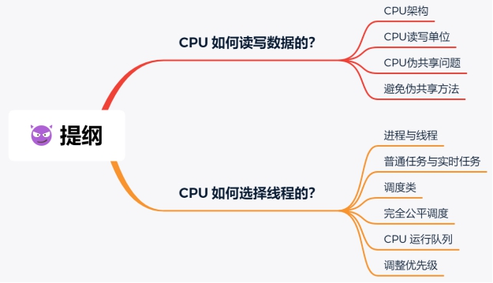


### CPU 如何读写数据的？

先来认识 CPU 的架构，只有理解了 CPU 的 架构，才能更好地理解 CPU 是如何读写数据的，对于现代 CPU 的架构图如下：


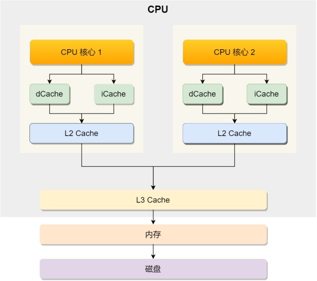

可以看到，一个 CPU 里通常会有多个 CPU 核心，比如上图中的 1 号和 2 号 CPU 核心，并且每个 CPU 核心都有自己的 L1 Cache 和 L2 Cache，而 L1 Cache 通常分为 dCache（数据缓存） 和 iCache（指令缓存），L3 Cache 则是多个核心共享的，这就是 CPU 典型的缓存层次。

上面提到的都是 CPU 内部的 Cache，放眼外部的话，还会有内存和硬盘，这些存储设备共同构成了金字塔存储层次。如下图所示：


从上图也可以看到，从上往下，存储设备的容量会越大，而访问速度会越慢。至于每个存储设备的访问延时，你可以看下图的表格：


你可以看到， CPU 访问 L1 Cache 速度比访问内存快 100 倍，这就是为什么 CPU 里会有 L1~L3 Cache 的原因，目的就是把 Cache 作为 CPU 与内存之间的缓存层，以减少对内存的访问频率。

CPU 从内存中读取数据到 Cache 的时候，并不是一个字节一个字节读取，而是一块一块的方式来读取数据的，这一块一块的数据被称为 CPU Line（缓存行），所以 CPU Line 是 CPU 从内存读取数据到 Cache 的单位。

至于 CPU Line 大小，在 Linux 系统可以用下面的方式查看到，你可以看我服务器的 L1 Cache Line 大小是 64 字节，也就意味着 L1 Cache 一次载入数据的大小是 64 字节。


那么对数组的加载， CPU 就会加载数组里面连续的多个数据到 Cache 里，因此我们应该按照物理内存地址分布的顺序去访问元素，这样访问数组元素的时候，Cache 命中率就会很高，于是就能减少从内存读取数据的频率， 从而可提高程序的性能。

但是，在我们不使用数组，而是使用单独的变量的时候，则会有 Cache 伪共享的问题，Cache 伪共享问题上是一个性能杀手，我们应该要规避它。

接下来，就来看看 Cache 伪共享是什么？又如何避免这个问题？

现在假设有一个双核心的 CPU，这两个 CPU 核心并行运行着两个不同的线程，它们同时从内存中读取两个不同的数据，分别是类型为 long的变量 A 和 B，这个两个数据的地址在物理内存上是连续的，如果 Cahce Line 的大小是 64 字节，并且变量 A 在 Cahce Line 的开头位置，那么这两个数据是位于同一个 Cache Line 中，又因为 CPU Line 是 CPU 从内存读取数据到 Cache 的单位，所以这两个数据会被同时读入到了两个 CPU 核心中各自 Cache 中。

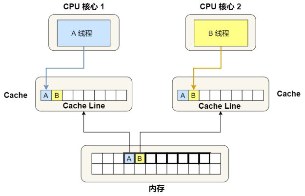

我们来思考一个问题，如果这两个不同核心的线程分别修改不同的数据，比如 1 号 CPU 核心的线程只修改了 变量 A，或 2 号 CPU 核心的线程的线程只修改了变量 B，会发生什么呢？


#### 分析伪共享的问题

现在我们结合保证多核缓存一致的 MESI 协议，来说明这一整个的过程，如果你还不知道 MESI 协议，你可以看我这篇文章「[10 张图打开 CPU 缓存一致性的大门](https://mp.weixin.qq.com/s/PDUqwAIaUxNkbjvRfovaCg)」。

①. 最开始变量 A 和 B 都还不在 Cache 里面，假设 1 号核心绑定了线程 A，2 号核心绑定了线程 B，线程 A 只会读写变量 A，线程 B 只会读写变量 B。

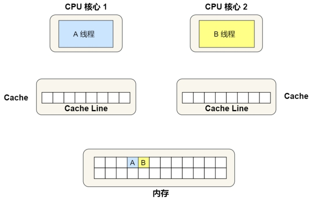

②. 1 号核心读取变量 A，由于 CPU 从内存读取数据到 Cache 的单位是 Cache Line，也正好变量 A 和 变量 B 的数据归属于同一个 Cache Line，所以 A 和 B 的数据都会被加载到 Cache，并将此 Cache Line 标记为「独占」状态。

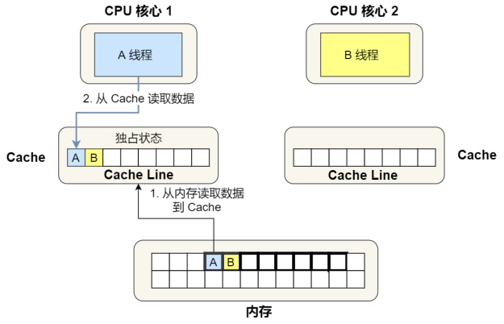

③. 接着，2 号核心开始从内存里读取变量 B，同样的也是读取 Cache Line 大小的数据到 Cache 中，此 Cache Line 中的数据也包含了变量 A 和 变量 B，此时 1 号和 2 号核心的 Cache Line 状态变为「共享」状态。

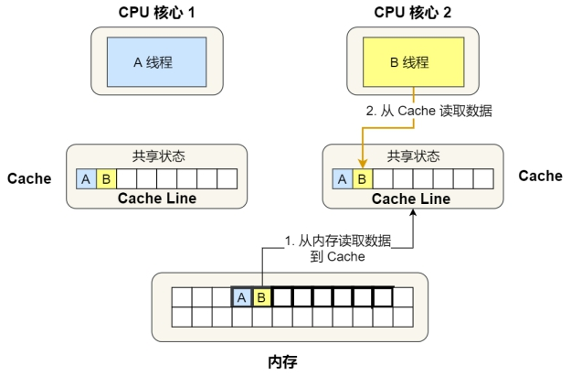

④. 1 号核心需要修改变量 A，发现此 Cache Line 的状态是「共享」状态，所以先需要通过总线发送消息给 2 号核心，通知 2 号核心把 Cache 中对应的 Cache Line 标记为「已失效」状态，然后 1 号核心对应的 Cache Line 状态变成「已修改」状态，并且修改变量 A。

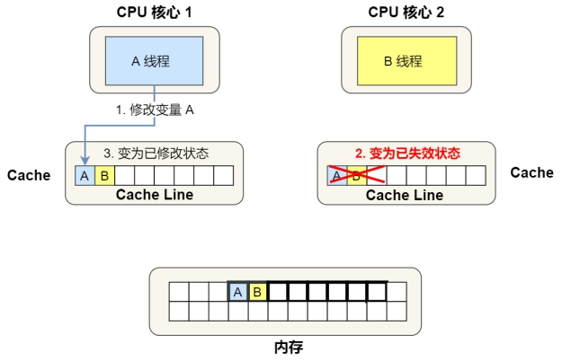

⑤. 之后，2 号核心需要修改变量 B，此时 2 号核心的 Cache 中对应的 Cache Line 是已失效状态，另外由于 1 号核心的 Cache 也有此相同的数据，且状态为「已修改」状态，所以要先把 1 号核心的 Cache 对应的 Cache Line 写回到内存，然后 2 号核心再从内存读取 Cache Line 大小的数据到 Cache 中，最后把变量 B 修改到 2 号核心的 Cache 中，并将状态标记为「已修改」状态。

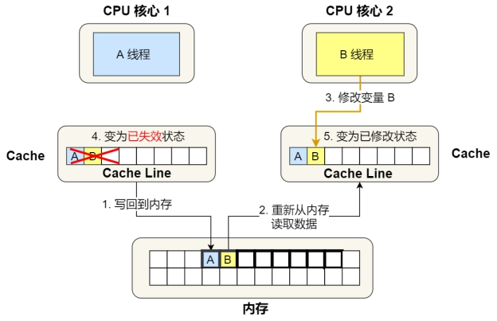

所以，可以发现如果 1 号和 2 号 CPU 核心这样持续交替的分别修改变量 A 和 B，就会重复 ④ 和 ⑤ 这两个步骤，Cache 并没有起到缓存的效果，虽然变量 A 和 B 之间其实并没有任何的关系，但是因为同时归属于一个 Cache Line ，这个 Cache Line 中的任意数据被修改后，都会相互影响，从而出现 ④ 和 ⑤ 这两个步骤。

因此，这种因为多个线程同时读写同一个 Cache Line 的不同变量时，而导致 CPU Cache 失效的现象称为伪共享（**False Sharing**）。


#### 避免伪共享的方法

因此，对于多个线程共享的热点数据，即经常会修改的数据，应该避免这些数据刚好在同一个 Cache Line 中，否则就会出现为伪共享的问题。

接下来，看看在实际项目中是用什么方式来避免伪共享的问题的。

在 Linux 内核中存在 __cacheline_aligned_in_smp宏定义，是用于解决伪共享的问题。

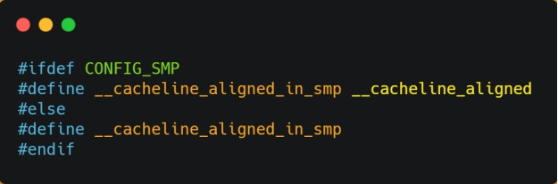


从上面的宏定义，我们可以看到：

- 如果在多核（MP）系统里，该宏定义是 __cacheline_aligned，也就是 Cache Line 的大小；

- 而如果在单核系统里，该宏定义是空的；

因此，针对在同一个 Cache Line 中的共享的数据，如果在多核之间竞争比较严重，为了防止伪共享现象的发生，可以采用上面的宏定义使得变量在 Cache Line 里是对齐的。

举个例子，有下面这个结构体：

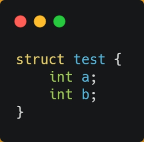

结构体里的两个成员变量 a 和 b 在物理内存地址上是连续的，于是它们可能会位于同一个 Cache Line 中，如下图：

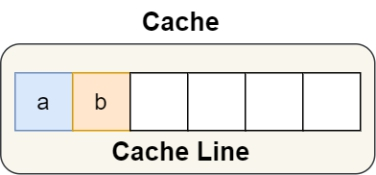

所以，为了防止前面提到的 Cache 伪共享问题，我们可以使用上面介绍的宏定义，将 b 的地址设置为 Cache Line 对齐地址，如下：

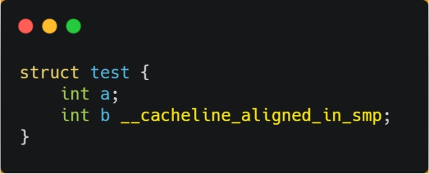

这样 a 和 b 变量就不会在同一个 Cache Line 中了，如下图：

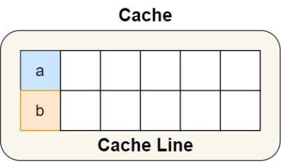

所以，避免 Cache 伪共享实际上是用空间换时间的思想，浪费一部分 Cache 空间，从而换来性能的提升。

我们再来看一个应用层面的规避方案，有一个 Java 并发框架 Disruptor 使用「字节填充 + 继承」的方式，来避免伪共享的问题。

Disruptor 中有一个 RingBuffer 类会经常被多个线程使用，代码如下：

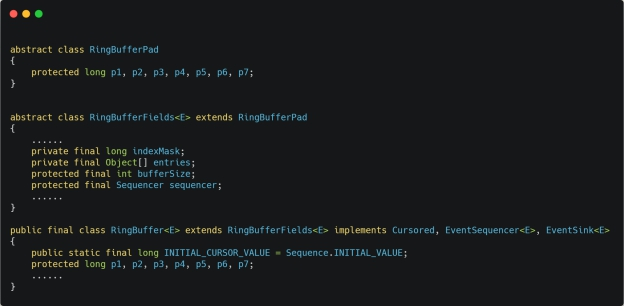

你可能会觉得 RingBufferPad 类里 7 个 long 类型的名字很奇怪，但事实上，它们虽然看起来毫无作用，但却对性能的提升起到了至关重要的作用。

我们都知道，CPU Cache 从内存读取数据的单位是 CPU Line，一般 64 位 CPU 的 CPU Line 的大小是 64 个字节，一个 long 类型的数据是 8 个字节，所以 CPU 一下会加载 8 个 long 类型的数据。

根据 JVM 对象继承关系中父类成员和子类成员，内存地址是连续排列布局的，因此 RingBufferPad 中的 7 个 long 类型数据作为 Cache Line 前置填充，而 RingBuffer 中的 7 个 long 类型数据则作为 Cache Line 后置填充，这 14 个 long 变量没有任何实际用途，更不会对它们进行读写操作。

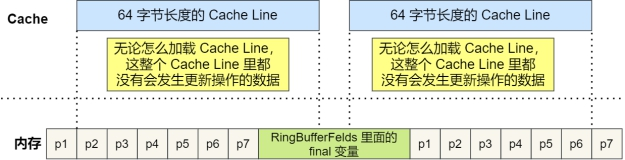

另外，RingBufferFelds 里面定义的这些变量都是 final修饰的，意味着第一次加载之后不会再修改， 又由于「前后」各填充了 7 个不会被读写的 long 类型变量，所以无论怎么加载 Cache Line，这整个 Cache Line 里都没有会发生更新操作的数据，于是只要数据被频繁地读取访问，就自然没有数据被换出 Cache 的可能，也因此不会产生伪共享的问题。


### CPU 如何选择线程的？

了解完 CPU 读取数据的过程后，我们再来看看 CPU 是根据什么来选择当前要执行的线程。

在 Linux 内核中，进程和线程都是用 tark_struct结构体表示的，区别在于线程的 tark**struct 结构体里部分资源是共享了进程已创建的资源，比如内存地址空间、代码段、文件描述符等，所以 Linux 中的线程也被称为轻量级进程，因为线程的 tark**struct 相比进程的 tark_struct 承载的 资源比较少，因此以「轻」得名。

一般来说，没有创建线程的进程，是只有单个执行流，它被称为是主线程。如果想让进程处理更多的事情，可以创建多个线程分别去处理，但不管怎么样，它们对应到内核里都是 tark_struct
。

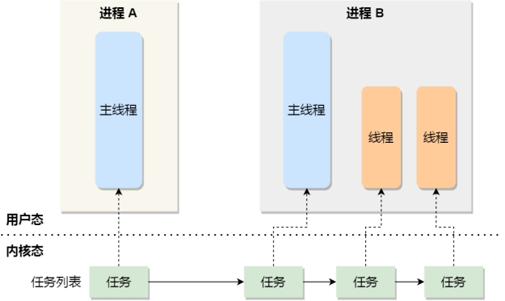

所以，Linux 内核里的调度器，调度的对象就是 tark_struct
，接下来我们就把这个数据结构统称为任务。

在 Linux 系统中，根据任务的优先级以及响应要求，主要分为两种，其中优先级的数值越小，优先级越高：

- 实时任务，对系统的响应时间要求很高，也就是要尽可能快的执行实时任务，优先级在 0~99范围内的就算实时任务；

- 普通任务，响应时间没有很高的要求，优先级在 100~139范围内都是普通任务级别；


#### 调度类

由于任务有优先级之分，Linux 系统为了保障高优先级的任务能够尽可能早的被执行，于是分为了这几种调度类，如下图：

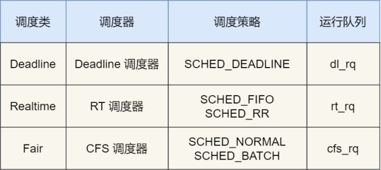

Deadline 和 Realtime 这两个调度类，都是应用于实时任务的，这两个调度类的调度策略合起来共有这三种，它们的作用如下：

- **SCHED_DEADLINE**：是按照 deadline 进行调度的，距离当前时间点最近的 deadline 的任务会被优先调度；

- **SCHED_FIFO**：对于相同优先级的任务，按先来先服务的原则，但是优先级更高的任务，可以抢占低优先级的任务，也就是优先级高的可以「插队」；

- **SCHED_RR**：对于相同优先级的任务，轮流着运行，每个任务都有一定的时间片，当用完时间片的任务会被放到队列尾部，以保证相同优先级任务的公平性，但是高优先级的任务依然可以抢占低优先级的任务；

而 Fair 调度类是应用于普通任务，都是由 CFS 调度器管理的，分为两种调度策略：

- **SCHED_NORMAL**：普通任务使用的调度策略；

- **SCHED_BATCH**：后台任务的调度策略，不和终端进行交互，因此在不影响其他需要交互的任务，可以适当降低它的优先级。


#### 完全公平调度

我们平日里遇到的基本都是普通任务，对于普通任务来说，公平性最重要，在 Linux 里面，实现了一个基于 CFS 的调度算法，也就是完全公平调度（**Completely Fair Scheduling**）。

这个算法的理念是想让分配给每个任务的 CPU 时间是一样，于是它为每个任务安排一个虚拟运行时间 vruntime，如果一个任务在运行，其运行的越久，该任务的 vruntime 自然就会越大，而没有被运行的任务，vruntime 是不会变化的。

那么，在 CFS 算法调度的时候，会优先选择 vruntime 少的任务，以保证每个任务的公平性。

这就好比，让你把一桶的奶茶平均分到 10 杯奶茶杯里，你看着哪杯奶茶少，就多倒一些；哪个多了，就先不倒，这样经过多轮操作，虽然不能保证每杯奶茶完全一样多，但至少是公平的。

当然，上面提到的例子没有考虑到优先级的问题，虽然是普通任务，但是普通任务之间还是有优先级区分的，所以在计算虚拟运行时间 vruntime 还要考虑普通任务的权重值，注意权重值并不是优先级的值，内核中会有一个 nice 级别与权重值的转换表，nice 级别越低的权重值就越大，至于 nice 值是什么，我们后面会提到。于是就有了以下这个公式：


你可以不用管 NICE**0**LOAD 是什么，你就认为它是一个常量，那么在「同样的实际运行时间」里，高权重任务的 vruntime 比低权重任务的 vruntime 少，你可能会奇怪为什么是少的？你还记得 CFS 调度吗，它是会优先选择 vruntime 少的任务进行调度，所以高权重的任务就会被优先调度了，于是高权重的获得的实际运行时间自然就多了。


#### CPU 运行队列

一个系统通常都会运行着很多任务，多任务的数量基本都是远超 CPU 核心数量，因此这时候就需要排队。

事实上，每个 CPU 都有自己的运行队列（**Run Queue, rq**），用于描述在此 CPU 上所运行的所有进程，其队列包含三个运行队列，Deadline 运行队列 dl**rq、实时任务运行队列 rt**rq 和 CFS 运行队列 csf**rq，其中 csf**rq 是用红黑树来描述的，按 vruntime 大小来排序的，最左侧的叶子节点，就是下次会被调度的任务。

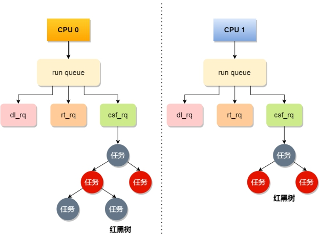

这几种调度类是有优先级的，优先级如下：Deadline > Realtime > Fair，这意味着 Linux 选择下一个任务执行的时候，会按照此优先级顺序进行选择，也就是说先从 dl_rq 里选择任务，然后从 rt_rq 里选择任务，最后从 csf_rq 里选择任务。因此，实时任务总是会比普通任务优先被执行。


#### 调整优先级

如果我们启动任务的时候，没有特意去指定优先级的话，默认情况下都是普通任务，普通任务的调度类是 Fail，由 CFS 调度器来进行管理。CFS 调度器的目的是实现任务运行的公平性，也就是保障每个任务的运行的时间是差不多的。

如果你想让某个普通任务有更多的执行时间，可以调整任务的 nice 值，从而让优先级高一些的任务执行更多时间。nice 的值能设置的范围是 -20～19， 值越低，表明优先级越高，因此 -20 是最高优先级，19 则是最低优先级，默认优先级是 0。

是不是觉得 nice 值的范围很诡异？事实上，nice 值并不是表示优先级，而是表示优先级的修正数值，它与优先级（priority）的关系是这样的：priority(new) = priority(old) + nice。内核中，priority 的范围是 0~139，值越低，优先级越高，其中前面的 0~99 范围是提供给实时任务使用的，而 nice 值是映射到 100~139，这个范围是提供给普通任务用的，因此 nice 值调整的是普通任务的优先级。

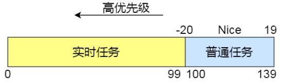

在前面我们提到了，权重值与 nice 值的关系的，nice 值越低，权重值就越大，计算出来的 vruntime 就会越少，由于 CFS 算法调度的时候，就会优先选择 vruntime 少的任务进行执行，所以 nice 值越低，任务的优先级就越高。

我们可以在启动任务的时候，可以指定 nice 的值，比如将 mysqld 以 -3 优先级：

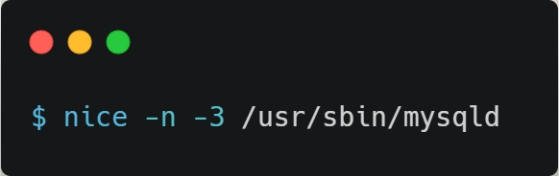

如果想修改已经运行中的任务的优先级，则可以使用 renice来调整 nice 值：


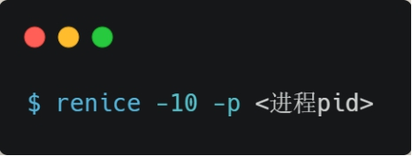


nice 调整的是普通任务的优先级，所以不管怎么缩小 nice 值，任务永远都是普通任务，如果某些任务要求实时性比较高，那么你可以考虑改变任务的优先级以及调度策略，使得它变成实时任务，比如：

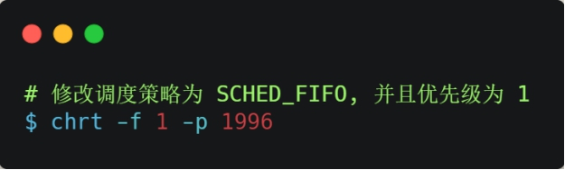


### 总结

理解 CPU 是如何读写数据的前提，是要理解 CPU 的架构，CPU 内部的多个 Cache + 外部的内存和磁盘都就构成了金字塔的存储器结构，在这个金字塔中，越往下，存储器的容量就越大，但访问速度就会小。

CPU 读写数据的时候，并不是按一个一个字节为单位来进行读写，而是以 CPU Line 大小为单位，CPU Line 大小一般是 64 个字节，也就意味着 CPU 读写数据的时候，每一次都是以 64 字节大小为一块进行操作。

因此，如果我们操作的数据是数组，那么访问数组元素的时候，按内存分布的地址顺序进行访问，这样能充分利用到 Cache，程序的性能得到提升。但如果操作的数据不是数组，而是普通的变量，并在多核 CPU 的情况下，我们还需要避免 Cache Line 伪共享的问题。

所谓的 Cache Line 伪共享问题就是，多个线程同时读写同一个 Cache Line 的不同变量时，而导致 CPU Cache 失效的现象。那么对于多个线程共享的热点数据，即经常会修改的数据，应该避免这些数据刚好在同一个 Cache Line 中，避免的方式一般有 Cache Line 大小字节对齐，以及字节填充等方法。

系统中需要运行的多线程数一般都会大于 CPU 核心，这样就会导致线程排队等待 CPU，这可能会产生一定的延时，如果我们的任务对延时容忍度很低，则可以通过一些人为手段干预 Linux 的默认调度策略和优先级。


## 1.6 软中断

今日的技术主题：什么是软中断？。


### 中断是什么？

先来看看什么是中断？在计算机中，中断是系统用来响应硬件设备请求的一种机制，操作系统收到硬件的中断请求，会打断正在执行的进程，然后调用内核中的中断处理程序来响应请求。

这样的解释可能过于学术了，容易云里雾里，我就举个生活中取外卖的例子。

小林中午搬完砖，肚子饿了，点了份白切鸡外卖，这次我带闪了，没有被某团大数据大熟。虽然平台上会显示配送进度，但是我也不能一直傻傻地盯着呀，时间很宝贵，当然得去干别的事情，等外卖到了配送员会通过「电话」通知我，电话响了，我就会停下手中地事情，去拿外卖。

这里的打电话，其实就是对应计算机里的中断，没接到电话的时候，我可以做其他的事情，只有接到了电话，也就是发生中断，我才会停下当前的事情，去进行另一个事情，也就是拿外卖。

从这个例子，我们可以知道，中断是一种异步的事件处理机制，可以提高系统的并发处理能力。

操作系统收到了中断请求，会打断其他进程的运行，所以中断请求的响应程序，也就是中断处理程序，要尽可能快的执行完，这样可以减少对正常进程运行调度地影响。

而且，中断处理程序在响应中断时，可能还会「临时关闭中断」，这意味着，如果当前中断处理程序没有执行完之前，系统中其他的中断请求都无法被响应，也就说中断有可能会丢失，所以中断处理程序要短且快。

还是回到外卖的例子，小林到了晚上又点起了外卖，这次为了犒劳自己，共点了两份外卖，一份小龙虾和一份奶茶，并且是由不同地配送员来配送，那么问题来了，当第一份外卖送到时，配送员给我打了长长的电话，说了一些杂七杂八的事情，比如给个好评等等，但如果这时另一位配送员也想给我打电话。

很明显，这时第二位配送员因为我在通话中（相当于关闭了中断响应），自然就无法打通我的电话，他可能尝试了几次后就走掉了（相当于丢失了一次中断）。


### 什么是软中断？

前面我们也提到了，中断请求的处理程序应该要短且快，这样才能减少对正常进程运行调度地影响，而且中断处理程序可能会暂时关闭中断，这时如果中断处理程序执行时间过长，可能在还未执行完中断处理程序前，会丢失当前其他设备的中断请求。

那 Linux 系统为了解决中断处理程序执行过长和中断丢失的问题，将中断过程分成了两个阶段，分别是「上半部和下半部分」。

- 上半部用来快速处理中断，一般会暂时关闭中断请求，主要负责处理跟硬件紧密相关或者时间敏感的事情。

- 下半部用来延迟处理上半部未完成的工作，一般以「内核线程」的方式运行。

前面的外卖例子，由于第一个配送员长时间跟我通话，则导致第二位配送员无法拨通我的电话，其实当我接到第一位配送员的电话，可以告诉配送员说我现在下楼，剩下的事情，等我们见面再说（上半部），然后就可以挂断电话，到楼下后，在拿外卖，以及跟配送员说其他的事情（下半部）。

这样，第一位配送员就不会占用我手机太多时间，当第二位配送员正好过来时，会有很大几率拨通我的电话。

再举一个计算机中的例子，常见的网卡接收网络包的例子。

网卡收到网络包后，会通过硬件中断通知内核有新的数据到了，于是内核就会调用对应的中断处理程序来响应该事件，这个事件的处理也是会分成上半部和下半部。

上部分要做到快速处理，所以只要把网卡的数据读到内存中，然后更新一下硬件寄存器的状态，比如把状态更新为表示数据已经读到内存中的状态值。

接着，内核会触发一个软中断，把一些处理比较耗时且复杂的事情，交给「软中断处理程序」去做，也就是中断的下半部，其主要是需要从内存中找到网络数据，再按照网络协议栈，对网络数据进行逐层解析和处理，最后把数据送给应用程序。

所以，中断处理程序的上部分和下半部可以理解为：

- 上半部直接处理硬件请求，也就是硬中断，主要是负责耗时短的工作，特点是快速执行；

- 下半部是由内核触发，也就说软中断，主要是负责上半部未完成的工作，通常都是耗时比较长的事情，特点是延迟执行；

还有一个区别，硬中断（上半部）是会打断 CPU 正在执行的任务，然后立即执行中断处理程序，而软中断（下半部）是以内核线程的方式执行，并且每一个 CPU 都对应一个软中断内核线程，名字通常为「ksoftirqd/CPU 编号」，比如 0 号 CPU 对应的软中断内核线程的名字是 ksoftirqd/0

不过，软中断不只是包括硬件设备中断处理程序的下半部，一些内核自定义事件也属于软中断，比如内核调度等、RCU 锁（内核里常用的一种锁）等。


#### 系统里有哪些软中断？

在 Linux 系统里，我们可以通过查看 /proc/softirqs 的 内容来知晓「软中断」的运行情况，以及 /proc/interrupts 的 内容来知晓「硬中断」的运行情况。

接下来，就来简单的解析下 /proc/softirqs 文件的内容，在我服务器上查看到的文件内容如下：

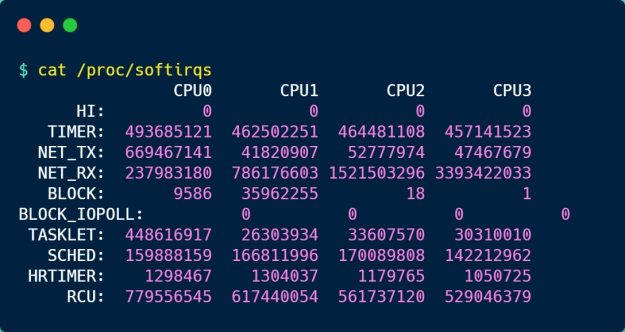

你可以看到，每一个 CPU 都有自己对应的不同类型软中断的累计运行次数，有 3 点需要注意下。

第一点，要注意第一列的内容，它是代表着软中断的类型，在我的系统里，软中断包括了 10 个类型，分别对应不同的工作类型，比如 NET_RX 表示网络接收中断，NET_TX 表示网络发送中断、TIMER 表示定时中断、RCU 表示 RCU 锁中断、SCHED 表示内核调度中断。

第二点，要注意同一种类型的软中断在不同 CPU 的分布情况，正常情况下，同一种中断在不同 CPU 上的累计次数相差不多，比如我的系统里，NET_RX 在 CPU0 、CPU1、CPU2、CPU3 上的中断次数基本是同一个数量级，相差不多。

第三点，这些数值是系统运行以来的累计中断次数，数值的大小没什么参考意义，但是系统的中断次数的变化速率才是我们要关注的，我们可以使用 watch -d cat /proc/softirqs 命令查看中断次数的变化速率。

前面提到过，软中断是以内核线程的方式执行的，我们可以用 ps 命令可以查看到，下面这个就是在我的服务器上查到软中断内核线程的结果：

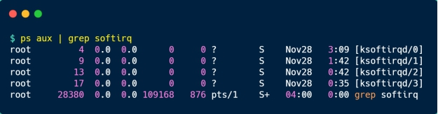

可以发现，内核线程的名字外面都有有中括号，这说明 ps 无法获取它们的命令行参数，所以一般来说，名字在中括号里到，都可以认为是内核线程。

而且，你可以看到有 4 个 ksoftirqd 内核线程，这是因为我这台服务器的 CPU 是 4 核心的，每个 CPU 核心都对应着一个内核线程。


### 如何定位软中断 CPU 使用率过高的问题？

要想知道当前的系统的软中断情况，我们可以使用 top 命令查看，下面是一台服务器上的 top 的数据：

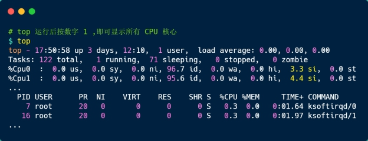

上图中的黄色部分 si，就是 CPU 在软中断上的使用率，而且可以发现，每个 CPU 使用率都不高，两个 CPU 的使用率虽然只有 3% 和 4% 左右，但是都是用在软中断上了。

另外，也可以看到 CPU 使用率最高的进程也是软中断 ksoftirqd，因此可以认为此时系统的开销主要来源于软中断。

如果要知道是哪种软中断类型导致的，我们可以使用 watch -d cat /proc/softirqs命令查看每个软中断类型的中断次数的变化速率。

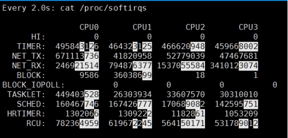

一般对于网络 I/O 比较高的 Web 服务器，NET_RX网络接收中断的变化速率相比其他中断类型快很多。

如果发现 NET_RX网络接收中断次数的变化速率过快，接下里就可以使用 sar -n DEV查看网卡的网络包接收速率情况，然后分析是哪个网卡有大量的网络包进来。

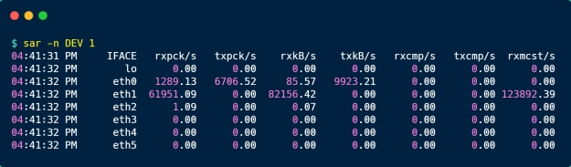

接着，在通过 tcpdump抓包，分析这些包的来源，如果是非法的地址，可以考虑加防火墙，如果是正常流量，则要考虑硬件升级等。


### 总结

为了避免由于中断处理程序执行时间过长，而影响正常进程的调度，Linux 将中断处理程序分为上半部和下半部：

- 上半部，对应硬中断，由硬件触发中断，用来快速处理中断；

- 下半部，对应软中断，由内核触发中断，用来异步处理上半部未完成的工作；

Linux 中的软中断包括网络收发、定时、调度、RCU 锁等各种类型，可以通过查看 /proc/softirqs 来观察软中断的累计中断次数情况，如果要实时查看中断次数的变化率，可以使用 watch -d cat /proc/softirqs 命令。

每一个 CPU 都有各自的软中断内核线程，我们还可以用 ps 命令来查看内核线程，一般名字在中括号里面到，都认为是内核线程。

如果在 top 命令发现，CPU 在软中断上的使用率比较高，而且 CPU 使用率最高的进程也是软中断 ksoftirqd 的时候，这种一般可以认为系统的开销被软中断占据了。

这时我们就可以分析是哪种软中断类型导致的，一般来说都是因为网络接收软中断导致的，如果是的话，可以用 sar 命令查看是哪个网卡的有大量的网络包接收，再用 tcpdump 抓网络包，做进一步分析该网络包的源头是不是非法地址，如果是就需要考虑防火墙增加规则，如果不是，则考虑硬件升级等。


## 1.7 为什么 0.1 + 0.2 不等于 0.3 ？

我们来思考几个问题：

- 为什么负数要用补码表示？

- 十进制小数怎么转成二进制？

- 计算机是怎么存小数的？

- 0.1 + 0.2 == 0.3 吗？

- ...

别看这些问题都看似简单，但是其实还是有点东西的这些问题。


### 为什么负数要用补码表示？

十进制转换二进制的方法相信大家都熟能生巧了，如果你说你还不知道，我觉得你还是太谦虚，可能你只是忘记了，即使你真的忘记了，不怕，贴心的小林在和你一起回忆一下。

十进制数转二进制采用的是除 2 取余法，比如数字 8 转二进制的过程如下图：

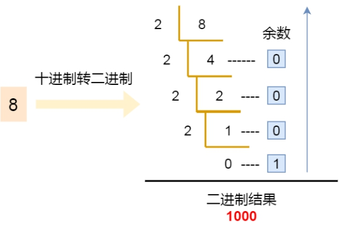

接着，我们看看「整数类型」的数字在计算机的存储方式，这其实很简单，也很直观，就是将十进制的数字转换成二进制即可。

我们以 int类型的数字作为例子，int 类型是 32位的，其中最高位是作为「符号标志位」，正数的符号位是 0，负数的符号位是 1，剩余的 31 位则表示二进制数据。

那么，对于 int 类型的数字 1 的二进制数表示如下：

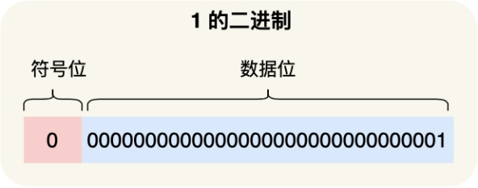

而负数就比较特殊了点，负数在计算机中是以「补码」表示的，所谓的补码就是把正数的二进制全部取反再加 1，比如 -1 的二进制是把数字 1 的二进制取反后再加 1，如下图：

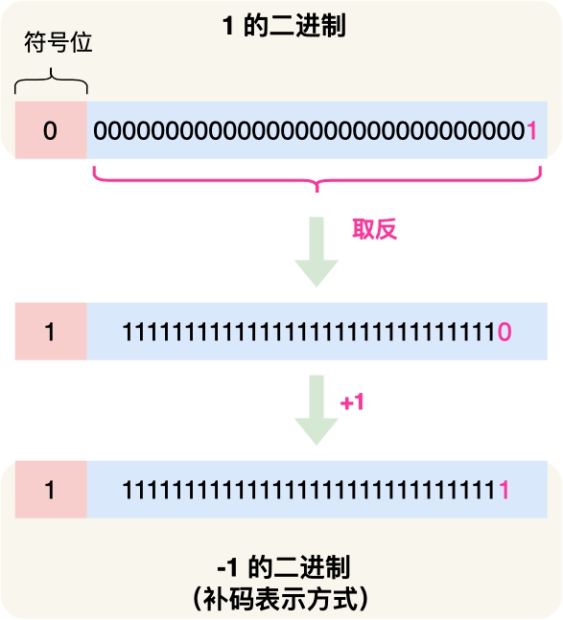

不知道你有没有想过，为什么计算机要用补码的方式来表示负数？在回答这个问题前，我们假设不用补码的方式来表示负数，而只是把最高位的符号标志位变为 1 表示负数，如下图过程：

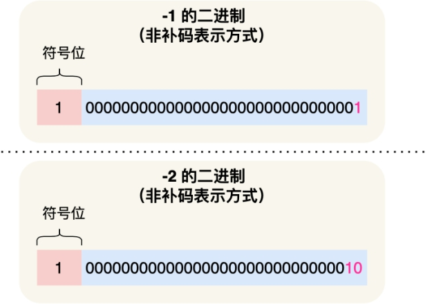

如果采用这种方式来表示负数的二进制的话，试想一下 -2 + 1的运算过程，如下图：

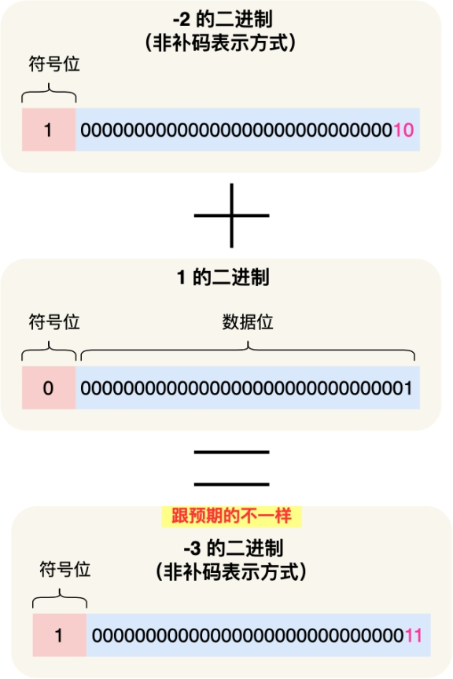

按道理，-2 + 1 = -1，但是上面的运算过程中得到结果却是 -3，所可以发现，这种负数的表示方式是不能用常规的加法来计算了，就需要特殊处理，要先判断数字是否为负数，如果是负数就要把加法操作变成减法操作才可以得到正确对结果。

到这里，我们就可以回答前面提到的「负数为什么要用补码方式来表示」的问题了。

如果负数不是使用补码的方式表示，则在做基本对加减法运算的时候，还需要多一步操作来判断是否为负数，如果为负数，还得把加法反转成减法，或者把减法反转成加法，这就非常不好了，毕竟加减法运算在计算机里是很常使用的，所以为了性能考虑，应该要尽量简化这个运算过程。

而用了补码的表示方式，对于负数的加减法操作，实际上是和正数加减法操作一样的。你可以看到下图，用补码表示的负数在运算 -2 + 1过程的时候，其结果是正确的：


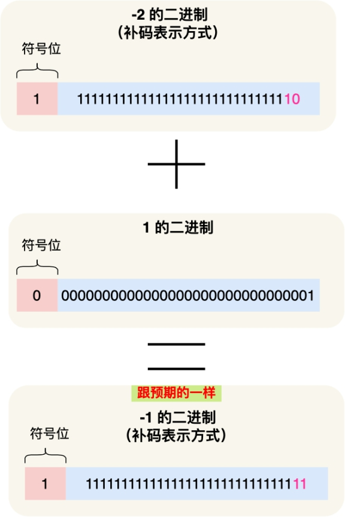


### 十进制小数与二进制的转换

好了，整数十进制转二进制我们知道了，接下来看看小数是怎么转二进制的，小数部分的转换不同于整数部分，它采用的是乘 2 取整法，将十进制中的小数部分乘以 2 作为二进制的一位，然后继续取小数部分乘以 2 作为下一位，直到不存在小数为止。

话不多说，我们就以 8.625转二进制作为例子，直接上图：


最后把「整数部分 + 小数部分」结合在一起后，其结果就是 1000.101。

但是，并不是所有小数都可以用二进制表示，前面提到的 0.625 小数是一个特例，刚好通过乘 2 取整法的方式完整的转换成二进制。

如果我们用相同的方式，来把 0.1转换成二进制，过程如下：

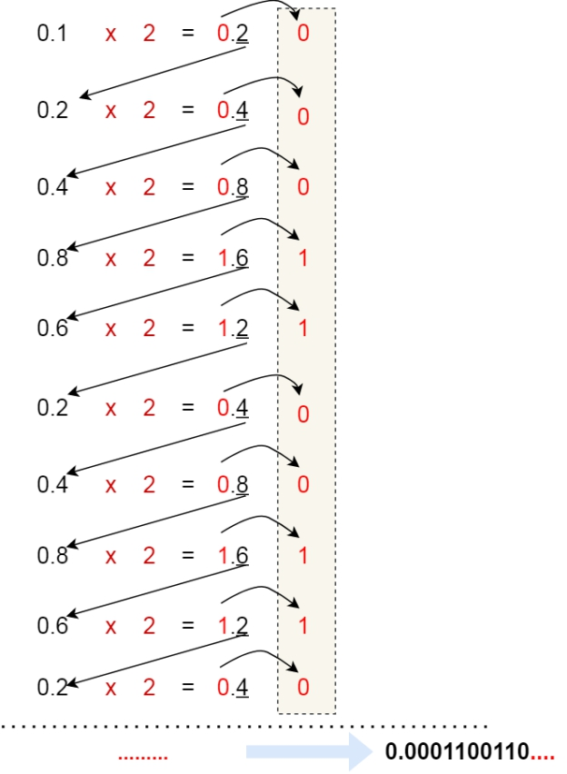

可以发现，0.1的二进制表示是无限循环的。

由于计算机的资源是有限的，所以是没办法用二进制精确的表示 0.1，只能用「近似值」来表示，就是在有限的精度情况下，最大化接近 0.1 的二进制数，于是就会造成精度缺失的情况。

对于二进制小数转十进制时，需要注意一点，小数点后面的指数幂是负数。

比如，二进制 0.1转成十进制就是 2^(-1)，也就是十进制 0.5，二进制 0.01转成十进制就是 2^-2，也就是十进制 0.25，以此类推。

举个例子，二进制 1010.101转十进制的过程，如下图：

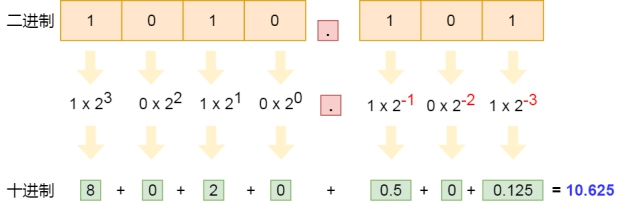


### 计算机是怎么存小数的？

1000.101这种二进制小数是「定点数」形式，代表着小数点是定死的，不能移动，如果你移动了它的小数点，这个数就变了， 就不再是它原来的值了。

然而，计算机并不是这样存储的小数的，计算机存储小数的采用的是浮点数，名字里的「浮点」表示小数点是可以浮动的。

比如 1000.101这个二进制数，可以表示成 1.000101 x 2^3，类似于数学上的科学记数法。

既然提到了科学计数法，我再帮大家复习一下。

比如有个很大的十进制数 1230000，我们可以也可以表示成 1.23 x 10^6，这种方式就称为科学记数法。

该方法在小数点左边只有一个数字，而且把这种整数部分没有前导 0 的数字称为规格化，比如 1.0 x 10^(-9)是规格化的科学记数法，而 0.1 x 10^(-9)和 10.0 x 10^(-9)就不是了。

因此，如果二进制要用到科学记数法，同时要规范化，那么不仅要保证基数为 2，还要保证小数点左侧只有 1 位，而且必须为 1。

所以通常将 1000.101这种二进制数，规格化表示成 1.000101 x 2^3，其中，最为关键的是 000101 和 3 这两个东西，它就可以包含了这个二进制小数的所有信息：

- 000101称为尾数，即小数点后面的数字；

- 3称为指数，指定了小数点在数据中的位置；


现在绝大多数计算机使用的浮点数，一般采用的是 IEEE 制定的国际标准，这种标准形式如下图：


这三个重要部分的意义如下：

- **符号位**：表示数字是正数还是负数，为 0 表示正数，为 1 表示负数；

- **指数位**：指定了小数点在数据中的位置，指数可以是负数，也可以是正数，指数位的长度越长则数值的表达范围就越大；

- **尾数位**：小数点右侧的数字，也就是小数部分，比如二进制 1.0011 x 2^(-2)，尾数部分就是 0011，而且尾数的长度决定了这个数的精度，因此如果要表示精度更高的小数，则就要提高尾数位的长度；


用 32位来表示的浮点数，则称为单精度浮点数，也就是我们编程语言中的 float变量，而用 64位来表示的浮点数，称为双精度浮点数，也就是 double变量，它们的结构如下：

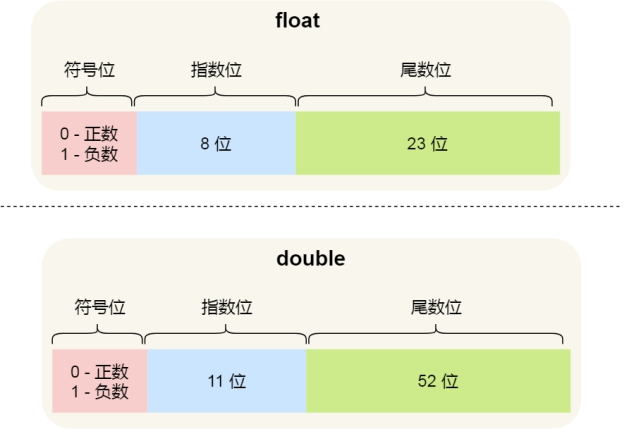

可以看到：

- double 的尾数部分是 52 位，float 的尾数部分是 23 位，由于同时都带有一个固定隐含位（这个后面会说），所以 double 有 53 个二进制有效位，float 有 24 个二进制有效位，所以所以它们的精度在十进制中分别是 log10(2^53)约等于 15.95 和 log10(2^24) 约等于 7.22 位，因此 double 的有效数字是 15~16 位，float 的有效数字是 7~8 位，这些是有效位是包含整数部分和小数部分；

- double 的指数部分是 11 位，而 float 的指数位是 8 位，意味着 double 相比 float 能表示更大的数值范围；

那二进制小数，是如何转换成二进制浮点数的呢？

我们就以 10.625作为例子，看看这个数字在 float 里是如何存储的。

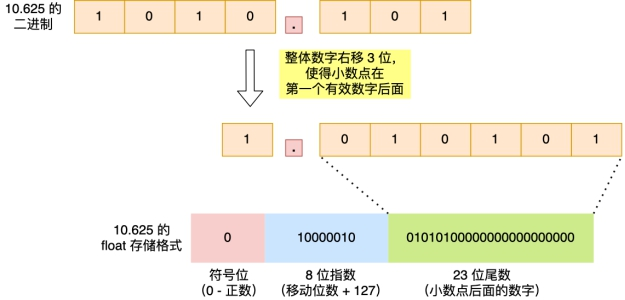

首先，我们计算出 10.625 的二进制小数为 1010.101。

然后把小数点，移动到第一个有效数字后面，即将 1010.101 右移 3位成 1.010101，右移 3 位就代表 +3，左移 3 位就是 -3。

float 中的「指数位」就跟这里移动的位数有关系，把移动的位数再加上「偏移量」，float 的话偏移量是 127，相加后就是指数位的值了，即指数位这 8 位存的是 10000010（十进制 130），因此你可以认为「指数位」相当于指明了小数点在数据中的位置。

1.010101这个数的小数点右侧的数字就是 float 里的「尾数位」，由于尾数位是 23 位，则后面要补充 0，所以最终尾数位存储的数字是 01010100000000000000000。

在算指数的时候，你可能会有疑问为什么要加上偏移量呢？

前面也提到，指数可能是正数，也可能是负数，即指数是有符号的整数，而有符号整数的计算是比无符号整数麻烦的，所以为了减少不必要的麻烦，在实际存储指数的时候，需要把指数转换成无符号整数。

float 的指数部分是 8 位，IEEE 标准规定单精度浮点的指数取值范围是 -126 ~ +127，于是为了把指数转换成无符号整数，就要加个偏移量，比如 float 的指数偏移量是 127，这样指数就不会出现负数了。

比如，指数如果是 8，则实际存储的指数是 8 + 127（偏移量）= 135，即把 135 转换为二进制之后再存储，而当我们需要计算实际的十进制数的时候，再把指数减去「偏移量」即可。

细心的朋友肯定发现，移动后的小数点左侧的有效位（即 1）消失了，它并没有存储到 float 里。

这是因为 IEEE 标准规定，二进制浮点数的小数点左侧只能有 1 位，并且还只能是 1，既然这一位永远都是 1，那就可以不用存起来了。

于是就让 23 位尾数只存储小数部分，然后在计算时会自动把这个 1 加上，这样就可以节约 1 位的空间，尾数就能多存一位小数，相应的精度就更高了一点。

那么，对于我们在从 float 的二进制浮点数转换成十进制时，要考虑到这个隐含的 1，转换公式如下：


举个例子，我们把下图这个 float 的数据转换成十进制，过程如下：

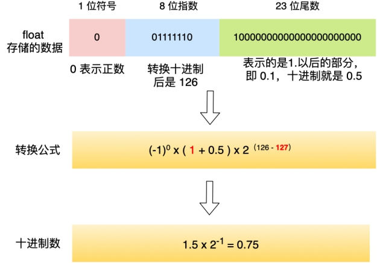

### 0.1 + 0.2 == 0.3 ?

前面提到过，并不是所有小数都可以用「完整」的二进制来表示的，比如十进制 0.1 在转换成二进制小数的时候，是一串无限循环的二进制数，计算机是无法表达无限循环的二进制数的，毕竟计算机的资源是有限。

因此，计算机只能用「近似值」来表示该二进制，那么意味着计算机存放的小数可能不是一个真实值。

现在基本都是用 IEEE 754 规范的「单精度浮点类型」或「双精度浮点类型」来存储小数的，根据精度的不同，近似值也会不同。

那计算机是存储 0.1 是一个怎么样的二进制浮点数呢？

偷个懒，我就不自己手动算了，可以使用 binaryconvert 这个工具，将十进制 0.1 小数转换成 float 浮点数：

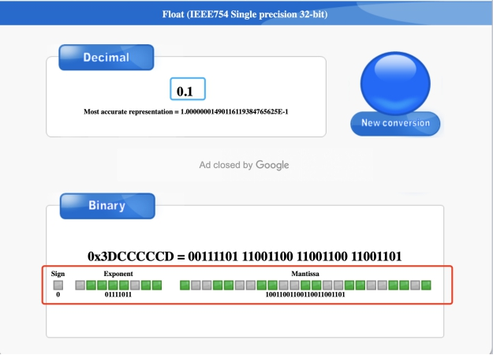

可以看到，8 位指数部分是 01111011，23 位的尾数部分是 10011001100110011001101，可以看到尾数部分是 0011是一直循环的，只不过尾数是有长度限制的，所以只会显示一部分，所以是一个近似值，精度十分有限。

接下来，我们看看 0.2 的 float 浮点数：

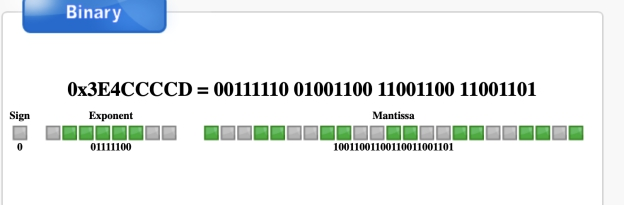

可以看到，8 位指数部分是 01111100，稍微和 0.1 的指数不同，23 位的尾数部分是 10011001100110011001101和 0.1 的尾数部分是相同的，也是一个近似值。

0.1 的二进制浮点数转换成十进制的结果是 0.100000001490116119384765625：
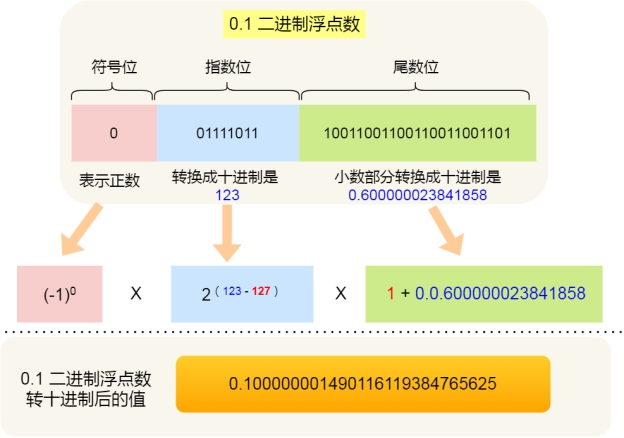

0.2 的二进制浮点数转换成十进制的结果是 0.20000000298023223876953125：
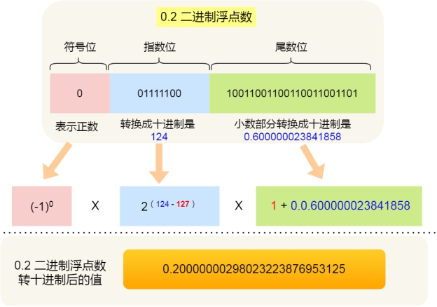


这两个结果相加就是 0.300000004470348358154296875：
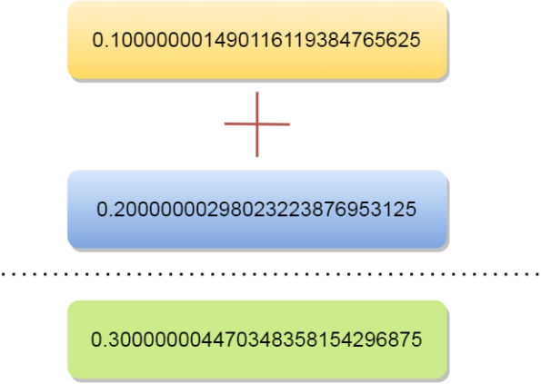

所以，你会看到在计算机中 0.1 + 0.2 并不等于完整的 0.3。

这主要是因为有的小数无法可以用「完整」的二进制来表示，所以计算机里只能采用近似数的方式来保存，那两个近似数相加，得到的必然也是一个近似数。

我们在 JavaScript 里执行 0.1 + 0.2，你会得到下面这个结果：

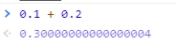

结果和我们前面推到的类似，因为 JavaScript 对于数字都是使用 IEEE 754 标准下的双精度浮点类型来存储的。

而我们二进制只能精准表达 2 除尽的数字 1/2, 1/4, 1/8，但是对于 0.1(1/10) 和 0.2(1/5)，在二进制中都无法精准表示时，需要根据精度舍入。

我们人类熟悉的十进制运算系统，可以精准表达 2 和 5 除尽的数字，例如 1/2, 1/4, 1/5(0.2), 1/8, 1/10(0.1)。

当然，十进制也有无法除尽的地方，例如 1/3, 1/7，也需要根据精度舍入。


### 总结

最后，再来回答开头多问题。

为什么负数要用补码表示？

负数之所以用补码的方式来表示，主要是为了统一和正数的加减法操作一样，毕竟数字的加减法是很常用的一个操作，就不要搞特殊化，尽量以统一的方式来运算。

十进制小数怎么转成二进制？

十进制整数转二进制使用的是「除 2 取余法」，十进制小数使用的是「乘 2 取整法」。

计算机是怎么存小数的？

计算机是以浮点数的形式存储小数的，大多数计算机都是 IEEE 754 标准定义的浮点数格式，包含三个部分：

- 符号位：表示数字是正数还是负数，为 0 表示正数，为 1 表示负数；

- 指数位：指定了小数点在数据中的位置，指数可以是负数，也可以是正数，指数位的长度越长则数值的表达范围就越大；

- 尾数位：小数点右侧的数字，也就是小数部分，比如二进制 1.0011 x 2^(-2)，尾数部分就是 0011，而且尾数的长度决定了这个数的精度，因此如果要表示精度更高的小数，则就要提高尾数位的长度；

用 32 位来表示的浮点数，则称为单精度浮点数，也就是我们编程语言中的 float 变量，而用 64 位来表示的浮点数，称为双精度浮点数，也就是 double 变量。

0.1 + 0.2 == 0.3 吗？

不是的，0.1 和 0.2 这两个数字用二进制表达会是一个一直循环的二进制数，比如 0.1 的二进制表示为 0.0 0011 0011 0011… （0011 无限循环)，对于计算机而言，0.1 无法精确表达，这是浮点数计算造成精度损失的根源。

因此，IEEE 754 标准定义的浮点数只能根据精度舍入，然后用「近似值」来表示该二进制，那么意味着计算机存放的小数可能不是一个真实值。

0.1 + 0.2 并不等于完整的 0.3，这主要是因为这两个小数无法用「完整」的二进制来表示，只能根据精度舍入，所以计算机里只能采用近似数的方式来保存，那两个近似数相加，得到的必然也是一个近似数。


# 二、操作系统结构

## 2.1 Linux 内核 vs Windows 内核

Windows 和 Linux 可以说是我们比较常见的两款操作系统的。

Windows 基本占领了电脑时代的市场，商业上取得了很大成就，但是它并不开源，所以要想接触源码得加入 Windows 的开发团队中。

对于服务器使用的操作系统基本上都是 Linux，而且内核源码也是开源的，任何人都可以下载，并增加自己的改动或功能，Linux 最大的魅力在于，全世界有非常多的技术大佬为它贡献代码。

这两个操作系统各有千秋，不分伯仲。

操作系统核心的东西就是内核，这次我们就来看看，Linux 内核和 Windows 内核有什么区别？

### 内核

什么是内核呢？

计算机是由各种外部硬件设备组成的，比如内存、cpu、硬盘等，如果每个应用都要和这些硬件设备对接通信协议，那这样太累了，所以这个中间人就由内核来负责，让内核作为应用连接硬件设备的桥梁，应用程序只需关心与内核交互，不用关心硬件的细节。


内核有哪些能力呢？

现代操作系统，内核一般会提供 4 个基本能力：

- 管理进程、线程，决定哪个进程、线程使用 CPU，也就是进程调度的能力；

- 管理内存，决定内存的分配和回收，也就是内存管理的能力；

- 管理硬件设备，为进程与硬件设备之间提供通信能力，也就是硬件通信能力；

- 提供系统调用，如果应用程序要运行更高权限运行的服务，那么就需要有系统调用，它是用户程序与操作系统之间的接口。

内核是怎么工作的？

内核具有很高的权限，可以控制 cpu、内存、硬盘等硬件，而应用程序具有的权限很小，因此大多数操作系统，把内存分成了两个区域：

- 内核空间，这个内存空间只有内核程序可以访问；

- 用户空间，这个内存空间专门给应用程序使用；

用户空间的代码只能访问一个局部的内存空间，而内核空间的代码可以访问所有内存空间。因此，当程序使用用户空间时，我们常说该程序在用户态执行，而当程序使内核空间时，程序则在内核态执行。

应用程序如果需要进入内核空间，就需要通过系统调用，下面来看看系统调用的过程：

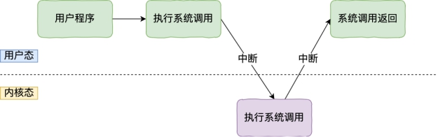

内核程序执行在内核态，用户程序执行在用户态。当应用程序使用系统调用时，会产生一个中断。发生中断后， CPU 会中断当前在执行的用户程序，转而跳转到中断处理程序，也就是开始执行内核程序。内核处理完后，主动触发中断，把 CPU 执行权限交回给用户程序，回到用户态继续工作。


### Linux 的设计

Linux 的开山始祖是来自一位名叫 Linus Torvalds 的芬兰小伙子，他在 1991 年用 C 语言写出了第一版的 Linux 操作系统，那年他 22 岁。

完成第一版 Linux 后，Linux Torvalds 就在网络上发布了 Linux 内核的源代码，每个人都可以免费下载和使用。

Linux 内核设计的理念主要有这几个点：

- **MutiTask**，多任务

- **SMP**，对称多处理

- **ELF**，可执行文件链接格式

- **Monolithic Kernel**，宏内核


##### MutiTask

MutiTask 的意思是多任务，代表着 Linux 是一个多任务的操作系统。

多任务意味着可以有多个任务同时执行，这里的「同时」可以是并发或并行：

- 对于单核 CPU 时，可以让每个任务执行一小段时间，时间到就切换另外一个任务，从宏观角度看，一段时间内执行了多个任务，这被称为并发。

- 对于多核 CPU 时，多个任务可以同时被不同核心的 CPU 同时执行，这被称为并行。


#### SMP

SMP 的意思是对称多处理，代表着每个 CPU 的地位是相等的，对资源的使用权限也是相同的，多个 CPU 共享同一个内存，每个 CPU 都可以访问完整的内存和硬件资源。

这个特点决定了 Linux 操作系统不会有某个 CPU 单独服务应用程序或内核程序，而是每个程序都可以被分配到任意一个 CPU 上被执行。


#### ELF

ELF 的意思是可执行文件链接格式，它是 Linux 操作系统中可执行文件的存储格式，你可以从下图看到它的结构：

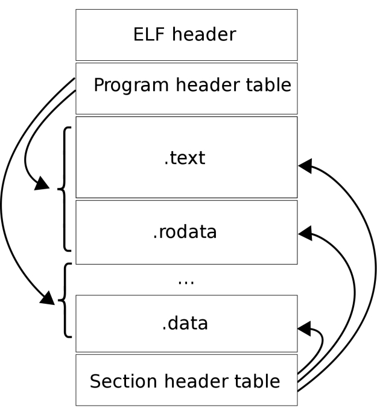

ELF 把文件分成了一个个分段，每一个段都有自己的作用，具体每个段的作用这里我就不详细说明了，感兴趣的同学可以去看《程序员的自我修养——链接、装载和库》这本书。

另外，ELF 文件有两种索引，Program header table 中记录了「运行时」所需的段，而 Section header table 记录了二进制文件中各个「段的首地址」。

那 ELF 文件怎么生成的呢？

我们编写的代码，首先通过「编译器」编译成汇编代码，接着通过「汇编器」变成目标代码，也就是目标文件，最后通过「链接器」把多个目标文件以及调用的各种函数库链接起来，形成一个可执行文件，也就是 ELF 文件。

那 ELF 文件是怎么被执行的呢？

执行 ELF 文件的时候，会通过「装载器」把 ELF 文件装载到内存里，CPU 读取内存中的指令和数据，于是程序就被执行起来了。


#### Monolithic Kernel

Monolithic Kernel 的意思是宏内核，Linux 内核架构就是宏内核，意味着 Linux 的内核是一个完整的可执行程序，且拥有最高的权限。

宏内核的特征是系统内核的所有模块，比如进程调度、内存管理、文件系统、设备驱动等，都运行在内核态。

不过，Linux 也实现了动态加载内核模块的功能，例如大部分设备驱动是以可加载模块的形式存在的，与内核其他模块解藕，让驱动开发和驱动加载更为方便、灵活。

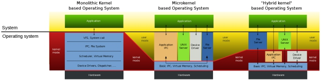

与宏内核相反的是微内核，微内核架构的内核只保留最基本的能力，比如进程调度、虚拟机内存、中断等，把一些应用放到了用户空间，比如驱动程序、文件系统等。这样服务与服务之间是隔离的，单个服务出现故障或者完全攻击，也不会导致整个操作系统挂掉，提高了操作系统的稳定性和可靠性。

微内核内核功能少，可移植性高，相比宏内核有一点不好的地方在于，由于驱动程序不在内核中，而且驱动程序一般会频繁调用底层能力的，于是驱动和硬件设备交互就需要频繁切换到内核态，这样会带来性能损耗。华为的鸿蒙操作系统的内核架构就是微内核。

还有一种内核叫混合类型内核，它的架构有点像微内核，内核里面会有一个最小版本的内核，然后其他模块会在这个基础上搭建，然后实现的时候会跟宏内核类似，也就是把整个内核做成一个完整的程序，大部分服务都在内核中，这就像是宏内核的方式包裹着一个微内核。


### Windows 设计

当今 Windows 7、Windows 10 使用的内核叫 Windows NT，NT 全称叫 New Technology。

下图是 Windows NT 的结构图片：

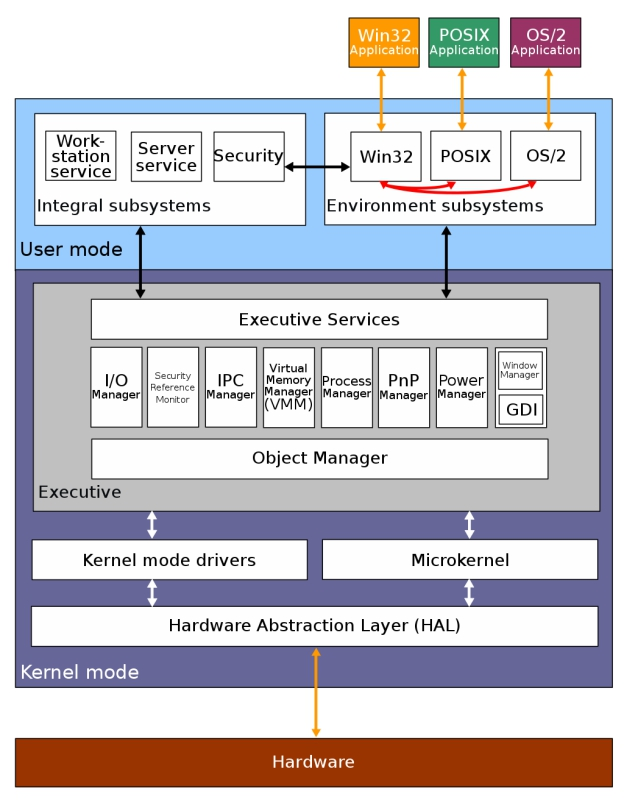

Windows 和 Linux 一样，同样支持 MutiTask 和 SMP，但不同的是，Window 的内核设计是混合型内核，在上图你可以看到内核中有一个 **MicroKernel** 模块，这个就是最小版本的内核，而整个内核实现是一个完整的程序，含有非常多模块。

Windows 的可执行文件的格式与 Linux 也不同，所以这两个系统的可执行文件是不可以在对方上运行的。

Windows 的可执行文件格式叫 PE，称为可移植执行文件，扩展名通常是.exe、.dll、.sys等。

PE 的结构你可以从下图中看到，它与 ELF 结构有一点相似。

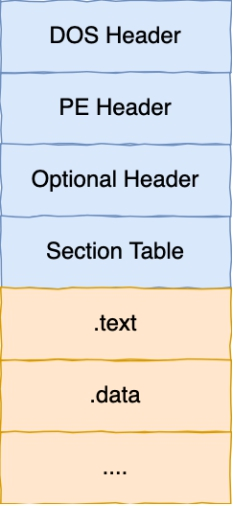


### 总结

对于内核的架构一般有这三种类型：

- 宏内核，包含多个模块，整个内核像一个完整的程序；

- 微内核，有一个最小版本的内核，一些模块和服务则由用户态管理；

- 混合内核，是宏内核和微内核的结合体，内核中抽象出了微内核的概念，也就是内核中会有一个小型的内核，其他模块就在这个基础上搭建，整个内核是个完整的程序；

Linux 的内核设计是采用了宏内核，Window 的内核设计则是采用了混合内核。

这两个操作系统的可执行文件格式也不一样， Linux 可执行文件格式叫作 ELF，Windows 可执行文件格式叫作 PE。


# 三、内存管理


## 3.1 虚拟内存

之前有不少读者跟我反馈，能不能写图解操作系统？

既然那么多读者想看，我最近就在疯狂的复习操作系统的知识。

操作系统确实是比较难啃的一门课，至少我认为比计算机网络难太多了，但它的重要性就不用我多说了。

学操作系统的时候，主要痛苦的地方，有太多的抽象难以理解的词语或概念，非常容易被劝退。

即使怀着满腔热血的心情开始学操作系统，不过 3分钟睡意就突然袭来。。。

该啃的还是得啃的，该图解的还是得图解的，万众期待的「图解操作系统」的系列来了。

本篇跟大家说说内存管理，内存管理还是比较重要的一个环节，理解了它，至少对整个操作系统的工作会有一个初步的轮廓，这也难怪面试的时候常问内存管理。

干就完事，本文的提纲：

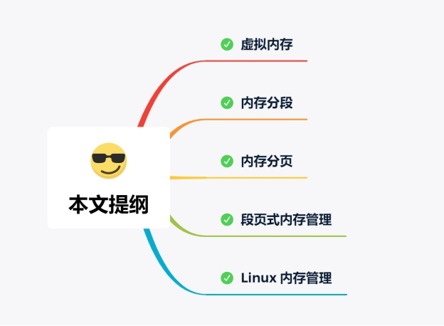


### 虚拟内存

如果你是电子相关专业的，肯定在大学里捣鼓过单片机。

单片机是没有操作系统的，所以每次写完代码，都需要借助工具把程序烧录进去，这样程序才能跑起来。

另外，单片机的 CPU 是直接操作内存的「物理地址」。


在这种情况下，要想在内存中同时运行两个程序是不可能的。如果第一个程序在 2000 的位置写入一个新的值，将会擦掉第二个程序存放在相同位置上的所有内容，所以同时运行两个程序是根本行不通的，这两个程序会立刻崩溃。

操作系统是如何解决这个问题呢？

这里关键的问题是这两个程序都引用了绝对物理地址，而这正是我们最需要避免的。

我们可以把进程所使用的地址「隔离」开来，即让操作系统为每个进程分配独立的一套「虚拟地址」，人人都有，大家自己玩自己的地址就行，互不干涉。但是有个前提每个进程都不能访问物理地址，至于虚拟地址最终怎么落到物理内存里，对进程来说是透明的，操作系统已经把这些都安排的明明白白了。


操作系统会提供一种机制，将不同进程的虚拟地址和不同内存的物理地址映射起来。

如果程序要访问虚拟地址的时候，由操作系统转换成不同的物理地址，这样不同的进程运行的时候，写入的是不同的物理地址，这样就不会冲突了。

于是，这里就引出了两种地址的概念：

- 我们程序所使用的内存地址叫做虚拟内存地址（**Virtual Memory Address**）

- 实际存在硬件里面的空间地址叫物理内存地址（**Physical Memory Address**）。

操作系统引入了虚拟内存，进程持有的虚拟地址会通过 CPU 芯片中的内存管理单元（MMU）的映射关系，来转换变成物理地址，然后再通过物理地址访问内存，如下图所示：

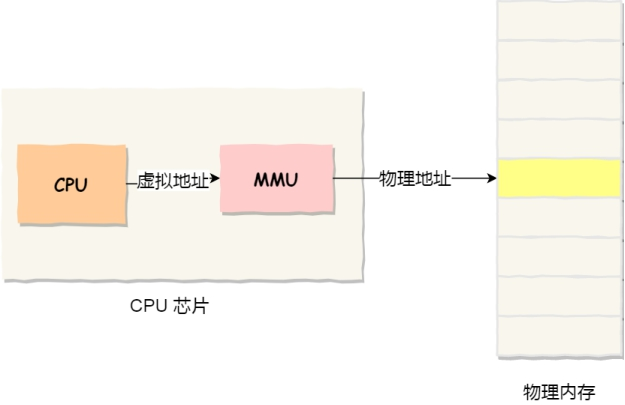

操作系统是如何管理虚拟地址与物理地址之间的关系？

主要有两种方式，分别是内存分段和内存分页，分段是比较早提出的，我们先来看看内存分段。


### 内存分段

程序是由若干个逻辑分段组成的，如可由代码分段、数据分段、栈段、堆段组成。不同的段是有不同的属性的，所以就用分段（**Segmentation**）的形式把这些段分离出来。

分段机制下，虚拟地址和物理地址是如何映射的？

分段机制下的虚拟地址由两部分组成，段选择子和段内偏移量。

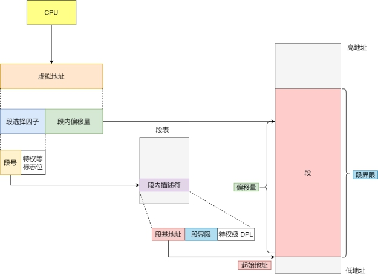

- 段选择子就保存在段寄存器里面。段选择子里面最重要的是段号，用作段表的索引。段表里面保存的是这个段的基地址、段的界限和特权等级等。

- 虚拟地址中的段内偏移量应该位于 0 和段界限之间，如果段内偏移量是合法的，就将段基地址加上段内偏移量得到物理内存地址。

在上面，知道了虚拟地址是通过段表与物理地址进行映射的，分段机制会把程序的虚拟地址分成 4 个段，每个段在段表中有一个项，在这一项找到段的基地址，再加上偏移量，于是就能找到物理内存中的地址，如下图：

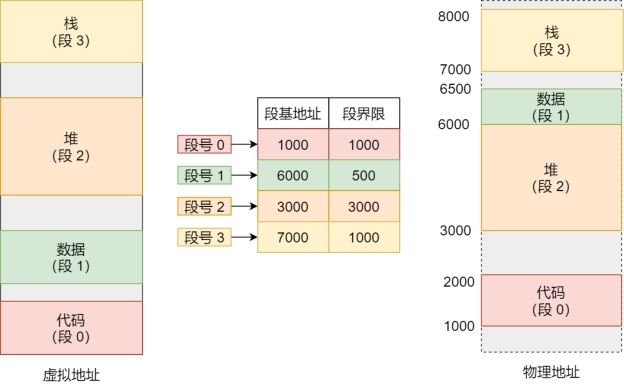

如果要访问段 3 中偏移量 500 的虚拟地址，我们可以计算出物理地址为，段 3 基地址 7000 + 偏移量 500 = 7500。

分段的办法很好，解决了程序本身不需要关心具体的物理内存地址的问题，但它也有一些不足之处：

- 第一个就是内存碎片的问题。

- 第二个就是内存交换的效率低的问题。

接下来，说说为什么会有这两个问题。

我们先来看看，分段为什么会产生内存碎片的问题？

我们来看看这样一个例子。假设有 1G 的物理内存，用户执行了多个程序，其中：

- 游戏占用了 512MB 内存

- 浏览器占用了 128MB 内存

- 音乐占用了 256 MB 内存。

这个时候，如果我们关闭了浏览器，则空闲内存还有 1024 - 512 - 256 = 256MB。

如果这个 256MB 不是连续的，被分成了两段 128 MB 内存，这就会导致没有空间再打开一个 200MB 的程序。


这里的内存碎片的问题共有两处地方：

- 外部内存碎片，也就是产生了多个不连续的小物理内存，导致新的程序无法被装载；

- 内部内存碎片，程序所有的内存都被装载到了物理内存，但是这个程序有部分的内存可能并不是很常使用，这也会导致内存的浪费；

针对上面两种内存碎片的问题，解决的方式会有所不同。

解决外部内存碎片的问题就是内存交换。

可以把音乐程序占用的那 256MB 内存写到硬盘上，然后再从硬盘上读回来到内存里。不过再读回的时候，我们不能装载回原来的位置，而是紧紧跟着那已经被占用了的 512MB 内存后面。这样就能空缺出连续的 256MB 空间，于是新的 200MB 程序就可以装载进来。

这个内存交换空间，在 Linux 系统里，也就是我们常看到的 Swap 空间，这块空间是从硬盘划分出来的，用于内存与硬盘的空间交换。

再来看看，分段为什么会导致内存交换效率低的问题？

对于多进程的系统来说，用分段的方式，内存碎片是很容易产生的，产生了内存碎片，那不得不重新 Swap内存区域，这个过程会产生性能瓶颈。

因为硬盘的访问速度要比内存慢太多了，每一次内存交换，我们都需要把一大段连续的内存数据写到硬盘上。

所以，如果内存交换的时候，交换的是一个占内存空间很大的程序，这样整个机器都会显得卡顿。

为了解决内存分段的内存碎片和内存交换效率低的问题，就出现了内存分页。


### 内存分页

分段的好处就是能产生连续的内存空间，但是会出现内存碎片和内存交换的空间太大的问题。

要解决这些问题，那么就要想出能少出现一些内存碎片的办法。另外，当需要进行内存交换的时候，让需要交换写入或者从磁盘装载的数据更少一点，这样就可以解决问题了。这个办法，也就是内存分页（**Paging**）。

分页是把整个虚拟和物理内存空间切成一段段固定尺寸的大小。这样一个连续并且尺寸固定的内存空间，我们叫页（**Page**）。在 Linux 下，每一页的大小为 4KB。

虚拟地址与物理地址之间通过页表来映射，如下图：

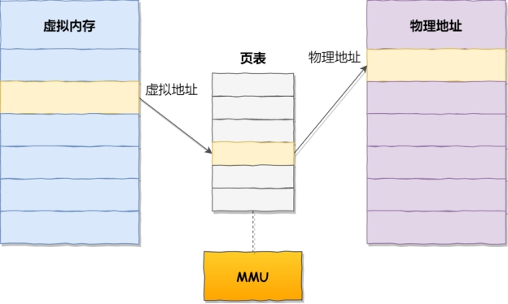

页表是存储在内存里的，内存管理单元 （**MMU**）就做将虚拟内存地址转换成物理地址的工作。

而当进程访问的虚拟地址在页表中查不到时，系统会产生一个缺页异常，进入系统内核空间分配物理内存、更新进程页表，最后再返回用户空间，恢复进程的运行。

分页是怎么解决分段的内存碎片、内存交换效率低的问题？

由于内存空间都是预先划分好的，也就不会像分段会产生间隙非常小的内存，这正是分段会产生内存碎片的原因。而采用了分页，那么释放的内存都是以页为单位释放的，也就不会产生无法给进程使用的小内存。

如果内存空间不够，操作系统会把其他正在运行的进程中的「最近没被使用」的内存页面给释放掉，也就是暂时写在硬盘上，称为换出（**Swap Out**）。一旦需要的时候，再加载进来，称为换入（**Swap In**）。所以，一次性写入磁盘的也只有少数的一个页或者几个页，不会花太多时间，内存交换的效率就相对比较高。


更进一步地，分页的方式使得我们在加载程序的时候，不再需要一次性都把程序加载到物理内存中。我们完全可以在进行虚拟内存和物理内存的页之间的映射之后，并不真的把页加载到物理内存里，而是只有在程序运行中，需要用到对应虚拟内存页里面的指令和数据时，再加载到物理内存里面去。

分页机制下，虚拟地址和物理地址是如何映射的？

在分页机制下，虚拟地址分为两部分，页号和页内偏移。页号作为页表的索引，页表包含物理页每页所在物理内存的基地址，这个基地址与页内偏移的组合就形成了物理内存地址，见下图。

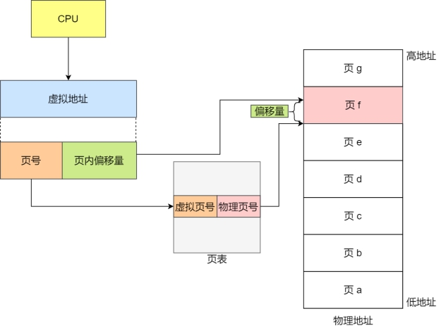

总结一下，对于一个内存地址转换，其实就是这样三个步骤：

- 把虚拟内存地址，切分成页号和偏移量；

- 根据页号，从页表里面，查询对应的物理页号；

- 直接拿物理页号，加上前面的偏移量，就得到了物理内存地址。

下面举个例子，虚拟内存中的页通过页表映射为了物理内存中的页，如下图：

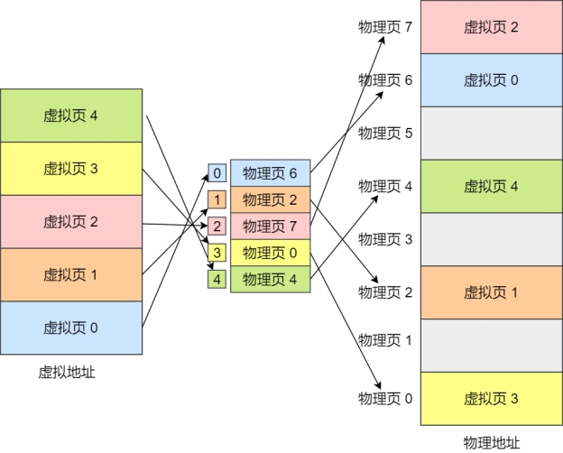

这看起来似乎没什么毛病，但是放到实际中操作系统，这种简单的分页是肯定是会有问题的。

简单的分页有什么缺陷吗？

有空间上的缺陷。

因为操作系统是可以同时运行非常多的进程的，那这不就意味着页表会非常的庞大。

在 32 位的环境下，虚拟地址空间共有 4GB，假设一个页的大小是 4KB（2^12），那么就需要大约 100 万 （2^20） 个页，每个「页表项」需要 4 个字节大小来存储，那么整个 4GB 空间的映射就需要有 4MB的内存来存储页表。

这 4MB 大小的页表，看起来也不是很大。但是要知道每个进程都是有自己的虚拟地址空间的，也就说都有自己的页表。

那么，100个进程的话，就需要 400MB的内存来存储页表，这是非常大的内存了，更别说 64 位的环境了。


#### 多级页表

要解决上面的问题，就需要采用一种叫作多级页表（**Multi-Level Page Table**）的解决方案。

在前面我们知道了，对于单页表的实现方式，在 32 位和页大小 4KB的环境下，一个进程的页表需要装下 100 多万个「页表项」，并且每个页表项是占用 4 字节大小的，于是相当于每个页表需占用 4MB 大小的空间。

我们把这个 100 多万个「页表项」的单级页表再分页，将页表（一级页表）分为 1024个页表（二级页表），每个表（二级页表）中包含 1024个「页表项」，形成二级分页。如下图所示：

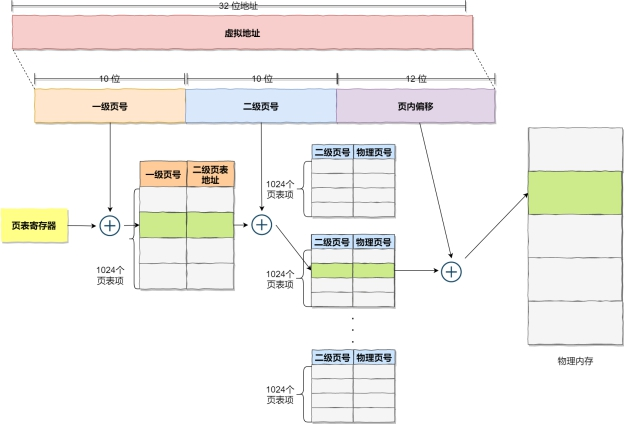

你可能会问，分了二级表，映射 4GB 地址空间就需要 4KB（一级页表）+ 4MB（二级页表）的内存，这样占用空间不是更大了吗？

当然如果 4GB 的虚拟地址全部都映射到了物理内存上的话，二级分页占用空间确实是更大了，但是，我们往往不会为一个进程分配那么多内存。

其实我们应该换个角度来看问题，还记得计算机组成原理里面无处不在的局部性原理么？

每个进程都有 4GB 的虚拟地址空间，而显然对于大多数程序来说，其使用到的空间远未达到 4GB，因为会存在部分对应的页表项都是空的，根本没有分配，对于已分配的页表项，如果存在最近一定时间未访问的页表，在物理内存紧张的情况下，操作系统会将页面换出到硬盘，也就是说不会占用物理内存。

如果使用了二级分页，一级页表就可以覆盖整个 4GB 虚拟地址空间，但如果某个一级页表的页表项没有被用到，也就不需要创建这个页表项对应的二级页表了，即可以在需要时才创建二级页表。做个简单的计算，假设只有 20% 的一级页表项被用到了，那么页表占用的内存空间就只有 4KB（一级页表） + 20% ** 4MB（二级页表）= 0.804MB，这对比单级页表的 4MB是不是一个巨大的节约？

那么为什么不分级的页表就做不到这样节约内存呢？我们从页表的性质来看，保存在内存中的页表承担的职责是将虚拟地址翻译成物理地址。假如虚拟地址在页表中找不到对应的页表项，计算机系统就不能工作了。所以页表一定要覆盖全部虚拟地址空间，不分级的页表就需要有 100 多万个页表项来映射，而二级分页则只需要 1024 个页表项（此时一级页表覆盖到了全部虚拟地址空间，二级页表在需要时创建）。

我们把二级分页再推广到多级页表，就会发现页表占用的内存空间更少了，这一切都要归功于对局部性原理的充分应用。

对于 64 位的系统，两级分页肯定不够了，就变成了四级目录，分别是：

- 全局页目录项 PGD（**Page Global Directory**）；

- 上层页目录项 PUD（**Page Upper Directory**）；

- 中间页目录项 PMD（**Page Middle Directory**）；

- 页表项 PTE（**Page Table Entry**）；

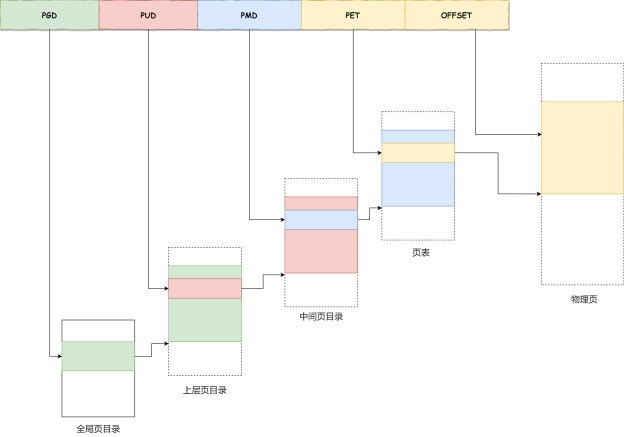


#### TLB

多级页表虽然解决了空间上的问题，但是虚拟地址到物理地址的转换就多了几道转换的工序，这显然就降低了这俩地址转换的速度，也就是带来了时间上的开销。

程序是有局部性的，即在一段时间内，整个程序的执行仅限于程序中的某一部分。相应地，执行所访问的存储空间也局限于某个内存区域。

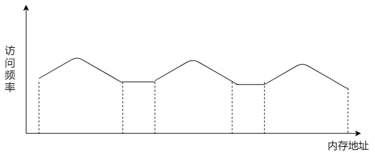

我们就可以利用这一特性，把最常访问的几个页表项存储到访问速度更快的硬件，于是计算机科学家们，就在 CPU 芯片中，加入了一个专门存放程序最常访问的页表项的 Cache，这个 Cache 就是 TLB（**Translation Lookaside Buffer**） ，通常称为页表缓存、转址旁路缓存、快表等。

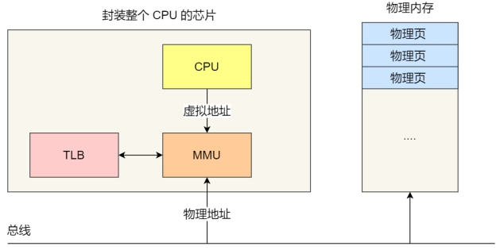

在 CPU 芯片里面，封装了内存管理单元（**Memory Management Unit**）芯片，它用来完成地址转换和 TLB 的访问与交互。

有了 TLB 后，那么 CPU 在寻址时，会先查 TLB，如果没找到，才会继续查常规的页表。

TLB 的命中率其实是很高的，因为程序最常访问的页就那么几个。


### 段页式内存管理

内存分段和内存分页并不是对立的，它们是可以组合起来在同一个系统中使用的，那么组合起来后，通常称为段页式内存管理。


段页式内存管理实现的方式：

- 先将程序划分为多个有逻辑意义的段，也就是前面提到的分段机制；

- 接着再把每个段划分为多个页，也就是对分段划分出来的连续空间，再划分固定大小的页；

这样，地址结构就由段号、段内页号和页内位移三部分组成。

用于段页式地址变换的数据结构是每一个程序一张段表，每个段又建立一张页表，段表中的地址是页表的起始地址，而页表中的地址则为某页的物理页号，如图所示：

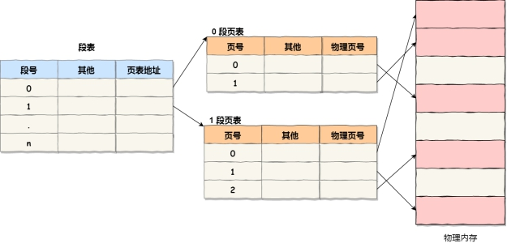

段页式地址变换中要得到物理地址须经过三次内存访问：

- 第一次访问段表，得到页表起始地址；

- 第二次访问页表，得到物理页号；

- 第三次将物理页号与页内位移组合，得到物理地址。

可用软、硬件相结合的方法实现段页式地址变换，这样虽然增加了硬件成本和系统开销，但提高了内存的利用率。


### Linux 内存管理

那么，Linux 操作系统采用了哪种方式来管理内存呢？

在回答这个问题前，我们得先看看 Intel 处理器的发展历史。

早期 Intel 的处理器从 80286 开始使用的是段式内存管理。但是很快发现，光有段式内存管理而没有页式内存管理是不够的，这会使它的 X86 系列会失去市场的竞争力。因此，在不久以后的 80386 中就实现了对页式内存管理。也就是说，80386 除了完成并完善从 80286 开始的段式内存管理的同时还实现了页式内存管理。

但是这个 80386 的页式内存管理设计时，没有绕开段式内存管理，而是建立在段式内存管理的基础上，这就意味着，页式内存管理的作用是在由段式内存管理所映射而成的地址上再加上一层地址映射。

由于此时由段式内存管理映射而成的地址不再是"物理地址"了，Intel 就称之为"线性地址"（也称虚拟地址）。于是，段式内存管理先将逻辑地址映射成线性地址，然后再由页式内存管理将线性地址映射成物理地址。

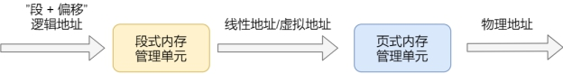

这里说明下逻辑地址和线性地址：

- 程序所使用的地址，通常是没被段式内存管理映射的地址，称为逻辑地址；

- 通过段式内存管理映射的地址，称为线性地址，也叫虚拟地址；

逻辑地址是「段式内存管理」转换前的地址，线性地址则是「页式内存管理」转换前的地址。

了解完 Intel 处理器的发展历史后，我们再来说说 Linux 采用了什么方式管理内存？

Linux 内存主要采用的是页式内存管理，但同时也不可避免地涉及了段机制。

这主要是上面 Intel 处理器发展历史导致的，因为 Intel X86 CPU 一律对程序中使用的地址先进行段式映射，然后才能进行页式映射。既然 CPU 的硬件结构是这样，Linux 内核也只好服从 Intel 的选择。

但是事实上，Linux 内核所采取的办法是使段式映射的过程实际上不起什么作用。也就是说，"上有政策，下有对策"，若惹不起就躲着走。

Linux 系统中的每个段都是从 0 地址开始的整个 4GB 虚拟空间（32 位环境下），也就是所有的段的起始地址都是一样的。这意味着，Linux 系统中的代码，包括操作系统本身的代码和应用程序代码，所面对的地址空间都是线性地址空间（虚拟地址），这种做法相当于屏蔽了处理器中的逻辑地址概念，段只被用于访问控制和内存保护。

我们再来瞧一瞧，Linux 的虚拟地址空间是如何分布的？

在 Linux 操作系统中，虚拟地址空间的内部又被分为内核空间和用户空间两部分，不同位数的系统，地址空间的范围也不同。比如最常见的 32 位和 64 位系统，如下所示：

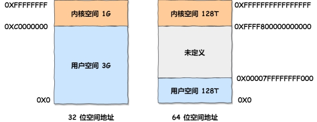

通过这里可以看出：

- 32位系统的内核空间占用 1G ，位于最高处，剩下的 3G 是用户空间；

- 64位系统的内核空间和用户空间都是 128T ，分别占据整个内存空间的最高和最低处，剩下的中间部分是未定义的。

再来说说，内核空间与用户空间的区别：

- 进程在用户态时，只能访问用户空间内存；

- 只有进入内核态后，才可以访问内核空间的内存；

虽然每个进程都各自有独立的虚拟内存，但是每个虚拟内存中的内核地址，其实关联的都是相同的物理内存。这样，进程切换到内核态后，就可以很方便地访问内核空间内存。

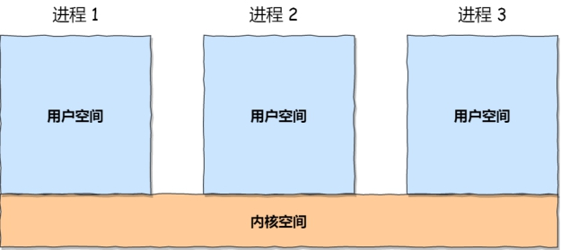

接下来，进一步了解虚拟空间的划分情况，用户空间和内核空间划分的方式是不同的，内核空间的分布情况就不多说了。

我们看看用户空间分布的情况，以 32 位系统为例，我画了一张图来表示它们的关系：

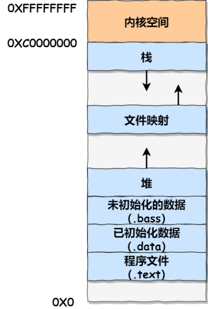

通过这张图你可以看到，用户空间内存，从低到高分别是 7 种不同的内存段：

- 程序文件段，包括二进制可执行代码；

- 已初始化数据段，包括静态常量；

- 未初始化数据段，包括未初始化的静态变量；

- 堆段，包括动态分配的内存，从低地址开始向上增长；

- 文件映射段，包括动态库、共享内存等，从低地址开始向上增长（[跟硬件和内核版本有关](http://lishiwen4.github.io/linux/linux-process-memory-location)）；

- 栈段，包括局部变量和函数调用的上下文等。栈的大小是固定的，一般是 8 MB。当然系统也提供了参数，以便我们自定义大小；

在这 7 个内存段中，堆和文件映射段的内存是动态分配的。比如说，使用 C 标准库的 malloc()或者 mmap()，就可以分别在堆和文件映射段动态分配内存。


### 总总结结

为了在多进程环境下，使得进程之间的内存地址不受影响，相互隔离，于是操作系统就为每个进程独立分配一套虚拟地址空间，每个程序只关心自己的虚拟地址就可以，实际上大家的虚拟地址都是一样的，但分布到物理地址内存是不一样的。作为程序，也不用关心物理地址的事情。

每个进程都有自己的虚拟空间，而物理内存只有一个，所以当启用了大量的进程，物理内存必然会很紧张，于是操作系统会通过内存交换技术，把不常使用的内存暂时存放到硬盘（换出），在需要的时候再装载回物理内存（换入）。

那既然有了虚拟地址空间，那必然要把虚拟地址「映射」到物理地址，这个事情通常由操作系统来维护。

那么对于虚拟地址与物理地址的映射关系，可以有分段和分页的方式，同时两者结合都是可以的。

内存分段是根据程序的逻辑角度，分成了栈段、堆段、数据段、代码段等，这样可以分离出不同属性的段，同时是一块连续的空间。但是每个段的大小都不是统一的，这就会导致内存碎片和内存交换效率低的问题。

于是，就出现了内存分页，把虚拟空间和物理空间分成大小固定的页，如在 Linux 系统中，每一页的大小为 4KB
。由于分了页后，就不会产生细小的内存碎片。同时在内存交换的时候，写入硬盘也就一个页或几个页，这就大大提高了内存交换的效率。

再来，为了解决简单分页产生的页表过大的问题，就有了多级页表，它解决了空间上的问题，但这就会导致 CPU 在寻址的过程中，需要有很多层表参与，加大了时间上的开销。于是根据程序的局部性原理，在 CPU 芯片中加入了 TLB，负责缓存最近常被访问的页表项，大大提高了地址的转换速度。

Linux 系统主要采用了分页管理，但是由于 Intel 处理器的发展史，Linux 系统无法避免分段管理。于是 Linux 就把所有段的基地址设为 0
，也就意味着所有程序的地址空间都是线性地址空间（虚拟地址），相当于屏蔽了 CPU 逻辑地址的概念，所以段只被用于访问控制和内存保护。

另外，Linxu 系统中虚拟空间分布可分为用户态和内核态两部分，其中用户态的分布：代码段、全局变量、BSS、函数栈、堆内存、映射区。


# 四、进程与线程


## 4.1 进程、线程基础知识

先来看看一则小故事

我们写好的一行行代码，为了让其工作起来，我们还得把它送进城（进程）里，那既然进了城里，那肯定不能胡作非为了。

城里人有城里人的规矩，城中有个专门管辖你们的城管（操作系统），人家让你休息就休息，让你工作就工作，毕竟摊位不多，每个人都要占这个摊位来工作，城里要工作的人多着去了。

所以城管为了公平起见，它使用一种策略（调度）方式，给每个人一个固定的工作时间（时间片），时间到了就会通知你去休息而换另外一个人上场工作。

另外，在休息时候你也不能偷懒，要记住工作到哪了，不然下次到你工作了，你忘记工作到哪了，那还怎么继续？

有的人，可能还进入了县城（线程）工作，这里相对轻松一些，在休息的时候，要记住的东西相对较少，而且还能共享城里的资源。

"哎哟，难道本文内容是进程和线程？"

可以，聪明的你猜出来了，也不枉费我瞎编乱造的故事了。


进程和线程对于写代码的我们，真的天天见、日日见了，但见的多不代表你就熟悉它们，比如简单问你一句，你知道它们的工作原理和区别吗？

不知道没关系，今天就要跟大家讨论操作系统的进程和线程。

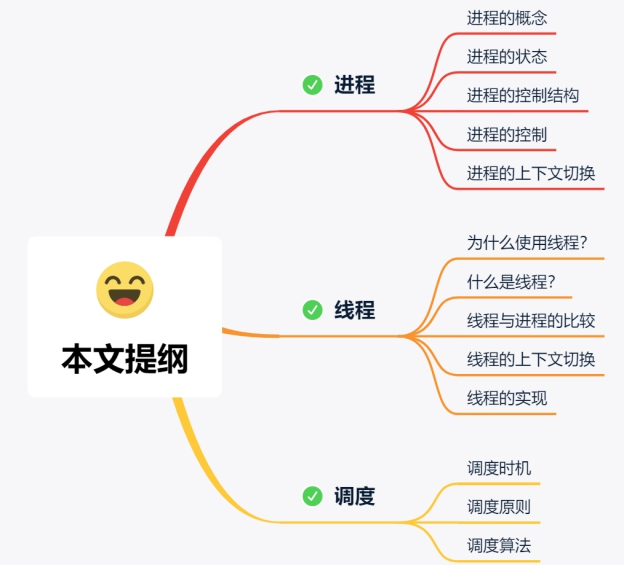


### 进程

我们编写的代码只是一个存储在硬盘的静态文件，通过编译后就会生成二进制可执行文件，当我们运行这个可执行文件后，它会被装载到内存中，接着 CPU 会执行程序中的每一条指令，那么这个运行中的程序，就被称为「进程」（Process）。

现在我们考虑有一个会读取硬盘文件数据的程序被执行了，那么当运行到读取文件的指令时，就会去从硬盘读取数据，但是硬盘的读写速度是非常慢的，那么在这个时候，如果 CPU 傻傻的等硬盘返回数据的话，那 CPU 的利用率是非常低的。

做个类比，你去煮开水时，你会傻傻的等水壶烧开吗？很明显，小孩也不会傻等。我们可以在水壶烧开之前去做其他事情。当水壶烧开了，我们自然就会听到"嘀嘀嘀"的声音，于是再把烧开的水倒入到水杯里就好了。

所以，当进程要从硬盘读取数据时，CPU 不需要阻塞等待数据的返回，而是去执行另外的进程。当硬盘数据返回时，CPU 会收到个中断，于是 CPU 再继续运行这个进程。

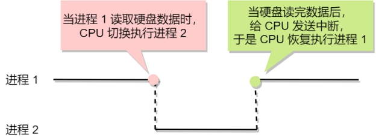

这种多个程序、交替执行的思想，就有 CPU 管理多个进程的初步想法。

对于一个支持多进程的系统，CPU 会从一个进程快速切换至另一个进程，其间每个进程各运行几十或几百个毫秒。

虽然单核的 CPU 在某一个瞬间，只能运行一个进程。但在 1 秒钟期间，它可能会运行多个进程，这样就产生并行的错觉，实际上这是并发。

并发和并行有什么区别？

一图胜千言。

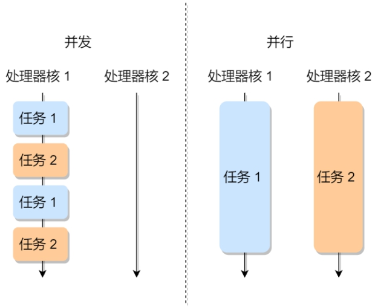

进程与程序的关系的类比

到了晚饭时间，一对小情侣肚子都咕咕叫了，于是男生见机行事，就想给女生做晚饭，所以他就在网上找了辣子鸡的菜谱，接着买了一些鸡肉、辣椒、香料等材料，然后边看边学边做这道菜。

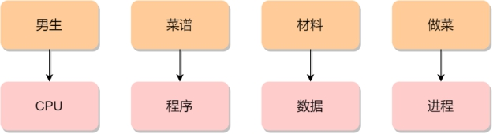

突然，女生说她想喝可乐，那么男生只好把做菜的事情暂停一下，并在手机菜谱标记做到哪一个步骤，把状态信息记录了下来。

然后男生听从女生的指令，跑去下楼买了一瓶冰可乐后，又回到厨房继续做菜。

这体现了，CPU 可以从一个进程（做菜）切换到另外一个进程（买可乐），在切换前必须要记录当前进程中运行的状态信息，以备下次切换回来的时候可以恢复执行。

所以，可以发现进程有着「运行 - 暂停 - 运行」的活动规律。


#### 进程的状态

在上面，我们知道了进程有着「运行 - 暂停 - 运行」的活动规律。一般说来，一个进程并不是自始至终连续不停地运行的，它与并发执行中的其他进程的执行是相互制约的。

它有时处于运行状态，有时又由于某种原因而暂停运行处于等待状态，当使它暂停的原因消失后，它又进入准备运行状态。

所以，在一个进程的活动期间至少具备三种基本状态，即运行状态、就绪状态、阻塞状态。

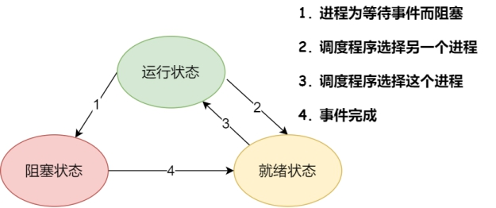

上图中各个状态的意义：

- 运行状态（**Runing**）：该时刻进程占用 CPU；

- 就绪状态（**Ready**）：可运行，由于其他进程处于运行状态而暂时停止运行；

- 阻塞状态（**Blocked**）：该进程正在等待某一事件发生（如等待输入/输出操作的完成）而暂时停止运行，这时，即使给它CPU控制权，它也无法运行；

当然，进程还有另外两个基本状态：

- 创建状态（**new**）：进程正在被创建时的状态；

- 结束状态（**Exit**）：进程正在从系统中消失时的状态；

于是，一个完整的进程状态的变迁如下图：

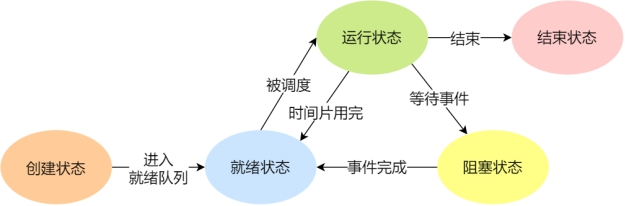

再来详细说明一下进程的状态变迁：

- **NULL -> 创建状态**：一个新进程被创建时的第一个状态；

- **创建状态 -> 就绪状态**：当进程被创建完成并初始化后，一切就绪准备运行时，变为就绪状态，这个过程是很快的；

- **就绪态 -> 运行状态**：处于就绪状态的进程被操作系统的进程调度器选中后，就分配给 CPU 正式运行该进程；

- **运行状态 -> 结束状态**：当进程已经运行完成或出错时，会被操作系统作结束状态处理；

- **运行状态 -> 就绪状态**：处于运行状态的进程在运行过程中，由于分配给它的运行时间片用完，操作系统会把该进程变为就绪态，接着从就绪态选中另外一个进程运行；

- **运行状态 -> 阻塞状态**：当进程请求某个事件且必须等待时，例如请求 I/O 事件；

- **阻塞状态 -> 就绪状态**：当进程要等待的事件完成时，它从阻塞状态变到就绪状态；

如果有大量处于阻塞状态的进程，进程可能会占用着物理内存空间，显然不是我们所希望的，毕竟物理内存空间是有限的，被阻塞状态的进程占用着物理内存就一种浪费物理内存的行为。

所以，在虚拟内存管理的操作系统中，通常会把阻塞状态的进程的物理内存空间换出到硬盘，等需要再次运行的时候，再从硬盘换入到物理内存。

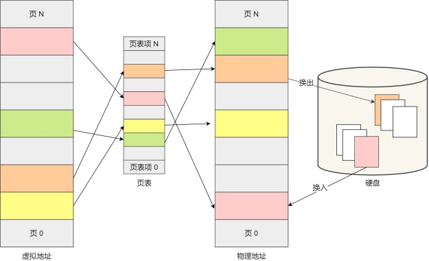

那么，就需要一个新的状态，来描述进程没有占用实际的物理内存空间的情况，这个状态就是挂起状态。这跟阻塞状态是不一样，阻塞状态是等待某个事件的返回。

另外，挂起状态可以分为两种：

- 阻塞挂起状态：进程在外存（硬盘）并等待某个事件的出现；

- 就绪挂起状态：进程在外存（硬盘），但只要进入内存，即刻立刻运行；

这两种挂起状态加上前面的五种状态，就变成了七种状态变迁（留给我的颜色不多了），见如下图：

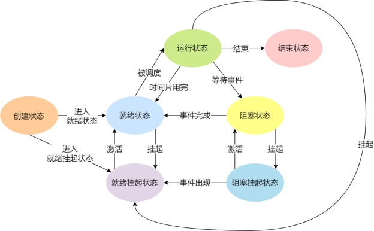

导致进程挂起的原因不只是因为进程所使用的内存空间不在物理内存，还包括如下情况：

- 通过 sleep 让进程间歇性挂起，其工作原理是设置一个定时器，到期后唤醒进程。

- 用户希望挂起一个程序的执行，比如在 Linux 中用 Ctrl+Z挂起进程；


#### 进程的控制结构

在操作系统中，是用进程控制块（**process control block，PCB**）数据结构来描述进程的。

那 PCB 是什么呢？打开知乎搜索你就会发现这个东西并不是那么简单。


打住打住，我们是个正经的人，怎么会去看那些问题呢？是吧，回来回来。

PCB 是进程存在的唯一标识，这意味着一个进程的存在，必然会有一个 PCB，如果进程消失了，那么 PCB 也会随之消失。

PCB 具体包含什么信息呢？

进程描述信息：

- 进程标识符：标识各个进程，每个进程都有一个并且唯一的标识符；

- 用户标识符：进程归属的用户，用户标识符主要为共享和保护服务；

进程控制和管理信息：

- 进程当前状态，如 new、ready、running、waiting 或 blocked 等；

- 进程优先级：进程抢占 CPU 时的优先级；

资源分配清单：

- 有关内存地址空间或虚拟地址空间的信息，所打开文件的列表和所使用的 I/O 设备信息。

CPU 相关信息：

- CPU 中各个寄存器的值，当进程被切换时，CPU 的状态信息都会被保存在相应的 PCB 中，以便进程重新执行时，能从断点处继续执行。

可见，PCB 包含信息还是比较多的。

每个 PCB 是如何组织的呢？

通常是通过链表的方式进行组织，把具有相同状态的进程链在一起，组成各种队列。比如：

- 将所有处于就绪状态的进程链在一起，称为就绪队列；

- 把所有因等待某事件而处于等待状态的进程链在一起就组成各种阻塞队列；

- 另外，对于运行队列在单核 CPU 系统中则只有一个运行指针了，因为单核 CPU 在某个时间，只能运行一个程序。

那么，就绪队列和阻塞队列链表的组织形式如下图：

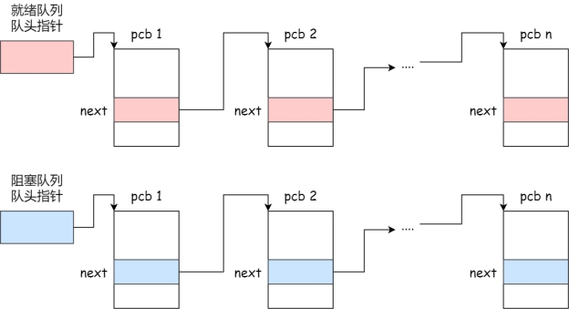

除了链接的组织方式，还有索引方式，它的工作原理：将同一状态的进程组织在一个索引表中，索引表项指向相应的 PCB，不同状态对应不同的索引表。

一般会选择链表，因为可能面临进程创建，销毁等调度导致进程状态发生变化，所以链表能够更加灵活的插入和删除。


#### 进程的控制

我们熟知了进程的状态变迁和进程的数据结构 PCB 后，再来看看进程的创建、终止、阻塞、唤醒的过程，这些过程也就是进程的控制。

01 创建进程

操作系统允许一个进程创建另一个进程，而且允许子进程继承父进程所拥有的资源，当子进程被终止时，其在父进程处继承的资源应当还给父进程。同时，终止父进程时同时也会终止其所有的子进程。

注意：Linux 操作系统对于终止有子进程的父进程，会把子进程交给 1 号进程接管。本文所指出的进程终止概念是宏观操作系统的一种观点，最后怎么实现当然是看具体的操作系统。

创建进程的过程如下：

- 为新进程分配一个唯一的进程标识号，并申请一个空白的 PCB，PCB 是有限的，若申请失败则创建失败；

- 为进程分配资源，此处如果资源不足，进程就会进入等待状态，以等待资源；

- 初始化 PCB；

- 如果进程的调度队列能够接纳新进程，那就将进程插入到就绪队列，等待被调度运行；

02 终止进程

进程可以有 3 种终止方式：正常结束、异常结束以及外界干预（信号 kill掉）。

终止进程的过程如下：

- 查找需要终止的进程的 PCB；

- 如果处于执行状态，则立即终止该进程的执行，然后将 CPU 资源分配给其他进程；

- 如果其还有子进程，则应将其所有子进程终止；

- 将该进程所拥有的全部资源都归还给父进程或操作系统；

- 将其从 PCB 所在队列中删除；

03 阻塞进程

当进程需要等待某一事件完成时，它可以调用阻塞语句把自己阻塞等待。而一旦被阻塞等待，它只能由另一个进程唤醒。

阻塞进程的过程如下：

- 找到将要被阻塞进程标识号对应的 PCB；

- 如果该进程为运行状态，则保护其现场，将其状态转为阻塞状态，停止运行；

- 将该 PCB 插入到阻塞队列中去；

04 唤醒进程

进程由「运行」转变为「阻塞」状态是由于进程必须等待某一事件的完成，所以处于阻塞状态的进程是绝对不可能叫醒自己的。

如果某进程正在等待 I/O 事件，需由别的进程发消息给它，则只有当该进程所期待的事件出现时，才由发现者进程用唤醒语句叫醒它。

唤醒进程的过程如下：

- 在该事件的阻塞队列中找到相应进程的 PCB；

- 将其从阻塞队列中移出，并置其状态为就绪状态；

- 把该 PCB 插入到就绪队列中，等待调度程序调度；

进程的阻塞和唤醒是一对功能相反的语句，如果某个进程调用了阻塞语句，则必有一个与之对应的唤醒语句。


#### 进程的上下文切换

各个进程之间是共享 CPU 资源的，在不同的时候进程之间需要切换，让不同的进程可以在 CPU 执行，那么这个一个进程切换到另一个进程运行，称为进程的上下文切换。

在详细说进程上下文切换前，我们先来看看 CPU 上下文切换

大多数操作系统都是多任务，通常支持大于 CPU 数量的任务同时运行。实际上，这些任务并不是同时运行的，只是因为系统在很短的时间内，让各个任务分别在 CPU 运行，于是就造成同时运行的错觉。

任务是交给 CPU 运行的，那么在每个任务运行前，CPU 需要知道任务从哪里加载，又从哪里开始运行。

所以，操作系统需要事先帮 CPU 设置好 CPU 寄存器和程序计数器。

CPU 寄存器是 CPU 内部一个容量小，但是速度极快的内存（缓存）。我举个例子，寄存器像是你的口袋，内存像你的书包，硬盘则是你家里的柜子，如果你的东西存放到口袋，那肯定是比你从书包或家里柜子取出来要快的多。

再来，程序计数器则是用来存储 CPU 正在执行的指令位置、或者即将执行的下一条指令位置。

所以说，CPU 寄存器和程序计数是 CPU 在运行任何任务前，所必须依赖的环境，这些环境就叫做 CPU 上下文。

既然知道了什么是 CPU 上下文，那理解 CPU 上下文切换就不难了。

CPU 上下文切换就是先把前一个任务的 CPU 上下文（CPU 寄存器和程序计数器）保存起来，然后加载新任务的上下文到这些寄存器和程序计数器，最后再跳转到程序计数器所指的新位置，运行新任务。

系统内核会存储保持下来的上下文信息，当此任务再次被分配给 CPU 运行时，CPU 会重新加载这些上下文，这样就能保证任务原来的状态不受影响，让任务看起来还是连续运行。

上面说到所谓的「任务」，主要包含进程、线程和中断。所以，可以根据任务的不同，把 CPU 上下文切换分成：进程上下文切换、线程上下文切换和中断上下文切换。

进程的上下文切换到底是切换什么呢？

进程是由内核管理和调度的，所以进程的切换只能发生在内核态。

所以，进程的上下文切换不仅包含了虚拟内存、栈、全局变量等用户空间的资源，还包括了内核堆栈、寄存器等内核空间的资源。

通常，会把交换的信息保存在进程的 PCB，当要运行另外一个进程的时候，我们需要从这个进程的 PCB 取出上下文，然后恢复到 CPU 中，这使得这个进程可以继续执行，如下图所示：


大家需要注意，进程的上下文开销是很关键的，我们希望它的开销越小越好，这样可以使得进程可以把更多时间花费在执行程序上，而不是耗费在上下文切换。

发生进程上下文切换有哪些场景？

- 为了保证所有进程可以得到公平调度，CPU 时间被划分为一段段的时间片，这些时间片再被轮流分配给各个进程。这样，当某个进程的时间片耗尽了，进程就从运行状态变为就绪状态，系统从就绪队列选择另外一个进程运行；

- 进程在系统资源不足（比如内存不足）时，要等到资源满足后才可以运行，这个时候进程也会被挂起，并由系统调度其他进程运行；

- 当进程通过睡眠函数 sleep 这样的方法将自己主动挂起时，自然也会重新调度；

- 当有优先级更高的进程运行时，为了保证高优先级进程的运行，当前进程会被挂起，由高优先级进程来运行；

- 发生硬件中断时，CPU 上的进程会被中断挂起，转而执行内核中的中断服务程序；

以上，就是发生进程上下文切换的常见场景了。


### 线程

在早期的操作系统中都是以进程作为独立运行的基本单位，直到后面，计算机科学家们又提出了更小的能独立运行的基本单位，也就是线程。


#### 为什么使用线程？

我们举个例子，假设你要编写一个视频播放器软件，那么该软件功能的核心模块有三个：

- 从视频文件当中读取数据；

- 对读取的数据进行解压缩；

- 把解压缩后的视频数据播放出来；

对于单进程的实现方式，我想大家都会是以下这个方式：

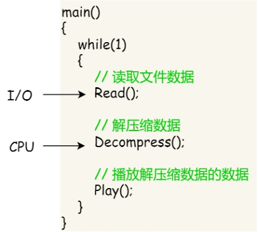

对于单进程的这种方式，存在以下问题：

- 播放出来的画面和声音会不连贯，因为当 CPU 能力不够强的时候，Read的时候可能进程就等在这了，这样就会导致等半天才进行数据解压和播放；

- 各个函数之间不是并发执行，影响资源的使用效率；

那改进成多进程的方式：

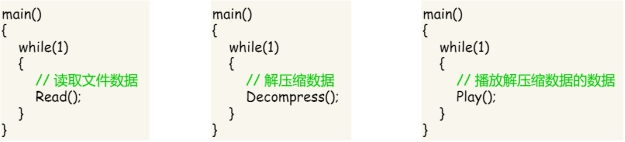

对于多进程的这种方式，依然会存在问题：

- 进程之间如何通信，共享数据？

- 维护进程的系统开销较大，如创建进程时，分配资源、建立 PCB；终止进程时，回收资源、撤销 PCB；进程切换时，保存当前进程的状态信息；

那到底如何解决呢？需要有一种新的实体，满足以下特性：

- 实体之间可以并发运行；

- 实体之间共享相同的地址空间；

这个新的实体，就是线程( **Thread** )，线程之间可以并发运行且共享相同的地址空间。


#### 什么是线程？

线程是进程当中的一条执行流程。

同一个进程内多个线程之间可以共享代码段、数据段、打开的文件等资源，但每个线程各自都有一套独立的寄存器和栈，这样可以确保线程的控制流是相对独立的。

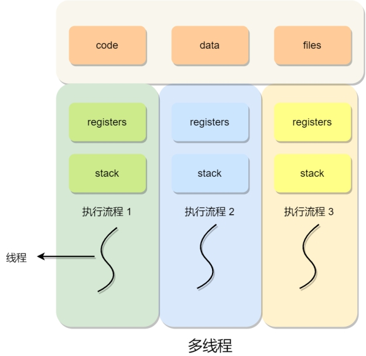

线程的优缺点？

线程的优点：

- 一个进程中可以同时存在多个线程；

- 各个线程之间可以并发执行；

- 各个线程之间可以共享地址空间和文件等资源；

线程的缺点：

- 当进程中的一个线程崩溃时，会导致其所属进程的所有线程崩溃。

举个例子，对于游戏的用户设计，则不应该使用多线程的方式，否则一个用户挂了，会影响其他同个进程的线程。


#### 线程与进程的比较

线程与进程的比较如下：

- 进程是资源（包括内存、打开的文件等）分配的单位，线程是 CPU 调度的单位；

- 进程拥有一个完整的资源平台，而线程只独享必不可少的资源，如寄存器和栈；

- 线程同样具有就绪、阻塞、执行三种基本状态，同样具有状态之间的转换关系；

- 线程能减少并发执行的时间和空间开销；

对于，线程相比进程能减少开销，体现在：

- 线程的创建时间比进程快，因为进程在创建的过程中，还需要资源管理信息，比如内存管理信息、文件管理信息，而线程在创建的过程中，不会涉及这些资源管理信息，而是共享它们；

- 线程的终止时间比进程快，因为线程释放的资源相比进程少很多；

- 同一个进程内的线程切换比进程切换快，因为线程具有相同的地址空间（虚拟内存共享），这意味着同一个进程的线程都具有同一个页表，那么在切换的时候不需要切换页表。而对于进程之间的切换，切换的时候要把页表给切换掉，而页表的切换过程开销是比较大的；

- 由于同一进程的各线程间共享内存和文件资源，那么在线程之间数据传递的时候，就不需要经过内核了，这就使得线程之间的数据交互效率更高了；

所以，不管是时间效率，还是空间效率线程比进程都要高。


#### 线程的上下文切换

在前面我们知道了，线程与进程最大的区别在于：线程是调度的基本单位，而进程则是资源拥有的基本单位。

所以，所谓操作系统的任务调度，实际上的调度对象是线程，而进程只是给线程提供了虚拟内存、全局变量等资源。

对于线程和进程，我们可以这么理解：

- 当进程只有一个线程时，可以认为进程就等于线程；

- 当进程拥有多个线程时，这些线程会共享相同的虚拟内存和全局变量等资源，这些资源在上下文切换时是不需要修改的；

另外，线程也有自己的私有数据，比如栈和寄存器等，这些在上下文切换时也是需要保存的。

线程上下文切换的是什么？

这还得看线程是不是属于同一个进程：

- 当两个线程不是属于同一个进程，则切换的过程就跟进程上下文切换一样；

- 当两个线程是属于同一个进程，因为虚拟内存是共享的，所以在切换时，虚拟内存这些资源就保持不动，只需要切换线程的私有数据、寄存器等不共享的数据；

所以，线程的上下文切换相比进程，开销要小很多。


#### 线程的实现

主要有三种线程的实现方式：

- 用户线程（**User Thread**）：在用户空间实现的线程，不是由内核管理的线程，是由用户态的线程库来完成线程的管理；

- 内核线程（**Kernel Thread**）：在内核中实现的线程，是由内核管理的线程；

- 轻量级进程（**LightWeight Process**）：在内核中来支持用户线程；

那么，这还需要考虑一个问题，用户线程和内核线程的对应关系。

首先，第一种关系是多对一的关系，也就是多个用户线程对应同一个内核线程：

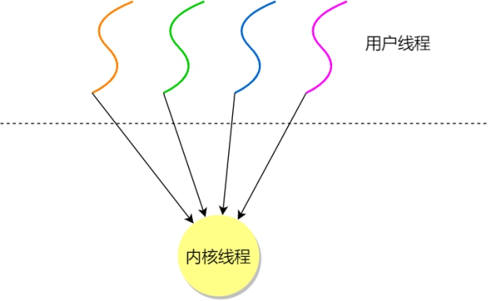

第二种是一对一的关系，也就是一个用户线程对应一个内核线程：

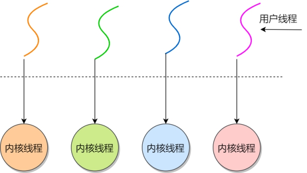

第三种是多对多的关系，也就是多个用户线程对应到多个内核线程：

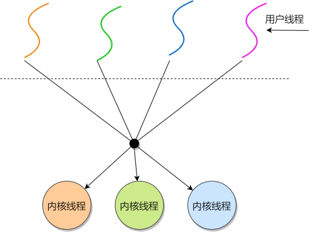

用户线程如何理解？存在什么优势和缺陷？

用户线程是基于用户态的线程管理库来实现的，那么线程控制块（**Thread Control Block, TCB**） 也是在库里面来实现的，对于操作系统而言是看不到这个 TCB 的，它只能看到整个进程的 PCB。

所以，用户线程的整个线程管理和调度，操作系统是不直接参与的，而是由用户级线程库函数来完成线程的管理，包括线程的创建、终止、同步和调度等。

用户级线程的模型，也就类似前面提到的多对一的关系，即多个用户线程对应同一个内核线程，如下图所示：

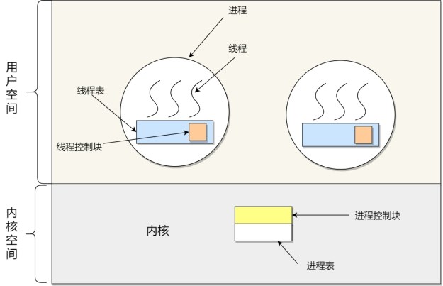

用户线程的优点：

- 每个进程都需要有它私有的线程控制块（TCB）列表，用来跟踪记录它各个线程状态信息（PC、栈指针、寄存器），TCB 由用户级线程库函数来维护，可用于不支持线程技术的操作系统；

- 用户线程的切换也是由线程库函数来完成的，无需用户态与内核态的切换，所以速度特别快；

用户线程的缺点：

- 由于操作系统不参与线程的调度，如果一个线程发起了系统调用而阻塞，那进程所包含的用户线程都不能执行了。

- 当一个线程开始运行后，除非它主动地交出 CPU 的使用权，否则它所在的进程当中的其他线程无法运行，因为用户态的线程没法打断当前运行中的线程，它没有这个特权，只有操作系统才有，但是用户线程不是由操作系统管理的。

- 由于时间片分配给进程，故与其他进程比，在多线程执行时，每个线程得到的时间片较少，执行会比较慢；

以上，就是用户线程的优缺点了。

那内核线程如何理解？存在什么优势和缺陷？

内核线程是由操作系统管理的，线程对应的 TCB 自然是放在操作系统里的，这样线程的创建、终止和管理都是由操作系统负责。

内核线程的模型，也就类似前面提到的一对一的关系，即一个用户线程对应一个内核线程，如下图所示：

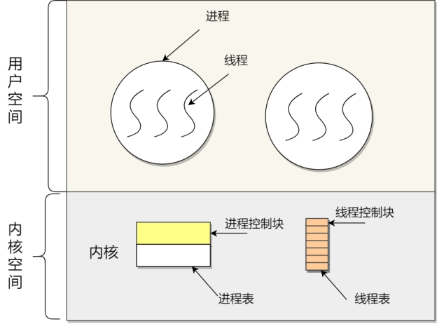

内核线程的优点：

- 在一个进程当中，如果某个内核线程发起系统调用而被阻塞，并不会影响其他内核线程的运行；

- 分配给线程，多线程的进程获得更多的 CPU 运行时间；

内核线程的缺点：

- 在支持内核线程的操作系统中，由内核来维护进程和线程的上下文信息，如 PCB 和 TCB；

- 线程的创建、终止和切换都是通过系统调用的方式来进行，因此对于系统来说，系统开销比较大；

以上，就是内核线程的优缺点了。

最后的轻量级进程如何理解？

轻量级进程（**Light-weight process，LWP**）是内核支持的用户线程，一个进程可有一个或多个 LWP，每个 LWP 是跟内核线程一对一映射的，也就是 LWP 都是由一个内核线程支持。

另外，LWP 只能由内核管理并像普通进程一样被调度，Linux 内核是支持 LWP 的典型例子。

在大多数系统中，LWP与普通进程的区别也在于它只有一个最小的执行上下文和调度程序所需的统计信息。一般来说，一个进程代表程序的一个实例，而 LWP 代表程序的执行线程，因为一个执行线程不像进程那样需要那么多状态信息，所以 LWP 也不带有这样的信息。

在 LWP 之上也是可以使用用户线程的，那么 LWP 与用户线程的对应关系就有三种：

- 1 : 1，即一个 LWP 对应 一个用户线程；

- N : 1，即一个 LWP 对应多个用户线程；

- M : N，即多个 LMP 对应多个用户线程；

接下来针对上面这三种对应关系说明它们优缺点。先看下图的 LWP 模型：

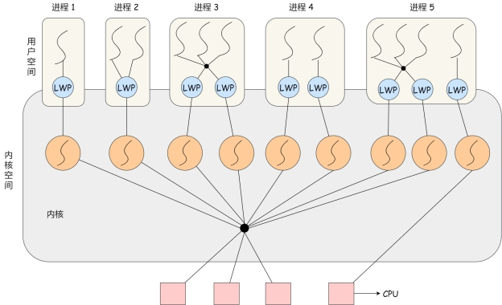

1 : 1 模式

一个线程对应到一个 LWP 再对应到一个内核线程，如上图的进程 4，属于此模型。

- 优点：实现并行，当一个 LWP 阻塞，不会影响其他 LWP；

- 缺点：每一个用户线程，就产生一个内核线程，创建线程的开销较大。

N : 1 模式

多个用户线程对应一个 LWP 再对应一个内核线程，如上图的进程 2，线程管理是在用户空间完成的，此模式中用户的线程对操作系统不可见。

- 优点：用户线程要开几个都没问题，且上下文切换发生用户空间，切换的效率较高；

- 缺点：一个用户线程如果阻塞了，则整个进程都将会阻塞，另外在多核 CPU 中，是没办法充分利用 CPU 的。

M : N 模式

根据前面的两个模型混搭一起，就形成 M:N模型，该模型提供了两级控制，首先多个用户线程对应到多个 LWP，LWP 再一一对应到内核线程，如上图的进程 3。

- 优点：综合了前两种优点，大部分的线程上下文发生在用户空间，且多个线程又可以充分利用多核 CPU 的资源。

组合模式

如上图的进程 5，此进程结合 1:1模型和 M:N模型。开发人员可以针对不同的应用特点调节内核线程的数目来达到物理并行性和逻辑并行性的最佳方案。


### 调度

进程都希望自己能够占用 CPU 进行工作，那么这涉及到前面说过的进程上下文切换。

一旦操作系统把进程切换到运行状态，也就意味着该进程占用着 CPU 在执行，但是当操作系统把进程切换到其他状态时，那就不能在 CPU 中执行了，于是操作系统会选择下一个要运行的进程。

选择一个进程运行这一功能是在操作系统中完成的，通常称为调度程序（**scheduler**）。

那到底什么时候调度进程，或以什么原则来调度进程呢？


#### 调度时机

在进程的生命周期中，当进程从一个运行状态到另外一状态变化的时候，其实会触发一次调度。

比如，以下状态的变化都会触发操作系统的调度：

- **从就绪态 -> 运行态**：当进程被创建时，会进入到就绪队列，操作系统会从就绪队列选择一个进程运行；

- **从运行态 -> 阻塞态**：当进程发生 I/O 事件而阻塞时，操作系统必须另外一个进程运行；

- **从运行态 -> 结束态**：当进程退出结束后，操作系统得从就绪队列选择另外一个进程运行；

因为，这些状态变化的时候，操作系统需要考虑是否要让新的进程给 CPU 运行，或者是否让当前进程从 CPU 上退出来而换另一个进程运行。

另外，如果硬件时钟提供某个频率的周期性中断，那么可以根据如何处理时钟中断，把调度算法分为两类：

- 非抢占式调度算法挑选一个进程，然后让该进程运行直到被阻塞，或者直到该进程退出，才会调用另外一个进程，也就是说不会理时钟中断这个事情。

- 抢占式调度算法挑选一个进程，然后让该进程只运行某段时间，如果在该时段结束时，该进程仍然在运行时，则会把它挂起，接着调度程序从就绪队列挑选另外一个进程。这种抢占式调度处理，需要在时间间隔的末端发生时钟中断，以便把 CPU 控制返回给调度程序进行调度，也就是常说的时间片机制。


#### 调度原则

**原则一**：如果运行的程序，发生了 I/O 事件的请求，那 CPU 使用率必然会很低，因为此时进程在阻塞等待硬盘的数据返回。这样的过程，势必会造成 CPU 突然的空闲。所以，为了提高 CPU 利用率，在这种发送 I/O 事件致使 CPU 空闲的情况下，调度程序需要从就绪队列中选择一个进程来运行。

**原则二**：有的程序执行某个任务花费的时间会比较长，如果这个程序一直占用着 CPU，会造成系统吞吐量（CPU 在单位时间内完成的进程数量）的降低。所以，要提高系统的吞吐率，调度程序要权衡长任务和短任务进程的运行完成数量。

**原则三**：从进程开始到结束的过程中，实际上是包含两个时间，分别是进程运行时间和进程等待时间，这两个时间总和就称为周转时间。进程的周转时间越小越好，如果进程的等待时间很长而运行时间很短，那周转时间就很长，这不是我们所期望的，调度程序应该避免这种情况发生。

**原则四**：处于就绪队列的进程，也不能等太久，当然希望这个等待的时间越短越好，这样可以使得进程更快的在 CPU 中执行。所以，就绪队列中进程的等待时间也是调度程序所需要考虑的原则。

**原则五**：对于鼠标、键盘这种交互式比较强的应用，我们当然希望它的响应时间越快越好，否则就会影响用户体验了。所以，对于交互式比较强的应用，响应时间也是调度程序需要考虑的原则。

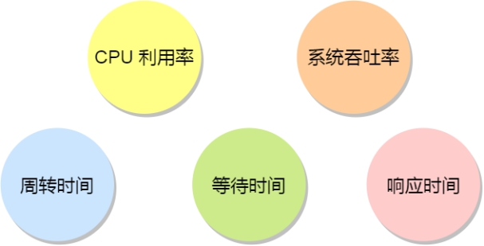

针对上面的五种调度原则，总结成如下：

- CPU 利用率：调度程序应确保 CPU 是始终匆忙的状态，这可提高 CPU 的利用率；

- 系统吞吐量：吞吐量表示的是单位时间内 CPU 完成进程的数量，长作业的进程会占用较长的 CPU 资源，因此会降低吞吐量，相反，短作业的进程会提升系统吞吐量；

- 周转时间：周转时间是进程运行和阻塞时间总和，一个进程的周转时间越小越好；

- 等待时间：这个等待时间不是阻塞状态的时间，而是进程处于就绪队列的时间，等待的时间越长，用户越不满意；

- 响应时间：用户提交请求到系统第一次产生响应所花费的时间，在交互式系统中，响应时间是衡量调度算法好坏的主要标准。

说白了，这么多调度原则，目的就是要使得进程要「快」。


#### 调度算法

不同的调度算法适用的场景也是不同的。

接下来，说说在单核 CPU 系统中常见的调度算法。

01 先来先服务调度算法

最简单的一个调度算法，就是非抢占式的先来先服务（**First Come First Seved, FCFS**）算法了。

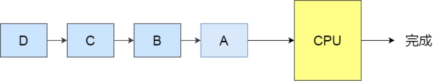

顾名思义，先来后到，每次从就绪队列选择最先进入队列的进程，然后一直运行，直到进程退出或被阻塞，才会继续从队列中选择第一个进程接着运行。

这似乎很公平，但是当一个长作业先运行了，那么后面的短作业等待的时间就会很长，不利于短作业。

FCFS 对长作业有利，适用于 CPU 繁忙型作业的系统，而不适用于 I/O 繁忙型作业的系统。

02 最短作业优先调度算法

最短作业优先（**Shortest Job First, SJF**）调度算法同样也是顾名思义，它会优先选择运行时间最短的进程来运行，这有助于提高系统的吞吐量。

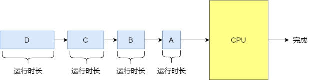

这显然对长作业不利，很容易造成一种极端现象。

比如，一个长作业在就绪队列等待运行，而这个就绪队列有非常多的短作业，那么就会使得长作业不断的往后推，周转时间变长，致使长作业长期不会被运行。

03 高响应比优先调度算法

前面的「先来先服务调度算法」和「最短作业优先调度算法」都没有很好的权衡短作业和长作业。

那么，高响应比优先（**Highest Response Ratio Next, HRRN**）调度算法主要是权衡了短作业和长作业。

每次进行进程调度时，先计算「响应比优先级」，然后把「响应比优先级」最高的进程投入运行，「响应比优先级」的计算公式：

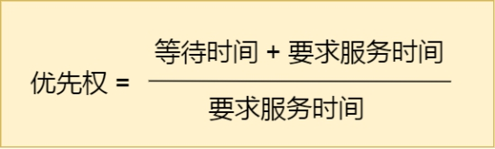

从上面的公式，可以发现：

- 如果两个进程的「等待时间」相同时，「要求的服务时间」越短，「响应比」就越高，这样短作业的进程容易被选中运行；

- 如果两个进程「要求的服务时间」相同时，「等待时间」越长，「响应比」就越高，这就兼顾到了长作业进程，因为进程的响应比可以随时间等待的增加而提高，当其等待时间足够长时，其响应比便可以升到很高，从而获得运行的机会；


04 时间片轮转调度算法

最古老、最简单、最公平且使用最广的算法就是时间片轮转（**Round Robin, RR**）调度算法。

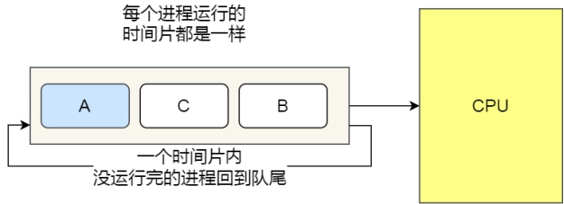

每个进程被分配一个时间段，称为时间片（**Quantum**），即允许该进程在该时间段中运行。

- 如果时间片用完，进程还在运行，那么将会把此进程从 CPU 释放出来，并把 CPU 分配给另外一个进程；

- 如果该进程在时间片结束前阻塞或结束，则 CPU 立即进行切换；

另外，时间片的长度就是一个很关键的点：

- 如果时间片设得太短会导致过多的进程上下文切换，降低了 CPU 效率；

- 如果设得太长又可能引起对短作业进程的响应时间变长。将

一般来说，时间片设为 20ms~50ms通常是一个比较合理的折中值。

05 最高优先级调度算法

前面的「时间片轮转算法」做了个假设，即让所有的进程同等重要，也不偏袒谁，大家的运行时间都一样。

但是，对于多用户计算机系统就有不同的看法了，它们希望调度是有优先级的，即希望调度程序能从就绪队列中选择最高优先级的进程进行运行，这称为最高优先级（**Highest Priority First，HPF**）调度算法。

进程的优先级可以分为，静态优先级和动态优先级：

- 静态优先级：创建进程时候，就已经确定了优先级了，然后整个运行时间优先级都不会变化；

- 动态优先级：根据进程的动态变化调整优先级，比如如果进程运行时间增加，则降低其优先级，如果进程等待时间（就绪队列的等待时间）增加，则升高其优先级，也就是随着时间的推移增加等待进程的优先级。

该算法也有两种处理优先级高的方法，非抢占式和抢占式：

- 非抢占式：当就绪队列中出现优先级高的进程，运行完当前进程，再选择优先级高的进程。

- 抢占式：当就绪队列中出现优先级高的进程，当前进程挂起，调度优先级高的进程运行。

但是依然有缺点，可能会导致低优先级的进程永远不会运行。

06 多级反馈队列调度算法

多级反馈队列（**Multilevel Feedback Queue**）调度算法是「时间片轮转算法」和「最高优先级算法」的综合和发展。

顾名思义：

- 「多级」表示有多个队列，每个队列优先级从高到低，同时优先级越高时间片越短。

- 「反馈」表示如果有新的进程加入优先级高的队列时，立刻停止当前正在运行的进程，转而去运行优先级高的队列；

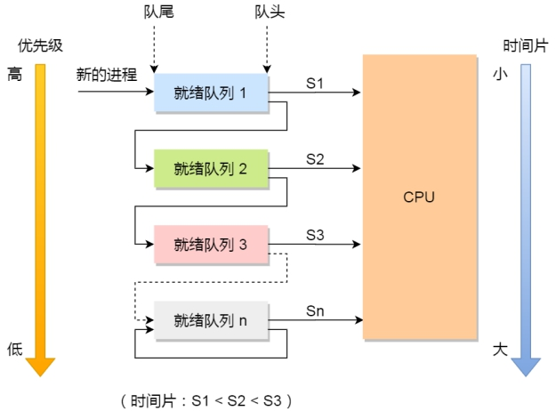

来看看，它是如何工作的：

- 设置了多个队列，赋予每个队列不同的优先级，每个队列优先级从高到低，同时优先级越高时间片越短；

- 新的进程会被放入到第一级队列的末尾，按先来先服务的原则排队等待被调度，如果在第一级队列规定的时间片没运行完成，则将其转入到第二级队列的末尾，以此类推，直至完成；

- 当较高优先级的队列为空，才调度较低优先级的队列中的进程运行。如果进程运行时，有新进程进入较高优先级的队列，则停止当前运行的进程并将其移入到原队列末尾，接着让较高优先级的进程运行；

可以发现，对于短作业可能可以在第一级队列很快被处理完。对于长作业，如果在第一级队列处理不完，可以移入下次队列等待被执行，虽然等待的时间变长了，但是运行时间也变更长了，所以该算法很好的兼顾了长短作业，同时有较好的响应时间。

看的迷迷糊糊？那我拿去银行办业务的例子，把上面的调度算法串起来，你还不懂，你锤我！

办理业务的客户相当于进程，银行窗口工作人员相当于 CPU。

现在，假设这个银行只有一个窗口（单核 CPU ），那么工作人员一次只能处理一个业务。


那么最简单的处理方式，就是先来的先处理，后面来的就乖乖排队，这就是先来先服务（**FCFS**）调度算法。但是万一先来的这位老哥是来贷款的，这一谈就好几个小时，一直占用着窗口，这样后面的人只能干等，或许后面的人只是想简单的取个钱，几分钟就能搞定，却因为前面老哥办长业务而要等几个小时，你说气不气人？

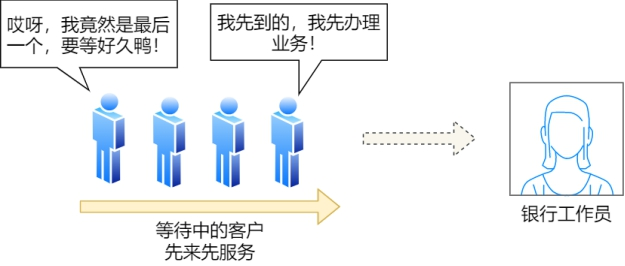

有客户抱怨了，那我们就要改进，我们干脆优先给那些几分钟就能搞定的人办理业务，这就是短作业优先（**SJF**）调度算法。听起来不错，但是依然还是有个极端情况，万一办理短业务的人非常的多，这会导致长业务的人一直得不到服务，万一这个长业务是个大客户，那不就捡了芝麻丢了西瓜


那就公平起见，现在窗口工作人员规定，每个人我只处理 10 分钟。如果 10 分钟之内处理完，就马上换下一个人。如果没处理完，依然换下一个人，但是客户自己得记住办理到哪个步骤了。这个也就是时间片轮转（**RR**）调度算法。但是如果时间片设置过短，那么就会造成大量的上下文切换，增大了系统开销。如果时间片过长，相当于退化成 FCFS 算法了。

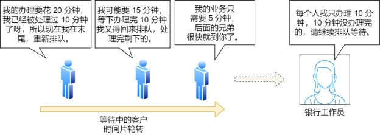

既然公平也可能存在问题，那银行就对客户分等级，分为普通客户、VIP 客户、SVIP 客户。只要高优先级的客户一来，就第一时间处理这个客户，这就是最高优先级（**HPF**）调度算法。但依然也会有极端的问题，万一当天来的全是高级客户，那普通客户不是没有被服务的机会，不把普通客户当人是吗？那我们把优先级改成动态的，如果客户办理业务时间增加，则降低其优先级，如果客户等待时间增加，则升高其优先级。


那有没有兼顾到公平和效率的方式呢？这里介绍一种算法，考虑的还算充分的，多级反馈队列（**MFQ**）调度算法，它是时间片轮转算法和优先级算法的综合和发展。它的工作方式：

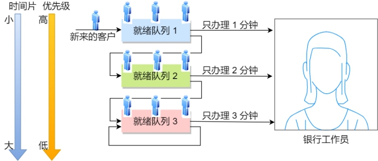

- 银行设置了多个排队（就绪）队列，每个队列都有不同的优先级，各个队列优先级从高到低，同时每个队列执行时间片的长度也不同，优先级越高的时间片越短。

- 新客户（进程）来了，先进入第一级队列的末尾，按先来先服务原则排队等待被叫号（运行）。如果时间片用完客户的业务还没办理完成，则让客户进入到下一级队列的末尾，以此类推，直至客户业务办理完成。

- 当第一级队列没人排队时，就会叫号二级队列的客户。如果客户办理业务过程中，有新的客户加入到较高优先级的队列，那么此时办理中的客户需要停止办理，回到原队列的末尾等待再次叫号，因为要把窗口让给刚进入较高优先级队列的客户。

可以发现，对于要办理短业务的客户来说，可以很快的轮到并解决。对于要办理长业务的客户，一下子解决不了，就可以放到下一个队列，虽然等待的时间稍微变长了，但是轮到自己的办理时间也变长了，也可以接受，不会造成极端的现象，可以说是综合上面几种算法的优点。


## 4.2 进程间通信

开场小故事


炎炎夏日，张三骑着单车去面试花了 1 小时，一路上汗流浃背。

结果面试过程只花了 5 分钟就结束了，面完的时候，天还是依然是亮的，还得在烈日下奔波 1 小时回去。

面试五分钟，骑车两小时。

你看，张三因面试没准备好，吹空调的时间只有 5 分钟，来回路上花了 2 小时晒太阳，你说惨不惨？

所以啊，炎炎夏日，为了能延长吹空调的时间，我们应该在面试前准备得更充分些，吹空调时间是要自己争取的。

很明显，在这一场面试中， 张三在进程间通信这一块没复习好，虽然列出了进程间通信的方式，但这只是表面功夫，应该需要进一步了解每种通信方式的优缺点及应用场景。

说真的，我们这次一起帮张三一起复习下，加深他对进程间通信的理解，好让他下次吹空调的时间能长一点。


每个进程的用户地址空间都是独立的，一般而言是不能互相访问的，但内核空间是每个进程都共享的，所以进程之间要通信必须通过内核。


Linux 内核提供了不少进程间通信的机制，我们来一起瞧瞧有哪些？


### 管道

如果你学过 Linux 命令，那你肯定很熟悉「|」这个竖线。

```sh
$ ps auxf | grep mysql
```

上面命令行里的「|」竖线就是一个管道，它的功能是将前一个命令（ps auxf）的输出，作为后一个命令（grep mysql）的输入，从这功能描述，可以看出管道传输数据是单向的，如果想相互通信，我们需要创建两个管道才行。

同时，我们得知上面这种管道是没有名字，所以「|」表示的管道称为匿名管道，用完了就销毁。

管道还有另外一个类型是命名管道，也被叫做 FIFO，因为数据是先进先出的传输方式。

在使用命名管道前，先需要通过 mkfifo命令来创建，并且指定管道名字：

```sh
$ mkfifo myPipe
```

myPipe 就是这个管道的名称，基于 Linux 一切皆文件的理念，所以管道也是以文件的方式存在，我们可以用 ls 看一下，这个文件的类型是 p，也就是 pipe（管道） 的意思：

```sh
$ ls -l
prw-r--r--. 1 root   root     0 Jul 17 02:45 myPipe
```

接下来，我们往 myPipe 这个管道写入数据：

```sh
$ echo "hello" > myPipe  // 将数据写进管道            // 停住了 ...
```

你操作了后，你会发现命令执行后就停在这了，这是因为管道里的内容没有被读取，只有当管道里的数据被读完后，命令才可以正常退出。

于是，我们执行另外一个命令来读取这个管道里的数据：

```sh
$ cat < myPipe  // 读取管道里的数据
hello
```

可以看到，管道里的内容被读取出来了，并打印在了终端上，另外一方面，echo 那个命令也正常退出了。

我们可以看出，管道这种通信方式效率低，不适合进程间频繁地交换数据。当然，它的好处，自然就是简单，同时也我们很容易得知管道里的数据已经被另一个进程读取了。

那管道如何创建呢，背后原理是什么？

匿名管道的创建，需要通过下面这个系统调用：

```c
intpipe(intfd[2])
```

这里表示创建一个匿名管道，并返回了两个描述符，一个是管道的读取端描述符 fd[0]，另一个是管道的写入端描述符 fd[1]。注意，这个匿名管道是特殊的文件，只存在于内存，不存于文件系统中。

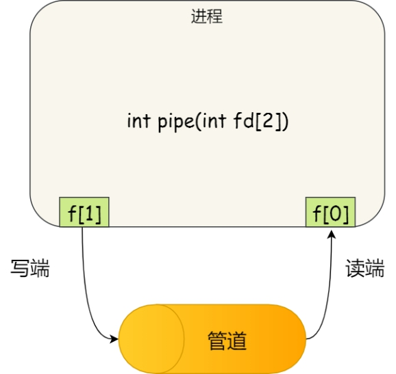

其实，所谓的管道，就是内核里面的一串缓存。从管道的一段写入的数据，实际上是缓存在内核中的，另一端读取，也就是从内核中读取这段数据。另外，管道传输的数据是无格式的流且大小受限。

看到这，你可能会有疑问了，这两个描述符都是在一个进程里面，并没有起到进程间通信的作用，怎么样才能使得管道是跨过两个进程的呢？

我们可以使用 fork创建子进程，创建的子进程会复制父进程的文件描述符，这样就做到了两个进程各有两个「 fd[0]与 fd[1]」，两个进程就可以通过各自的 fd 写入和读取同一个管道文件实现跨进程通信了。

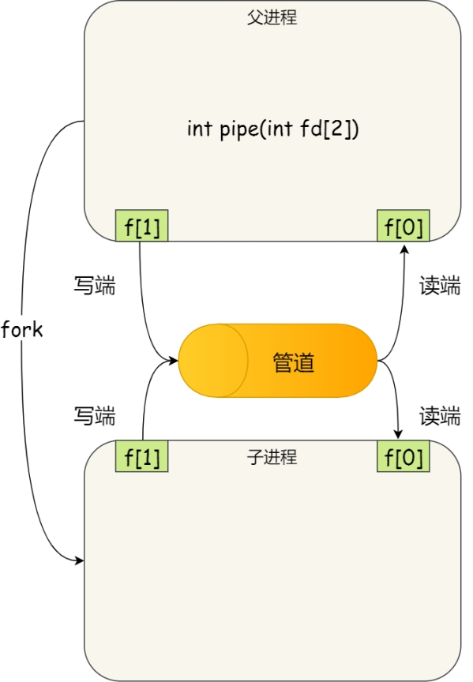

管道只能一端写入，另一端读出，所以上面这种模式容易造成混乱，因为父进程和子进程都可以同时写入，也都可以读出。那么，为了避免这种情况，通常的做法是：

- 父进程关闭读取的 fd[0]，只保留写入的 fd[1]；

- 子进程关闭写入的 fd[1]，只保留读取的 fd[0]；

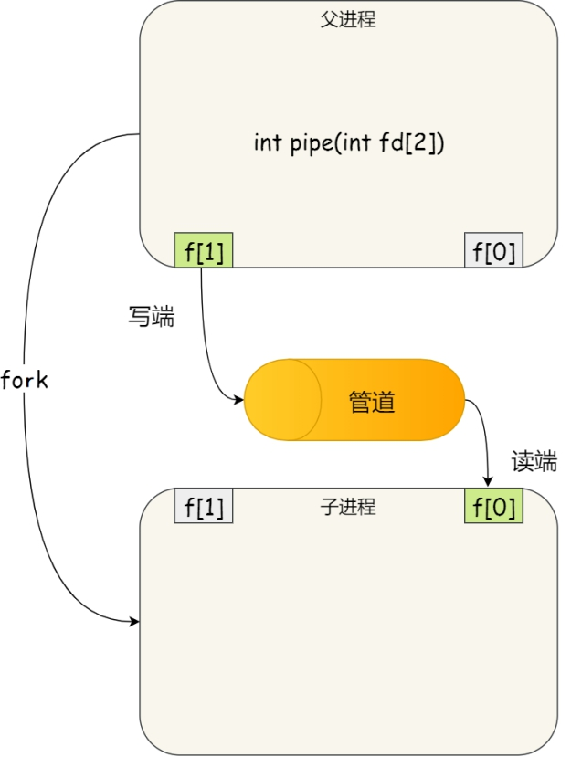

所以说如果需要双向通信，则应该创建两个管道。

到这里，我们仅仅解析了使用管道进行父进程与子进程之间的通信，但是在我们 shell 里面并不是这样的。

在 shell 里面执行 A | B命令的时候，A 进程和 B 进程都是 shell 创建出来的子进程，A 和 B 之间不存在父子关系，它俩的父进程都是 shell。

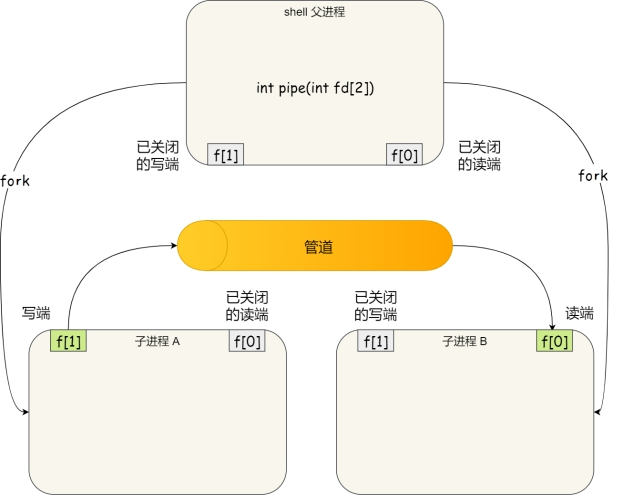

所以说，在 shell 里通过「|」匿名管道将多个命令连接在一起，实际上也就是创建了多个子进程，那么在我们编写 shell 脚本时，能使用一个管道搞定的事情，就不要多用一个管道，这样可以减少创建子进程的系统开销。

我们可以得知，对于匿名管道，它的通信范围是存在父子关系的进程。因为管道没有实体，也就是没有管道文件，只能通过 fork 来复制父进程 fd 文件描述符，来达到通信的目的。

另外，对于命名管道，它可以在不相关的进程间也能相互通信。因为命令管道，提前创建了一个类型为管道的设备文件，在进程里只要使用这个设备文件，就可以相互通信。

不管是匿名管道还是命名管道，进程写入的数据都是缓存在内核中，另一个进程读取数据时候自然也是从内核中获取，同时通信数据都遵循先进先出原则，不支持 lseek 之类的文件定位操作。


### 消息队列

前面说到管道的通信方式是效率低的，因此管道不适合进程间频繁地交换数据。

对于这个问题，消息队列的通信模式就可以解决。比如，A 进程要给 B 进程发送消息，A 进程把数据放在对应的消息队列后就可以正常返回了，B 进程需要的时候再去读取数据就可以了。同理，B 进程要给 A 进程发送消息也是如此。

再来，消息队列是保存在内核中的消息链表，在发送数据时，会分成一个一个独立的数据单元，也就是消息体（数据块），消息体是用户自定义的数据类型，消息的发送方和接收方要约定好消息体的数据类型，所以每个消息体都是固定大小的存储块，不像管道是无格式的字节流数据。如果进程从消息队列中读取了消息体，内核就会把这个消息体删除。

消息队列生命周期随内核，如果没有释放消息队列或者没有关闭操作系统，消息队列会一直存在，而前面提到的匿名管道的生命周期，是随进程的创建而建立，随进程的结束而销毁。

消息这种模型，两个进程之间的通信就像平时发邮件一样，你来一封，我回一封，可以频繁沟通了。

但邮件的通信方式存在不足的地方有两点，一是通信不及时，二是附件也有大小限制，这同样也是消息队列通信不足的点。

消息队列不适合比较大数据的传输，因为在内核中每个消息体都有一个最大长度的限制，同时所有队列所包含的全部消息体的总长度也是有上限。在 Linux 内核中，会有两个宏定义 MSGMAX和 MSGMNB，它们以字节为单位，分别定义了一条消息的最大长度和一个队列的最大长度。

消息队列通信过程中，存在用户态与内核态之间的数据拷贝开销，因为进程写入数据到内核中的消息队列时，会发生从用户态拷贝数据到内核态的过程，同理另一进程读取内核中的消息数据时，会发生从内核态拷贝数据到用户态的过程。


### 共享内存

消息队列的读取和写入的过程，都会有发生用户态与内核态之间的消息拷贝过程。那共享内存的方式，就很好的解决了这一问题。

现代操作系统，对于内存管理，采用的是虚拟内存技术，也就是每个进程都有自己独立的虚拟内存空间，不同进程的虚拟内存映射到不同的物理内存中。所以，即使进程 A 和 进程 B 的虚拟地址是一样的，其实访问的是不同的物理内存地址，对于数据的增删查改互不影响。

共享内存的机制，就是拿出一块虚拟地址空间来，映射到相同的物理内存中。这样这个进程写入的东西，另外一个进程马上就能看到了，都不需要拷贝来拷贝去，传来传去，大大提高了进程间通信的速度。

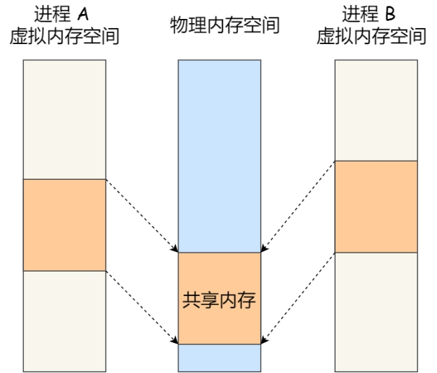


### 信号量

用了共享内存通信方式，带来新的问题，那就是如果多个进程同时修改同一个共享内存，很有可能就冲突了。例如两个进程都同时写一个地址，那先写的那个进程会发现内容被别人覆盖了。

为了防止多进程竞争共享资源，而造成的数据错乱，所以需要保护机制，使得共享的资源，在任意时刻只能被一个进程访问。正好，信号量就实现了这一保护机制。

信号量其实是一个整型的计数器，主要用于实现进程间的互斥与同步，而不是用于缓存进程间通信的数据。

信号量表示资源的数量，控制信号量的方式有两种原子操作：

- 一个是 P 操作，这个操作会把信号量减去 1，相减后如果信号量 < 0，则表明资源已被占用，进程需阻塞等待；相减后如果信号量 >= 0，则表明还有资源可使用，进程可正常继续执行。

- 另一个是 V 操作，这个操作会把信号量加上 1，相加后如果信号量 <= 0，则表明当前有阻塞中的进程，于是会将该进程唤醒运行；相加后如果信号量 > 0，则表明当前没有阻塞中的进程；

P 操作是用在进入共享资源之前，V 操作是用在离开共享资源之后，这两个操作是必须成对出现的。

接下来，举个例子，如果要使得两个进程互斥访问共享内存，我们可以初始化信号量为 1。

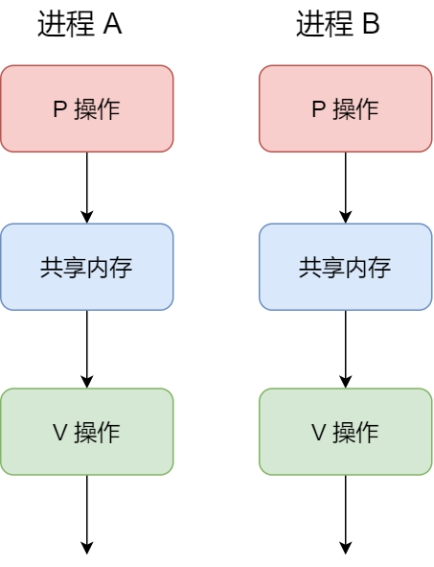

具体的过程如下：

- 进程 A 在访问共享内存前，先执行了 P 操作，由于信号量的初始值为 1，故在进程 A 执行 P 操作后信号量变为 0，表示共享资源可用，于是进程 A 就可以访问共享内存。

- 若此时，进程 B 也想访问共享内存，执行了 P 操作，结果信号量变为了 -1，这就意味着临界资源已被占用，因此进程 B 被阻塞。

- 直到进程 A 访问完共享内存，才会执行 V 操作，使得信号量恢复为 0，接着就会唤醒阻塞中的线程 B，使得进程 B 可以访问共享内存，最后完成共享内存的访问后，执行 V 操作，使信号量恢复到初始值 1。

可以发现，信号初始化为 1，就代表着是互斥信号量，它可以保证共享内存在任何时刻只有一个进程在访问，这就很好的保护了共享内存。

另外，在多进程里，每个进程并不一定是顺序执行的，它们基本是以各自独立的、不可预知的速度向前推进，但有时候我们又希望多个进程能密切合作，以实现一个共同的任务。

例如，进程 A 是负责生产数据，而进程 B 是负责读取数据，这两个进程是相互合作、相互依赖的，进程 A 必须先生产了数据，进程 B 才能读取到数据，所以执行是有前后顺序的。

那么这时候，就可以用信号量来实现多进程同步的方式，我们可以初始化信号量为 0。

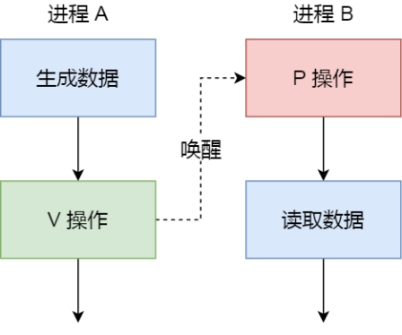

具体过程：

- 如果进程 B 比进程 A 先执行了，那么执行到 P 操作时，由于信号量初始值为 0，故信号量会变为 -1，表示进程 A 还没生产数据，于是进程 B 就阻塞等待；

- 接着，当进程 A 生产完数据后，执行了 V 操作，就会使得信号量变为 0，于是就会唤醒阻塞在 P 操作的进程 B；

- 最后，进程 B 被唤醒后，意味着进程 A 已经生产了数据，于是进程 B 就可以正常读取数据了。

可以发现，信号初始化为 0，就代表着是同步信号量，它可以保证进程 A 应在进程 B 之前执行。


### 信号

上面说的进程间通信，都是常规状态下的工作模式。对于异常情况下的工作模式，就需要用「信号」的方式来通知进程。

信号跟信号量虽然名字相似度 66.66%，但两者用途完全不一样，就好像 Java 和 JavaScript 的区别。

在 Linux 操作系统中， 为了响应各种各样的事件，提供了几十种信号，分别代表不同的意义。我们可以通过 kill -l命令，查看所有的信号：

```sh
$ kill -l1) SIGHUP    2) SIGINT    3) SIGQUIT    4) SIGILL    5) SIGTRAP6) SIGABRT    7) SIGBUS    8) SIGFPE    9) SIGKILL   10) SIGUSR1
11) SIGSEGV   12) SIGUSR2   13) SIGPIPE   14) SIGALRM   15) SIGTERM
16) SIGSTKFLT  17) SIGCHLD   18) SIGCONT   19) SIGSTOP   20) SIGTSTP
21) SIGTTIN   22) SIGTTOU   23) SIGURG    24) SIGXCPU   25) SIGXFSZ
26) SIGVTALRM  27) SIGPROF   28) SIGWINCH   29) SIGIO    30) SIGPWR
31) SIGSYS    34) SIGRTMIN   35) SIGRTMIN+1  36) SIGRTMIN+2  37) SIGRTMIN+3
38) SIGRTMIN+4  39) SIGRTMIN+5  40) SIGRTMIN+6  41) SIGRTMIN+7  42) SIGRTMIN+8
43) SIGRTMIN+9  44) SIGRTMIN+10 45) SIGRTMIN+11 46) SIGRTMIN+12 47) SIGRTMIN+13
48) SIGRTMIN+14 49) SIGRTMIN+15 50) SIGRTMAX-14 51) SIGRTMAX-13 52) SIGRTMAX-12
53) SIGRTMAX-11 54) SIGRTMAX-10 55) SIGRTMAX-9  56) SIGRTMAX-8  57) SIGRTMAX-7
58) SIGRTMAX-6  59) SIGRTMAX-5  60) SIGRTMAX-4  61) SIGRTMAX-3  62) SIGRTMAX-2
63) SIGRTMAX-1  64) SIGRTMAX
```

运行在 shell 终端的进程，我们可以通过键盘输入某些组合键的时候，给进程发送信号。例如

- Ctrl+C 产生 SIGINT信号，表示终止该进程；

- Ctrl+Z 产生 SIGTSTP信号，表示停止该进程，但还未结束；

如果进程在后台运行，可以通过 kill命令的方式给进程发送信号，但前提需要知道运行中的进程 PID 号，例如：`kill -9 1050`，表示给 PID 为 1050 的进程发送 SIGKILL信号，用来立即结束该进程；

所以，信号事件的来源主要有硬件来源（如键盘 Cltr+C ）和软件来源（如 kill 命令）。

信号是进程间通信机制中唯一的异步通信机制，因为可以在任何时候发送信号给某一进程，一旦有信号产生，我们就有下面这几种，用户进程对信号的处理方式。

1.执行默认操作。Linux 对每种信号都规定了默认操作，例如，上面列表中的 SIGTERM 信号，就是终止进程的意思。

2.捕捉信号。我们可以为信号定义一个信号处理函数。当信号发生时，我们就执行相应的信号处理函数。

3.忽略信号。当我们不希望处理某些信号的时候，就可以忽略该信号，不做任何处理。有两个信号是应用进程无法捕捉和忽略的，即 SIGKILL和 SEGSTOP，它们用于在任何时候中断或结束某一进程。


### Socket

前面提到的管道、消息队列、共享内存、信号量和信号都是在同一台主机上进行进程间通信，那要想跨网络与不同主机上的进程之间通信，就需要 Socket 通信了。

实际上，Socket 通信不仅可以跨网络与不同主机的进程间通信，还可以在同主机上进程间通信。

我们来看看创建 socket 的系统调用：

```sh
intsocket(intdomain,inttype,intprotocal)
```

三个参数分别代表：

- domain 参数用来指定协议族，比如 AF**INET 用于 IPV4、AF**INET6 用于 IPV6、AF**LOCAL/AF**UNIX 用于本机；

- type 参数用来指定通信特性，比如 SOCK**STREAM 表示的是字节流，对应 TCP、SOCK**DGRAM 表示的是数据报，对应 UDP、SOCK_RAW 表示的是原始套接字；

- protocal 参数原本是用来指定通信协议的，但现在基本废弃。因为协议已经通过前面两个参数指定完成，protocol 目前一般写成 0 即可；

根据创建 socket 类型的不同，通信的方式也就不同：

- 实现 TCP 字节流通信： socket 类型是 AF**INET 和 SOCK**STREAM；

- 实现 UDP 数据报通信：socket 类型是 AF**INET 和 SOCK**DGRAM；

- 实现本地进程间通信： 「本地字节流 socket 」类型是 AF**LOCAL 和 SOCK**STREAM，「本地数据报 socket 」类型是 AF**LOCAL 和 SOCK**DGRAM。另外，AF**UNIX 和 AF**LOCAL 是等价的，所以 AF_UNIX 也属于本地 socket；

接下来，简单说一下这三种通信的编程模式。

针对 TCP 协议通信的 socket 编程模型

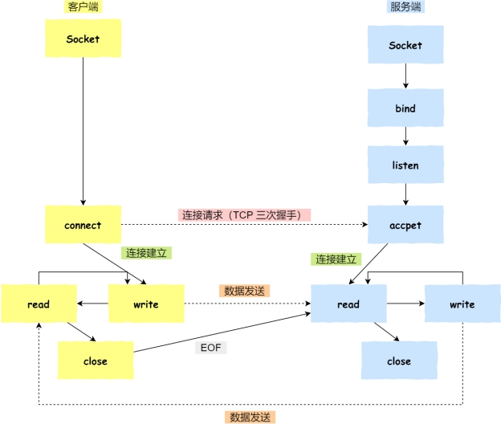

- 服务端和客户端初始化 socket，得到文件描述符；

- 服务端调用 bind，将绑定在 IP 地址和端口;

- 服务端调用 listen，进行监听；

- 服务端调用 accept，等待客户端连接；

- 客户端调用 connect，向服务器端的地址和端口发起连接请求；

- 服务端 accept返回用于传输的 socket 的文件描述符；

- 客户端调用 write写入数据；服务端调用 read 读取数据；

- 客户端断开连接时，会调用 close，那么服务端 read读取数据的时候，就会读取到了 EOF，待处理完数据后，服务端调用 close，表示连接关闭。

这里需要注意的是，服务端调用 accept时，连接成功了会返回一个已完成连接的 socket，后续用来传输数据。

所以，监听的 socket 和真正用来传送数据的 socket，是「两个」 socket，一个叫作监听 socket，一个叫作已完成连接 socket。

成功连接建立之后，双方开始通过 read 和 write 函数来读写数据，就像往一个文件流里面写东西一样。

针对 UDP 协议通信的 socket 编程模型


UDP 是没有连接的，所以不需要三次握手，也就不需要像 TCP 调用 listen 和 connect，但是 UDP 的交互仍然需要 IP 地址和端口号，因此也需要 bind。

对于 UDP 来说，不需要要维护连接，那么也就没有所谓的发送方和接收方，甚至都不存在客户端和服务端的概念，只要有一个 socket 多台机器就可以任意通信，因此每一个 UDP 的 socket 都需要 bind。

另外，每次通信时，调用 sendto 和 recvfrom，都要传入目标主机的 IP 地址和端口。

针对本地进程间通信的 socket 编程模型

本地 socket 被用于在同一台主机上进程间通信的场景：

- 本地 socket 的编程接口和 IPv4 、IPv6 套接字编程接口是一致的，可以支持「字节流」和「数据报」两种协议；

- 本地 socket 的实现效率大大高于 IPv4 和 IPv6 的字节流、数据报 socket 实现；

对于本地字节流 socket，其 socket 类型是 AF**LOCAL 和 SOCK**STREAM。

对于本地数据报 socket，其 socket 类型是 AF**LOCAL 和 SOCK**DGRAM。

本地字节流 socket 和 本地数据报 socket 在 bind 的时候，不像 TCP 和 UDP 要绑定 IP 地址和端口，而是绑定一个本地文件，这也就是它们之间的最大区别。


### 总结

由于每个进程的用户空间都是独立的，不能相互访问，这时就需要借助内核空间来实现进程间通信，原因很简单，每个进程都是共享一个内核空间。

Linux 内核提供了不少进程间通信的方式，其中最简单的方式就是管道，管道分为「匿名管道」和「命名管道」。

匿名管道顾名思义，它没有名字标识，匿名管道是特殊文件只存在于内存，没有存在于文件系统中，shell 命令中的「|」竖线就是匿名管道，通信的数据是无格式的流并且大小受限，通信的方式是单向的，数据只能在一个方向上流动，如果要双向通信，需要创建两个管道，再来匿名管道是只能用于存在父子关系的进程间通信，匿名管道的生命周期随着进程创建而建立，随着进程终止而消失。

命名管道突破了匿名管道只能在亲缘关系进程间的通信限制，因为使用命名管道的前提，需要在文件系统创建一个类型为 p 的设备文件，那么毫无关系的进程就可以通过这个设备文件进行通信。另外，不管是匿名管道还是命名管道，进程写入的数据都是缓存在内核中，另一个进程读取数据时候自然也是从内核中获取，同时通信数据都遵循先进先出原则，不支持 lseek 之类的文件定位操作。

消息队列克服了管道通信的数据是无格式的字节流的问题，消息队列实际上是保存在内核的「消息链表」，消息队列的消息体是可以用户自定义的数据类型，发送数据时，会被分成一个一个独立的消息体，当然接收数据时，也要与发送方发送的消息体的数据类型保持一致，这样才能保证读取的数据是正确的。消息队列通信的速度不是最及时的，毕竟每次数据的写入和读取都需要经过用户态与内核态之间的拷贝过程。

共享内存可以解决消息队列通信中用户态与内核态之间数据拷贝过程带来的开销，它直接分配一个共享空间，每个进程都可以直接访问，就像访问进程自己的空间一样快捷方便，不需要陷入内核态或者系统调用，大大提高了通信的速度，享有最快的进程间通信方式之名。但是便捷高效的共享内存通信，带来新的问题，多进程竞争同个共享资源会造成数据的错乱。

那么，就需要信号量来保护共享资源，以确保任何时刻只能有一个进程访问共享资源，这种方式就是互斥访问。信号量不仅可以实现访问的互斥性，还可以实现进程间的同步，信号量其实是一个计数器，表示的是资源个数，其值可以通过两个原子操作来控制，分别是 P 操作和 V 操作。

与信号量名字很相似的叫信号，它俩名字虽然相似，但功能一点儿都不一样。信号是进程间通信机制中唯一的异步通信机制，信号可以在应用进程和内核之间直接交互，内核也可以利用信号来通知用户空间的进程发生了哪些系统事件，信号事件的来源主要有硬件来源（如键盘 Cltr+C ）和软件来源（如 kill 命令），一旦有信号发生，进程有三种方式响应信号 1. 执行默认操作、2. 捕捉信号、3. 忽略信号。有两个信号是应用进程无法捕捉和忽略的，即 SIGKILL和 SEGSTOP，这是为了方便我们能在任何时候结束或停止某个进程。

前面说到的通信机制，都是工作于同一台主机，如果要与不同主机的进程间通信，那么就需要 Socket 通信了。Socket 实际上不仅用于不同的主机进程间通信，还可以用于本地主机进程间通信，可根据创建 Socket 的类型不同，分为三种常见的通信方式，一个是基于 TCP 协议的通信方式，一个是基于 UDP 协议的通信方式，一个是本地进程间通信方式。

以上，就是进程间通信的主要机制了。你可能会问了，那线程通信间的方式呢？

同个进程下的线程之间都是共享进程的资源，只要是共享变量都可以做到线程间通信，比如全局变量，所以对于线程间关注的不是通信方式，而是关注多线程竞争共享资源的问题，信号量也同样可以在线程间实现互斥与同步：

- 互斥的方式，可保证任意时刻只有一个线程访问共享资源；

- 同步的方式，可保证线程 A 应在线程 B 之前执行；

好了，今日帮张三同学复习就到这了，希望张三同学早日收到心意的 offer，给夏天划上充满汗水的句号。


## 4.3 多线程同步

先来看看虚构的小故事

已经晚上 11 点了，程序员小明的双手还在键盘上飞舞着，眼神依然注视着的电脑屏幕。

没办法这段时间公司业绩增长中，需求自然也多了起来，加班自然也少不了。

天气变化莫测，这时窗外下起了蓬勃大雨，同时闪电轰鸣。

但这一丝都没有影响到小明，始料未及，突然一道巨大的雷一闪而过，办公楼就这么停电了，随后整栋楼都在回荡着的小明那一声撕心裂肺的「卧槽」。

此时，求小明的心里面积有多大？

等小明心里平复后，突然肚子非常的痛，想上厕所，小明心想肯定是晚上吃的某堡王有问题。

整栋楼都停了电，小明两眼一抹黑，啥都看不见，只能靠摸墙的方法，一步一步的来到了厕所门口。

到了厕所（共享资源），由于实在太急，小明直接冲入了厕所里，用手摸索着刚好第一个门没锁门，便夺门而入。

这就荒唐了，这个门里面正好小红在上着厕所，正好这个厕所门是坏了的，没办法锁门。

黑暗中，小红虽然看不见，但靠着声音，发现自己面前的这扇门有动静，觉得不对劲，于是铆足了力气，用她穿着高跟鞋脚，用力地一脚踢了过去。

小明很幸运，被踢中了「命根子」，撕心裂肺地喊出了一个字「痛」！

故事说完了，扯了那么多，实际上是为了说明，对于共享资源，如果没有上锁，在多线程的环境里，那么就可能会发生翻车现场。

接下来，用 30+张图，带大家走进操作系统中避免多线程资源竞争的互斥、同步的方法。

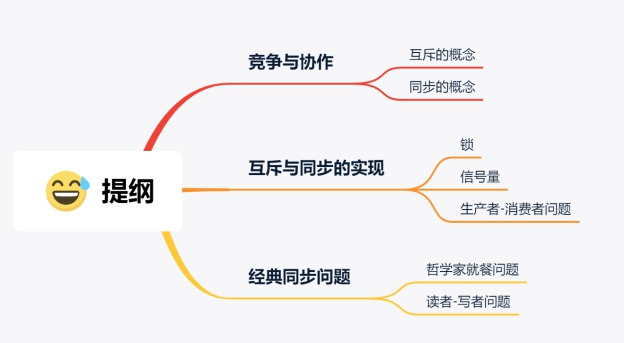


### 竞争与协作

在单核 CPU 系统里，为了实现多个程序同时运行的假象，操作系统通常以时间片调度的方式，让每个进程执行每次执行一个时间片，时间片用完了，就切换下一个进程运行，由于这个时间片的时间很短，于是就造成了「并发」的现象。

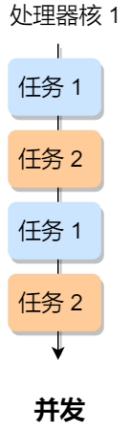

另外，操作系统也为每个进程创建巨大、私有的虚拟内存的假象，这种地址空间的抽象让每个程序好像拥有自己的内存，而实际上操作系统在背后秘密地让多个地址空间「复用」物理内存或者磁盘。


如果一个程序只有一个执行流程，也代表它是单线程的。当然一个程序可以有多个执行流程，也就是所谓的多线程程序，线程是调度的基本单位，进程则是资源分配的基本单位。

所以，线程之间是可以共享进程的资源，比如代码段、堆空间、数据段、打开的文件等资源，但每个线程都有自己独立的栈空间。


那么问题就来了，多个线程如果竞争共享资源，如果不采取有效的措施，则会造成共享数据的混乱。

我们做个小实验，创建两个线程，它们分别对共享变量 i自增 1执行 10000次，如下代码（虽然说是 C++ 代码，但是没学过 C++ 的同学也是看到懂的）：

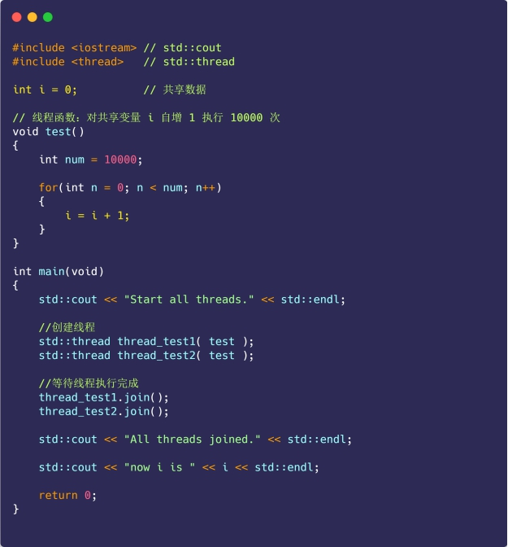

按理来说，i变量最后的值应该是 20000，但很不幸，并不是如此。我们对上面的程序执行一下：

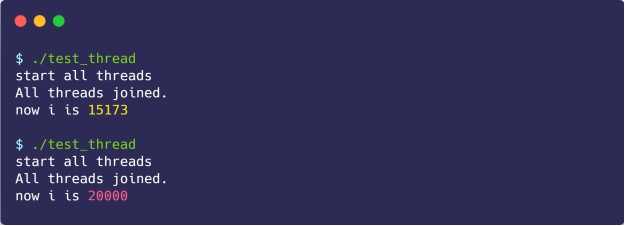

运行了两次，发现出现了 i值的结果是 15173，也会出现 20000的 i 值结果。

每次运行不但会产生错误，而且得到不同的结果。在计算机里是不能容忍的，虽然是小概率出现的错误，但是小概率事件它一定是会发生的，「墨菲定律」大家都懂吧。

为什么会发生这种情况？

为了理解为什么会发生这种情况，我们必须了解编译器为更新计数器 i变量生成的代码序列，也就是要了解汇编指令的执行顺序。

在这个例子中，我们只是想给 i加上数字 1，那么它对应的汇编指令执行过程是这样的：

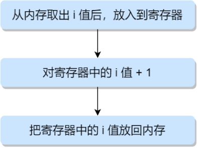

可以发现，只是单纯给 i加上数字 1，在 CPU 运行的时候，实际上要执行 3条指令。

设想我们的线程 1 进入这个代码区域，它将 i 的值（假设此时是 50 ）从内存加载到它的寄存器中，然后它向寄存器加 1，此时在寄存器中的 i 值是 51。

现在，一件不幸的事情发生了：时钟中断发生。因此，操作系统将当前正在运行的线程的状态保存到线程的线程控制块 TCB。

现在更糟的事情发生了，线程 2 被调度运行，并进入同一段代码。它也执行了第一条指令，从内存获取 i 值并将其放入到寄存器中，此时内存中 i 的值仍为 50，因此线程 2 寄存器中的 i 值也是 50。假设线程 2 执行接下来的两条指令，将寄存器中的 i 值 + 1，然后将寄存器中的 i 值保存到内存中，于是此时全局变量 i 值是 51。

最后，又发生一次上下文切换，线程 1 恢复执行。还记得它已经执行了两条汇编指令，现在准备执行最后一条指令。回忆一下， 线程 1 寄存器中的 i 值是51，因此，执行最后一条指令后，将值保存到内存，全局变量 i 的值再次被设置为 51。

简单来说，增加 i （值为 50 ）的代码被运行两次，按理来说，最后的 i 值应该是 52，但是由于不可控的调度，导致最后 i 值却是 51。

针对上面线程 1 和线程 2 的执行过程，我画了一张流程图，会更明确一些：

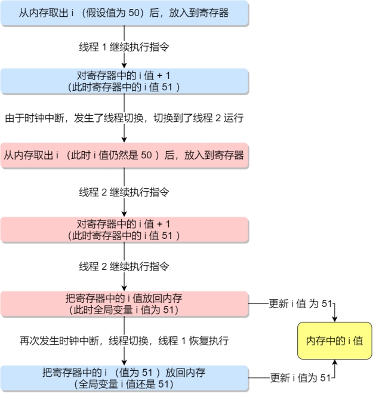

#### 互斥的概念

上面展示的情况称为竞争条件（**race condition**），当多线程相互竞争操作共享变量时，由于运气不好，即在执行过程中发生了上下文切换，我们得到了错误的结果，事实上，每次运行都可能得到不同的结果，因此输出的结果存在不确定性（**indeterminate**）。

由于多线程执行操作共享变量的这段代码可能会导致竞争状态，因此我们将此段代码称为临界区（**critical section**），它是访问共享资源的代码片段，一定不能给多线程同时执行。

我们希望这段代码是互斥（**mutualexclusion**）的，也就说保证一个线程在临界区执行时，其他线程应该被阻止进入临界区，说白了，就是这段代码执行过程中，最多只能出现一个线程。

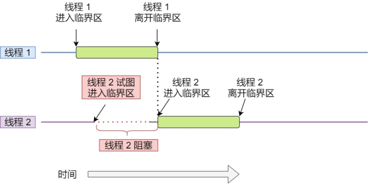

另外，说一下互斥也并不是只针对多线程。在多进程竞争共享资源的时候，也同样是可以使用互斥的方式来避免资源竞争造成的资源混乱。


#### 同步的概念

互斥解决了并发进程/线程对临界区的使用问题。这种基于临界区控制的交互作用是比较简单的，只要一个进程/线程进入了临界区，其他试图想进入临界区的进程/线程都会被阻塞着，直到第一个进程/线程离开了临界区。

我们都知道在多线程里，每个线程并不一定是顺序执行的，它们基本是以各自独立的、不可预知的速度向前推进，但有时候我们又希望多个线程能密切合作，以实现一个共同的任务。

例子，线程 1 是负责读入数据的，而线程 2 是负责处理数据的，这两个线程是相互合作、相互依赖的。线程 2 在没有收到线程 1 的唤醒通知时，就会一直阻塞等待，当线程 1 读完数据需要把数据传给线程 2 时，线程 1 会唤醒线程 2，并把数据交给线程 2 处理。

所谓同步，就是并发进程/线程在一些关键点上可能需要互相等待与互通消息，这种相互制约的等待与互通信息称为进程/线程同步。

举个生活的同步例子，你肚子饿了想要吃饭，你叫妈妈早点做菜，妈妈听到后就开始做菜，但是在妈妈没有做完饭之前，你必须阻塞等待，等妈妈做完饭后，自然会通知你，接着你吃饭的事情就可以进行了。

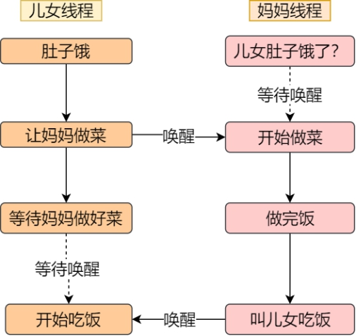

注意，同步与互斥是两种不同的概念：

- 同步就好比：「操作 A 应在操作 B 之前执行」，「操作 C 必须在操作 A 和操作 B 都完成之后才能执行」等；

- 互斥就好比：「操作 A 和操作 B 不能在同一时刻执行」；


### 互斥与同步的实现和使用

在进程/线程并发执行的过程中，进程/线程之间存在协作的关系，例如有互斥、同步的关系。

为了实现进程/线程间正确的协作，操作系统必须提供实现进程协作的措施和方法，主要的方法有两种：

- **锁**：加锁、解锁操作；

- **信号量**：P、V 操作；

这两个都可以方便地实现进程/线程互斥，而信号量比锁的功能更强一些，它还可以方便地实现进程/线程同步。


#### 锁

使用加锁操作和解锁操作可以解决并发线程/进程的互斥问题。

任何想进入临界区的线程，必须先执行加锁操作。若加锁操作顺利通过，则线程可进入临界区；在完成对临界资源的访问后再执行解锁操作，以释放该临界资源。

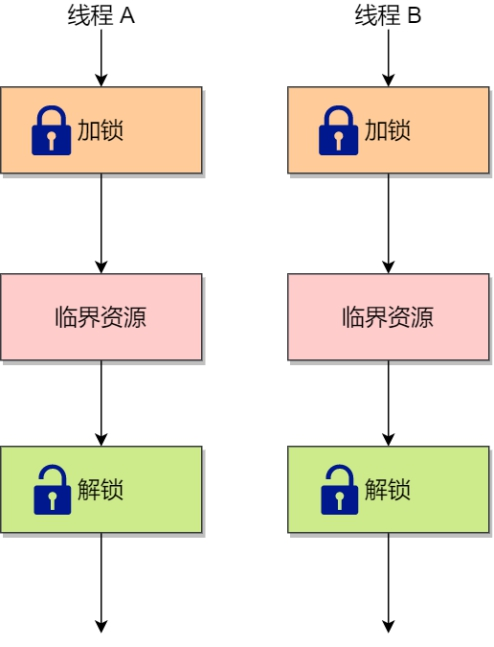

根据锁的实现不同，可以分为「忙等待锁」和「无忙等待锁」。

我们先来看看「忙等待锁」的实现

在说明「忙等待锁」的实现之前，先介绍现代 CPU 体系结构提供的特殊原子操作指令 —— 测试和置位（**Test-and-Set**）指令。

如果用 C 代码表示 Test-and-Set 指令，形式如下：

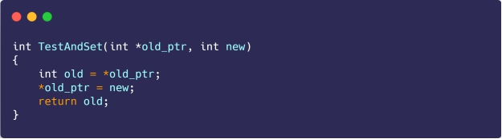

测试并设置指令做了下述事情:

- 把 old_ptr更新为 new 的新值

- 返回 old_ptr的旧值；

当然，关键是这些代码是原子执行。因为既可以测试旧值，又可以设置新值，所以我们把这条指令叫作「测试并设置」。

那什么是原子操作呢？原子操作就是要么全部执行，要么都不执行，不能出现执行到一半的中间状态

我们可以运用 Test-and-Set 指令来实现「忙等待锁」，代码如下：

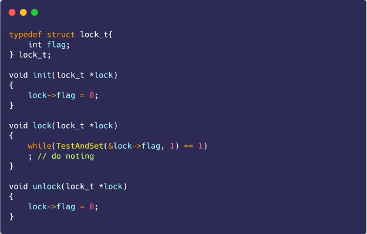

我们来确保理解为什么这个锁能工作：

- 第一个场景是，首先假设一个线程在运行，调用 lock()，没有其他线程持有锁，所以 flag是 0。当调用 TestAndSet(flag, 1)方法，返回 0，线程会跳出 while 循环，获取锁。同时也会原子的设置 flag 为1，标志锁已经被持有。当线程离开临界区，调用 unlock()将 flag清理为 0。

- 第二种场景是，当某一个线程已经持有锁（即 flag为1）。本线程调用 lock() ，然后调用 TestAndSet(flag, 1) ，这一次返回 1。只要另一个线程一直持有锁，TestAndSet() 会重复返回 1，本线程会一直忙等。当 flag 终于被改为 0，本线程会调用 TestAndSet() ，返回 0 并且原子地设置为 1，从而获得锁，进入临界区。

很明显，当获取不到锁时，线程就会一直 wile 循环，不做任何事情，所以就被称为「忙等待锁」，也被称为自旋锁（**spin lock**）。

这是最简单的一种锁，一直自旋，利用 CPU 周期，直到锁可用。在单处理器上，需要抢占式的调度器（即不断通过时钟中断一个线程，运行其他线程）。否则，自旋锁在单 CPU 上无法使用，因为一个自旋的线程永远不会放弃 CPU。


再来看看「无等待锁」的实现

无等待锁顾明思议就是获取不到锁的时候，不用自旋。

既然不想自旋，那当没获取到锁的时候，就把当前线程放入到锁的等待队列，然后执行调度程序，把 CPU 让给其他线程执行。

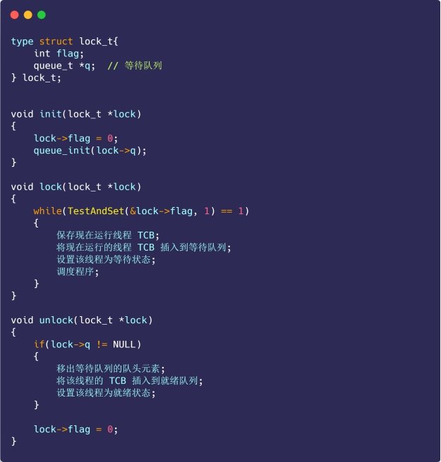

本次只是提出了两种简单锁的实现方式。当然，在具体操作系统实现中，会更复杂，但也离不开本例子两个基本元素。

如果你想要对锁的更进一步理解，推荐大家可以看《操作系统导论》第 28 章锁的内容，这本书在「微信读书」就可以免费看。


#### 信号量

信号量是操作系统提供的一种协调共享资源访问的方法。

通常信号量表示资源的数量，对应的变量是一个整型（sem）变量。

另外，还有两个原子操作的系统调用函数来控制信号量的，分别是：

- **P 操作**：将 sem减 1，相减后，如果 sem < 0，则进程/线程进入阻塞等待，否则继续，表明 P 操作可能会阻塞；

- **V 操作**：将 sem加 1，相加后，如果 sem <= 0，唤醒一个等待中的进程/线程，表明 V 操作不会阻塞；

P 操作是用在进入临界区之前，V 操作是用在离开临界区之后，这两个操作是必须成对出现的。

举个类比，2 个资源的信号量，相当于 2 条火车轨道，PV 操作如下图过程：

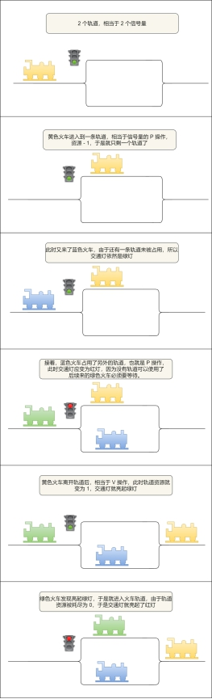

操作系统是如何实现 PV 操作的呢？

信号量数据结构与 PV 操作的算法描述如下图：

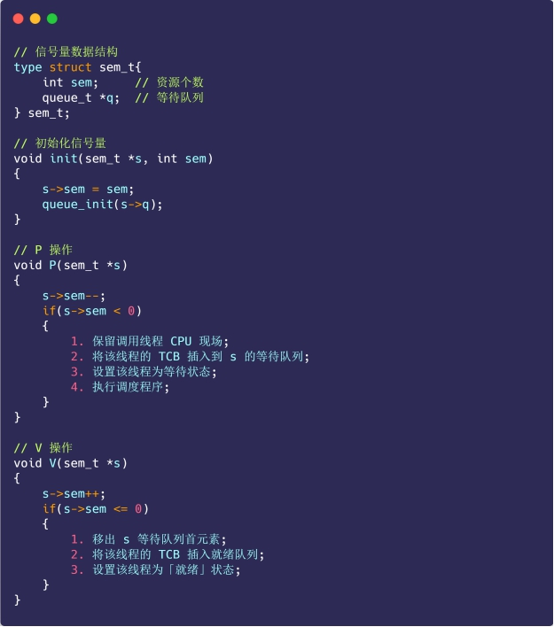

PV 操作的函数是由操作系统管理和实现的，所以操作系统已经使得执行 PV 函数时是具有原子性的。

PV 操作如何使用的呢？

信号量不仅可以实现临界区的互斥访问控制，还可以线程间的事件同步。

我们先来说说如何使用信号量实现临界区的互斥访问。

为每类共享资源设置一个信号量 s，其初值为 1，表示该临界资源未被占用。

只要把进入临界区的操作置于 P(s)和 V(s)之间，即可实现进程/线程互斥：

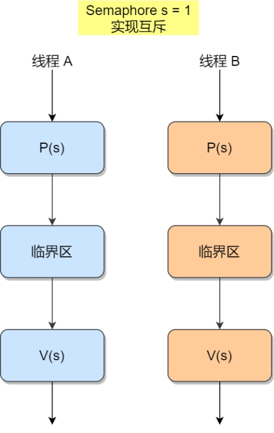

此时，任何想进入临界区的线程，必先在互斥信号量上执行 P 操作，在完成对临界资源的访问后再执行 V 操作。由于互斥信号量的初始值为 1，故在第一个线程执行 P 操作后 s 值变为 0，表示临界资源为空闲，可分配给该线程，使之进入临界区。

若此时又有第二个线程想进入临界区，也应先执行 P 操作，结果使 s 变为负值，这就意味着临界资源已被占用，因此，第二个线程被阻塞。

并且，直到第一个线程执行 V 操作，释放临界资源而恢复 s 值为 0 后，才唤醒第二个线程，使之进入临界区，待它完成临界资源的访问后，又执行 V 操作，使 s 恢复到初始值 1。

对于两个并发线程，互斥信号量的值仅取 1、0 和 -1 三个值，分别表示：

- 如果互斥信号量为 1，表示没有线程进入临界区；

- 如果互斥信号量为 0，表示有一个线程进入临界区；

- 如果互斥信号量为 -1，表示一个线程进入临界区，另一个线程等待进入。

通过互斥信号量的方式，就能保证临界区任何时刻只有一个线程在执行，就达到了互斥的效果。

再来，我们说说如何使用信号量实现事件同步。

同步的方式是设置一个信号量，其初值为 0。

我们把前面的「吃饭-做饭」同步的例子，用代码的方式实现一下：

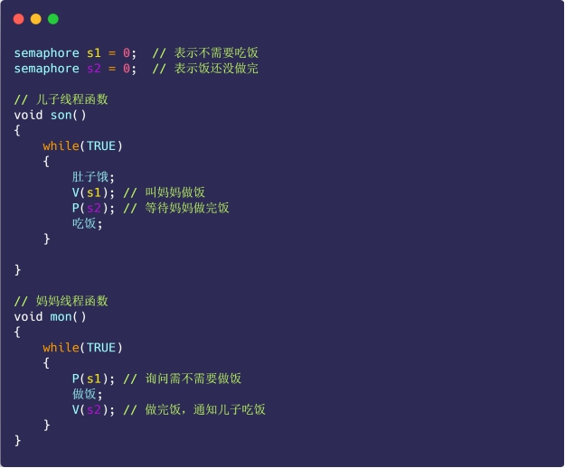

妈妈一开始询问儿子要不要做饭时，执行的是 P(s1)，相当于询问儿子需不需要吃饭，由于 s1初始值为 0，此时 s1变成 -1，表明儿子不需要吃饭，所以妈妈线程就进入等待状态。

当儿子肚子饿时，执行了 V(s1)，使得 s1信号量从 -1 变成 0，表明此时儿子需要吃饭了，于是就唤醒了阻塞中的妈妈线程，妈妈线程就开始做饭。

接着，儿子线程执行了 P(s2)，相当于询问妈妈饭做完了吗，由于 s2初始值是 0，则此时 s2变成 -1，说明妈妈还没做完饭，儿子线程就等待状态。

最后，妈妈终于做完饭了，于是执行 V(s2)，s2信号量从 -1 变回了 0，于是就唤醒等待中的儿子线程，唤醒后，儿子线程就可以进行吃饭了。


#### 生产者-消费者问题


生产者-消费者问题描述：

- 生产者在生成数据后，放在一个缓冲区中；

- 消费者从缓冲区取出数据处理；

- 任何时刻，只能有一个生产者或消费者可以访问缓冲区；

我们对问题分析可以得出：

- 任何时刻只能有一个线程操作缓冲区，说明操作缓冲区是临界代码，需要互斥；

- 缓冲区空时，消费者必须等待生产者生成数据；缓冲区满时，生产者必须等待消费者取出数据。说明生产者和消费者需要同步。

那么我们需要三个信号量，分别是：

- 互斥信号量 mutex：用于互斥访问缓冲区，初始化值为 1；

- 资源信号量 fullBuffers：用于消费者询问缓冲区是否有数据，有数据则读取数据，初始化值为 0（表明缓冲区一开始为空）；

- 资源信号量 emptyBuffers：用于生产者询问缓冲区是否有空位，有空位则生成数据，初始化值为 n （缓冲区大小）；

具体的实现代码：

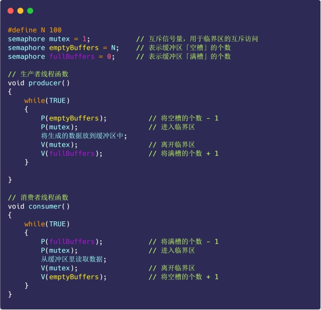

如果消费者线程一开始执行 P(fullBuffers)，由于信号量 fullBuffers初始值为 0，则此时 fullBuffers的值从 0 变为 -1，说明缓冲区里没有数据，消费者只能等待。

接着，轮到生产者执行 P(emptyBuffers)，表示减少 1 个空槽，如果当前没有其他生产者线程在临界区执行代码，那么该生产者线程就可以把数据放到缓冲区，放完后，执行 V(fullBuffers)，信号量 fullBuffers从 -1 变成 0，表明有「消费者」线程正在阻塞等待数据，于是阻塞等待的消费者线程会被唤醒。

消费者线程被唤醒后，如果此时没有其他消费者线程在读数据，那么就可以直接进入临界区，从缓冲区读取数据。最后，离开临界区后，把空槽的个数 + 1。


### 经典同步问题


#### 哲学家就餐问题

当初我在校招的时候，面试官也问过「哲学家就餐」这道题目，我当时听的一脸懵逼，无论面试官怎么讲述这个问题，我也始终没听懂，就莫名其妙的说这个问题会「死锁」。

当然，我这回答槽透了，所以当场 game over，残酷又悲惨故事，就不多说了，反正当时菜就是菜。


时至今日，看我来图解这道题。


先来看看哲学家就餐的问题描述：

- 5个老大哥哲学家，闲着没事做，围绕着一张圆桌吃面；

- 巧就巧在，这个桌子只有 5支叉子，每两个哲学家之间放一支叉子；

- 哲学家围在一起先思考，思考中途饿了就会想进餐；

- 奇葩的是，这些哲学家要两支叉子才愿意吃面，也就是需要拿到左右两边的叉子才进餐；

- 吃完后，会把两支叉子放回原处，继续思考；

那么问题来了，如何保证哲 学家们的动作有序进行，而不会出现有人永远拿不到叉子呢？

方案一

我们用信号量的方式，也就是 PV 操作来尝试解决它，代码如下：

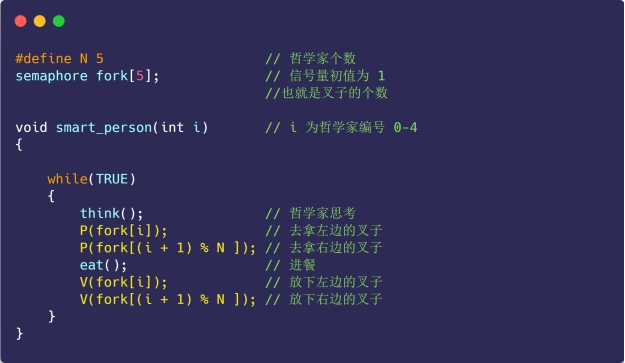

上面的程序，好似很自然。拿起叉子用 P 操作，代表有叉子就直接用，没有叉子时就等待其他哲学家放回叉子。

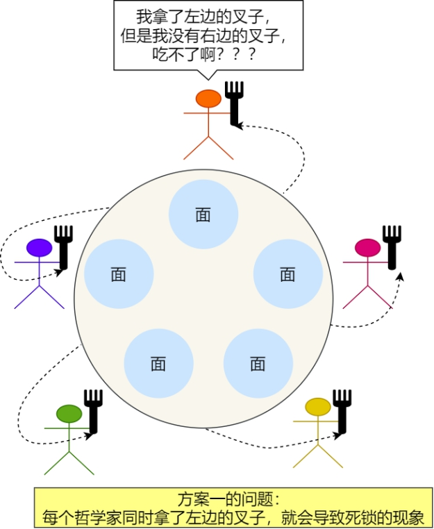

不过，这种解法存在一个极端的问题：假设五位哲学家同时拿起左边的叉子，桌面上就没有叉子了，这样就没有人能够拿到他们右边的叉子，也就说每一位哲学家都会在 P(fork[(i + 1) % N ])这条语句阻塞了，很明显这发生了死锁的现象。

方案二

既然「方案一」会发生同时竞争左边叉子导致死锁的现象，那么我们就在拿叉子前，加个互斥信号量，代码如下：

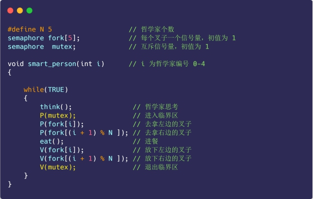

上面程序中的互斥信号量的作用就在于，只要有一个哲学家进入了「临界区」，也就是准备要拿叉子时，其他哲学家都不能动，只有这位哲学家用完叉子了，才能轮到下一个哲学家进餐。

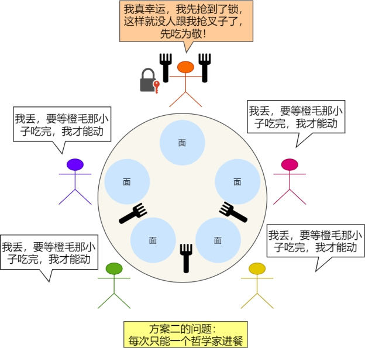

方案二虽然能让哲学家们按顺序吃饭，但是每次进餐只能有一位哲学家，而桌面上是有 5 把叉子，按道理是能可以有两个哲学家同时进餐的，所以从效率角度上，这不是最好的解决方案。

方案三

那既然方案二使用互斥信号量，会导致只能允许一个哲学家就餐，那么我们就不用它。

另外，方案一的问题在于，会出现所有哲学家同时拿左边刀叉的可能性，那我们就避免哲学家可以同时拿左边的刀叉，采用分支结构，根据哲学家的编号的不同，而采取不同的动作。

即让偶数编号的哲学家「先拿左边的叉子后拿右边的叉子」，奇数编号的哲学家「先拿右边的叉子后拿左边的叉子」。

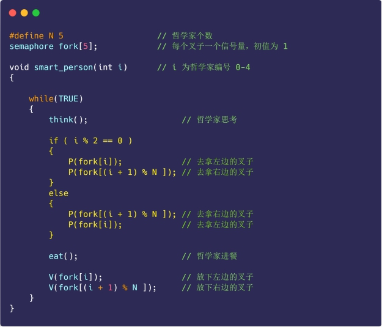

上面的程序，在 P 操作时，根据哲学家的编号不同，拿起左右两边叉子的顺序不同。另外，V 操作是不需要分支的，因为 V 操作是不会阻塞的。

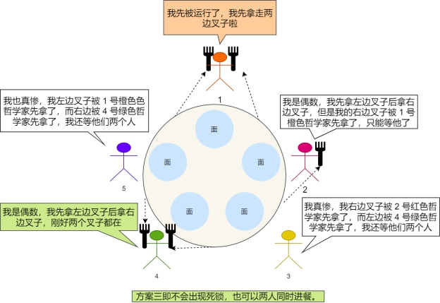

方案三即不会出现死锁，也可以两人同时进餐。

方案四

在这里再提出另外一种可行的解决方案，我们用一个数组 state 来记录每一位哲学家在进程、思考还是饥饿状态（正在试图拿叉子）。

那么，一个哲学家只有在两个邻居都没有进餐时，才可以进入进餐状态。

第 i个哲学家的左邻右舍，则由宏 LEFT和 RIGHT定义：

- **LEFT** : ( i + 5 - 1 ) % 5

- **RIGHT** : ( i + 1 ) % 5

比如 i 为 2，则 LEFT为 1，RIGHT为 3。

具体代码实现如下：

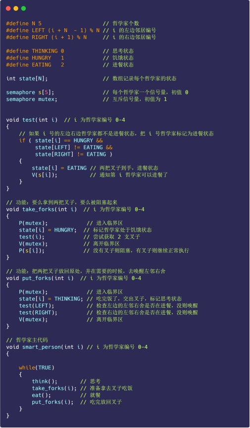

上面的程序使用了一个信号量数组，每个信号量对应一位哲学家，这样在所需的叉子被占用时，想进餐的哲学家就被阻塞。

注意，每个进程/线程将 smart_person函数作为主代码运行，而其他 take_forks、put_forks和 test只是普通的函数，而非单独的进程/线程。


方案四同样不会出现死锁，也可以两人同时进餐。


#### 读者-写者问题

前面的「哲学家进餐问题」对于互斥访问有限的竞争问题（如 I/O 设备）一类的建模过程十分有用。

另外，还有个著名的问题是「读者-写者」，它为数据库访问建立了一个模型。

读者只会读取数据，不会修改数据，而写者即可以读也可以修改数据。

读者-写者的问题描述：

- 「读-读」允许：同一时刻，允许多个读者同时读

- 「读-写」互斥：没有写者时读者才能读，没有读者时写者才能写

- 「写-写」互斥：没有其他写者时，写者才能写

接下来，提出几个解决方案来分析分析。

方案一

使用信号量的方式来尝试解决：

- 信号量 wMutex：控制写操作的互斥信号量，初始值为 1 ；

- 读者计数 rCount：正在进行读操作的读者个数，初始化为 0；

- 信号量 rCountMutex：控制对 rCount 读者计数器的互斥修改，初始值为 1；

接下来看看代码的实现：

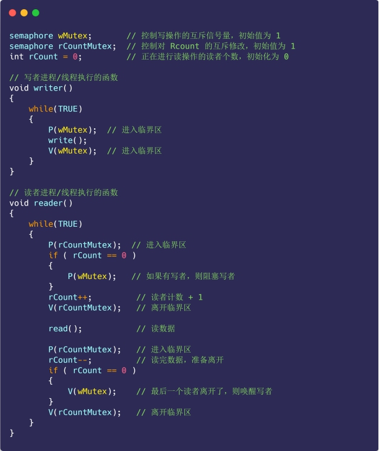

上面的这种实现，是读者优先的策略，因为只要有读者正在读的状态，后来的读者都可以直接进入，如果读者持续不断进入，则写者会处于饥饿状态。

方案二

那既然有读者优先策略，自然也有写者优先策略：

- 只要有写者准备要写入，写者应尽快执行写操作，后来的读者就必须阻塞；

- 如果有写者持续不断写入，则读者就处于饥饿；

在方案一的基础上新增如下变量：

- 信号量 rMutex：控制读者进入的互斥信号量，初始值为 1；

- 信号量 wDataMutex：控制写者写操作的互斥信号量，初始值为 1；

- 写者计数 wCount：记录写者数量，初始值为 0；

- 信号量 wCountMutex：控制 wCount 互斥修改，初始值为 1；

具体实现如下代码：

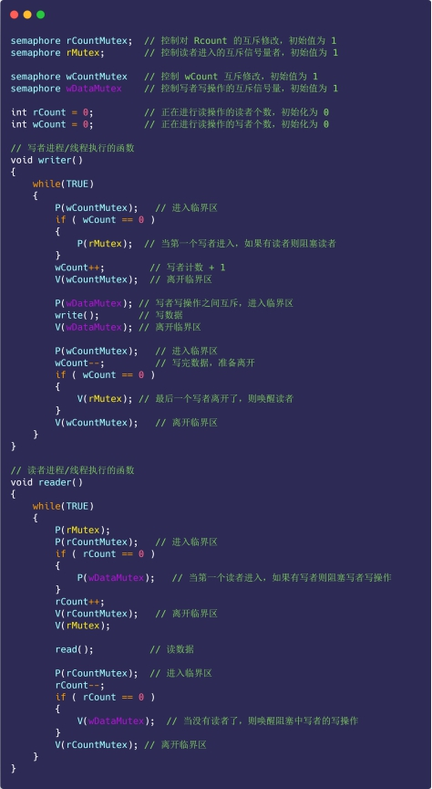

注意，这里 rMutex的作用，开始有多个读者读数据，它们全部进入读者队列，此时来了一个写者，执行了 P(rMutex)之后，后续的读者由于阻塞在 rMutex上，都不能再进入读者队列，而写者到来，则可以全部进入写者队列，因此保证了写者优先。

同时，第一个写者执行了 P(rMutex)之后，也不能马上开始写，必须等到所有进入读者队列的读者都执行完读操作，通过 V(wDataMutex)唤醒写者的写操作。

方案三

既然读者优先策略和写者优先策略都会造成饥饿的现象，那么我们就来实现一下公平策略。

公平策略：

- 优先级相同；

- 写者、读者互斥访问；

- 只能一个写者访问临界区；

- 可以有多个读者同时访问临街资源；

具体代码实现：

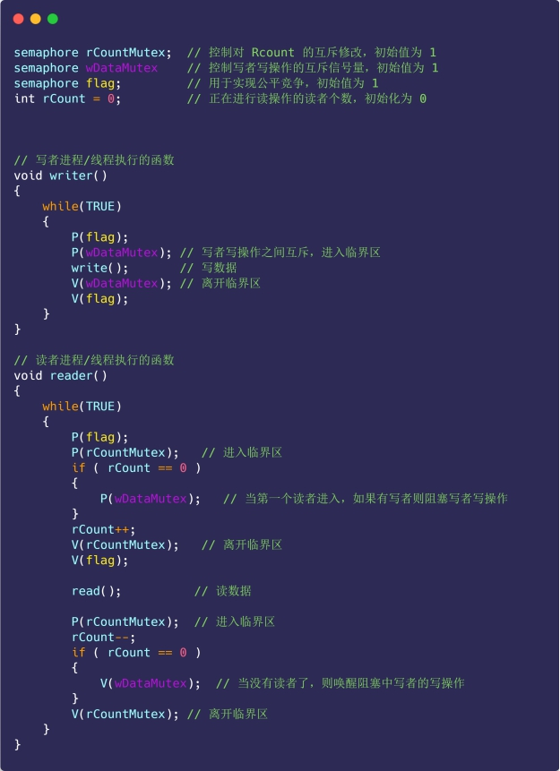

看完代码不知你是否有这样的疑问，为什么加了一个信号量 flag，就实现了公平竞争？

对比方案一的读者优先策略，可以发现，读者优先中只要后续有读者到达，读者就可以进入读者队列， 而写者必须等待，直到没有读者到达。

没有读者到达会导致读者队列为空，即 rCount==0，此时写者才可以进入临界区执行写操作。

而这里 flag的作用就是阻止读者的这种特殊权限（特殊权限是只要读者到达，就可以进入读者队列）。

比如：开始来了一些读者读数据，它们全部进入读者队列，此时来了一个写者，执行 P(falg)操作，使得后续到来的读者都阻塞在 flag上，不能进入读者队列，这会使得读者队列逐渐为空，即 rCount减为 0。

这个写者也不能立马开始写（因为此时读者队列不为空），会阻塞在信号量 wDataMutex上，读者队列中的读者全部读取结束后，最后一个读者进程执行 V(wDataMutex)，唤醒刚才的写者，写者则继续开始进行写操作。


## 4.4 死锁

面试过程中，死锁也是高频的考点，因为如果线上环境真多发生了死锁，那真的出大事了。

这次，我们就来系统地聊聊死锁的问题。

- 死锁的概念；

- 模拟死锁问题的产生；

- 利用工具排查死锁问题；

- 避免死锁问题的发生；


### 死锁的概念

在多线程编程中，我们为了防止多线程竞争共享资源而导致数据错乱，都会在操作共享资源之前加上互斥锁，只有成功获得到锁的线程，才能操作共享资源，获取不到锁的线程就只能等待，直到锁被释放。

那么，当两个线程为了保护两个不同的共享资源而使用了两个互斥锁，那么这两个互斥锁应用不当的时候，可能会造成两个线程都在等待对方释放锁，在没有外力的作用下，这些线程会一直相互等待，就没办法继续运行，这种情况就是发生了死锁。

举个例子，小林拿了小美房间的钥匙，而小林在自己的房间里，小美拿了小林房间的钥匙，而小美也在自己的房间里。如果小林要从自己的房间里出去，必须拿到小美手中的钥匙，但是小美要出去，又必须拿到小林手中的钥匙，这就形成了死锁。

死锁只有同时满足以下四个条件才会发生：

- 互斥条件；

- 持有并等待条件；

- 不可剥夺条件；

- 环路等待条件；


##### 互斥条件

互斥条件是指多个线程不能同时使用同一个资源。

比如下图，如果线程 A 已经持有的资源，不能再同时被线程 B 持有，如果线程 B 请求获取线程 A 已经占用的资源，那线程 B 只能等待，直到线程 A 释放了资源。

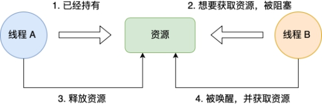


##### 持有并等待条件

持有并等待条件是指，当线程 A 已经持有了资源 1，又想申请资源 2，而资源 2 已经被线程 C 持有了，所以线程 A 就会处于等待状态，但是线程 A 在等待资源 2 的同时并不会释放自己已经持有的资源 1。

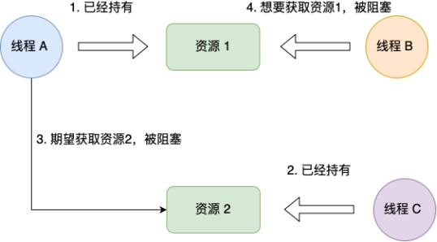


##### 不可剥夺条件

不可剥夺条件是指，当线程已经持有了资源 ，在自己使用完之前不能被其他线程获取，线程 B 如果也想使用此资源，则只能在线程 A 使用完并释放后才能获取。

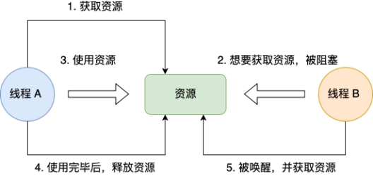


##### 环路等待条件

环路等待条件指都是，在死锁发生的时候，两个线程获取资源的顺序构成了环形链。

比如，线程 A 已经持有资源 2，而想请求资源 1， 线程 B 已经获取了资源 1，而想请求资源 2，这就形成资源请求等待的环形图。

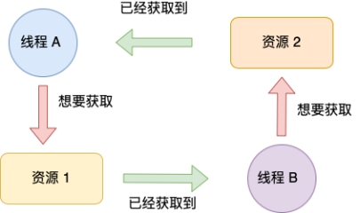


### 模拟死锁问题的产生

Talk is cheap. Show me the code.

下面，我们用代码来模拟死锁问题的产生。

首先，我们先创建 2 个线程，分别为线程 A 和 线程 B，然后有两个互斥锁，分别是 mutex**A 和 mutex**B，代码如下：

```c
pthread_mutex_t mutex_A=PTHREAD_MUTEX_INITIALIZER;

pthread_mutex_t mutex_B=PTHREAD_MUTEX_INITIALIZER;


intmain(){
 pthread_t tidA,tidB;

 //创建两个线程
 pthread_create(&tidA,NULL,threadA_proc,NULL);
 pthread_create(&tidB,NULL,threadB_proc,NULL);

 pthread_join(tidA,NULL);
 pthread_join(tidB,NULL);

 printf("exit\n");

 return 0;

}
```

接下来，我们看下线程 A 函数做了什么。

```c
//线程函数 A
void *threadA_proc(void *data)
  {
  printf("thread A waiting get ResourceA \n");
  pthread_mutex_lock(&mutex_A);
  printf("thread A got ResourceA \n");
  sleep(1);
  printf("thread A waiting get ResourceB \n");
  pthread_mutex_lock(&mutex_B);
  printf("thread A got ResourceB \n");
  pthread_mutex_unlock(&mutex_B);
  pthread_mutex_unlock(&mutex_A);
  return (void *)0;
}
```

可以看到，线程 A 函数的过程：

- 先获取互斥锁 A，然后睡眠 1 秒；

- 再获取互斥锁 B，然后释放互斥锁 B；

- 最后释放互斥锁 A；

```c
//线程函数 B
void *threadB_proc(void *data)
{
  printf("thread B waiting get ResourceB \n");
  pthread_mutex_lock(&mutex_B);
  printf("thread B got ResourceB \n");
  sleep(1);
  printf("thread B waiting get ResourceA \n");
  pthread_mutex_lock(&mutex_A);
  printf("thread B got ResourceA \n");
  pthread_mutex_unlock(&mutex_A);
  pthread_mutex_unlock(&mutex_B);
  return (void *)0;
}
```

可以看到，线程 B 函数的过程：

- 先获取互斥锁 B，然后睡眠 1 秒；

- 再获取互斥锁 A，然后释放互斥锁 A；

- 最后释放互斥锁 B；

然后，我们运行这个程序，运行结果如下：

```
thread B waiting get ResourceB
thread B got ResourceB
thread A waiting get ResourceA
thread A got ResourceA
thread B waiting get ResourceA
thread A waiting get ResourceB
// 阻塞中。。。
```

可以看到线程 B 在等待互斥锁 A 的释放，线程 A 在等待互斥锁 B 的释放，双方都在等待对方资源的释放，很明显，产生了死锁问题。


### 利用工具排查死锁问题

如果你想排查你的 Java 程序是否死锁，则可以使用 jstack工具，它是 jdk 自带的线程堆栈分析工具。

由于小林的死锁代码例子是 C 写的，在 Linux 下，我们可以使用 pstack\+ gdb工具来定位死锁问题。

pstack 命令可以显示每个线程的栈跟踪信息（函数调用过程），它的使用方式也很简单，只需要 pstack <pid>就可以了。

那么，在定位死锁问题时，我们可以多次执行 pstack 命令查看线程的函数调用过程，多次对比结果，确认哪几个线程一直没有变化，且是因为在等待锁，那么大概率是由于死锁问题导致的。

我用 pstack 输出了我前面模拟死锁问题的进程的所有线程的情况，我多次执行命令后，其结果都一样，如下：

```sh
$ pstack 87746
Thread 3 (Thread 0x7f60a610a700 (LWP 87747)):
\#0  0x0000003720e0da1d in __lll_lock_wait () from /lib64/libpthread.so.0
\#1  0x0000003720e093ca in _L_lock_829 () from /lib64/libpthread.so.0
\#2  0x0000003720e09298 in pthread_mutex_lock () from /lib64/libpthread.so.0
\#3  0x0000000000400725 in threadA_proc ()
\#4  0x0000003720e07893 in start_thread () from /lib64/libpthread.so.0
\#5  0x00000037206f4bfd in clone () from /lib64/libc.so.6
Thread 2 (Thread 0x7f60a5709700 (LWP 87748)):
\#0  0x0000003720e0da1d in __lll_lock_wait () from /lib64/libpthread.so.0
\#1  0x0000003720e093ca in _L_lock_829 () from /lib64/libpthread.so.0
\#2  0x0000003720e09298 in pthread_mutex_lock () from /lib64/libpthread.so.0
\#3  0x0000000000400792 in threadB_proc ()
\#4  0x0000003720e07893 in start_thread () from /lib64/libpthread.so.0
\#5  0x00000037206f4bfd in clone () from /lib64/libc.so.6
Thread 1 (Thread 0x7f60a610c700 (LWP 87746)):
\#0  0x0000003720e080e5 in pthread_join () from /lib64/libpthread.so.0
\#1  0x0000000000400806 in main ()

....
```
```sh
$ pstack 87746
Thread 3 (Thread 0x7f60a610a700 (LWP 87747)):
#0  0x0000003720e0da1d in __lll_lock_wait () from /lib64/libpthread.so.0
#1  0x0000003720e093ca in _L_lock_829 () from /lib64/libpthread.so.0
#2  0x0000003720e09298 in pthread_mutex_lock () from /lib64/libpthread.so.0
#3  0x0000000000400725 in threadA_proc ()
#4  0x0000003720e07893 in start_thread () from /lib64/libpthread.so.0
#5  0x00000037206f4bfd in clone () from /lib64/libc.so.6
Thread 2 (Thread 0x7f60a5709700 (LWP 87748)):
#0  0x0000003720e0da1d in __lll_lock_wait () from /lib64/libpthread.so.0
#1  0x0000003720e093ca in _L_lock_829 () from /lib64/libpthread.so.0
#2  0x0000003720e09298 in pthread_mutex_lock () from /lib64/libpthread.so.0
#3  0x0000000000400792 in threadB_proc ()
#4  0x0000003720e07893 in start_thread () from /lib64/libpthread.so.0
#5  0x00000037206f4bfd in clone () from /lib64/libc.so.6
Thread 1 (Thread 0x7f60a610c700 (LWP 87746)):
#0  0x0000003720e080e5 in pthread_join () from /lib64/libpthread.so.0
#1  0x0000000000400806 in main ()
```

可以看到，Thread 2 和 Thread 3 一直阻塞获取锁（pthread_mutex_lock）的过程，而且 pstack 多次输出信息都没有变化，那么可能大概率发生了死锁。

但是，还不能够确认这两个线程是在互相等待对方的锁的释放，因为我们看不到它们是等在哪个锁对象，于是我们可以使用 gdb 工具进一步确认。

整个 gdb 调试过程，如下：

```c
// gdb 命令
$ gdb -p 87746
// 打印所有的线程信息
(gdb) info thread
3 Thread 0x7f60a610a700 (LWP 87747) 0x0000003720e0da1d in
__lll_lock_wait () from /lib64/libpthread.so.0
2 Thread 0x7f60a5709700 (LWP 87748) 0x0000003720e0da1d in
__lll_lock_wait () from /lib64/libpthread.so.0
* 1 Thread 0x7f60a610c700 (LWP 87746) 0x0000003720e080e5 in
pthread_join () from /lib64/libpthread.so.0
//最左边的 * 表示 gdb 锁定的线程，切换到第⼆个线程去查看
// 切换到第2个线程
(gdb) thread 2
[Switching to thread 2 (Thread 0x7f60a5709700 (LWP 87748))]#0
0x0000003720e0da1d in __lll_lock_wait () from /lib64/libpthread.so.0
// bt 可以打印函数堆栈，却⽆法看到函数参数，跟 pstack 命令⼀样
(gdb) bt
#0 0x0000003720e0da1d in __lll_lock_wait () from /lib64/libpthread.so.0
#1 0x0000003720e093ca in _L_lock_829 () from /lib64/libpthread.so.0
#2 0x0000003720e09298 in pthread_mutex_lock () from
/lib64/libpthread.so.0
#3 0x0000000000400792 in threadB_proc (data=0x0) at dead_lock.c:25
#4 0x0000003720e07893 in start_thread () from /lib64/libpthread.so.0
#5 0x00000037206f4bfd in clone () from /lib64/libc.so.6
// 打印第三帧信息，每次函数调⽤都会有压栈的过程，⽽ frame 则记录栈中的帧信息
(gdb) frame 3
#3 0x0000000000400792 in threadB_proc (data=0x0) at dead_lock.c:25
27 printf("thread B waiting get ResourceA \n");
28 pthread_mutex_lock(&mutex_A);
// 打印mutex_A的值 , __owner表示gdb中标示线程的值，即LWP
(gdb) p mutex_A
$1 = {__data = {__lock = 2, __count = 0, __owner = 87747, __nusers = 1,
__kind = 0, __spins = 0, __list = {__prev = 0x0, __next = 0x0}},
__size = "\002\000\000\000\000\000\000\000\303V\001\000\001", '\000'
<repeats 26 times>, __align = 2}
// 打印mutex_B的值 , __owner表示gdb中标示线程的值，即LWP
(gdb) p mutex_B
$2 = {__data = {__lock = 2, __count = 0, __owner = 87748, __nusers = 1,
__kind = 0, __spins = 0, __list = {__prev = 0x0, __next = 0x0}},
__size = "\002\000\000\000\000\000\000\000\304V\001\000\001", '\000'
<repeats 26 times>, __align = 2}
```

我来解释下，上面的调试过程：

1. 通过 info thread打印了所有的线程信息，可以看到有 3 个线程，一个是主线程（LWP 87746），另外两个都是我们自己创建的线程（LWP 87747 和 87748）；

2. 通过 thread 2，将切换到第 2 个线程（LWP 87748）；

3. 通过 bt，打印线程的调用栈信息，可以看到有 threadB_proc 函数，说明这个是线程 B 函数，也就说 LWP 87748 是线程 B;

4. 通过 frame 3，打印调用栈中的第三个帧的信息，可以看到线程 B 函数，在获取互斥锁 A 的时候阻塞了；

5. 通过 p mutex_A，打印互斥锁 A 对象信息，可以看到它被 LWP 为 87747（线程 A） 的线程持有着；

6. 通过 p mutex_B，打印互斥锁 A 对象信息，可以看到他被 LWP 为 87748 （线程 B） 的线程持有着；

因为线程 B 在等待线程 A 所持有的 mutex**A, 而同时线程 A 又在等待线程 B 所拥有的mutex**B, 所以可以断定该程序发生了死锁。


### 避免死锁问题的发生

前面我们提到，产生死锁的四个必要条件是：互斥条件、持有并等待条件、不可剥夺条件、环路等待条件。

那么避免死锁问题就只需要破环其中一个条件就可以，最常见的并且可行的就是使用资源有序分配法，来破环环路等待条件。

那什么是资源有序分配法呢？

线程 A 和 线程 B 获取资源的顺序要一样，当线程 A 是先尝试获取资源 A，然后尝试获取资源 B 的时候，线程 B 同样也是先尝试获取资源 A，然后尝试获取资源 B。也就是说，线程 A 和 线程 B 总是以相同的顺序申请自己想要的资源。

我们使用资源有序分配法的方式来修改前面发生死锁的代码，我们可以不改动线程 A 的代码。

我们先要清楚线程 A 获取资源的顺序，它是先获取互斥锁 A，然后获取互斥锁 B。

所以我们只需将线程 B 改成以相同顺序的获取资源，就可以打破死锁了。

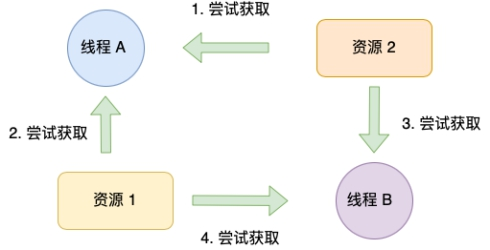

线程 B 函数改进后的代码如下：

```c
//线程 B 函数，同线程 A ⼀样，先获取互斥锁 A，然后获取互斥锁 B
void *threadB_proc(void *data)
{
  printf("thread B waiting get ResourceA \n");
  pthread_mutex_lock(&mutex_A);
  printf("thread B got ResourceA \n");
  sleep(1);
  printf("thread B waiting get ResourceB \n");
  pthread_mutex_lock(&mutex_B);
  printf("thread B got ResourceB \n");
  pthread_mutex_unlock(&mutex_B);
  pthread_mutex_unlock(&mutex_A);
  return (void *)0;
}
```

执行结果如下，可以看，没有发生死锁。

thread B waiting get ResourceA
thread B got ResourceA
thread A waiting get ResourceA
thread B waiting  get ResourceB
thread B got ResourceB
thread A got ResourceA
thread A waiting get ResourceB
thread A got ResourceB
exit


### 总结

简单来说，死锁问题的产生是由两个或者以上线程并行执行的时候，争夺资源而互相等待造成的。

死锁只有同时满足互斥、持有并等待、不可剥夺、环路等待这四个条件的时候才会发生。

所以要避免死锁问题，就是要破坏其中一个条件即可，最常用的方法就是使用资源有序分配法来破坏环路等待条件。


## 4.5 悲观锁与乐观锁

生活中用到的锁，用途都比较简单粗暴，上锁基本是为了防止外人进来、电动车被偷等等。

但生活中也不是没有 BUG 的，比如加锁的电动车在「广西 - 窃·格瓦拉」面前，锁就是形同虚设，只要他愿意，他就可以轻轻松松地把你电动车给「顺走」，不然打工怎么会是他这辈子不可能的事情呢？牛逼之人，必有牛逼之处。


那在编程世界里，「锁」更是五花八门，多种多样，每种锁的加锁开销以及应用场景也可能会不同。

如何用好锁，也是程序员的基本素养之一了。

高并发的场景下，如果选对了合适的锁，则会大大提高系统的性能，否则性能会降低。

所以，知道各种锁的开销，以及应用场景是很有必要的。

接下来，就谈一谈常见的这几种锁：


多线程访问共享资源的时候，避免不了资源竞争而导致数据错乱的问题，所以我们通常为了解决这一问题，都会在访问共享资源之前加锁。

最常用的就是互斥锁，当然还有很多种不同的锁，比如自旋锁、读写锁、乐观锁等，不同种类的锁自然适用于不同的场景。

如果选择了错误的锁，那么在一些高并发的场景下，可能会降低系统的性能，这样用户体验就会非常差了。

所以，为了选择合适的锁，我们不仅需要清楚知道加锁的成本开销有多大，还需要分析业务场景中访问的共享资源的方式，再来还要考虑并发访问共享资源时的冲突概率。

对症下药，才能减少锁对高并发性能的影响。

那接下来，针对不同的应用场景，谈一谈「互斥锁、自旋锁、读写锁、乐观锁、悲观锁」的选择和使用。


### 互斥锁与自旋锁：谁更轻松自如？

最底层的两种就是会「互斥锁和自旋锁」，有很多高级的锁都是基于它们实现的，你可以认为它们是各种锁的地基，所以我们必须清楚它俩之间的区别和应用。

加锁的目的就是保证共享资源在任意时间里，只有一个线程访问，这样就可以避免多线程导致共享数据错乱的问题。

当已经有一个线程加锁后，其他线程加锁则就会失败，互斥锁和自旋锁对于加锁失败后的处理方式是不一样的：

- 互斥锁加锁失败后，线程会释放 CPU ，给其他线程；

- 自旋锁加锁失败后，线程会忙等待，直到它拿到锁；

互斥锁是一种「独占锁」，比如当线程 A 加锁成功后，此时互斥锁已经被线程 A 独占了，只要线程 A 没有释放手中的锁，线程 B 加锁就会失败，于是就会释放 CPU 让给其他线程，既然线程 B 释放掉了 CPU，自然线程 B 加锁的代码就会被阻塞。

对于互斥锁加锁失败而阻塞的现象，是由操作系统内核实现的。当加锁失败时，内核会将线程置为「睡眠」状态，等到锁被释放后，内核会在合适的时机唤醒线程，当这个线程成功获取到锁后，于是就可以继续执行。如下图：

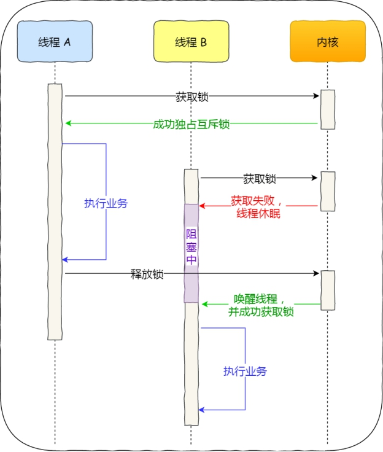

所以，互斥锁加锁失败时，会从用户态陷入到内核态，让内核帮我们切换线程，虽然简化了使用锁的难度，但是存在一定的性能开销成本。

那这个开销成本是什么呢？会有两次线程上下文切换的成本：

- 当线程加锁失败时，内核会把线程的状态从「运行」状态设置为「睡眠」状态，然后把 CPU 切换给其他线程运行；

- 接着，当锁被释放时，之前「睡眠」状态的线程会变为「就绪」状态，然后内核会在合适的时间，把 CPU 切换给该线程运行。

线程的上下文切换的是什么？当两个线程是属于同一个进程，因为虚拟内存是共享的，所以在切换时，虚拟内存这些资源就保持不动，只需要切换线程的私有数据、寄存器等不共享的数据。

上下切换的耗时有大佬统计过，大概在几十纳秒到几微秒之间，如果你锁住的代码执行时间比较短，那可能上下文切换的时间都比你锁住的代码执行时间还要长。

所以，如果你能确定被锁住的代码执行时间很短，就不应该用互斥锁，而应该选用自旋锁，否则使用互斥锁。

自旋锁是通过 CPU 提供的 CAS函数（**Compare And Swap**），在「用户态」完成加锁和解锁操作，不会主动产生线程上下文切换，所以相比互斥锁来说，会快一些，开销也小一些。

一般加锁的过程，包含两个步骤：

- 第一步，查看锁的状态，如果锁是空闲的，则执行第二步；

- 第二步，将锁设置为当前线程持有；

CAS 函数就把这两个步骤合并成一条硬件级指令，形成原子指令，这样就保证了这两个步骤是不可分割的，要么一次性执行完两个步骤，要么两个步骤都不执行。

使用自旋锁的时候，当发生多线程竞争锁的情况，加锁失败的线程会「忙等待」，直到它拿到锁。这里的「忙等待」可以用 while循环等待实现，不过最好是使用 CPU 提供的 PAUSE指令来实现「忙等待」，因为可以减少循环等待时的耗电量。

自旋锁是最比较简单的一种锁，一直自旋，利用 CPU 周期，直到锁可用。需要注意，在单核 CPU 上，需要抢占式的调度器（即不断通过时钟中断一个线程，运行其他线程）。否则，自旋锁在单 CPU 上无法使用，因为一个自旋的线程永远不会放弃 CPU。

自旋锁开销少，在多核系统下一般不会主动产生线程切换，适合异步、协程等在用户态切换请求的编程方式，但如果被锁住的代码执行时间过长，自旋的线程会长时间占用 CPU 资源，所以自旋的时间和被锁住的代码执行的时间是成「正比」的关系，我们需要清楚的知道这一点。

自旋锁与互斥锁使用层面比较相似，但实现层面上完全不同：当加锁失败时，互斥锁用「线程切换」来应对，自旋锁则用「忙等待」来应对。

它俩是锁的最基本处理方式，更高级的锁都会选择其中一个来实现，比如读写锁既可以选择互斥锁实现，也可以基于自旋锁实现。


### 读写锁：读和写还有优先级区分？

读写锁从字面意思我们也可以知道，它由「读锁」和「写锁」两部分构成，如果只读取共享资源用「读锁」加锁，如果要修改共享资源则用「写锁」加锁。

所以，读写锁适用于能明确区分读操作和写操作的场景。

读写锁的工作原理是：

- 当「写锁」没有被线程持有时，多个线程能够并发地持有读锁，这大大提高了共享资源的访问效率，因为「读锁」是用于读取共享资源的场景，所以多个线程同时持有读锁也不会破坏共享资源的数据。

- 但是，一旦「写锁」被线程持有后，读线程的获取读锁的操作会被阻塞，而且其他写线程的获取写锁的操作也会被阻塞。

所以说，写锁是独占锁，因为任何时刻只能有一个线程持有写锁，类似互斥锁和自旋锁，而读锁是共享锁，因为读锁可以被多个线程同时持有。

知道了读写锁的工作原理后，我们可以发现，读写锁在读多写少的场景，能发挥出优势。

另外，根据实现的不同，读写锁可以分为「读优先锁」和「写优先锁」。

读优先锁期望的是，读锁能被更多的线程持有，以便提高读线程的并发性，它的工作方式是：当读线程 A 先持有了读锁，写线程 B 在获取写锁的时候，会被阻塞，并且在阻塞过程中，后续来的读线程 C 仍然可以成功获取读锁，最后直到读线程 A 和 C 释放读锁后，写线程 B 才可以成功获取写锁。如下图：

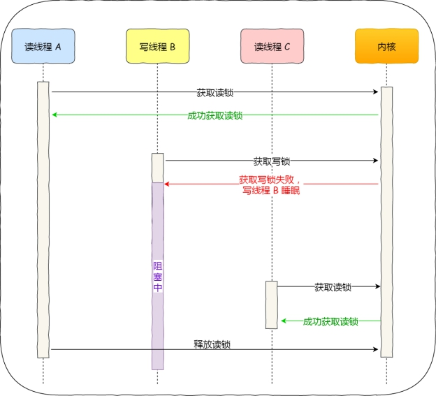

而写优先锁是优先服务写线程，其工作方式是：当读线程 A 先持有了读锁，写线程 B 在获取写锁的时候，会被阻塞，并且在阻塞过程中，后续来的读线程 C 获取读锁时会失败，于是读线程 C 将被阻塞在获取读锁的操作，这样只要读线程 A 释放读锁后，写线程 B 就可以成功获取读锁。如下图：

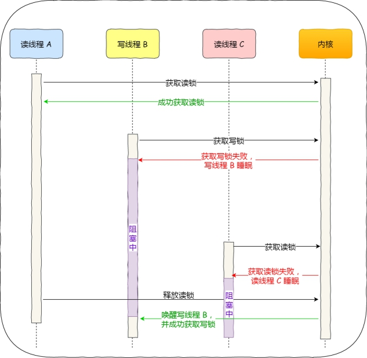


读优先锁对于读线程并发性更好，但也不是没有问题。我们试想一下，如果一直有读线程获取读锁，那么写线程将永远获取不到写锁，这就造成了写线程「饥饿」的现象。

写优先锁可以保证写线程不会饿死，但是如果一直有写线程获取写锁，读线程也会被「饿死」。

既然不管优先读锁还是写锁，对方可能会出现饿死问题，那么我们就不偏袒任何一方，搞个「公平读写锁」。

公平读写锁比较简单的一种方式是：用队列把获取锁的线程排队，不管是写线程还是读线程都按照先进先出的原则加锁即可，这样读线程仍然可以并发，也不会出现「饥饿」的现象。

互斥锁和自旋锁都是最基本的锁，读写锁可以根据场景来选择这两种锁其中的一个进行实现。


### 乐观锁与悲观锁：做事的心态有何不同？

前面提到的互斥锁、自旋锁、读写锁，都是属于悲观锁。

悲观锁做事比较悲观，它认为多线程同时修改共享资源的概率比较高，于是很容易出现冲突，所以访问共享资源前，先要上锁。

那相反的，如果多线程同时修改共享资源的概率比较低，就可以采用乐观锁。

乐观锁做事比较乐观，它假定冲突的概率很低，它的工作方式是：先修改完共享资源，再验证这段时间内有没有发生冲突，如果没有其他线程在修改资源，那么操作完成，如果发现有其他线程已经修改过这个资源，就放弃本次操作。

放弃后如何重试，这跟业务场景息息相关，虽然重试的成本很高，但是冲突的概率足够低的话，还是可以接受的。

可见，乐观锁的心态是，不管三七二十一，先改了资源再说。另外，你会发现乐观锁全程并没有加锁，所以它也叫无锁编程。

这里举一个场景例子：在线文档。

我们都知道在线文档可以同时多人编辑的，如果使用了悲观锁，那么只要有一个用户正在编辑文档，此时其他用户就无法打开相同的文档了，这用户体验当然不好了。

那实现多人同时编辑，实际上是用了乐观锁，它允许多个用户打开同一个文档进行编辑，编辑完提交之后才验证修改的内容是否有冲突。

怎么样才算发生冲突？这里举个例子，比如用户 A 先在浏览器编辑文档，之后用户 B 在浏览器也打开了相同的文档进行编辑，但是用户 B 比用户 A 提交改动，这一过程用户 A 是不知道的，当 A 提交修改完的内容时，那么 A 和 B 之间并行修改的地方就会发生冲突。

服务端要怎么验证是否冲突了呢？通常方案如下：

- 由于发生冲突的概率比较低，所以先让用户编辑文档，但是浏览器在下载文档时会记录下服务端返回的文档版本号；

- 当用户提交修改时，发给服务端的请求会带上原始文档版本号，服务器收到后将它与当前版本号进行比较，如果版本号一致则修改成功，否则提交失败。

实际上，我们常见的 SVN 和 Git 也是用了乐观锁的思想，先让用户编辑代码，然后提交的时候，通过版本号来判断是否产生了冲突，发生了冲突的地方，需要我们自己修改后，再重新提交。

乐观锁虽然去除了加锁解锁的操作，但是一旦发生冲突，重试的成本非常高，所以只有在冲突概率非常低，且加锁成本非常高的场景时，才考虑使用乐观锁。


### 总结

开发过程中，最常见的就是互斥锁的了，互斥锁加锁失败时，会用「线程切换」来应对，当加锁失败的线程再次加锁成功后的这一过程，会有两次线程上下文切换的成本，性能损耗比较大。

如果我们明确知道被锁住的代码的执行时间很短，那我们应该选择开销比较小的自旋锁，因为自旋锁加锁失败时，并不会主动产生线程切换，而是一直忙等待，直到获取到锁，那么如果被锁住的代码执行时间很短，那这个忙等待的时间相对应也很短。

如果能区分读操作和写操作的场景，那读写锁就更合适了，它允许多个读线程可以同时持有读锁，提高了读的并发性。根据偏袒读方还是写方，可以分为读优先锁和写优先锁，读优先锁并发性很强，但是写线程会被饿死，而写优先锁会优先服务写线程，读线程也可能会被饿死，那为了避免饥饿的问题，于是就有了公平读写锁，它是用队列把请求锁的线程排队，并保证先入先出的原则来对线程加锁，这样便保证了某种线程不会被饿死，通用性也更好点。

互斥锁和自旋锁都是最基本的锁，读写锁可以根据场景来选择这两种锁其中的一个进行实现。

另外，互斥锁、自旋锁、读写锁都属于悲观锁，悲观锁认为并发访问共享资源时，冲突概率可能非常高，所以在访问共享资源前，都需要先加锁。

相反的，如果并发访问共享资源时，冲突概率非常低的话，就可以使用乐观锁，它的工作方式是，在访问共享资源时，不用先加锁，修改完共享资源后，再验证这段时间内有没有发生冲突，如果没有其他线程在修改资源，那么操作完成，如果发现有其他线程已经修改过这个资源，就放弃本次操作。

但是，一旦冲突概率上升，就不适合使用乐观锁了，因为它解决冲突的重试成本非常高。

不管使用的哪种锁，我们的加锁的代码范围应该尽可能的小，也就是加锁的粒度要小，这样执行速度会比较快。再来，使用上了合适的锁，就会快上加快了。


# 五、调度算法


## 5.1 进程调度/页面置换/磁盘调度算法

最近，我偷偷潜伏在各大技术群，因为秋招在即，看到不少小伙伴分享的大厂面经。

然后发现，操作系统的知识点考察还是比较多的，大厂就是大厂就爱问基础知识。其中，关于操作系统的「调度算法」考察也算比较频繁。

所以，我这边总结了操作系统的三大调度机制，分别是「进程调度/页面置换/磁盘调度算法」，供大家复习，希望大家在秋招能斩获自己心意的 offer。

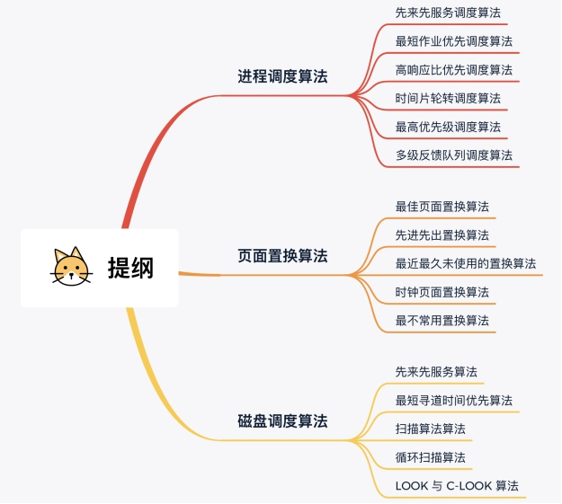


### 进程调度算法

进程调度算法也称 CPU 调度算法，毕竟进程是由 CPU 调度的。

当 CPU 空闲时，操作系统就选择内存中的某个「就绪状态」的进程，并给其分配 CPU。

什么时候会发生 CPU 调度呢？通常有以下情况：

1. 当进程从运行状态转到等待状态；

2. 当进程从运行状态转到就绪状态；

3. 当进程从等待状态转到就绪状态；

4. 当进程从运行状态转到终止状态；

其中发生在 1 和 4 两种情况下的调度称为「非抢占式调度」，2 和 3 两种情况下发生的调度称为「抢占式调度」。

非抢占式的意思就是，当进程正在运行时，它就会一直运行，直到该进程完成或发生某个事件而被阻塞时，才会把 CPU 让给其他进程。

而抢占式调度，顾名思义就是进程正在运行的时，可以被打断，使其把 CPU 让给其他进程。那抢占的原则一般有三种，分别是时间片原则、优先权原则、短作业优先原则。

你可能会好奇为什么第 3 种情况也会发生 CPU 调度呢？假设有一个进程是处于等待状态的，但是它的优先级比较高，如果该进程等待的事件发生了，它就会转到就绪状态，一旦它转到就绪状态，如果我们的调度算法是以优先级来进行调度的，那么它就会立马抢占正在运行的进程，所以这个时候就会发生 CPU 调度。

那第 2 种状态通常是时间片到的情况，因为时间片到了就会发生中断，于是就会抢占正在运行的进程，从而占用 CPU。

调度算法影响的是等待时间（进程在就绪队列中等待调度的时间总和），而不能影响进程真在使用 CPU 的时间和 I/O 时间。

接下来，说说常见的调度算法：

- 先来先服务调度算法

- 最短作业优先调度算法

- 高响应比优先调度算法

- 时间片轮转调度算法

- 最高优先级调度算法

- 多级反馈队列调度算法


#### 先来先服务调度算法

最简单的一个调度算法，就是非抢占式的先来先服务（**First Come First Severd, FCFS**）算法了。


顾名思义，先来后到，每次从就绪队列选择最先进入队列的进程，然后一直运行，直到进程退出或被阻塞，才会继续从队列中选择第一个进程接着运行。

这似乎很公平，但是当一个长作业先运行了，那么后面的短作业等待的时间就会很长，不利于短作业。

FCFS 对长作业有利，适用于 CPU 繁忙型作业的系统，而不适用于 I/O 繁忙型作业的系统。


#### 最短作业优先调度算法

最短作业优先（**Shortest Job First, SJF**）调度算法同样也是顾名思义，它会优先选择运行时间最短的进程来运行，这有助于提高系统的吞吐量。


这显然对长作业不利，很容易造成一种极端现象。

比如，一个长作业在就绪队列等待运行，而这个就绪队列有非常多的短作业，那么就会使得长作业不断的往后推，周转时间变长，致使长作业长期不会被运行。


#### 高响应比优先调度算法

前面的「先来先服务调度算法」和「最短作业优先调度算法」都没有很好的权衡短作业和长作业。

那么，高响应比优先（**Highest Response Ratio Next, HRRN**）调度算法主要是权衡了短作业和长作业。

每次进行进程调度时，先计算「响应比优先级」，然后把「响应比优先级」最高的进程投入运行，「响应比优先级」的计算公式：


从上面的公式，可以发现：

- 如果两个进程的「等待时间」相同时，「要求的服务时间」越短，「响应比」就越高，这样短作业的进程容易被选中运行；

- 如果两个进程「要求的服务时间」相同时，「等待时间」越长，「响应比」就越高，这就兼顾到了长作业进程，因为进程的响应比可以随时间等待的增加而提高，当其等待时间足够长时，其响应比便可以升到很高，从而获得运行的机会；


#### 时间片轮转调度算法

最古老、最简单、最公平且使用最广的算法就是时间片轮转（**Round Robin, RR**）调度算法。。


每个进程被分配一个时间段，称为时间片（**Quantum**），即允许该进程在该时间段中运行。

- 如果时间片用完，进程还在运行，那么将会把此进程从 CPU 释放出来，并把 CPU 分配另外一个进程；

- 如果该进程在时间片结束前阻塞或结束，则 CPU 立即进行切换；

另外，时间片的长度就是一个很关键的点：

- 如果时间片设得太短会导致过多的进程上下文切换，降低了 CPU 效率；

- 如果设得太长又可能引起对短作业进程的响应时间变长。将

通常时间片设为 20ms~50ms通常是一个比较合理的折中值。


#### 最高优先级调度算法

前面的「时间片轮转算法」做了个假设，即让所有的进程同等重要，也不偏袒谁，大家的运行时间都一样。

但是，对于多用户计算机系统就有不同的看法了，它们希望调度是有优先级的，即希望调度程序能从就绪队列中选择最高优先级的进程进行运行，这称为最高优先级（**Highest Priority First，HPF**）调度算法。

进程的优先级可以分为，静态优先级或动态优先级：

- 静态优先级：创建进程时候，就已经确定了优先级了，然后整个运行时间优先级都不会变化；

- 动态优先级：根据进程的动态变化调整优先级，比如如果进程运行时间增加，则降低其优先级，如果进程等待时间（就绪队列的等待时间）增加，则升高其优先级，也就是随着时间的推移增加等待进程的优先级。

该算法也有两种处理优先级高的方法，非抢占式和抢占式：

- 非抢占式：当就绪队列中出现优先级高的进程，运行完当前进程，再选择优先级高的进程。

- 抢占式：当就绪队列中出现优先级高的进程，当前进程挂起，调度优先级高的进程运行。

但是依然有缺点，可能会导致低优先级的进程永远不会运行。


#### 多级反馈队列调度算法

多级反馈队列（**Multilevel Feedback Queue**）调度算法是「时间片轮转算法」和「最高优先级算法」的综合和发展。

顾名思义：

- 「多级」表示有多个队列，每个队列优先级从高到低，同时优先级越高时间片越短。

- 「反馈」表示如果有新的进程加入优先级高的队列时，立刻停止当前正在运行的进程，转而去运行优先级高的队列；


来看看，它是如何工作的：

- 设置了多个队列，赋予每个队列不同的优先级，每个队列优先级从高到低，同时优先级越高时间片越短；

- 新的进程会被放入到第一级队列的末尾，按先来先服务的原则排队等待被调度，如果在第一级队列规定的时间片没运行完成，则将其转入到第二级队列的末尾，以此类推，直至完成；

- 当较高优先级的队列为空，才调度较低优先级的队列中的进程运行。如果进程运行时，有新进程进入较高优先级的队列，则停止当前运行的进程并将其移入到原队列末尾，接着让较高优先级的进程运行；

可以发现，对于短作业可能可以在第一级队列很快被处理完。对于长作业，如果在第一级队列处理不完，可以移入下次队列等待被执行，虽然等待的时间变长了，但是运行时间也会更长了，所以该算法很好的兼顾了长短作业，同时有较好的响应时间。


### 内存页面置换算法

在了解内存页面置换算法前，我们得先谈一下缺页异常（缺页中断）。

当 CPU 访问的页面不在物理内存时，便会产生一个缺页中断，请求操作系统将所缺页调入到物理内存。那它与一般中断的主要区别在于：

- 缺页中断在指令执行「期间」产生和处理中断信号，而一般中断在一条指令执行「完成」后检查和处理中断信号。

- 缺页中断返回到该指令的开始重新执行「该指令」，而一般中断返回回到该指令的「下一个指令」执行。

我们来看一下缺页中断的处理流程，如下图：

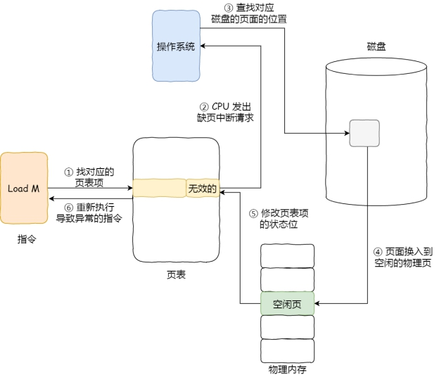

1. 在 CPU 里访问一条 Load M 指令，然后 CPU 会去找 M 所对应的页表项。

2. 如果该页表项的状态位是「有效的」，那 CPU 就可以直接去访问物理内存了，如果状态位是「无效的」，则 CPU 则会发送缺页中断请求。

3. 操作系统收到了缺页中断，则会执行缺页中断处理函数，先会查找该页面在磁盘中的页面的位置。

4. 找到磁盘中对应的页面后，需要把该页面换入到物理内存中，但是在换入前，需要在物理内存中找空闲页，如果找到空闲页，就把页面换入到物理内存中。

5. 页面从磁盘换入到物理内存完成后，则把页表项中的状态位修改为「有效的」。

6. 最后，CPU 重新执行导致缺页异常的指令。

上面所说的过程，第 4 步是能在物理内存找到空闲页的情况，那如果找不到呢？

找不到空闲页的话，就说明此时内存已满了，这时候，就需要「页面置换算法」选择一个物理页，如果该物理页有被修改过（脏页），则把它换出到磁盘，然后把该被置换出去的页表项的状态改成「无效的」，最后把正在访问的页面装入到这个物理页中。

这里提一下，页表项通常有如下图的字段：


那其中：

- **状态位**：用于表示该页是否有效，也就是说是否在物理内存中，供程序访问时参考。

- **访问字段**：用于记录该页在一段时间被访问的次数，供页面置换算法选择出页面时参考。

- **修改位**：表示该页在调入内存后是否有被修改过，由于内存中的每一页都在磁盘上保留一份副本，因此，如果没有修改，在置换该页时就不需要将该页写回到磁盘上，以减少系统的开销；如果已经被修改，则将该页重写到磁盘上，以保证磁盘中所保留的始终是最新的副本。

- **硬盘地址**：用于指出该页在硬盘上的地址，通常是物理块号，供调入该页时使用。

这里我整理了虚拟内存的管理整个流程，你可以从下面这张图看到：

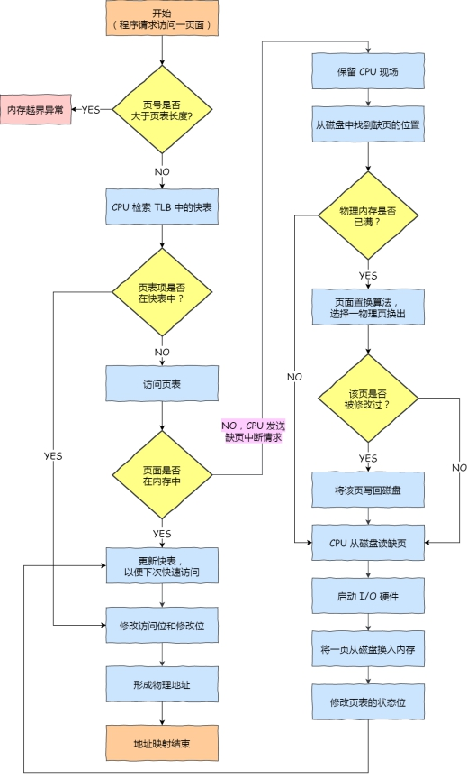

所以，页面置换算法的功能是，当出现缺页异常，需调入新页面而内存已满时，选择被置换的物理页面，也就是说选择一个物理页面换出到磁盘，然后把需要访问的页面换入到物理页。

那其算法目标则是，尽可能减少页面的换入换出的次数，常见的页面置换算法有如下几种：

- 最佳页面置换算法（**OPT**）

- 先进先出置换算法（**FIFO**）

- 最近最久未使用的置换算法（**LRU**）

- 时钟页面置换算法（**Lock**）

- 最不常用置换算法（**LFU**）


#### 最佳页面置换算法

最佳页面置换算法基本思路是，置换在「未来」最长时间不访问的页面。

所以，该算法实现需要计算内存中每个逻辑页面的「下一次」访问时间，然后比较，选择未来最长时间不访问的页面。

我们举个例子，假设一开始有 3 个空闲的物理页，然后有请求的页面序列，那它的置换过程如下图：

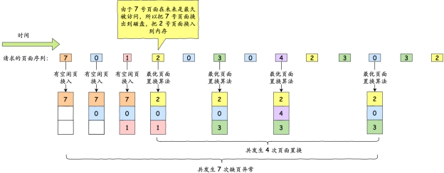

在这个请求的页面序列中，缺页共发生了 7次（空闲页换入 3 次 + 最优页面置换 4 次），页面置换共发生了 4次。

这很理想，但是实际系统中无法实现，因为程序访问页面时是动态的，我们是无法预知每个页面在「下一次」访问前的等待时间。

所以，最佳页面置换算法作用是为了衡量你的算法的效率，你的算法效率越接近该算法的效率，那么说明你的算法是高效的。


#### 先进先出置换算法

既然我们无法预知页面在下一次访问前所需的等待时间，那我们可以选择在内存驻留时间很长的页面进行中置换，这个就是「先进先出置换」算法的思想。

还是以前面的请求的页面序列作为例子，假设使用先进先出置换算法，则过程如下图：

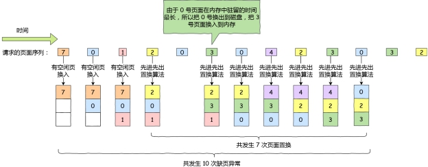

在这个请求的页面序列中，缺页共发生了 10次，页面置换共发生了 7次，跟最佳页面置换算法比较起来，性能明显差了很多。


#### 最近最久未使用的置换算法

最近最久未使用（**LRU**）的置换算法的基本思路是，发生缺页时，选择最长时间没有被访问的页面进行置换，也就是说，该算法假设已经很久没有使用的页面很有可能在未来较长的一段时间内仍然不会被使用。

这种算法近似最优置换算法，最优置换算法是通过「未来」的使用情况来推测要淘汰的页面，而 LRU 则是通过「历史」的使用情况来推测要淘汰的页面。

还是以前面的请求的页面序列作为例子，假设使用最近最久未使用的置换算法，则过程如下图：

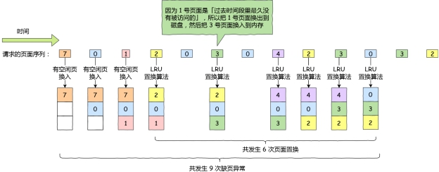

在这个请求的页面序列中，缺页共发生了 9次，页面置换共发生了 6次，跟先进先出置换算法比较起来，性能提高了一些。

虽然 LRU 在理论上是可以实现的，但代价很高。为了完全实现 LRU，需要在内存中维护一个所有页面的链表，最近最多使用的页面在表头，最近最少使用的页面在表尾。

困难的是，在每次访问内存时都必须要更新「整个链表」。在链表中找到一个页面，删除它，然后把它移动到表头是一个非常费时的操作。

所以，LRU 虽然看上去不错，但是由于开销比较大，实际应用中比较少使用。


#### 时钟页面置换算法

那有没有一种即能优化置换的次数，也能方便实现的算法呢？

时钟页面置换算法就可以两者兼得，它跟 LRU 近似，又是对 FIFO 的一种改进。

该算法的思路是，把所有的页面都保存在一个类似钟面的「环形链表」中，一个表针指向最老的页面。

当发生缺页中断时，算法首先检查表针指向的页面：

- 如果它的访问位位是 0 就淘汰该页面，并把新的页面插入这个位置，然后把表针前移一个位置；

- 如果访问位是 1 就清除访问位，并把表针前移一个位置，重复这个过程直到找到了一个访问位为 0 的页面为止；

我画了一副时钟页面置换算法的工作流程图，你可以在下方看到：

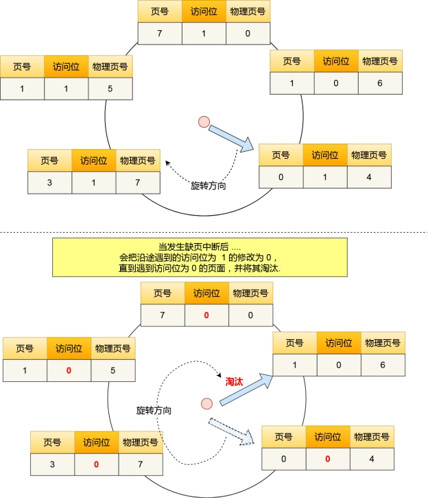

了解了这个算法的工作方式，就明白为什么它被称为时钟（**Clock**）算法了。


#### 最不常用算法

最不常用（**LFU**）算法，这名字听起来很调皮，但是它的意思不是指这个算法不常用，而是当发生缺页中断时，选择「访问次数」最少的那个页面，并将其淘汰。

它的实现方式是，对每个页面设置一个「访问计数器」，每当一个页面被访问时，该页面的访问计数器就累加 1。在发生缺页中断时，淘汰计数器值最小的那个页面。

看起来很简单，每个页面加一个计数器就可以实现了，但是在操作系统中实现的时候，我们需要考虑效率和硬件成本的。

要增加一个计数器来实现，这个硬件成本是比较高的，另外如果要对这个计数器查找哪个页面访问次数最小，查找链表本身，如果链表长度很大，是非常耗时的，效率不高。

但还有个问题，LFU 算法只考虑了频率问题，没考虑时间的问题，比如有些页面在过去时间里访问的频率很高，但是现在已经没有访问了，而当前频繁访问的页面由于没有这些页面访问的次数高，在发生缺页中断时，就会可能会误伤当前刚开始频繁访问，但访问次数还不高的页面。

那这个问题的解决的办法还是有的，可以定期减少访问的次数，比如当发生时间中断时，把过去时间访问的页面的访问次数除以 2，也就说，随着时间的流失，以前的高访问次数的页面会慢慢减少，相当于加大了被置换的概率。


### 磁盘调度算法

我们来看看磁盘的结构，如下图：

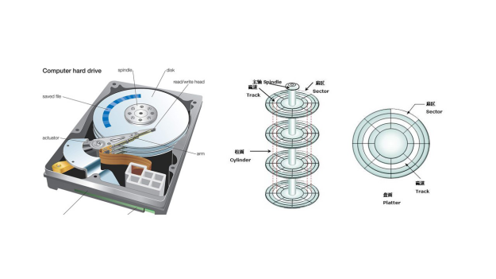

常见的机械磁盘是上图左边的样子，中间圆的部分是磁盘的盘片，一般会有多个盘片，每个盘面都有自己的磁头。右边的图就是一个盘片的结构，盘片中的每一层分为多个磁道，每个磁道分多个扇区，每个扇区是 512字节。那么，多个具有相同编号的磁道形成一个圆柱，称之为磁盘的柱面，如上图里中间的样子。

磁盘调度算法的目的很简单，就是为了提高磁盘的访问性能，一般是通过优化磁盘的访问请求顺序来做到的。

寻道的时间是磁盘访问最耗时的部分，如果请求顺序优化的得当，必然可以节省一些不必要的寻道时间，从而提高磁盘的访问性能。

假设有下面一个请求序列，每个数字代表磁道的位置：

98，183，37，122，14，124，65，67

初始磁头当前的位置是在第 53磁道。

接下来，分别对以上的序列，作为每个调度算法的例子，那常见的磁盘调度算法有：

- 先来先服务算法

- 最短寻道时间优先算法

- 扫描算法算法

- 循环扫描算法

- LOOK 与 C-LOOK 算法


#### 先来先服务

先来先服务（**First-Come，First-Served，FCFS**），顾名思义，先到来的请求，先被服务。

那按照这个序列的话：

98，183，37，122，14，124，65，67

那么，磁盘的写入顺序是从左到右，如下图：

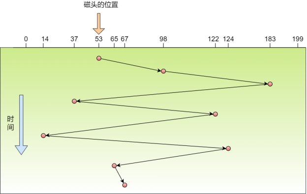

先来先服务算法总共移动了 640个磁道的距离，这么一看这种算法，比较简单粗暴，但是如果大量进程竞争使用磁盘，请求访问的磁道可能会很分散，那先来先服务算法在性能上就会显得很差，因为寻道时间过长。


#### 最短寻道时间优先

最短寻道时间优先（**Shortest Seek First，SSF**）算法的工作方式是，优先选择从当前磁头位置所需寻道时间最短的请求，还是以这个序列为例子：

98，183，37，122，14，124，65，67

那么，那么根据距离磁头（ 53 位置）最近的请求的算法，具体的请求则会是下列从左到右的顺序：

65，67，37，14，98，122，124，183

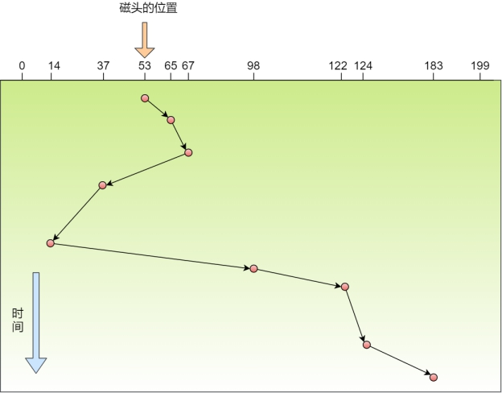

磁头移动的总距离是 236磁道，相比先来先服务性能提高了不少。

但这个算法可能存在某些请求的饥饿，因为本次例子我们是静态的序列，看不出问题，假设是一个动态的请求，如果后续来的请求都是小于 183磁道的，那么 183 磁道可能永远不会被响应，于是就产生了饥饿现象，这里产生饥饿的原因是磁头在一小块区域来回移动。


### 扫描算法

最短寻道时间优先算法会产生饥饿的原因在于：磁头有可能再一个小区域内来回得移动。

为了防止这个问题，可以规定：磁头在一个方向上移动，访问所有未完成的请求，直到磁头到达该方向上的最后的磁道，才调换方向，这就是扫描（**Scan**）算法。

这种算法也叫做电梯算法，比如电梯保持按一个方向移动，直到在那个方向上没有请求为止，然后改变方向。

还是以这个序列为例子，磁头的初始位置是 53：

98，183，37，122，14，124，65，67

那么，假设扫描调度算先朝磁道号减少的方向移动，具体请求则会是下列从左到右的顺序：

37，14，0
，65，67，98，122，124，183

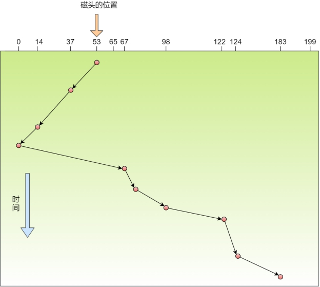

磁头先响应左边的请求，直到到达最左端（ 0 磁道）后，才开始反向移动，响应右边的请求。

扫描调度算法性能较好，不会产生饥饿现象，但是存在这样的问题，中间部分的磁道会比较占便宜，中间部分相比其他部分响应的频率会比较多，也就是说每个磁道的响应频率存在差异。


#### 循环扫描算法

扫描算法使得每个磁道响应的频率存在差异，那么要优化这个问题的话，可以总是按相同的方向进行扫描，使得每个磁道的响应频率基本一致。

循环扫描（**Circular Scan, CSCAN** ）规定：只有磁头朝某个特定方向移动时，才处理磁道访问请求，而返回时直接快速移动至最靠边缘的磁道，也就是复位磁头，这个过程是很快的，并且返回中途不处理任何请求，该算法的特点，就是磁道只响应一个方向上的请求。

还是以这个序列为例子，磁头的初始位置是 53：

98，183，37，122，14，124，65，67

那么，假设循环扫描调度算先朝磁道增加的方向移动，具体请求会是下列从左到右的顺序：

65，67，98，122，124，183，199
，0
，14，37

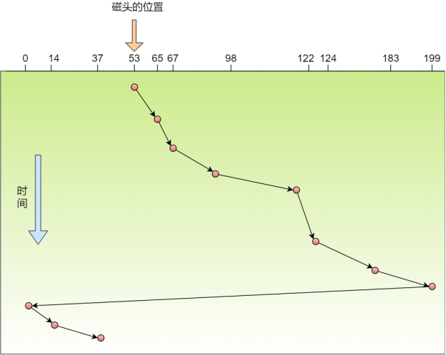

磁头先响应了右边的请求，直到碰到了最右端的磁道 199，就立即回到磁盘的开始处（磁道 0），但这个返回的途中是不响应任何请求的，直到到达最开始的磁道后，才继续顺序响应右边的请求。

循环扫描算法相比于扫描算法，对于各个位置磁道响应频率相对比较平均。


#### LOOK 与 C-LOOK算法

我们前面说到的扫描算法和循环扫描算法，都是磁头移动到磁盘「最始端或最末端」才开始调换方向。

那这其实是可以优化的，优化的思路就是磁头在移动到「最远的请求」位置，然后立即反向移动。

那针对 SCAN 算法的优化则叫 LOOK 算法，它的工作方式，磁头在每个方向上仅仅移动到最远的请求位置，然后立即反向移动，而不需要移动到磁盘的最始端或最末端，反向移动的途中会响应请求。

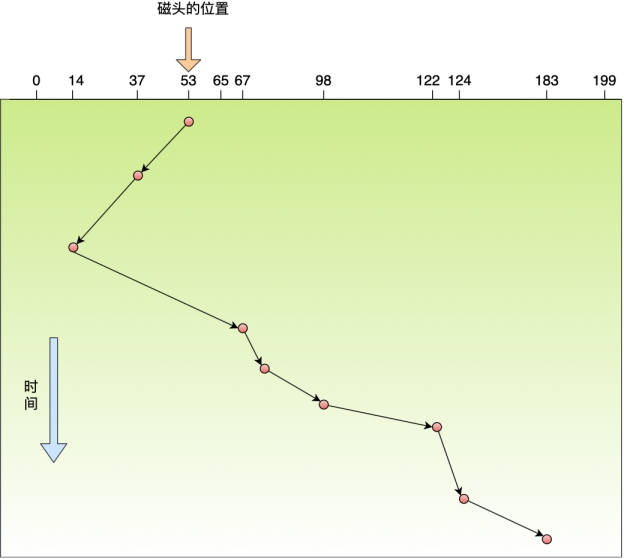

而针 C-SCAN 算法的优化则叫 C-LOOK，它的工作方式，磁头在每个方向上仅仅移动到最远的请求位置，然后立即反向移动，而不需要移动到磁盘的最始端或最末端，反向移动的途中不会响应请求。


# 六、 文件系统


## 6.1 文件系统

不多 BB，直接上「硬菜」。


### 文件系统的基本组成

文件系统是操作系统中负责管理持久数据的子系统，说简单点，就是负责把用户的文件存到磁盘硬件中，因为即使计算机断电了，磁盘里的数据并不会丢失，所以可以持久化的保存文件。

文件系统的基本数据单位是文件，它的目的是对磁盘上的文件进行组织管理，那组织的方式不同，就会形成不同的文件系统。

Linux 最经典的一句话是：「一切皆文件」，不仅普通的文件和目录，就连块设备、管道、socket 等，也都是统一交给文件系统管理的。

Linux 文件系统会为每个文件分配两个数据结构：索引节点（**index node**）和目录项（**directory entry**），它们主要用来记录文件的元信息和目录层次结构。

- 索引节点，也就是 **inode**，用来记录文件的元信息，比如 inode 编号、文件大小、访问权限、创建时间、修改时间、数据在磁盘的位置等等。索引节点是文件的唯一标识，它们之间一一对应，也同样都会被存储在硬盘中，所以索引节点同样占用磁盘空间。

- 目录项，也就是 **dentry**，用来记录文件的名字、索引节点指针以及与其他目录项的层级关联关系。多个目录项关联起来，就会形成目录结构，但它与索引节点不同的是，目录项是由内核维护的一个数据结构，不存放于磁盘，而是缓存在内存。

由于索引节点唯一标识一个文件，而目录项记录着文件的名，所以目录项和索引节点的关系是多对一，也就是说，一个文件可以有多个别字。比如，硬链接的实现就是多个目录项中的索引节点指向同一个文件。

注意，目录也是文件，也是用索引节点唯一标识，和普通文件不同的是，普通文件在磁盘里面保存的是文件数据，而目录文件在磁盘里面保存子目录或文件。

目录项和目录是一个东西吗？

虽然名字很相近，但是它们不是一个东西，目录是个文件，持久化存储在磁盘，而目录项是内核一个数据结构，缓存在内存。

如果查询目录频繁从磁盘读，效率会很低，所以内核会把已经读过的目录用目录项这个数据结构缓存在内存，下次再次读到相同的目录时，只需从内存读就可以，大大提高了文件系统的效率。

注意，目录项这个数据结构不只是表示目录，也是可以表示文件的。

那文件数据是如何存储在磁盘的呢？

磁盘读写的最小单位是扇区，扇区的大小只有 512B大小，很明显，如果每次读写都以这么小为单位，那这读写的效率会非常低。

所以，文件系统把多个扇区组成了一个逻辑块，每次读写的最小单位就是逻辑块（数据块），Linux 中的逻辑块大小为 4KB
，也就是一次性读写 8 个扇区，这将大大提高了磁盘的读写的效率。

以上就是索引节点、目录项以及文件数据的关系，下面这个图就很好的展示了它们之间的关系：

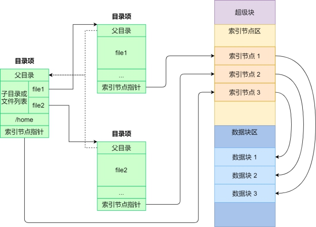

索引节点是存储在硬盘上的数据，那么为了加速文件的访问，通常会把索引节点加载到内存中。

另外，磁盘进行格式化的时候，会被分成三个存储区域，分别是超级块、索引节点区和数据块区。

- **超级块**，用来存储文件系统的详细信息，比如块个数、块大小、空闲块等等。

- **索引节点区**，用来存储索引节点；

- **数据块区**，用来存储文件或目录数据；

我们不可能把超级块和索引节点区全部加载到内存，这样内存肯定撑不住，所以只有当需要使用的时候，才将其加载进内存，它们加载进内存的时机是不同的：

- 超级块：当文件系统挂载时进入内存；

- 索引节点区：当文件被访问时进入内存；


### 虚拟文件系统

文件系统的种类众多，而操作系统希望对用户提供一个统一的接口，于是在用户层与文件系统层引入了中间层，这个中间层就称为虚拟文件系统（**Virtual File System，VFS**）。

VFS 定义了一组所有文件系统都支持的数据结构和标准接口，这样程序员不需要了解文件系统的工作原理，只需要了解 VFS 提供的统一接口即可。

在 Linux 文件系统中，用户空间、系统调用、虚拟机文件系统、缓存、文件系统以及存储之间的关系如下图：

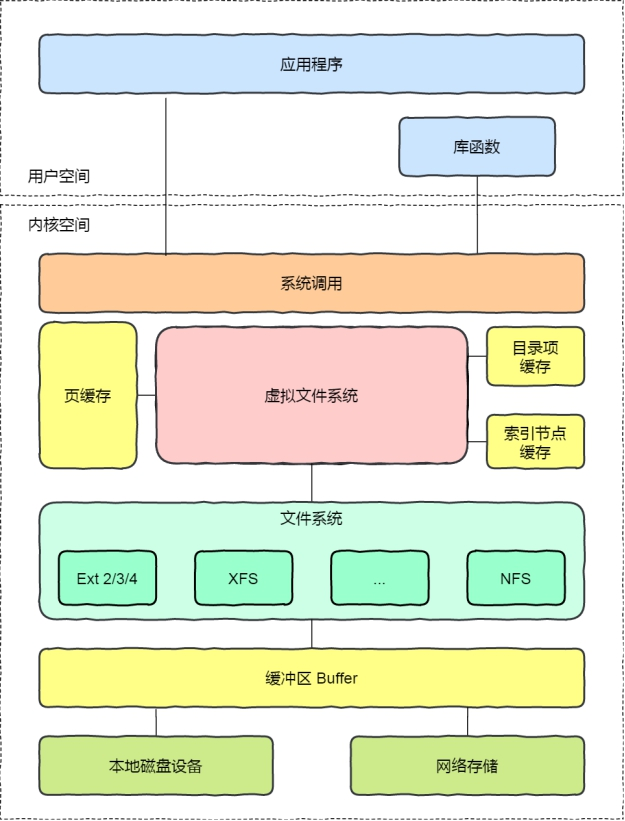

Linux 支持的文件系统也不少，根据存储位置的不同，可以把文件系统分为三类：

- **磁盘的文件系统**，它是直接把数据存储在磁盘中，比如 Ext 2/3/4、XFS 等都是这类文件系统。

- **内存的文件系统**，这类文件系统的数据不是存储在硬盘的，而是占用内存空间，我们经常用到的 /proc和 /sys 文件系统都属于这一类，读写这类文件，实际上是读写内核中相关的数据。

- **网络的文件系统**，用来访问其他计算机主机数据的文件系统，比如 NFS、SMB 等等。

文件系统首先要先挂载到某个目录才可以正常使用，比如 Linux 系统在启动时，会把文件系统挂载到根目录。


### 文件的使用

我们从用户角度来看文件的话，就是我们要怎么使用文件？首先，我们得通过系统调用来打开一个文件。

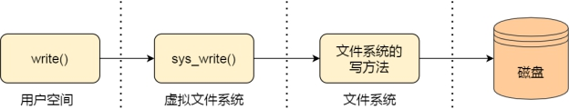

```c
fd = open(name, flag); # 打开文件
...
write(fd,...); # 写数据
...
close(fd); # 关闭文件
```

上面简单的代码是读取一个文件的过程：

- 首先用 open系统调用打开文件，open 的参数中包含文件的路径名和文件名。

- 使用 write写数据，其中 write 使用 open 所返回的文件描述符，并不使用文件名作为参数。

- 使用完文件后，要用 close系统调用关闭文件，避免资源的泄露。

我们打开了一个文件后，操作系统会跟踪进程打开的所有文件，所谓的跟踪呢，就是操作系统为每个进程维护一个打开文件表，文件表里的每一项代表「文件描述符」，所以说文件描述符是打开文件的标识。

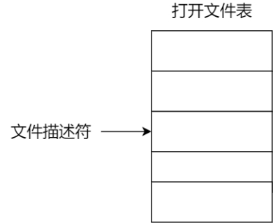

操作系统在打开文件表中维护着打开文件的状态和信息：

- 文件指针：系统跟踪上次读写位置作为当前文件位置指针，这种指针对打开文件的某个进程来说是唯一的；

- 文件打开计数器：文件关闭时，操作系统必须重用其打开文件表条目，否则表内空间不够用。因为多个进程可能打开同一个文件，所以系统在删除打开文件条目之前，必须等待最后一个进程关闭文件，该计数器跟踪打开和关闭的数量，当该计数为 0 时，系统关闭文件，删除该条目；

- 文件磁盘位置：绝大多数文件操作都要求系统修改文件数据，该信息保存在内存中，以免每个操作都从磁盘中读取；

- 访问权限：每个进程打开文件都需要有一个访问模式（创建、只读、读写、添加等），该信息保存在进程的打开文件表中，以便操作系统能允许或拒绝之后的 I/O 请求；

在用户视角里，文件就是一个持久化的数据结构，但操作系统并不会关心你想存在磁盘上的任何的数据结构，操作系统的视角是如何把文件数据和磁盘块对应起来。

所以，用户和操作系统对文件的读写操作是有差异的，用户习惯以字节的方式读写文件，而操作系统则是以数据块来读写文件，那屏蔽掉这种差异的工作就是文件系统了。

我们来分别看一下，读文件和写文件的过程：

- 当用户进程从文件读取 1 个字节大小的数据时，文件系统则需要获取字节所在的数据块，再返回数据块对应的用户进程所需的数据部分。

- 当用户进程把 1 个字节大小的数据写进文件时，文件系统则找到需要写入数据的数据块的位置，然后修改数据块中对应的部分，最后再把数据块写回磁盘。

所以说，文件系统的基本操作单位是数据块。


### 文件的存储

文件的数据是要存储在硬盘上面的，数据在磁盘上的存放方式，就像程序在内存中存放的方式那样，有以下两种：

- 连续空间存放方式

- 非连续空间存放方式

其中，非连续空间存放方式又可以分为「链表方式」和「索引方式」。

不同的存储方式，有各自的特点，重点是要分析它们的存储效率和读写性能，接下来分别对每种存储方式说一下。


#### 连续空间存放方式

连续空间存放方式顾名思义，文件存放在磁盘「连续的」物理空间中。这种模式下，文件的数据都是紧密相连，读写效率很高，因为一次磁盘寻道就可以读出整个文件。

使用连续存放的方式有一个前提，必须先知道一个文件的大小，这样文件系统才会根据文件的大小在磁盘上找到一块连续的空间分配给文件。

所以，文件头里需要指定「起始块的位置」和「长度」，有了这两个信息就可以很好的表示文件存放方式是一块连续的磁盘空间。

注意，此处说的文件头，就类似于 Linux 的 inode。


连续空间存放的方式虽然读写效率高，但是有「磁盘空间碎片」和「文件长度不易扩展」的缺陷。

如下图，如果文件 B 被删除，磁盘上就留下一块空缺，这时，如果新来的文件小于其中的一个空缺，我们就可以将其放在相应空缺里。但如果该文件的大小大于所有的空缺，但却小于空缺大小之和，则虽然磁盘上有足够的空缺，但该文件还是不能存放。当然了，我们可以通过将现有文件进行挪动来腾出空间以容纳新的文件，但是这个在磁盘挪动文件是非常耗时，所以这种方式不太现实。

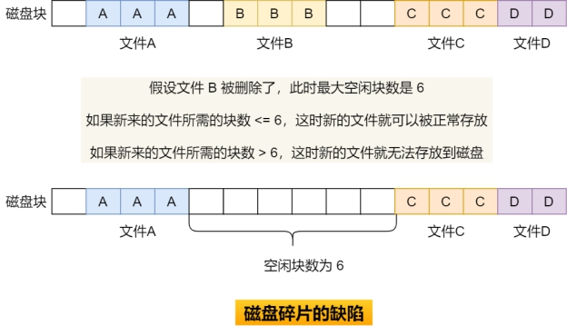

另外一个缺陷是文件长度扩展不方便，例如上图中的文件 A 要想扩大一下，需要更多的磁盘空间，唯一的办法就只能是挪动的方式，前面也说了，这种方式效率是非常低的。

那么有没有更好的方式来解决上面的问题呢？答案当然有，既然连续空间存放的方式不太行，那么我们就改变存放的方式，使用非连续空间存放方式来解决这些缺陷。


#### 非连续空间存放方式

非连续空间存放方式分为「链表方式」和「索引方式」。

我们先来看看链表的方式。

链表的方式存放是离散的，不用连续的，于是就可以消除磁盘碎片，可大大提高磁盘空间的利用率，同时文件的长度可以动态扩展。根据实现的方式的不同，链表可分为「隐式链表」和「显式链接」两种形式。

文件要以「隐式链表」的方式存放的话，实现的方式是文件头要包含「第一块」和「最后一块」的位置，并且每个数据块里面留出一个指针空间，用来存放下一个数据块的位置，这样一个数据块连着一个数据块，从链头开是就可以顺着指针找到所有的数据块，所以存放的方式可以是不连续的。

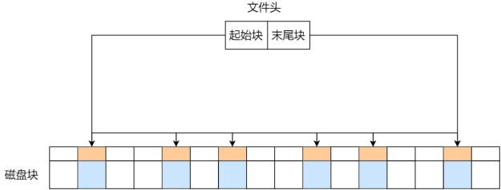

隐式链表的存放方式的缺点在于无法直接访问数据块，只能通过指针顺序访问文件，以及数据块指针消耗了一定的存储空间。隐式链接分配的稳定性较差，系统在运行过程中由于软件或者硬件错误导致链表中的指针丢失或损坏，会导致文件数据的丢失。

如果取出每个磁盘块的指针，把它放在内存的一个表中，就可以解决上述隐式链表的两个不足。那么，这种实现方式是「显式链接」，它指把用于链接文件各数据块的指针，显式地存放在内存的一张链接表中，该表在整个磁盘仅设置一张，每个表项中存放链接指针，指向下一个数据块号。

对于显式链接的工作方式，我们举个例子，文件 A 依次使用了磁盘块 4、7、2、10 和 12 ，文件 B 依次使用了磁盘块 6、3、11 和 14 。利用下图中的表，可以从第 4 块开始，顺着链走到最后，找到文件 A 的全部磁盘块。同样，从第 6 块开始，顺着链走到最后，也能够找出文件 B 的全部磁盘块。最后，这两个链都以一个不属于有效磁盘编号的特殊标记（如 -1 ）结束。内存中的这样一个表格称为文件分配表（**File Allocation Table，FAT**）。

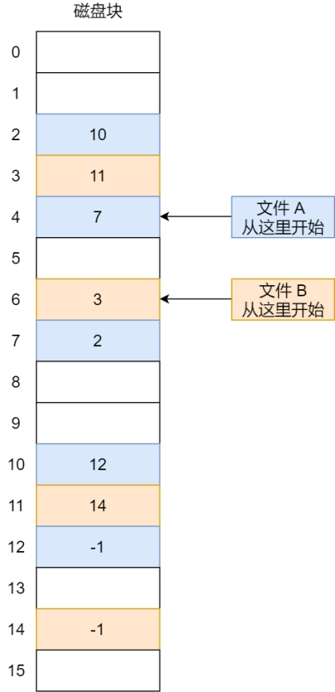

由于查找记录的过程是在内存中进行的，因而不仅显著地提高了检索速度，而且大大减少了访问磁盘的次数。但也正是整个表都存放在内存中的关系，它的主要的缺点是不适用于大磁盘。

比如，对于 200GB 的磁盘和 1KB 大小的块，这张表需要有 2 亿项，每一项对应于这 2 亿个磁盘块中的一个块，每项如果需要 4 个字节，那这张表要占用 800MB 内存，很显然 FAT 方案对于大磁盘而言不太合适。

接下来，我们来看看索引的方式。

链表的方式解决了连续分配的磁盘碎片和文件动态扩展的问题，但是不能有效支持直接访问（FAT除外），索引的方式可以解决这个问题。

索引的实现是为每个文件创建一个「索引数据块」，里面存放的是指向文件数据块的指针列表，说白了就像书的目录一样，要找哪个章节的内容，看目录查就可以。

另外，文件头需要包含指向「索引数据块」的指针，这样就可以通过文件头知道索引数据块的位置，再通过索引数据块里的索引信息找到对应的数据块。

创建文件时，索引块的所有指针都设为空。当首次写入第 i 块时，先从空闲空间中取得一个块，再将其地址写到索引块的第 i 个条目。

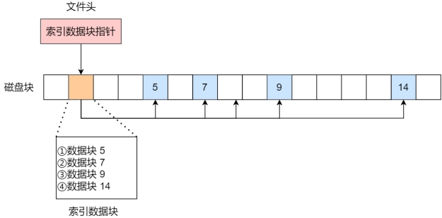

索引的方式优点在于：

- 文件的创建、增大、缩小很方便；

- 不会有碎片的问题；

- 支持顺序读写和随机读写；

由于索引数据也是存放在磁盘块的，如果文件很小，明明只需一块就可以存放的下，但还是需要额外分配一块来存放索引数据，所以缺陷之一就是存储索引带来的开销。

如果文件很大，大到一个索引数据块放不下索引信息，这时又要如何处理大文件的存放呢？我们可以通过组合的方式，来处理大文件的存。

先来看看链表 + 索引的组合，这种组合称为「链式索引块」，它的实现方式是在索引数据块留出一个存放下一个索引数据块的指针，于是当一个索引数据块的索引信息用完了，就可以通过指针的方式，找到下一个索引数据块的信息。那这种方式也会出现前面提到的链表方式的问题，万一某个指针损坏了，后面的数据也就会无法读取了。

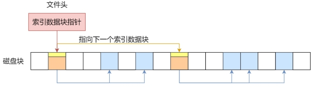

还有另外一种组合方式是索引 + 索引的方式，这种组合称为「多级索引块」，实现方式是通过一个索引块来存放多个索引数据块，一层套一层索引，像极了俄罗斯套娃是吧。

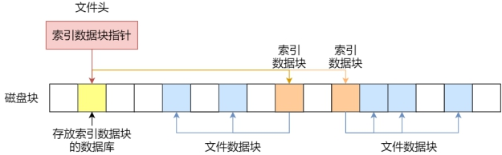


#### Unix 文件的实现方式

我们先把前面提到的文件实现方式，做个比较：

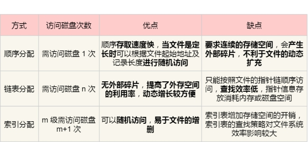

那早期 Unix 文件系统是组合了前面的文件存放方式的优点，如下图：

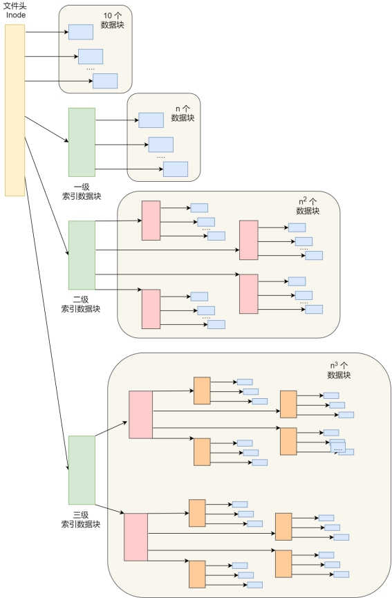

它是根据文件的大小，存放的方式会有所变化：

- 如果存放文件所需的数据块小于 10 块，则采用直接查找的方式；

- 如果存放文件所需的数据块超过 10 块，则采用一级间接索引方式；

- 如果前面两种方式都不够存放大文件，则采用二级间接索引方式；

- 如果二级间接索引也不够存放大文件，这采用三级间接索引方式；

那么，文件头（**Inode**）就需要包含 13 个指针：

- 10 个指向数据块的指针；

- 第 11 个指向索引块的指针；

- 第 12 个指向二级索引块的指针；

- 第 13 个指向三级索引块的指针；

所以，这种方式能很灵活地支持小文件和大文件的存放：

- 对于小文件使用直接查找的方式可减少索引数据块的开销；

- 对于大文件则以多级索引的方式来支持，所以大文件在访问数据块时需要大量查询；

这个方案就用在了 Linux Ext 2/3 文件系统里，虽然解决大文件的存储，但是对于大文件的访问，需要大量的查询，效率比较低。

为了解决这个问题，Ext 4 做了一定的改变，具体怎么解决的，本文就不展开了。


### 空闲空间管理

前面说到的文件的存储是针对已经被占用的数据块组织和管理，接下来的问题是，如果我要保存一个数据块，我应该放在硬盘上的哪个位置呢？难道需要将所有的块扫描一遍，找个空的地方随便放吗？

那这种方式效率就太低了，所以针对磁盘的空闲空间也是要引入管理的机制，接下来介绍几种常见的方法：

- 空闲表法

- 空闲链表法

- 位图法


#### 空闲表法

空闲表法就是为所有空闲空间建立一张表，表内容包括空闲区的第一个块号和该空闲区的块个数，注意，这个方式是连续分配的。如下图：

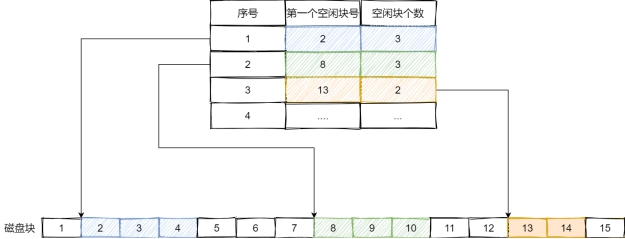

当请求分配磁盘空间时，系统依次扫描空闲表里的内容，直到找到一个合适的空闲区域为止。当用户撤销一个文件时，系统回收文件空间。这时，也需顺序扫描空闲表，寻找一个空闲表条目并将释放空间的第一个物理块号及它占用的块数填到这个条目中。

这种方法仅当有少量的空闲区时才有较好的效果。因为，如果存储空间中有着大量的小的空闲区，则空闲表变得很大，这样查询效率会很低。另外，这种分配技术适用于建立连续文件。


#### 空闲链表法

我们也可以使用「链表」的方式来管理空闲空间，每一个空闲块里有一个指针指向下一个空闲块，这样也能很方便的找到空闲块并管理起来。如下图：

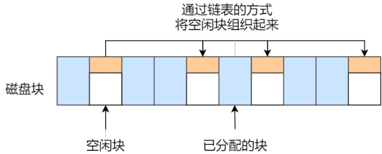

当创建文件需要一块或几块时，就从链头上依次取下一块或几块。反之，当回收空间时，把这些空闲块依次接到链头上。

这种技术只要在主存中保存一个指针，令它指向第一个空闲块。其特点是简单，但不能随机访问，工作效率低，因为每当在链上增加或移动空闲块时需要做很多 I/O 操作，同时数据块的指针消耗了一定的存储空间。

空闲表法和空闲链表法都不适合用于大型文件系统，因为这会使空闲表或空闲链表太大。


#### 位图法

位图是利用二进制的一位来表示磁盘中一个盘块的使用情况，磁盘上所有的盘块都有一个二进制位与之对应。

当值为 0 时，表示对应的盘块空闲，值为 1 时，表示对应的盘块已分配。它形式如下：

1111110011111110001110110111111100111 ...

在 Linux 文件系统就采用了位图的方式来管理空闲空间，不仅用于数据空闲块的管理，还用于 inode 空闲块的管理，因为 inode 也是存储在磁盘的，自然也要有对其管理。


### 文件系统的结构

前面提到 Linux 是用位图的方式管理空闲空间，用户在创建一个新文件时，Linux 内核会通过 inode 的位图找到空闲可用的 inode，并进行分配。要存储数据时，会通过块的位图找到空闲的块，并分配，但仔细计算一下还是有问题的。

数据块的位图是放在磁盘块里的，假设是放在一个块里，一个块 4K，每位表示一个数据块，共可以表示 4 ** 1024 ** 8 = 2^15个空闲块，由于 1 个数据块是 4K 大小，那么最大可以表示的空间为 2^15 ** 4 ** 1024 = 2^27个 byte，也就是 128M。


也就是说按照上面的结构，如果采用「一个块的位图 + 一系列的块」，外加「一个块的 inode 的位图 + 一系列的 inode 的结构」能表示的最大空间也就 128M，这太少了，现在很多文件都比这个大。

在 Linux 文件系统，把这个结构称为一个块组，那么有 N 多的块组，就能够表示 N 大的文件。

下图给出了 Linux Ext2 整个文件系统的结构和块组的内容，文件系统都由大量块组组成，在硬盘上相继排布：


最前面的第一个块是引导块，在系统启动时用于启用引导，接着后面就是一个一个连续的块组了，块组的内容如下：

- **超级块**，包含的是文件系统的重要信息，比如 inode 总个数、块总个数、每个块组的 inode 个数、每个块组的块个数等等。

- **块组描述符**，包含文件系统中各个块组的状态，比如块组中空闲块和 inode 的数目等，每个块组都包含了文件系统中「所有块组的组描述符信息」。

- **数据位图和 inode 位图**， 用于表示对应的数据块或 inode 是空闲的，还是被使用中。

- **inode 列表**，包含了块组中所有的 inode，inode 用于保存文件系统中与各个文件和目录相关的所有元数据。

- **数据块**，包含文件的有用数据。

你可以会发现每个块组里有很多重复的信息，比如超级块和块组描述符表，这两个都是全局信息，而且非常的重要，这么做是有两个原因：

- 如果系统崩溃破坏了超级块或块组描述符，有关文件系统结构和内容的所有信息都会丢失。如果有冗余的副本，该信息是可能恢复的。

- 通过使文件和管理数据尽可能接近，减少了磁头寻道和旋转，这可以提高文件系统的性能。

不过，Ext2 的后续版本采用了稀疏技术。该做法是，超级块和块组描述符表不再存储到文件系统的每个块组中，而是只写入到块组 0、块组 1 和其他 ID 可以表示为 3、 5、7 的幂的块组中。


### 目录的存储

在前面，我们知道了一个普通文件是如何存储的，但还有一个特殊的文件，经常用到的目录，它是如何保存的呢？

基于 Linux 一切皆文件的设计思想，目录其实也是个文件，你甚至可以通过 vim打开它，它也有 inode，inode 里面也是指向一些块。

和普通文件不同的是，普通文件的块里面保存的是文件数据，而目录文件的块里面保存的是目录里面一项一项的文件信息。

在目录文件的块中，最简单的保存格式就是列表，就是一项一项地将目录下的文件信息（如文件名、文件 inode、文件类型等）列在表里。

列表中每一项就代表该目录下的文件的文件名和对应的 inode，通过这个 inode，就可以找到真正的文件。

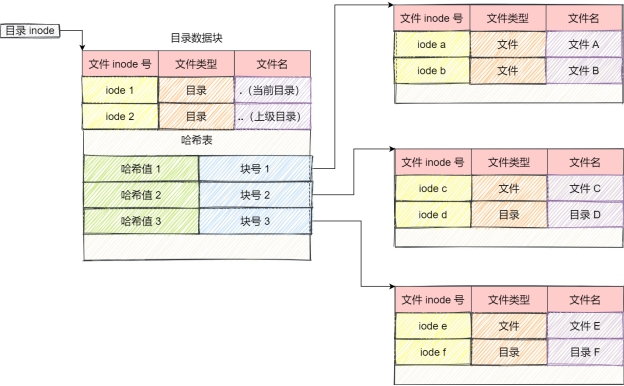

通常，第一项是「.
」，表示当前目录，第二项是「..
」，表示上一级目录，接下来就是一项一项的文件名和 inode。

如果一个目录有超级多的文件，我们要想在这个目录下找文件，按照列表一项一项的找，效率就不高了。

于是，保存目录的格式改成哈希表，对文件名进行哈希计算，把哈希值保存起来，如果我们要查找一个目录下面的文件名，可以通过名称取哈希。如果哈希能够匹配上，就说明这个文件的信息在相应的块里面。

Linux 系统的 ext 文件系统就是采用了哈希表，来保存目录的内容，这种方法的优点是查找非常迅速，插入和删除也较简单，不过需要一些预备措施来避免哈希冲突。

目录查询是通过在磁盘上反复搜索完成，需要不断地进行 I/O 操作，开销较大。所以，为了减少 I/O 操作，把当前使用的文件目录缓存在内存，以后要使用该文件时只要在内存中操作，从而降低了磁盘操作次数，提高了文件系统的访问速度。


### 软链接和硬链接

有时候我们希望给某个文件取个别名，那么在 Linux 中可以通过硬链接（**Hard Link**） 和软链接（**Symbolic Link**） 的方式来实现，它们都是比较特殊的文件，但是实现方式也是不相同的。

硬链接是多个目录项中的「索引节点」指向一个文件，也就是指向同一个 inode，但是 inode 是不可能跨越文件系统的，每个文件系统都有各自的 inode 数据结构和列表，所以硬链接是不可用于跨文件系统的。由于多个目录项都是指向一个 inode，那么只有删除文件的所有硬链接以及源文件时，系统才会彻底删除该文件。

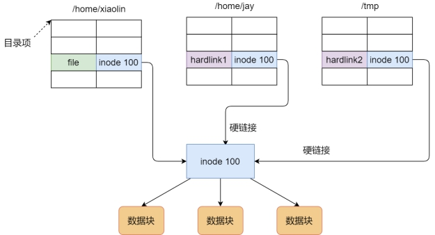

软链接相当于重新创建一个文件，这个文件有独立的 inode，但是这个文件的内容是另外一个文件的路径，所以访问软链接的时候，实际上相当于访问到了另外一个文件，所以软链接是可以跨文件系统的，甚至目标文件被删除了，链接文件还是在的，只不过指向的文件找不到了而已。

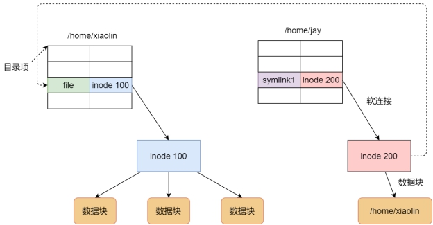


### 文件 I/O

文件的读写方式各有千秋，对于文件的 I/O 分类也非常多，常见的有

- 缓冲与非缓冲 I/O

- 直接与非直接 I/O

- 阻塞与非阻塞 I/O VS 同步与异步 I/O

接下来，分别对这些分类讨论讨论。


#### 缓冲与非缓冲 I/O

文件操作的标准库是可以实现数据的缓存，那么根据「是否利用标准库缓冲」，可以把文件 I/O 分为缓冲 I/O 和非缓冲 I/O：

- 缓冲 I/O，利用的是标准库的缓存实现文件的加速访问，而标准库再通过系统调用访问文件。

- 非缓冲 I/O，直接通过系统调用访问文件，不经过标准库缓存。

这里所说的「缓冲」特指标准库内部实现的缓冲。

比方说，很多程序遇到换行时才真正输出，而换行前的内容，其实就是被标准库暂时缓存了起来，这样做的目的是，减少系统调用的次数，毕竟系统调用是有 CPU 上下文切换的开销的。


#### 直接与非直接 I/O

我们都知道磁盘 I/O 是非常慢的，所以 Linux 内核为了减少磁盘 I/O 次数，在系统调用后，会把用户数据拷贝到内核中缓存起来，这个内核缓存空间也就是「页缓存」，只有当缓存满足某些条件的时候，才发起磁盘 I/O 的请求。

那么，根据是「否利用操作系统的缓存」，可以把文件 I/O 分为直接 I/O 与非直接 I/O：

- 直接 I/O，不会发生内核缓存和用户程序之间数据复制，而是直接经过文件系统访问磁盘。

- 非直接 I/O，读操作时，数据从内核缓存中拷贝给用户程序，写操作时，数据从用户程序拷贝给内核缓存，再由内核决定什么时候写入数据到磁盘。

如果你在使用文件操作类的系统调用函数时，指定了 O_DIRECT标志，则表示使用直接 I/O。如果没有设置过，默认使用的是非直接 I/O。

如果用了非直接 I/O 进行写数据操作，内核什么情况下才会把缓存数据写入到磁盘？

以下几种场景会触发内核缓存的数据写入磁盘：

- 在调用 write的最后，当发现内核缓存的数据太多的时候，内核会把数据写到磁盘上；

- 用户主动调用 sync，内核缓存会刷到磁盘上；

- 当内存十分紧张，无法再分配页面时，也会把内核缓存的数据刷到磁盘上；

- 内核缓存的数据的缓存时间超过某个时间时，也会把数据刷到磁盘上；


#### 阻塞与非阻塞 I/O VS 同步与异步 I/O

为什么把阻塞 / 非阻塞与同步与异步放一起说的呢？因为它们确实非常相似，也非常容易混淆，不过它们之间的关系还是有点微妙的。

先来看看阻塞 I/O，当用户程序执行 read，线程会被阻塞，一直等到内核数据准备好，并把数据从内核缓冲区拷贝到应用程序的缓冲区中，当拷贝过程完成，read才会返回。

注意，阻塞等待的是「内核数据准备好」和「数据从内核态拷贝到用户态」这两个过程。过程如下图：

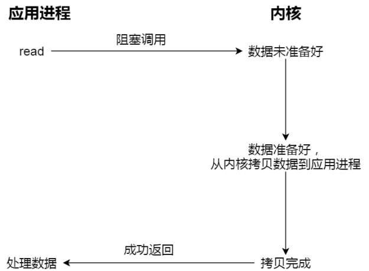

知道了阻塞 I/O ，来看看非阻塞 I/O，非阻塞的 read 请求在数据未准备好的情况下立即返回，可以继续往下执行，此时应用程序不断轮询内核，直到数据准备好，内核将数据拷贝到应用程序缓冲区，read调用才可以获取到结果。过程如下图：

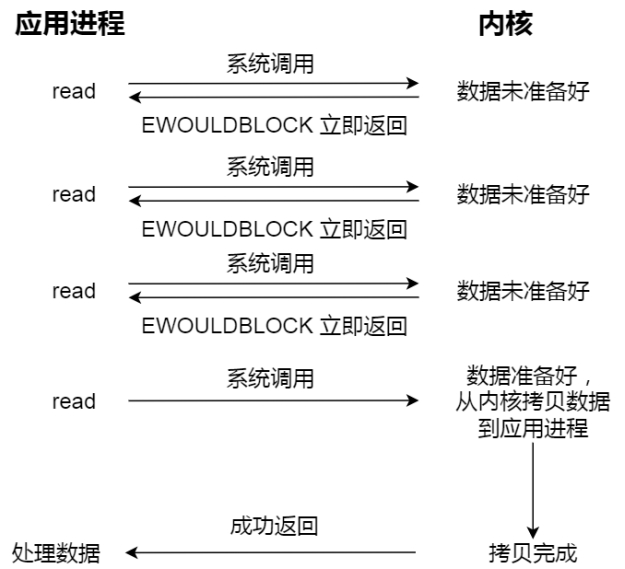

注意，这里最后一次 read 调用，获取数据的过程，是一个同步的过程，是需要等待的过程。这里的同步指的是内核态的数据拷贝到用户程序的缓存区这个过程。

举个例子，访问管道或 socket 时，如果设置了 O_NONBLOCK标志，那么就表示使用的是非阻塞 I/O 的方式访问，而不做任何设置的话，默认是阻塞 I/O。

应用程序每次轮询内核的 I/O 是否准备好，感觉有点傻乎乎，因为轮询的过程中，应用程序啥也做不了，只是在循环。

为了解决这种傻乎乎轮询方式，于是 I/O 多路复用技术就出来了，如 select、poll，它是通过 I/O 事件分发，当内核数据准备好时，再以事件通知应用程序进行操作。

这个做法大大改善了应用进程对 CPU 的利用率，在没有被通知的情况下，应用进程可以使用 CPU 做其他的事情。

下图是使用 select I/O 多路复用过程。注意，read获取数据的过程（数据从内核态拷贝到用户态的过程），也是一个同步的过程，需要等待：

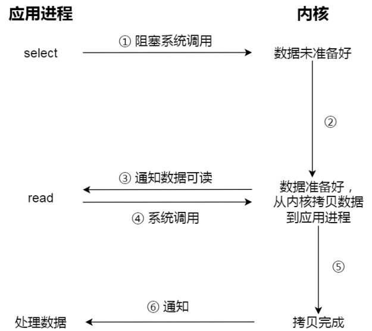

实际上，无论是阻塞 I/O、非阻塞 I/O，还是基于非阻塞 I/O 的多路复用都是同步调用。因为它们在 read 调用时，内核将数据从内核空间拷贝到应用程序空间，过程都是需要等待的，也就是说这个过程是同步的，如果内核实现的拷贝效率不高，read 调用就会在这个同步过程中等待比较长的时间。

而真正的异步 I/O 是「内核数据准备好」和「数据从内核态拷贝到用户态」这两个过程都不用等待。

当我们发起 aio_read之后，就立即返回，内核自动将数据从内核空间拷贝到应用程序空间，这个拷贝过程同样是异步的，内核自动完成的，和前面的同步操作不一样，应用程序并不需要主动发起拷贝动作。过程如下图：

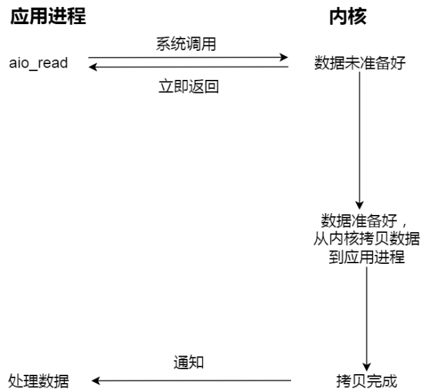

下面这张图，总结了以上几种 I/O 模型：

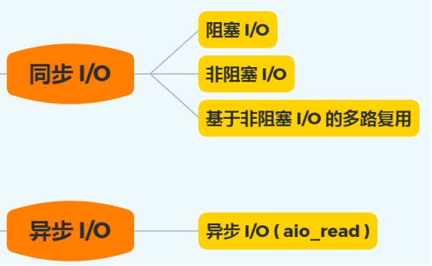

在前面我们知道了，I/O 是分为两个过程的：

1. 数据准备的过程

2. 数据从内核空间拷贝到用户进程缓冲区的过程

阻塞 I/O 会阻塞在「过程 1 」和「过程 2」，而非阻塞 I/O 和基于非阻塞 I/O 的多路复用只会阻塞在「过程 2」，所以这三个都可以认为是同步 I/O。

异步 I/O 则不同，「过程 1 」和「过程 2 」都不会阻塞。

用故事去理解这几种 I/O 模型

举个你去饭堂吃饭的例子，你好比用户程序，饭堂好比操作系统。

阻塞 I/O 好比，你去饭堂吃饭，但是饭堂的菜还没做好，然后你就一直在那里等啊等，等了好长一段时间终于等到饭堂阿姨把菜端了出来（数据准备的过程），但是你还得继续等阿姨把菜（内核空间）打到你的饭盒里（用户空间），经历完这两个过程，你才可以离开。

非阻塞 I/O 好比，你去了饭堂，问阿姨菜做好了没有，阿姨告诉你没，你就离开了，过几十分钟，你又来饭堂问阿姨，阿姨说做好了，于是阿姨帮你把菜打到你的饭盒里，这个过程你是得等待的。

基于非阻塞的 I/O 多路复用好比，你去饭堂吃饭，发现有一排窗口，饭堂阿姨告诉你这些窗口都还没做好菜，等做好了再通知你，于是等啊等（select调用中），过了一会阿姨通知你菜做好了，但是不知道哪个窗口的菜做好了，你自己看吧。于是你只能一个一个窗口去确认，后面发现 5 号窗口菜做好了，于是你让 5 号窗口的阿姨帮你打菜到饭盒里，这个打菜的过程你是要等待的，虽然时间不长。打完菜后，你自然就可以离开了。

异步 I/O 好比，你让饭堂阿姨将菜做好并把菜打到饭盒里后，把饭盒送到你面前，整个过程你都不需要任何等待。


# 七、设备管理


## 7.1 键盘敲入A 字母时，操作系统期间发生了什么？

键盘可以说是我们最常使用的输入硬件设备了，但身为程序员的你，你知道「键盘敲入A 字母时，操作系统期间发生了什么吗」？

那要想知道这个发生的过程，我们得先了解了解「操作系统是如何管理多种多样的的输入输出设备」的，等了解完这个后，我们再来看看这个问题，你就会发现问题已经被迎刃而解了。


### 设备控制器

我们的电脑设备可以接非常多的输入输出设备，比如键盘、鼠标、显示器、网卡、硬盘、打印机、音响等等，每个设备的用法和功能都不同，那操作系统是如何把这些输入输出设备统一管理的呢?

为了屏蔽设备之间的差异，每个设备都有一个叫设备控制器（**Device Control**） 的组件，比如硬盘有硬盘控制器、显示器有视频控制器等。

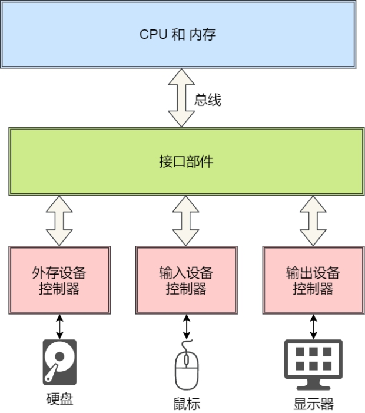

因为这些控制器都很清楚的知道对应设备的用法和功能，所以 CPU 是通过设备控制器来和设备打交道的。

设备控制器里有芯片，它可执行自己的逻辑，也有自己的寄存器，用来与 CPU 进行通信，比如：

- 通过写入这些寄存器，操作系统可以命令设备发送数据、接收数据、开启或关闭，或者执行某些其他操作。

- 通过读取这些寄存器，操作系统可以了解设备的状态，是否准备好接收一个新的命令等。

实际上，控制器是有三类寄存器，它们分别是状态寄存器（**Status Register**）、 命令寄存器（**Command Register**）以及数据寄存器（**Data Register**），如下图：

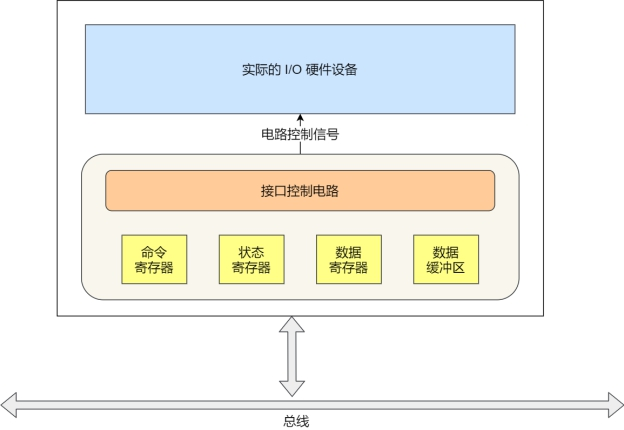

这三个寄存器的作用：

- **数据寄存器**，CPU 向 I/O 设备写入需要传输的数据，比如要打印的内容是「Hello」，CPU 就要先发送一个 H 字符给到对应的 I/O 设备。

- **命令寄存器**，CPU 发送一个命令，告诉 I/O 设备，要进行输入/输出操作，于是就会交给 I/O 设备去工作，任务完成后，会把状态寄存器里面的状态标记为完成。

- **状态寄存器**，目的是告诉 CPU ，现在已经在工作或工作已经完成，如果已经在工作状态，CPU 再发送数据或者命令过来，都是没有用的，直到前面的工作已经完成，状态寄存标记成已完成，CPU 才能发送下一个字符和命令。

CPU 通过读写设备控制器中的寄存器控制设备，这可比 CPU 直接控制输入输出设备，要方便和标准很多。

另外， 输入输出设备可分为两大类 ：块设备（**Block Device**）和字符设备（**Character Device**）。

- **块设备**，把数据存储在固定大小的块中，每个块有自己的地址，硬盘、USB 是常见的块设备。

- **字符设备**，以字符为单位发送或接收一个字符流，字符设备是不可寻址的，也没有任何寻道操作，鼠标是常见的字符设备。

块设备通常传输的数据量会非常大，于是控制器设立了一个可读写的数据缓冲区。

- CPU 写入数据到控制器的缓冲区时，当缓冲区的数据囤够了一部分，才会发给设备。

- CPU 从控制器的缓冲区读取数据时，也需要缓冲区囤够了一部分，才拷贝到内存。

这样做是为了，减少对设备的频繁操作。

那 CPU 是如何与设备的控制寄存器和数据缓冲区进行通信的？存在两个方法：

- **端口 I/O**，每个控制寄存器被分配一个 I/O 端口，可以通过特殊的汇编指令操作这些寄存器，比如 in/out类似的指令。

- **内存映射 I/O**，将所有控制寄存器映射到内存空间中，这样就可以像读写内存一样读写数据缓冲区。


### I/O 控制方式

在前面我知道，每种设备都有一个设备控制器，控制器相当于一个小 CPU，它可以自己处理一些事情，但有个问题是，当 CPU 给设备发送了一个指令，让设备控制器去读设备的数据，它读完的时候，要怎么通知 CPU 呢？

控制器的寄存器一般会有状态标记位，用来标识输入或输出操作是否完成。于是，我们想到第一种轮询等待的方法，让 CPU 一直查寄存器的状态，直到状态标记为完成，很明显，这种方式非常的傻瓜，它会占用 CPU 的全部时间。

那我们就想到第二种方法 —— 中断，通知操作系统数据已经准备好了。我们一般会有一个硬件的中断控制器，当设备完成任务后触发中断到中断控制器，中断控制器就通知 CPU，一个中断产生了，CPU 需要停下当前手里的事情来处理中断。

另外，中断有两种，一种软中断，例如代码调用 INT指令触发，一种是硬件中断，就是硬件通过中断控制器触发的。

但中断的方式对于频繁读写数据的磁盘，并不友好，这样 CPU 容易经常被打断，会占用 CPU 大量的时间。对于这一类设备的问题的解决方法是使用 DMA（**Direct Memory Access**） 功能，它可以使得设备在 CPU 不参与的情况下，能够自行完成把设备 I/O 数据放入到内存。那要实现 DMA 功能要有 「DMA 控制器」硬件的支持。

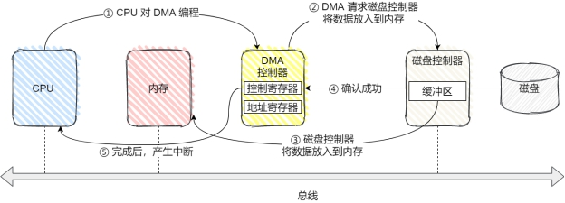

DMA 的工作方式如下：

- CPU 需对 DMA 控制器下发指令，告诉它想读取多少数据，读完的数据放在内存的某个地方就可以了；

- 接下来，DMA 控制器会向磁盘控制器发出指令，通知它从磁盘读数据到其内部的缓冲区中，接着磁盘控制器将缓冲区的数据传输到内存；

- 当磁盘控制器把数据传输到内存的操作完成后，磁盘控制器在总线上发出一个确认成功的信号到 DMA 控制器；

- DMA 控制器收到信号后，DMA 控制器发中断通知 CPU 指令完成，CPU 就可以直接用内存里面现成的数据了；

可以看到， CPU 当要读取磁盘数据的时候，只需给 DMA 控制器发送指令，然后返回去做其他事情，当磁盘数据拷贝到内存后，DMA 控制机器通过中断的方式，告诉 CPU 数据已经准备好了，可以从内存读数据了。仅仅在传送开始和结束时需要 CPU 干预。


### 设备驱动程序

虽然设备控制器屏蔽了设备的众多细节，但每种设备的控制器的寄存器、缓冲区等使用模式都是不同的，所以为了屏蔽「设备控制器」的差异，引入了设备驱动程序。

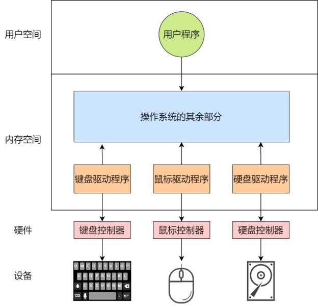

设备控制器不属于操作系统范畴，它是属于硬件，而设备驱动程序属于操作系统的一部分，操作系统的内核代码可以像本地调用代码一样使用设备驱动程序的接口，而设备驱动程序是面向设备控制器的代码，它发出操控设备控制器的指令后，才可以操作设备控制器。

不同的设备控制器虽然功能不同，但是设备驱动程序会提供统一的接口给操作系统，这样不同的设备驱动程序，就可以以相同的方式接入操作系统。如下图：

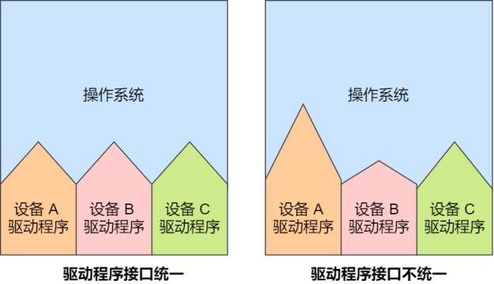

前面提到了不少关于中断的事情，设备完成了事情，则会发送中断来通知操作系统。那操作系统就需要有一个地方来处理这个中断，这个地方也就是在设备驱动程序里，它会及时响应控制器发来的中断请求，并根据这个中断的类型调用响应的中断处理程序进行处理。

通常，设备驱动程序初始化的时候，要先注册一个该设备的中断处理函数。

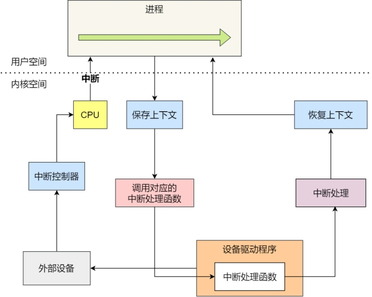

我们来看看，中断处理程序的处理流程：

\1. 在 I/O 时，设备控制器如果已经准备好数据，则会通过中断控制器向 CPU 发送中断请求；

\2. 保护被中断进程的 CPU 上下文；

\3. 转入相应的设备中断处理函数；

\4. 进行中断处理；

\5. 恢复被中断进程的上下文；


### 通用块层

对于块设备，为了减少不同块设备的差异带来的影响，Linux 通过一个统一的通用块层，来管理不同的块设备。

通用块层是处于文件系统和磁盘驱动中间的一个块设备抽象层，它主要有两个功能：

- 第一个功能，向上为文件系统和应用程序，提供访问块设备的标准接口，向下把各种不同的磁盘设备抽象为统一的块设备，并在内核层面，提供一个框架来管理这些设备的驱动程序；

- 第二功能，通用层还会给文件系统和应用程序发来的 I/O 请求排队，接着会对队列重新排序、请求合并等方式，也就是 I/O 调度，主要目的是为了提高磁盘读写的效率。

Linux 内存支持 5 种 I/O 调度算法，分别是：

- 没有调度算法

- 先入先出调度算法

- 完全公平调度算法

- 优先级调度

- 最终期限调度算法

第一种，没有调度算法，是的，你没听错，它不对文件系统和应用程序的 I/O 做任何处理，这种算法常用在虚拟机 I/O 中，此时磁盘 I/O 调度算法交由物理机系统负责。

第二种，先入先出调度算法，这是最简单的 I/O 调度算法，先进入 I/O 调度队列的 I/O 请求先发生。

第三种，完全公平调度算法，大部分系统都把这个算法作为默认的 I/O 调度器，它为每个进程维护了一个 I/O 调度队列，并按照时间片来均匀分布每个进程的 I/O 请求。

第四种，优先级调度算法，顾名思义，优先级高的 I/O 请求先发生， 它适用于运行大量进程的系统，像是桌面环境、多媒体应用等。

第五种，最终期限调度算法，分别为读、写请求创建了不同的 I/O 队列，这样可以提高机械磁盘的吞吐量，并确保达到最终期限的请求被优先处理，适用于在 I/O 压力比较大的场景，比如数据库等。


### 存储系统 I/O 软件分层

前面说到了不少东西，设备、设备控制器、驱动程序、通用块层，现在再结合文件系统原理，我们来看看 Linux 存储系统的 I/O 软件分层。

可以把 Linux 存储系统的 I/O 由上到下可以分为三个层次，分别是文件系统层、通用块层、设备层。他们整个的层次关系如下图：

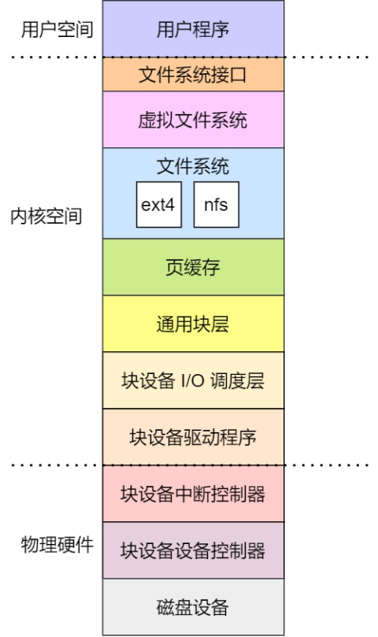

这三个层次的作用是：

- 文件系统层，包括虚拟文件系统和其他文件系统的具体实现，它向上为应用程序统一提供了标准的文件访问接口，向下会通过通用块层来存储和管理磁盘数据。

- 通用块层，包括块设备的 I/O 队列和 I/O 调度器，它会对文件系统的 I/O 请求进行排队，再通过 I/O 调度器，选择一个 I/O 发给下一层的设备层。

- 设备层，包括硬件设备、设备控制器和驱动程序，负责最终物理设备的 I/O 操作。

有了文件系统接口之后，不但可以通过文件系统的命令行操作设备，也可以通过应用程序，调用 read
、write函数，就像读写文件一样操作设备，所以说设备在 Linux 下，也只是一个特殊的文件。

但是，除了读写操作，还需要有检查特定于设备的功能和属性。于是，需要 ioctl接口，它表示输入输出控制接口，是用于配置和修改特定设备属性的通用接口。

另外，存储系统的 I/O 是整个系统最慢的一个环节，所以 Linux 提供了不少缓存机制来提高 I/O 的效率。

- 为了提高文件访问的效率，会使用页缓存、索引节点缓存、目录项缓存等多种缓存机制，目的是为了减少对块设备的直接调用。

- 为了提高块设备的访问效率， 会使用缓冲区，来缓存块设备的数据。


### 键盘敲入字母时，期间发生了什么？

看完前面的内容，相信你对输入输出设备的管理有了一定的认识，那接下来就从操作系统的角度回答开头的问题「键盘敲入字母时，操作系统期间发生了什么？」

我们先来看看 CPU 的硬件架构图：

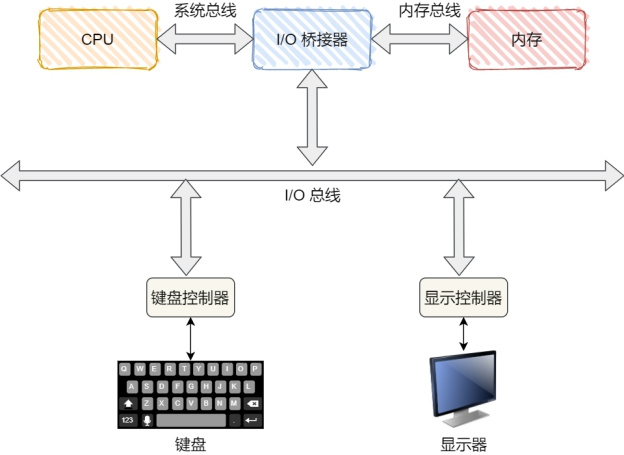

CPU 里面的内存接口，直接和系统总线通信，然后系统总线再接入一个 I/O 桥接器，这个 I/O 桥接器，另一边接入了内存总线，使得 CPU 和内存通信。再另一边，又接入了一个 I/O 总线，用来连接 I/O 设备，比如键盘、显示器等。

那当用户输入了键盘字符，键盘控制器就会产生扫描码数据，并将其缓冲在键盘控制器的寄存器中，紧接着键盘控制器通过总线给 CPU 发送中断请求。

CPU 收到中断请求后，操作系统会保存被中断进程的 CPU 上下文，然后调用键盘的中断处理程序。

键盘的中断处理程序是在键盘驱动程序初始化时注册的，那键盘中断处理函数的功能就是从键盘控制器的寄存器的缓冲区读取扫描码，再根据扫描码找到用户在键盘输入的字符，如果输入的字符是显示字符，那就会把扫描码翻译成对应显示字符的 ASCII 码，比如用户在键盘输入的是字母 A，是显示字符，于是就会把扫描码翻译成 A 字符的 ASCII 码。

得到了显示字符的 ASCII 码后，就会把 ASCII 码放到「读缓冲区队列」，接下来就是要把显示字符显示屏幕了，显示设备的驱动程序会定时从「读缓冲区队列」读取数据放到「写缓冲区队列」，最后把「写缓冲区队列」的数据一个一个写入到显示设备的控制器的寄存器中的数据缓冲区，最后将这些数据显示在屏幕里。

显示出结果后，恢复被中断进程的上下文。


# 八、网络系统


## 8.1 Linux 系统是如何收发网络包的？

这次，就围绕一个问题来说。

Linux 系统是如何收发网络包的？


### 网络模型

为了使得多种设备能通过网络相互通信，和为了解决各种不同设备在网络互联中的兼容性问题，国际标标准化组织制定了开放式系统互联通信参考模型（**pen System Interconnection Reference Model**），也就是 OSI 网络模型，该模型主要有 7 层，分别是应用层、表示层、会话层、传输层、网络层、数据链路层以及物理层。

每一层负责的职能都不同，如下：

- 应用层，负责给应用程序提供统一的接口；

- 表示层，负责把数据转换成兼容另一个系统能识别的格式；

- 会话层，负责建立、管理和终止表示层实体之间的通信会话；

- 传输层，负责端到端的数据传输；

- 网络层，负责数据的路由、转发、分片；

- 数据链路层，负责数据的封帧和差错检测，以及 MAC 寻址；

- 物理层，负责在物理网络中传输数据帧；

由于 OSI 模型实在太复杂，提出的也只是概念理论上的分层，并没有提供具体的实现方案。事实上，我们比较常见，也比较实用的是四层模型，即 TCP/IP 网络模型，Linux 系统正是按照这套网络模型来实现网络协议栈的。

TCP/IP 网络模型共有 4 层，分别是应用层、传输层、网络层和网络接口层，每一层负责的职能如下：

- 应用层，负责向用户提供一组应用程序，比如 HTTP、DNS、FTP 等;

- 传输层，负责端到端的通信，比如 TCP、UDP 等；

- 网络层，负责网络包的封装、分片、路由、转发，比如 IP、ICMP 等；

- 网络接口层，负责网络包在物理网络中的传输，比如网络包的封帧、 MAC 寻址、差错检测，以及通过网卡传输网络帧等；

TCP/IP 网络模型相比 OSI 网络模型简化了不少，也更加易记，它们之间的关系如下图：

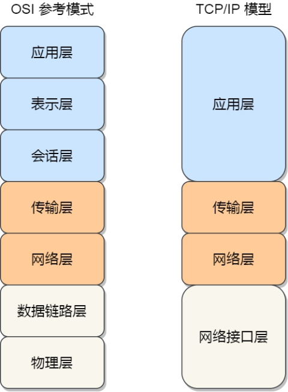

不过，我们常说的七层和四层负载均衡，是用 OSI 网络模型来描述的，七层对应的是应用层，四层对应的是传输层。


### Linux 网络协议栈

我们可以把自己的身体比作应用层中的数据，打底衣服比作传输层中的 TCP 头，外套比作网络层中 IP 头，帽子和鞋子分别比作网络接口层的帧头和帧尾。

在冬天这个季节，当我们要从家里出去玩的时候，自然要先穿个打底衣服，再套上保暖外套，最后穿上帽子和鞋子才出门，这个过程就好像我们把 TCP 协议通信的网络包发出去的时候，会把应用层的数据按照网络协议栈层层封装和处理。

你从下面这张图可以看到，应用层数据在每一层的封装格式。

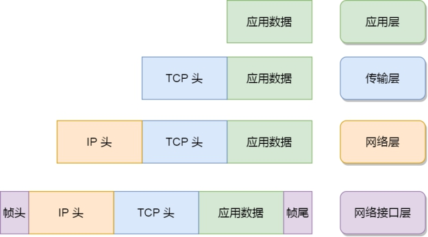

其中：

- 传输层，给应用数据前面增加了 TCP 头；

- 网络层，给 TCP 数据包前面增加了 IP 头；

- 网络接口层，给 IP 数据包前后分别增加了帧头和帧尾；

这些新增和头部和尾部，都有各自的作用，也都是按照特定的协议格式填充，这每一层都增加了各自的协议头，那自然网络包的大小就增大了，但物理链路并不能传输任意大小的数据包，所以在以太网中，规定了最大传输单元（MTU）是 1500字节，也就是规定了单次传输的最大 IP 包大小。

当网络包超过 MTU 的大小，就会在网络层分片，以确保分片后的 IP 包不会超过 MTU 大小，如果 MTU 越小，需要的分包就越多，那么网络吞吐能力就越差，相反的，如果 MTU 越大，需要的分包就越小，那么网络吞吐能力就越好。

知道了 TCP/IP 网络模型，以及网络包的封装原理后，那么 Linux 网络协议栈的样子，你想必猜到了大概，它其实就类似于 TCP/IP 的四层结构：

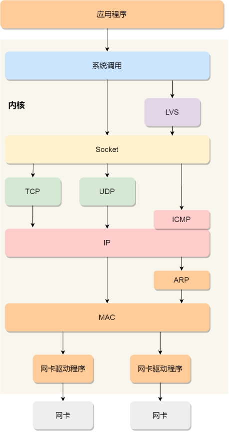

从上图的的网络协议栈，你可以看到：

- 应用程序需要通过系统调用，来跟 Socket 层进行数据交互；

- Socket 层的下面就是传输层、网络层和网络接口层；

- 最下面的一层，则是网卡驱动程序和硬件网卡设备；


### Linux 接收网络包的流程

网卡是计算机里的一个硬件，专门负责接收和发送网络包，当网卡接收到一个网络包后，会通过 DMA 技术，将网络包放入到 Ring Buffer，这个是一个环形缓冲区。

那接收到网络包后，应该怎么告诉操作系统这个网络包已经到达了呢？

最简单的一种方式就是触发中断，也就是每当网卡收到一个网络包，就触发一个中断告诉操作系统。

但是，这存在一个问题，在高性能网络场景下，网络包的数量会非常多，那么就会触发非常多的中断，要知道当 CPU 收到了中断，就会停下手里的事情，而去处理这些网络包，处理完毕后，才会回去继续其他事情，那么频繁地触发中断，则会导致 CPU 一直没玩没了的处理中断，而导致其他任务可能无法继续前进，从而影响系统的整体效率。

所以为了解决频繁中断带来的性能开销，Linux 内核在 2.6 版本中引入了 NAPI 机制，它是混合「中断和轮询」的方式来接收网络包，它的核心概念就是不采用中断的方式读取数据，而是首先采用中断唤醒数据接收的服务程序，然后 poll的方法来轮询数据。

比如，当有网络包到达时，网卡发起硬件中断，于是会执行网卡硬件中断处理函数，中断处理函数处理完需要「暂时屏蔽中断」，然后唤醒「软中断」来轮询处理数据，直到没有新数据时才恢复中断，这样一次中断处理多个网络包，于是就可以降低网卡中断带来的性能开销。

那软中断是怎么处理网络包的呢？它会从 Ring Buffer 中拷贝数据到内核 struct sk_buff 缓冲区中，从而可以作为一个网络包交给网络协议栈进行逐层处理。

首先，会先进入到网络接口层，在这一层会检查报文的合法性，如果不合法则丢弃，合法则会找出该网络包的上层协议的类型，比如是 IPv4，还是 IPv6，接着再去掉帧头和帧尾，然后交给网络层。

到了网络层，则取出 IP 包，判断网络包下一步的走向，比如是交给上层处理还是转发出去。当确认这个网络包要发送给本机后，就会从 IP 头里看看上一层协议的类型是 TCP 还是 UDP，接着去掉 IP 头，然后交给传输层。

传输层取出 TCP 头或 UDP 头，根据四元组「源 IP、源端口、目的 IP、目的端口」 作为标识，找出对应的 Socket，并把数据拷贝到 Socket 的接收缓冲区。

最后，应用层程序调用 Socket 接口，从内核的 Socket 接收缓冲区读取新到来的数据到应用层。

至此，一个网络包的接收过程就已经结束了，你也可以从下图左边部分看到网络包接收的流程，右边部分刚好反过来，它是网络包发送的流程。

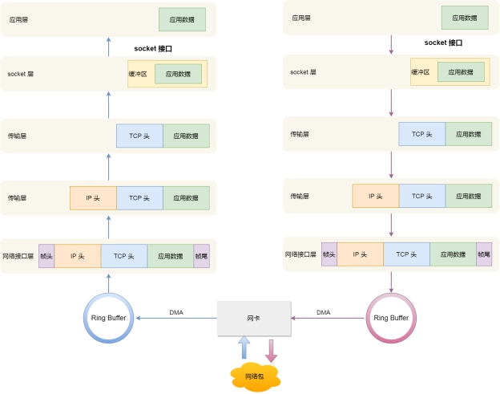


### Linux 发送网络包的流程

如上图的有半部分，发送网络包的流程正好和接收流程相反。

首先，应用程序会调用 Socket 发送数据包的接口，由于这个是系统调用，所以会从用户态陷入到内核态中的 Socket 层，Socket 层会将应用层数据拷贝到 Socket 发送缓冲区中。

接下来，网络协议栈从 Socket 发送缓冲区中取出数据包，并按照 TCP/IP 协议栈从上到下逐层处理。

如果使用的是 TCP 传输协议发送数据，那么会在传输层增加 TCP 包头，然后交给网络层，网络层会给数据包增加 IP 包，然后通过查询路由表确认下一跳的 IP，并按照 MTU 大小进行分片。

分片后的网络包，就会被送到网络接口层，在这里会通过 ARP 协议获得下一跳的 MAC 地址，然后增加帧头和帧尾，放到发包队列中。

这一些准备好后，会触发软中断告诉网卡驱动程序，这里有新的网络包需要发送，最后驱动程序通过 DMA，从发包队列中读取网络包，将其放入到硬件网卡的队列中，随后物理网卡再将它发送出去。


### 总结

电脑与电脑之间通常都是通话网卡、交换机、路由器等网络设备连接到一起，那由于网络设备的异构性，国际标准化组织定义了一个七层的 OSI 网络模型，但是这个模型由于比较复杂，实际应用中并没有采用，而是采用了更为简化的 TCP/IP 模型，Linux 网络协议栈就是按照了该模型来实现的。

TCP/IP 模型主要分为应用层、传输层、网络层、网络接口层四层，每一层负责的职责都不同，这也是 Linux 网络协议栈主要构成部分。

当应用程序通过 Socket 接口发送数据包，数据包会被网络协议栈从上到下进行逐层处理后，才会被送到网卡队列中，随后由网卡将网络包发送出去。

而在接收网络包时，同样也要先经过网络协议栈从下到上的逐层处理，最后才会被送到应用程序。


## 8.2 零拷贝

磁盘可以说是计算机系统最慢的硬件之一，读写速度相差内存 10 倍以上，所以针对优化磁盘的技术非常的多，比如零拷贝、直接 I/O、异步 I/O 等等，这些优化的目的就是为了提高系统的吞吐量，另外操作系统内核中的磁盘高速缓存区，可以有效的减少磁盘的访问次数。

这次，我们就以「文件传输」作为切入点，来分析 I/O 工作方式，以及如何优化传输文件的性能。


### 为什么要有 DMA 技术?

在没有 DMA 技术前，I/O 的过程是这样的：

- CPU 发出对应的指令给磁盘控制器，然后返回；

- 磁盘控制器收到指令后，于是就开始准备数据，会把数据放入到磁盘控制器的内部缓冲区中，然后产生一个中断；

- CPU 收到中断信号后，停下手头的工作，接着把磁盘控制器的缓冲区的数据一次一个字节地读进自己的寄存器，然后再把寄存器里的数据写入到内存，而在数据传输的期间 CPU 是无法执行其他任务的。

为了方便你理解，我画了一副图：

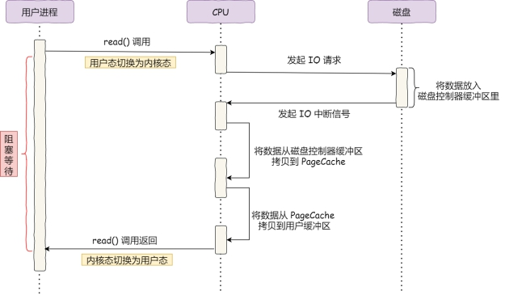

可以看到，整个数据的传输过程，都要需要 CPU 亲自参与搬运数据的过程，而且这个过程，CPU 是不能做其他事情的。

简单的搬运几个字符数据那没问题，但是如果我们用千兆网卡或者硬盘传输大量数据的时候，都用 CPU 来搬运的话，肯定忙不过来。

计算机科学家们发现了事情的严重性后，于是就发明了 DMA 技术，也就是直接内存访问（**Direct Memory Access**） 技术。

什么是 DMA 技术？简单理解就是，在进行 I/O 设备和内存的数据传输的时候，数据搬运的工作全部交给 DMA 控制器，而 CPU 不再参与任何与数据搬运相关的事情，这样 CPU 就可以去处理别的事务。

那使用 DMA 控制器进行数据传输的过程究竟是什么样的呢？下面我们来具体看看。

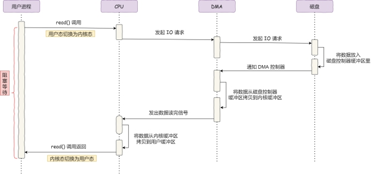

具体过程：

- 用户进程调用 read 方法，向操作系统发出 I/O 请求，请求读取数据到自己的内存缓冲区中，进程进入阻塞状态；

- 操作系统收到请求后，进一步将 I/O 请求发送 DMA，然后让 CPU 执行其他任务；

- DMA 进一步将 I/O 请求发送给磁盘；

- 磁盘收到 DMA 的 I/O 请求，把数据从磁盘读取到磁盘控制器的缓冲区中，当磁盘控制器的缓冲区被读满后，向 DMA 发起中断信号，告知自己缓冲区已满；

- DMA 收到磁盘的信号，将磁盘控制器缓冲区中的数据拷贝到内核缓冲区中，此时不占用 CPU，CPU 可以执行其他任务；

- 当 DMA 读取了足够多的数据，就会发送中断信号给 CPU；

- CPU 收到 DMA 的信号，知道数据已经准备好，于是将数据从内核拷贝到用户空间，系统调用返回；

可以看到， 整个数据传输的过程，CPU 不再参与数据搬运的工作，而是全程由 DMA 完成，但是 CPU 在这个过程中也是必不可少的，因为传输什么数据，从哪里传输到哪里，都需要 CPU 来告诉 DMA 控制器。

早期 DMA 只存在在主板上，如今由于 I/O 设备越来越多，数据传输的需求也不尽相同，所以每个 I/O 设备里面都有自己的 DMA 控制器。


### 传统的文件传输有多糟糕？

如果服务端要提供文件传输的功能，我们能想到的最简单的方式是：将磁盘上的文件读取出来，然后通过网络协议发送给客户端。

传统 I/O 的工作方式是，数据读取和写入是从用户空间到内核空间来回复制，而内核空间的数据是通过操作系统层面的 I/O 接口从磁盘读取或写入。

代码通常如下，一般会需要两个系统调用：

```c
read(file, tmp_buf, len);
write(socket, tmp_buf, len);
```

代码很简单，虽然就两行代码，但是这里面发生了不少的事情。

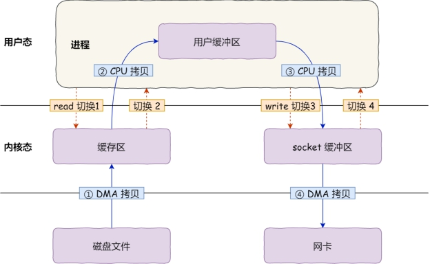

首先，期间共发生了 4 次用户态与内核态的上下文切换，因为发生了两次系统调用，一次是 read()，一次是 write()
，每次系统调用都得先从用户态切换到内核态，等内核完成任务后，再从内核态切换回用户态。

上下文切换到成本并不小，一次切换需要耗时几十纳秒到几微秒，虽然时间看上去很短，但是在高并发的场景下，这类时间容易被累积和放大，从而影响系统的性能。

其次，还发生了 4 次数据拷贝，其中两次是 DMA 的拷贝，另外两次则是通过 CPU 拷贝的，下面说一下这个过程：

- **第一次拷贝**，把磁盘上的数据拷贝到操作系统内核的缓冲区里，这个拷贝的过程是通过 DMA 搬运的。

- **第二次拷贝**，把内核缓冲区的数据拷贝到用户的缓冲区里，于是我们应用程序就可以使用这部分数据了，这个拷贝到过程是由 CPU 完成的。

- **第三次拷贝**，把刚才拷贝到用户的缓冲区里的数据，再拷贝到内核的 socket 的缓冲区里，这个过程依然还是由 CPU 搬运的。

- **第四次拷贝**，把内核的 socket 缓冲区里的数据，拷贝到网卡的缓冲区里，这个过程又是由 DMA 搬运的。

我们回过头看这个文件传输的过程，我们只是搬运一份数据，结果却搬运了 4 次，过多的数据拷贝无疑会消耗 CPU 资源，大大降低了系统性能。

这种简单又传统的文件传输方式，存在冗余的上文切换和数据拷贝，在高并发系统里是非常糟糕的，多了很多不必要的开销，会严重影响系统性能。

所以，要想提高文件传输的性能，就需要减少「用户态与内核态的上下文切换」和「内存拷贝」的次数。


### 如何优化文件传输的性能？

先来看看，如何减少「用户态与内核态的上下文切换」的次数呢？

读取磁盘数据的时候，之所以要发生上下文切换，这是因为用户空间没有权限操作磁盘或网卡，内核的权限最高，这些操作设备的过程都需要交由操作系统内核来完成，所以一般要通过内核去完成某些任务的时候，就需要使用操作系统提供的系统调用函数。

而一次系统调用必然会发生 2 次上下文切换：首先从用户态切换到内核态，当内核执行完任务后，再切换回用户态交由进程代码执行。

所以，要想减少上下文切换到次数，就要减少系统调用的次数。


再来看看，如何减少「数据拷贝」的次数？

在前面我们知道了，传统的文件传输方式会历经 4 次数据拷贝，而且这里面，「从内核的读缓冲区拷贝到用户的缓冲区里，再从用户的缓冲区里拷贝到 socket 的缓冲区里」，这个过程是没有必要的。

因为文件传输的应用场景中，在用户空间我们并不会对数据「再加工」，所以数据实际上可以不用搬运到用户空间，因此用户的缓冲区是没有必要存在的。


### 如何实现零拷贝？

零拷贝技术实现的方式通常有 2 种：

- mmap + write

- sendfile

下面就谈一谈，它们是如何减少「上下文切换」和「数据拷贝」的次数。


#### mmap + write

在前面我们知道，read()系统调用的过程中会把内核缓冲区的数据拷贝到用户的缓冲区里，于是为了减少这一步开销，我们可以用 mmap()替换 read()系统调用函数。

```c
buf = mmap(file, len);
write(sockfd, buf, len);
```

mmap()系统调用函数会直接把内核缓冲区里的数据「映射」到用户空间，这样，操作系统内核与用户空间就不需要再进行任何的数据拷贝操作。

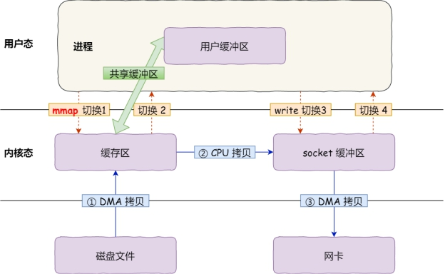

具体过程如下：

- 应用进程调用了 mmap()后，DMA 会把磁盘的数据拷贝到内核的缓冲区里。接着，应用进程跟操作系统内核「共享」这个缓冲区；

- 应用进程再调用 write()
，操作系统直接将内核缓冲区的数据拷贝到 socket 缓冲区中，这一切都发生在内核态，由 CPU 来搬运数据；

- 最后，把内核的 socket 缓冲区里的数据，拷贝到网卡的缓冲区里，这个过程是由 DMA 搬运的。

我们可以得知，通过使用 mmap()来代替 read()
， 可以减少一次数据拷贝的过程。

但这还不是最理想的零拷贝，因为仍然需要通过 CPU 把内核缓冲区的数据拷贝到 socket 缓冲区里，而且仍然需要 4 次上下文切换，因为系统调用还是 2 次。


#### sendfile

在 Linux 内核版本 2.1 中，提供了一个专门发送文件的系统调用函数 sendfile()，函数形式如下：

```c
#include <sys/socket.h>
ssize_t sendfile(int out_fd, int in_fd, off_t *offset, size_t count);
```

它的前两个参数分别是目的端和源端的文件描述符，后面两个参数是源端的偏移量和复制数据的长度，返回值是实际复制数据的长度。

首先，它可以替代前面的 read()和 write()这两个系统调用，这样就可以减少一次系统调用，也就减少了 2 次上下文切换的开销。

其次，该系统调用，可以直接把内核缓冲区里的数据拷贝到 socket 缓冲区里，不再拷贝到用户态，这样就只有 2 次上下文切换，和 3 次数据拷贝。如下图：

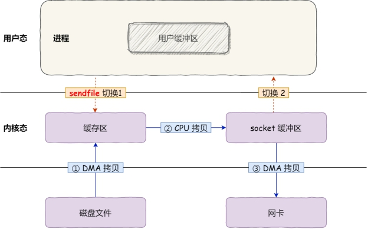

但是这还不是真正的零拷贝技术，如果网卡支持 SG-DMA（**The Scatter-Gather Direct Memory Access**）技术（和普通的 DMA 有所不同），我们可以进一步减少通过 CPU 把内核缓冲区里的数据拷贝到 socket 缓冲区的过程。

你可以在你的 Linux 系统通过下面这个命令，查看网卡是否支持 scatter-gather 特性：

```sh
$ ethtool -k eth0 | grep scatter-gather
scatter-gather: on
```

于是，从 Linux 内核 2.4版本开始起，对于支持网卡支持 SG-DMA 技术的情况下， sendfile()系统调用的过程发生了点变化，具体过程如下：

- 第一步，通过 DMA 将磁盘上的数据拷贝到内核缓冲区里；

- 第二步，缓冲区描述符和数据长度传到 socket 缓冲区，这样网卡的 SG-DMA 控制器就可以直接将内核缓存中的数据拷贝到网卡的缓冲区里，此过程不需要将数据从操作系统内核缓冲区拷贝到 socket 缓冲区中，这样就减少了一次数据拷贝；

所以，这个过程之中，只进行了 2 次数据拷贝，如下图：

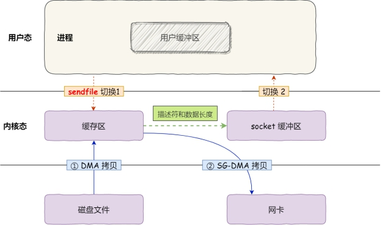

这就是所谓的零拷贝（**Zero-copy**）技术，因为我们没有在内存层面去拷贝数据，也就是说全程没有通过 CPU 来搬运数据，所有的数据都是通过 DMA 来进行传输的。。

零拷贝技术的文件传输方式相比传统文件传输的方式，减少了 2 次上下文切换和数据拷贝次数，只需要 2 次上下文切换和数据拷贝次数，就可以完成文件的传输，而且 2 次的数据拷贝过程，都不需要通过 CPU，2 次都是由 DMA 来搬运。

所以，总体来看，零拷贝技术可以把文件传输的性能提高至少一倍以上。


#### 使用零拷贝技术的项目

事实上，Kafka 这个开源项目，就利用了「零拷贝」技术，从而大幅提升了 I/O 的吞吐率，这也是 Kafka 在处理海量数据为什么这么快的原因之一。

如果你追溯 Kafka 文件传输的代码，你会发现，最终它调用了 Java NIO 库里的 transferTo方法：

```java
@Override
public long transferFrom(FileChannel fileChannel, long position, long count)
throws IOException {
  return fileChannel.transferTo(position, count, socketChannel);
}
```

如果 Linux 系统支持 sendfile()系统调用，那么 transferTo()实际上最后就会使用到 sendfile()系统调用函数。

曾经有大佬专门写过程序测试过，在同样的硬件条件下，传统文件传输和零拷拷贝文件传输的性能差异，你可以看到下面这张测试数据图，使用了零拷贝能够缩短 65%的时间，大幅度提升了机器传输数据的吞吐量。


另外，Nginx 也支持零拷贝技术，一般默认是开启零拷贝技术，这样有利于提高文件传输的效率，是否开启零拷贝技术的配置如下：

```nginx
http {
  ...
  sendfile on
  ...
}
```

sendfile 配置的具体意思:

- 设置为 on 表示，使用零拷贝技术来传输文件：sendfile ，这样只需要 2 次上下文切换，和 2 次数据拷贝。

- 设置为 off 表示，使用传统的文件传输技术：read + write，这时就需要 4 次上下文切换，和 4 次数据拷贝。

当然，要使用 sendfile，Linux 内核版本必须要 2.1 以上的版本。


### PageCache 有什么作用？

回顾前面说道文件传输过程，其中第一步都是先需要先把磁盘文件数据拷贝「内核缓冲区」里，这个「内核缓冲区」实际上是磁盘高速缓存（**PageCache**）。

由于零拷贝使用了 PageCache 技术，可以使得零拷贝进一步提升了性能，我们接下来看看 PageCache 是如何做到这一点的。

读写磁盘相比读写内存的速度慢太多了，所以我们应该想办法把「读写磁盘」替换成「读写内存」。于是，我们会通过 DMA 把磁盘里的数据搬运到内存里，这样就可以用读内存替换读磁盘。

但是，内存空间远比磁盘要小，内存注定只能拷贝磁盘里的一小部分数据。

那问题来了，选择哪些磁盘数据拷贝到内存呢？

我们都知道程序运行的时候，具有「局部性」，所以通常，刚被访问的数据在短时间内再次被访问的概率很高，于是我们可以用 PageCache 来缓存最近被访问的数据，当空间不足时淘汰最久未被访问的缓存。

所以，读磁盘数据的时候，优先在 PageCache 找，如果数据存在则可以直接返回；如果没有，则从磁盘中读取，然后缓存 PageCache 中。

还有一点，读取磁盘数据的时候，需要找到数据所在的位置，但是对于机械磁盘来说，就是通过磁头旋转到数据所在的扇区，再开始「顺序」读取数据，但是旋转磁头这个物理动作是非常耗时的，为了降低它的影响，PageCache 使用了「预读功能」。

比如，假设 read 方法每次只会读 32 KB的字节，虽然 read 刚开始只会读 0 ～ 32 KB 的字节，但内核会把其后面的 32～64 KB 也读取到 PageCache，这样后面读取 32～64 KB 的成本就很低，如果在 32～64 KB 淘汰出 PageCache 前，进程读取到它了，收益就非常大。

所以，PageCache 的优点主要是两个：

- 缓存最近被访问的数据；

- 预读功能；

这两个做法，将大大提高读写磁盘的性能。

但是，在传输大文件（GB 级别的文件）的时候，PageCache 会不起作用，那就白白浪费 DMA 多做的一次数据拷贝，造成性能的降低，即使使用了 PageCache 的零拷贝也会损失性能

这是因为如果你有很多 GB 级别文件需要传输，每当用户访问这些大文件的时候，内核就会把它们载入 PageCache 中，于是 PageCache 空间很快被这些大文件占满。

另外，由于文件太大，可能某些部分的文件数据被再次访问的概率比较低，这样就会带来 2 个问题：

- PageCache 由于长时间被大文件占据，其他「热点」的小文件可能就无法充分使用到 PageCache，于是这样磁盘读写的性能就会下降了；

- PageCache 中的大文件数据，由于没有享受到缓存带来的好处，但却耗费 DMA 多拷贝到 PageCache 一次；

所以，针对大文件的传输，不应该使用 PageCache，也就是说不应该使用零拷贝技术，因为可能由于 PageCache 被大文件占据，而导致「热点」小文件无法利用到 PageCache，这样在高并发的环境下，会带来严重的性能问题。


### 大文件传输用什么方式实现？

那针对大文件的传输，我们应该使用什么方式呢？

我们先来看看最初的例子，当调用 read 方法读取文件时，进程实际上会阻塞在 read 方法调用，因为要等待磁盘数据的返回，如下图：

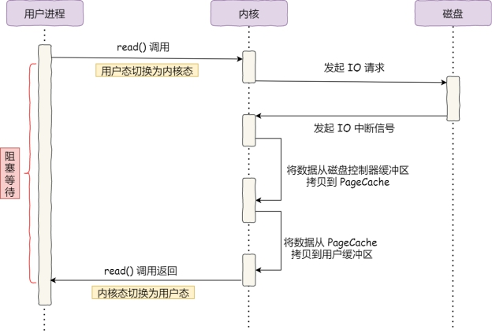

具体过程：

- 当调用 read 方法时，会阻塞着，此时内核会向磁盘发起 I/O 请求，磁盘收到请求后，便会寻址，当磁盘数据准备好后，就会向内核发起 I/O 中断，告知内核磁盘数据已经准备好；

- 内核收到 I/O 中断后，就将数据从磁盘控制器缓冲区拷贝到 PageCache 里；

- 最后，内核再把 PageCache 中的数据拷贝到用户缓冲区，于是 read 调用就正常返回了。

对于阻塞的问题，可以用异步 I/O 来解决，它工作方式如下图：

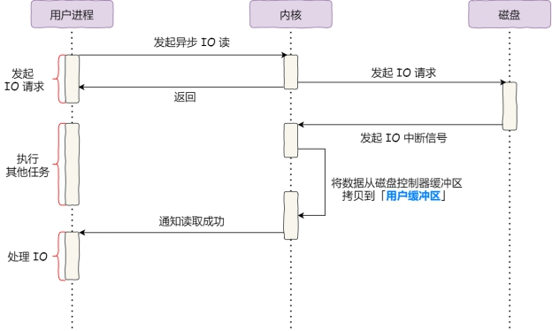

它把读操作分为两部分：

- 前半部分，内核向磁盘发起读请求，但是可以不等待数据就位就可以返回，于是进程此时可以处理其他任务；

- 后半部分，当内核将磁盘中的数据拷贝到进程缓冲区后，进程将接收到内核的通知，再去处理数据；

而且，我们可以发现，异步 I/O 并没有涉及到 PageCache，所以使用异步 I/O 就意味着要绕开 PageCache。

绕开 PageCache 的 I/O 叫直接 I/O，使用 PageCache 的 I/O 则叫缓存 I/O。通常，对于磁盘，异步 I/O 只支持直接 I/O。

前面也提到，大文件的传输不应该使用 PageCache，因为可能由于 PageCache 被大文件占据，而导致「热点」小文件无法利用到 PageCache。

于是，在高并发的场景下，针对大文件的传输的方式，应该使用「异步 I/O + 直接 I/O」来替代零拷贝技术。

直接 I/O 应用场景常见的两种：

- 应用程序已经实现了磁盘数据的缓存，那么可以不需要 PageCache 再次缓存，减少额外的性能损耗。在 MySQL 数据库中，可以通过参数设置开启直接 I/O，默认是不开启；

- 传输大文件的时候，由于大文件难以命中 PageCache 缓存，而且会占满 PageCache 导致「热点」文件无法充分利用缓存，从而增大了性能开销，因此，这时应该使用直接 I/O。

另外，由于直接 I/O 绕过了 PageCache，就无法享受内核的这两点的优化：

- 内核的 I/O 调度算法会缓存尽可能多的 I/O 请求在 PageCache 中，最后「合并」成一个更大的 I/O 请求再发给磁盘，这样做是为了减少磁盘的寻址操作；

- 内核也会「预读」后续的 I/O 请求放在 PageCache 中，一样是为了减少对磁盘的操作；

于是，传输大文件的时候，使用「异步 I/O + 直接 I/O」了，就可以无阻塞地读取文件了。

所以，传输文件的时候，我们要根据文件的大小来使用不同的方式：

- 传输大文件的时候，使用「异步 I/O + 直接 I/O」；

- 传输小文件的时候，则使用「零拷贝技术」；

在 nginx 中，我们可以用如下配置，来根据文件的大小来使用不同的方式：

location /video/ { sendfile on; aio on; directio 1024m;
}

当文件大小大于 directio值后，使用「异步 I/O + 直接 I/O」，否则使用「零拷贝技术」。


### 总结

早期 I/O 操作，内存与磁盘的数据传输的工作都是由 CPU 完成的，而此时 CPU 不能执行其他任务，会特别浪费 CPU 资源。

于是，为了解决这一问题，DMA 技术就出现了，每个 I/O 设备都有自己的 DMA 控制器，通过这个 DMA 控制器，CPU 只需要告诉 DMA 控制器，我们要传输什么数据，从哪里来，到哪里去，就可以放心离开了。后续的实际数据传输工作，都会由 DMA 控制器来完成，CPU 不需要参与数据传输的工作。

传统 IO 的工作方式，从硬盘读取数据，然后再通过网卡向外发送，我们需要进行 4 上下文切换，和 4 次数据拷贝，其中 2 次数据拷贝发生在内存里的缓冲区和对应的硬件设备之间，这个是由 DMA 完成，另外 2 次则发生在内核态和用户态之间，这个数据搬移工作是由 CPU 完成的。

为了提高文件传输的性能，于是就出现了零拷贝技术，它通过一次系统调用（sendfile方法）合并了磁盘读取与网络发送两个操作，降低了上下文切换次数。另外，拷贝数据都是发生在内核中的，天然就降低了数据拷贝的次数。

Kafka 和 Nginx 都有实现零拷贝技术，这将大大提高文件传输的性能。

零拷贝技术是基于 PageCache 的，PageCache 会缓存最近访问的数据，提升了访问缓存数据的性能，同时，为了解决机械硬盘寻址慢的问题，它还协助 I/O 调度算法实现了 IO 合并与预读，这也是顺序读比随机读性能好的原因。这些优势，进一步提升了零拷贝的性能。

需要注意的是，零拷贝技术是不允许进程对文件内容作进一步的加工的，比如压缩数据再发送。

另外，当传输大文件时，不能使用零拷贝，因为可能由于 PageCache 被大文件占据，而导致「热点」小文件无法利用到 PageCache，并且大文件的缓存命中率不高，这时就需要使用「异步 IO + 直接 IO 」的方式。

在 Nginx 里，可以通过配置，设定一个文件大小阈值，针对大文件使用异步 IO 和直接 IO，而对小文件使用零拷贝。


## 8.3 I/O 多路复用：select/poll/epoll

这次，我们以最简单 socket 网络模型，一步一步的过度到 I/O 多路复用。

但我不会具体细节说到每个系统调用的参数，这方面书上肯定比我说的详细。

好了，发车！


### 最基本的 Socket 模型

要想客户端和服务器能在网络中通信，那必须得使用 Socket 编程，它是进程间通信里比较特别的方式，特别之处在于它是可以跨主机间通信。

Socket 的中文名叫作插口，咋一看还挺迷惑的。事实上，双方要进行网络通信前，各自得创建一个 Socket，这相当于客户端和服务器都开了一个"口子"，双方读取和发送数据的时候，都通过这个"口子"。这样一看，是不是觉得很像弄了一根网线，一头插在客户端，一头插在服务端，然后进行通信。

创建 Socket 的时候，可以指定网络层使用的是 IPv4 还是 IPv6，传输层使用的是 TCP 还是 UDP。

UDP 的 Socket 编程相对简单些，这里我们只介绍基于 TCP 的 Socket 编程。

服务器的程序要先跑起来，然后等待客户端的连接和数据，我们先来看看服务端的 Socket 编程过程是怎样的。

服务端首先调用 socket()函数，创建网络协议为 IPv4，以及传输协议为 TCP 的 Socket ，接着调用 bind()函数，给这个 Socket 绑定一个 IP 地址和端口，绑定这两个的目的是什么？

- 绑定端口的目的：当内核收到 TCP 报文，通过 TCP 头里面的端口号，来找到我们的应用程序，然后把数据传递给我们。

- 绑定 IP 地址的目的：一台机器是可以有多个网卡的，每个网卡都有对应的 IP 地址，当绑定一个网卡时，内核在收到该网卡上的包，才会发给我们；

绑定完 IP 地址和端口后，就可以调用 listen()函数进行监听，此时对应 TCP 状态图中的 listen，如果我们要判定服务器中一个网络程序有没有启动，可以通过 netstat命令查看对应的端口号是否有被监听。

服务端进入了监听状态后，通过调用 accept()函数，来从内核获取客户端的连接，如果没有客户端连接，则会阻塞等待客户端连接的到来。

那客户端是怎么发起连接的呢？客户端在创建好 Socket 后，调用 connect()函数发起连接，该函数的参数要指明服务端的 IP 地址和端口号，然后万众期待的 TCP 三次握手就开始了。

在 TCP 连接的过程中，服务器的内核实际上为每个 Socket 维护了两个队列：

- 一个是还没完全建立连接的队列，称为 TCP 半连接队列，这个队列都是没有完成三次握手的连接，此时服务端处于 syn_rcvd的状态；

- 一个是一件建立连接的队列，称为 TCP 全连接队列，这个队列都是完成了三次握手的连接，此时服务端处于 established状态；

当 TCP 全连接队列不为空后，服务端的 accept()函数，就会从内核中的 TCP 全连接队列里拿出一个已经完成连接的 Socket 返回应用程序，后续数据传输都用这个 Socket。

注意，监听的 Socket 和真正用来传数据的 Socket 是两个：

- 一个叫作监听 Socket；

- 一个叫作已连接 Socket；

连接建立后，客户端和服务端就开始相互传输数据了，双方都可以通过 read()和 write()函数来读写数据。

至此， TCP 协议的 Socket 程序的调用过程就结束了，整个过程如下图：


看到这，不知道你有没有觉得读写 Socket 的方式，好像读写文件一样。

是的，基于 Linux 一切皆文件的理念，在内核中 Socket 也是以「文件」的形式存在的，也是有对应的文件描述符。

PS : 下面会说到内核里的数据结构，不感兴趣的可以跳过这一部分，不会对后续的内容有影响。

文件描述符的作用是什么？每一个进程都有一个数据结构 task_struct
，该结构体里有一个指向「文件描述符数组」的成员指针。该数组里列出这个进程打开的所有文件的文件描述符。数组的下标是文件描述符，是一个整数，而数组的内容是一个指针，指向内核中所有打开的文件的列表，也就是说内核可以通过文件描述符找到对应打开的文件。

然后每个文件都有一个 inode，Socket 文件的 inode 指向了内核中的 Socket 结构，在这个结构体里有两个队列，分别是发送队列和接收队列，这个两个队列里面保存的是一个个 struct sk_buff，用链表的组织形式串起来。

sk_buff 可以表示各个层的数据包，在应用层数据包叫 data，在 TCP 层我们称为 segment，在 IP 层我们叫 packet，在数据链路层称为 frame。

你可能会好奇，为什么全部数据包只用一个结构体来描述呢？协议栈采用的是分层结构，上层向下层传递数据时需要增加包头，下层向上层数据时又需要去掉包头，如果每一层都用一个结构体，那在层之间传递数据的时候，就要发生多次拷贝，这将大大降低 CPU 效率。

于是，为了在层级之间传递数据时，不发生拷贝，只用 sk**buff 一个结构体来描述所有的网络包，那它是如何做到的呢？是通过调整 sk**buff 中 data的指针，比如：

- 当接收报文时，从网卡驱动开始，通过协议栈层层往上传送数据报，通过增加 skb->data 的值，来逐步剥离协议首部。

- 当要发送报文时，创建 sk_buff 结构体，数据缓存区的头部预留足够的空间，用来填充各层首部，在经过各下层协议时，通过减少 skb->data 的值来增加协议首部。

你可以从下面这张图看到，当发送报文时，data 指针的移动过程。

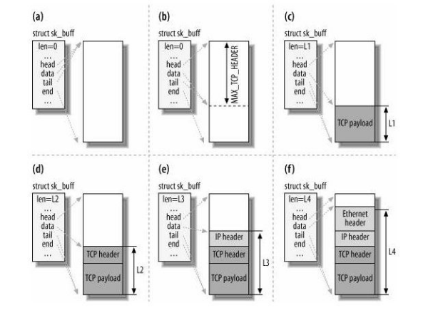


### 如何服务更多的用户？

前面提到的 TCP Socket 调用流程是最简单、最基本的，它基本只能一对一通信，因为使用的是同步阻塞的方式，当服务端在还没处理完一个客户端的网络 I/O 时，或者 读写操作发生阻塞时，其他客户端是无法与服务端连接的。

可如果我们服务器只能服务一个客户，那这样就太浪费资源了，于是我们要改进这个网络 I/O 模型，以支持更多的客户端。

在改进网络 I/O 模型前，我先来提一个问题，你知道服务器单机理论最大能连接多少个客户端？

相信你知道 TCP 连接是由四元组唯一确认的，这个四元组就是：本机IP, 本机端口, 对端IP, 对端端口。

服务器作为服务方，通常会在本地固定监听一个端口，等待客户端的连接。因此服务器的本地 IP 和端口是固定的，于是对于服务端 TCP 连接的四元组只有对端 IP 和端口是会变化的，所以最大 TCP 连接数 = 客户端 IP 数×客户端端口数。

对于 IPv4，客户端的 IP 数最多为 2 的 32 次方，客户端的端口数最多为 2 的 16 次方，也就是服务端单机最大 TCP 连接数约为 2 的 48 次方。

这个理论值相当"丰满"，但是服务器肯定承载不了那么大的连接数，主要会受两个方面的限制：

- 文件描述符，Socket 实际上是一个文件，也就会对应一个文件描述符。在 Linux 下，单个进程打开的文件描述符数是有限制的，没有经过修改的值一般都是 1024，不过我们可以通过 ulimit 增大文件描述符的数目；

- 系统内存，每个 TCP 连接在内核中都有对应的数据结构，意味着每个连接都是会占用一定内存的；

那如果服务器的内存只有 2 GB，网卡是千兆的，能支持并发 1 万请求吗？

并发 1 万请求，也就是经典的 C10K 问题 ，C 是 Client 单词首字母缩写，C10K 就是单机同时处理 1 万个请求的问题。

从硬件资源角度看，对于 2GB 内存千兆网卡的服务器，如果每个请求处理占用不到 200KB 的内存和 100Kbit 的网络带宽就可以满足并发 1 万个请求。

不过，要想真正实现 C10K 的服务器，要考虑的地方在于服务器的网络 I/O 模型，效率低的模型，会加重系统开销，从而会离 C10K 的目标越来越远。


### 多进程模型

基于最原始的阻塞网络 I/O， 如果服务器要支持多个客户端，其中比较传统的方式，就是使用多进程模型，也就是为每个客户端分配一个进程来处理请求。

服务器的主进程负责监听客户的连接，一旦与客户端连接完成，accept() 函数就会返回一个「已连接 Socket」，这时就通过 fork()函数创建一个子进程，实际上就把父进程所有相关的东西都复制一份，包括文件描述符、内存地址空间、程序计数器、执行的代码等。

这两个进程刚复制完的时候，几乎一摸一样。不过，会根据返回值来区分是父进程还是子进程，如果返回值是 0，则是子进程；如果返回值是其他的整数，就是父进程。

正因为子进程会复制父进程的文件描述符，于是就可以直接使用「已连接 Socket 」和客户端通信了，


可以发现，子进程不需要关心「监听 Socket」，只需要关心「已连接 Socket」；父进程则相反，将客户服务交给子进程来处理，因此父进程不需要关心「已连接 Socket」，只需要关心「监听 Socket」。

下面这张图描述了从连接请求到连接建立，父进程创建生子进程为客户服务。

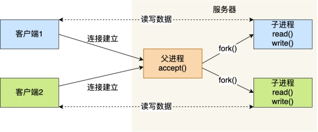

另外，当「子进程」退出时，实际上内核里还会保留该进程的一些信息，也是会占用内存的，如果不做好"回收"工作，就会变成僵尸进程，随着僵尸进程越多，会慢慢耗尽我们的系统资源。

因此，父进程要"善后"好自己的孩子，怎么善后呢？那么有两种方式可以在子进程退出后回收资源，分别是调用 wait()和 waitpid()函数。

这种用多个进程来应付多个客户端的方式，在应对 100 个客户端还是可行的，但是当客户端数量高达一万时，肯定扛不住的，因为每产生一个进程，必会占据一定的系统资源，而且进程间上下文切换的"包袱"是很重的，性能会大打折扣。

进程的上下文切换不仅包含了虚拟内存、栈、全局变量等用户空间的资源，还包括了内核堆栈、寄存器等内核空间的资源。


### 多线程模型

既然进程间上下文切换的"包袱"很重，那我们就搞个比较轻量级的模型来应对多用户的请求 —— 多线程模型。

线程是运行在进程中的一个"逻辑流"，单进程中可以运行多个线程，同进程里的线程可以共享进程的部分资源的，比如文件描述符列表、进程空间、代码、全局数据、堆、共享库等，这些共享些资源在上下文切换时是不需要切换，而只需要切换线程的私有数据、寄存器等不共享的数据，因此同一个进程下的线程上下文切换的开销要比进程小得多。

当服务器与客户端 TCP 完成连接后，通过 pthread_create()函数创建线程，然后将「已连接 Socket」的文件描述符传递给线程函数，接着在线程里和客户端进行通信，从而达到并发处理的目的。

如果每来一个连接就创建一个线程，线程运行完后，还得操作系统还得销毁线程，虽说线程切换的上写文开销不大，但是如果频繁创建和销毁线程，系统开销也是不小的。

那么，我们可以使用线程池的方式来避免线程的频繁创建和销毁，所谓的线程池，就是提前创建若干个线程，这样当由新连接建立时，将这个已连接的 Socket 放入到一个队列里，然后线程池里的线程负责从队列中取出已连接 Socket 进程处理。

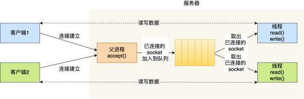

需要注意的是，这个队列是全局的，每个线程都会操作，为了避免多线程竞争，线程在操作这个队列前要加锁。

上面基于进程或者线程模型的，其实还是有问题的。新到来一个 TCP 连接，就需要分配一个进程或者线程，那么如果要达到 C10K，意味着要一台机器维护 1 万个连接，相当于要维护 1 万个进程/线程，操作系统就算死扛也是扛不住的。


### I/O 多路复用

既然为每个请求分配一个进程/线程的方式不合适，那有没有可能只使用一个进程来维护多个 Socket 呢？答案是有的，那就是 I/O 多路复用技术。

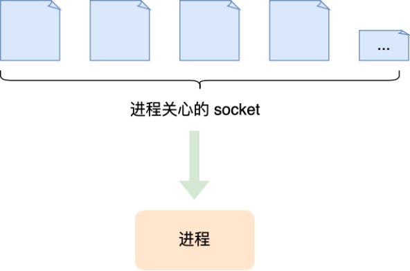

一个进程虽然任一时刻只能处理一个请求，但是处理每个请求的事件时，耗时控制在 1 毫秒以内，这样 1 秒内就可以处理上千个请求，把时间拉长来看，多个请求复用了一个进程，这就是多路复用，这种思想很类似一个 CPU 并发多个进程，所以也叫做时分多路复用。

我们熟悉的 select/poll/epoll 内核提供给用户态的多路复用系统调用，进程可以通过一个系统调用函数从内核中获取多个事件。

select/poll/epoll 是如何获取网络事件的呢？在获取事件时，先把所有连接（文件描述符）传给内核，再由内核返回产生了事件的连接，然后在用户态中再处理这些连接对应的请求即可。

select/poll/epoll 这是三个多路复用接口，都能实现 C10K 吗？接下来，我们分别说说它们。


### select/poll

select 实现多路复用的方式是，将已连接的 Socket 都放到一个文件描述符集合，然后调用 select 函数将文件描述符集合拷贝到内核里，让内核来检查是否有网络事件产生，检查的方式很粗暴，就是通过遍历文件描述符集合的方式，当检查到有事件产生后，将此 Socket 标记为可读或可写， 接着再把整个文件描述符集合拷贝回用户态里，然后用户态还需要再通过遍历的方法找到可读或可写的 Socket，然后再对其处理。

所以，对于 select 这种方式，需要进行 2 次「遍历」文件描述符集合，一次是在内核态里，一个次是在用户态里 ，而且还会发生 2 次「拷贝」文件描述符集合，先从用户空间传入内核空间，由内核修改后，再传出到用户空间中。

select 使用固定长度的 BitsMap，表示文件描述符集合，而且所支持的文件描述符的个数是有限制的，在 Linux 系统中，由内核中的 FD_SETSIZE 限制， 默认最大值为 1024，只能监听 0~1023 的文件描述符。

poll 不再用 BitsMap 来存储所关注的文件描述符，取而代之用动态数组，以链表形式来组织，突破了 select 的文件描述符个数限制，当然还会受到系统文件描述符限制。

但是 poll 和 select 并没有太大的本质区别，都是使用「线性结构」存储进程关注的 Socket 集合，因此都需要遍历文件描述符集合来找到可读或可写的 Socket，时间复杂度为 O(n)，而且也需要在用户态与内核态之间拷贝文件描述符集合，这种方式随着并发数上来，性能的损耗会呈指数级增长。


### epoll

epoll 通过两个方面，很好解决了 select/poll 的问题。

**第一点**，epoll 在内核里使用红黑树来跟踪进程所有待检测的文件描述字，把需要监控的 socket 通过 epoll_ctl()函数加入内核中的红黑树里，红黑树是个高效的数据结构，增删查一般时间复杂度是 O(logn)，通过对这棵黑红树进行操作，这样就不需要像 select/poll 每次操作时都传入整个 socket 集合，只需要传入一个待检测的 socket，减少了内核和用户空间大量的数据拷贝和内存分配。

**第二点**， epoll 使用事件驱动的机制，内核里维护了一个链表来记录就绪事件，当某个 socket 有事件发生时，通过回调函数内核会将其加入到这个就绪事件列表中，当用户调用 epoll_wait()函数时，只会返回有事件发生的文件描述符的个数，不需要像 select/poll 那样轮询扫描整个 socket 集合，大大提高了检测的效率。

从下图你可以看到 epoll 相关的接口作用：

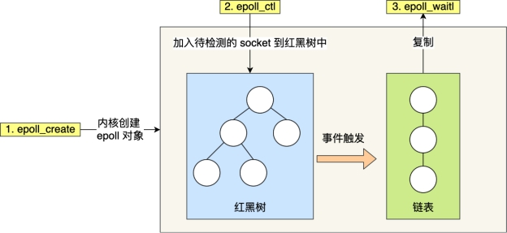

epoll 的方式即使监听的 Socket 数量越多的时候，效率不会大幅度降低，能够同时监听的 Socket 的数目也非常的多了，上限就为系统定义的进程打开的最大文件描述符个数。因而，epoll 被称为解决 C10K 问题的利器。

插个题外话，网上文章不少说，epoll_wait返回时，对于就绪的事件，epoll使用的是共享内存的方式，即用户态和内核态都指向了就绪链表，所以就避免了内存拷贝消耗。

这是错的！看过 epoll 内核源码的都知道，压根就没有使用共享内存这个玩意。你可以从下面这份代码看到， epoll**wait 实现的内核代码中调用了 `__put**user` 函数，这个函数就是将数据从内核拷贝到用户空间。

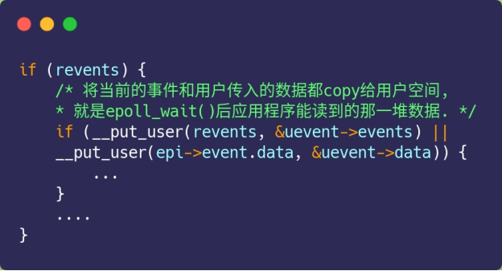

好了，这个题外话就说到这了，我们继续！

epoll 支持两种事件触发模式，分别是边缘触发（**edge-triggered，ET**）和水平触发（**level-triggered，LT**）。

这两个术语还挺抽象的，其实它们的区别还是很好理解的。

- 使用边缘触发模式时，当被监控的 Socket 描述符上有可读事件发生时，服务器端只会从 epoll_wait 中苏醒一次，即使进程没有调用 read 函数从内核读取数据，也依然只苏醒一次，因此我们程序要保证一次性将内核缓冲区的数据读取完；

- 使用水平触发模式时，当被监控的 Socket 上有可读事件发生时，服务器端不断地从 epoll_wait 中苏醒，直到内核缓冲区数据被 read 函数读完才结束，目的是告诉我们有数据需要读取；

举个例子，你的快递被放到了一个快递箱里，如果快递箱只会通过短信通知你一次，即使你一直没有去取，它也不会再发送第二条短信提醒你，这个方式就是边缘触发；如果快递箱发现你的快递没有被取出，它就会不停地发短信通知你，直到你取出了快递，它才消停，这个就是水平触发的方式。

这就是两者的区别，水平触发的意思是只要满足事件的条件，比如内核中有数据需要读，就一直不断地把这个事件传递给用户；而边缘触发的意思是只有第一次满足条件的时候才触发，之后就不会再传递同样的事件了。

如果使用水平触发模式，当内核通知文件描述符可读写时，接下来还可以继续去检测它的状态，看它是否依然可读或可写。所以在收到通知后，没必要一次执行尽可能多的读写操作。

如果使用边缘触发模式，I/O 事件发生时只会通知一次，而且我们不知道到底能读写多少数据，所以在收到通知后应尽可能地读写数据，以免错失读写的机会。因此，我们会循环从文件描述符读写数据，那么如果文件描述符是阻塞的，没有数据可读写时，进程会阻塞在读写函数那里，程序就没办法继续往下执行。所以，边缘触发模式一般和非阻塞 I/O 搭配使用，程序会一直执行 I/O 操作，直到系统调用（如 read和 write）返回错误，错误类型为 EAGAIN或 EWOULDBLOCK。

一般来说，边缘触发的效率比水平触发的效率要高，因为边缘触发可以减少 epoll_wait 的系统调用次数，系统调用也是有一定的开销的的，毕竟也存在上下文的切换。

select/poll 只有水平触发模式，epoll 默认的触发模式是水平触发，但是可以根据应用场景设置为边缘触发模式。

另外，使用 I/O 多路复用时，最好搭配非阻塞 I/O 一起使用，Linux 手册关于 select 的内容中有如下说明：

Under Linux, select() may report a socket file descriptor as "ready for reading", while nevertheless a subsequent read blocks. This could for example happen when data has arrived but upon examination has wrong checksum and is discarded. There may be other circumstances in which a file descriptor is spuriously reported as ready. Thus it may be safer to use O_NONBLOCK on sockets that should not block.

我谷歌翻译的结果：

在Linux下，select() 可能会将一个 socket 文件描述符报告为 "准备读取"，而后续的读取块却没有。例如，当数据已经到达，但经检查后发现有错误的校验和而被丢弃时，就会发生这种情况。也有可能在其他情况下，文件描述符被错误地报告为就绪。因此，在不应该阻塞的 socket 上使用 O_NONBLOCK 可能更安全。

简单点理解，就是多路复用 API 返回的事件并不一定可读写的，如果使用阻塞 I/O， 那么在调用 read/write 时则会发生程序阻塞，因此最好搭配非阻塞 I/O，以便应对极少数的特殊情况。


### 总结

最基础的 TCP 的 Socket 编程，它是阻塞 I/O 模型，基本上只能一对一通信，那为了服务更多的客户端，我们需要改进网络 I/O 模型。

比较传统的方式是使用多进程/线程模型，每来一个客户端连接，就分配一个进程/线程，然后后续的读写都在对应的进程/线程，这种方式处理 100 个客户端没问题，但是当客户端增大到 10000 个时，10000 个进程/线程的调度、上下文切换以及它们占用的内存，都会成为瓶颈。

为了解决上面这个问题，就出现了 I/O 的多路复用，可以只在一个进程里处理多个文件的 I/O，Linux 下有三种提供 I/O 多路复用的 API，分别是： select、poll、epoll。

select 和 poll 并没有本质区别，它们内部都是使用「线性结构」来存储进程关注的 Socket 集合。

在使用的时候，首先需要把关注的 Socket 集合通过 select/poll 系统调用从用户态拷贝到内核态，然后由内核检测事件，当有网络事件产生时，内核需要遍历进程关注 Socket 集合，找到对应的 Socket，并设置其状态为可读/可写，然后把整个 Socket 集合从内核态拷贝到用户态，用户态还要继续遍历整个 Socket 集合找到可读/可写的 Socket，然后对其处理。

很明显发现，select 和 poll 的缺陷在于，当客户端越多，也就是 Socket 集合越大，Socket 集合的遍历和拷贝会带来很大的开销，因此也很难应对 C10K。

epoll 是解决 C10K 问题的利器，通过两个方面解决了 select/poll 的问题。

- epoll 在内核里使用「红黑树」来关注进程所有待检测的 Socket，红黑树是个高效的数据结构，增删查一般时间复杂度是 O(logn)，通过对这棵黑红树的管理，不需要像 select/poll 在每次操作时都传入整个 Socket 集合，减少了内核和用户空间大量的数据拷贝和内存分配。

- epoll 使用事件驱动的机制，内核里维护了一个「链表」来记录就绪事件，只将有事件发生的 Socket 集合传递给应用程序，不需要像 select/poll 那样轮询扫描整个集合（包含有和无事件的 Socket ），大大提高了检测的效率。

而且，epoll 支持边缘触发和水平触发的方式，而 select/poll 只支持水平触发，一般而言，边缘触发的方式会比水平触发的效率高。


## 8.4 高性能网络模式：Reactor 和 Proactor

小林，来了。

这次就来图解 Reactor 和 Proactor 这两个高性能网络模式。

别小看这两个东西，特别是 Reactor 模式，市面上常见的开源软件很多都采用了这个方案，比如 Redis、Nginx、Netty 等等，所以学好这个模式设计的思想，不仅有助于我们理解很多开源软件，而且也能在面试时吹逼。

发车！

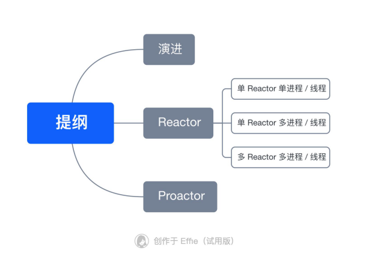


### 演进

如果要让服务器服务多个客户端，那么最直接的方式就是为每一条连接创建线程。

其实创建进程也是可以的，原理是一样的，进程和线程的区别在于线程比较轻量级些，线程的创建和线程间切换的成本要小些，为了描述简述，后面都以线程为例。

处理完业务逻辑后，随着连接关闭后线程也同样要销毁了，但是这样不停地创建和销毁线程，不仅会带来性能开销，也会造成浪费资源，而且如果要连接几万条连接，创建几万个线程去应对也是不现实的。

要这么解决这个问题呢？我们可以使用「资源复用」的方式。

也就是不用再为每个连接创建线程，而是创建一个「线程池」，将连接分配给线程，然后一个线程可以处理多个连接的业务。

不过，这样又引来一个新的问题，线程怎样才能高效地处理多个连接的业务？

当一个连接对应一个线程时，线程一般采用「read -> 业务处理 -> send」的处理流程，如果当前连接没有数据可读，那么线程会阻塞在 read操作上（ socket 默认情况是阻塞 I/O），不过这种阻塞方式并不影响其他线程。

但是引入了线程池，那么一个线程要处理多个连接的业务，线程在处理某个连接的 read操作时，如果遇到没有数据可读，就会发生阻塞，那么线程就没办法继续处理其他连接的业务。

要解决这一个问题，最简单的方式就是将 socket 改成非阻塞，然后线程不断地轮询调用 read操作来判断是否有数据，这种方式虽然该能够解决阻塞的问题，但是解决的方式比较粗暴，因为轮询是要消耗 CPU 的，而且随着一个 线程处理的连接越多，轮询的效率就会越低。

上面的问题在于，线程并不知道当前连接是否有数据可读，从而需要每次通过 read去试探。

那有没有办法在只有当连接上有数据的时候，线程才去发起读请求呢？答案是有的，实现这一技术的就是 I/O 多路复用。

I/O 多路复用技术会用一个系统调用函数来监听我们所有关心的连接，也就说可以在一个监控线程里面监控很多的连接。


我们熟悉的 select/poll/epoll 就是内核提供给用户态的多路复用系统调用，线程可以通过一个系统调用函数从内核中获取多个事件。

PS：如果想知道 select/poll/epoll 的区别，可以看看小林之前写的这篇文章：[这次答应我，一举拿下 I/O 多路复用！](https://mp.weixin.qq.com/s/Qpa0qXxuIM8jrBqDaXmVNA)

select/poll/epoll 是如何获取网络事件的呢？

在获取事件时，先把我们要关心的连接传给内核，再由内核检测：

- 如果没有事件发生，线程只需阻塞在这个系统调用，而无需像前面的线程池方案那样轮训调用 read 操作来判断是否有数据。

- 如果有事件发生，内核会返回产生了事件的连接，线程就会从阻塞状态返回，然后在用户态中再处理这些连接对应的业务即可。

当下开源软件能做到网络高性能的原因就是 I/O 多路复用吗？

是的，基本是基于 I/O 多路复用，用过 I/O 多路复用接口写网络程序的同学，肯定知道是面向过程的方式写代码的，这样的开发的效率不高。

于是，大佬们基于面向对象的思想，对 I/O 多路复用作了一层封装，让使用者不用考虑底层网络 API 的细节，只需要关注应用代码的编写。

大佬们还为这种模式取了个让人第一时间难以理解的名字：Reactor 模式。

Reactor 翻译过来的意思是「反应堆」，可能大家会联想到物理学里的核反应堆，实际上并不是的这个意思。

这里的反应指的是「对事件反应」，也就是来了一个事件，Reactor 就有相对应的反应/响应。

事实上，Reactor 模式也叫 Dispatcher模式，我觉得这个名字更贴合该模式的含义，即 I/O 多路复用监听事件，收到事件后，根据事件类型分配（Dispatch）给某个进程 / 线程。

Reactor 模式主要由 Reactor 和处理资源池这两个核心部分组成，它俩负责的事情如下：

- Reactor 负责监听和分发事件，事件类型包含连接事件、读写事件；

- 处理资源池负责处理事件，如 read -> 业务逻辑 -> send；

Reactor 模式是灵活多变的，可以应对不同的业务场景，灵活在于：

- Reactor 的数量可以只有一个，也可以有多个；

- 处理资源池可以是单个进程 / 线程，也可以是多个进程 /线程；

将上面的两个因素排列组设一下，理论上就可以有 4 种方案选择：

- 单 Reactor 单进程 / 线程；

- 单 Reactor 多进程 / 线程；

- 多 Reactor 单进程 / 线程；

- 多 Reactor 多进程 / 线程；

其中，「多 Reactor 单进程 / 线程」实现方案相比「单 Reactor 单进程 / 线程」方案，不仅复杂而且也没有性能优势，因此实际中并没有应用。

剩下的 3 个方案都是比较经典的，且都有应用在实际的项目中：

- 单 Reactor 单进程 / 线程；

- 单 Reactor 多线程 / 进程；

- 多 Reactor 多进程 / 线程；

方案具体使用进程还是线程，要看使用的编程语言以及平台有关：

- Java 语言一般使用线程，比如 Netty;

- C 语言使用进程和线程都可以，例如 Nginx 使用的是进程，Memcache 使用的是线程。

接下来，分别介绍这三个经典的 Reactor 方案。


### Reactor


#### 单 Reactor 单进程 / 线程

一般来说，C 语言实现的是「单 Reactor **单进程**」的方案，因为 C 语编写完的程序，运行后就是一个独立的进程，不需要在进程中再创建线程。

而 Java 语言实现的是「单 Reactor **单线程**」的方案，因为 Java 程序是跑在 Java 虚拟机这个进程上面的，虚拟机中有很多线程，我们写的 Java 程序只是其中的一个线程而已。

我们来看看「单 Reactor 单进程」的方案示意图：

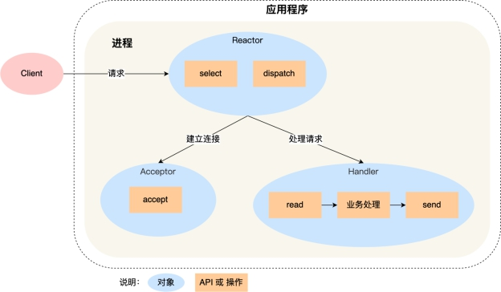

可以看到进程里有 Reactor、Acceptor、Handler 这三个对象：

- Reactor 对象的作用是监听和分发事件；

- Acceptor 对象的作用是获取连接；

- Handler 对象的作用是处理业务；

对象里的 select、accept、read、send 是系统调用函数，dispatch 和 「业务处理」是需要完成的操作，其中 dispatch 是分发事件操作。

接下来，介绍下「单 Reactor 单进程」这个方案：

- Reactor 对象通过 select （IO 多路复用接口） 监听事件，收到事件后通过 dispatch 进行分发，具体分发给 Acceptor 对象还是 Handler 对象，还要看收到的事件类型；

- 如果是连接建立的事件，则交由 Acceptor 对象进行处理，Acceptor 对象会通过 accept 方法 获取连接，并创建一个 Handler 对象来处理后续的响应事件；

- 如果不是连接建立事件， 则交由当前连接对应的 Handler 对象来进行响应；

- Handler 对象通过 read -> 业务处理 -> send 的流程来完成完整的业务流程。

单 Reactor 单进程的方案因为全部工作都在同一个进程内完成，所以实现起来比较简单，不需要考虑进程间通信，也不用担心多进程竞争。

但是，这种方案存在 2 个缺点：

- 第一个缺点，因为只有一个进程，无法充分利用 多核 CPU 的性能；

- 第二个缺点，Handler 对象在业务处理时，整个进程是无法处理其他连接的事件的，如果业务处理耗时比较长，那么就造成响应的延迟；

所以，单 Reactor 单进程的方案不适用计算机密集型的场景，只适用于业务处理非常快速的场景。

Redis 是由 C 语言实现的，它采用的正是「单 Reactor 单进程」的方案，因为 Redis 业务处理主要是在内存中完成，操作的速度是很快的，性能瓶颈不在 CPU 上，所以 Redis 对于命令的处理是单进程的方案。


#### 单 Reactor 多线程 / 多进程

如果要克服「单 Reactor 单线程 / 进程」方案的缺点，那么就需要引入多线程 / 多进程，这样就产生了单 Reactor 多线程 / 多进程的方案。

闻其名不如看其图，先来看看「单 Reactor 多线程」方案的示意图如下：

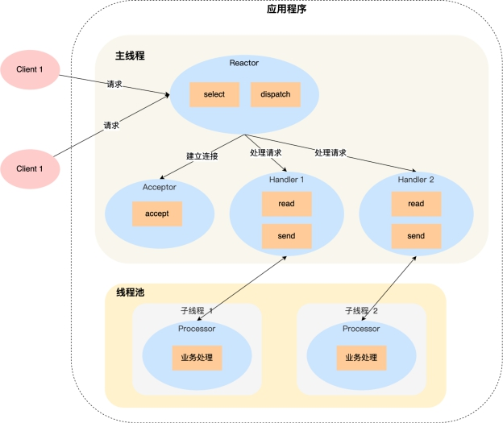

详细说一下这个方案：

- Reactor 对象通过 select （IO 多路复用接口） 监听事件，收到事件后通过 dispatch 进行分发，具体分发给 Acceptor 对象还是 Handler 对象，还要看收到的事件类型；

- 如果是连接建立的事件，则交由 Acceptor 对象进行处理，Acceptor 对象会通过 accept 方法 获取连接，并创建一个 Handler 对象来处理后续的响应事件；

- 如果不是连接建立事件， 则交由当前连接对应的 Handler 对象来进行响应；

上面的三个步骤和单 Reactor 单线程方案是一样的，接下来的步骤就开始不一样了：

- Handler 对象不再负责业务处理，只负责数据的接收和发送，Handler 对象通过 read 读取到数据后，会将数据发给子线程里的 Processor 对象进行业务处理；

- 子线程里的 Processor 对象就进行业务处理，处理完后，将结果发给主线程中的 Handler 对象，接着由 Handler 通过 send 方法将响应结果发送给 client；

单 Reator 多线程的方案优势在于能够充分利用多核 CPU 的能，那既然引入多线程，那么自然就带来了多线程竞争资源的问题。

例如，子线程完成业务处理后，要把结果传递给主线程的 Reactor 进行发送，这里涉及共享数据的竞争。

要避免多线程由于竞争共享资源而导致数据错乱的问题，就需要在操作共享资源前加上互斥锁，以保证任意时间里只有一个线程在操作共享资源，待该线程操作完释放互斥锁后，其他线程才有机会操作共享数据。

聊完单 Reactor 多线程的方案，接着来看看单 Reactor 多进程的方案。

事实上，单 Reactor 多进程相比单 Reactor 多线程实现起来很麻烦，主要因为要考虑子进程 <-> 父进程的双向通信，并且父进程还得知道子进程要将数据发送给哪个客户端。

而多线程间可以共享数据，虽然要额外考虑并发问题，但是这远比进程间通信的复杂度低得多，因此实际应用中也看不到单 Reactor 多进程的模式。

另外，「单 Reactor」的模式还有个问题，因为一个 Reactor 对象承担所有事件的监听和响应，而且只在主线程中运行，在面对瞬间高并发的场景时，容易成为性能的瓶颈的地方。


#### 多 Reactor 多进程 / 线程

要解决「单 Reactor」的问题，就是将「单 Reactor」实现成「多 Reactor」，这样就产生了第 多 Reactor 多进程 / 线程的方案。

老规矩，闻其名不如看其图。多 Reactor 多进程 / 线程方案的示意图如下（以线程为例）：

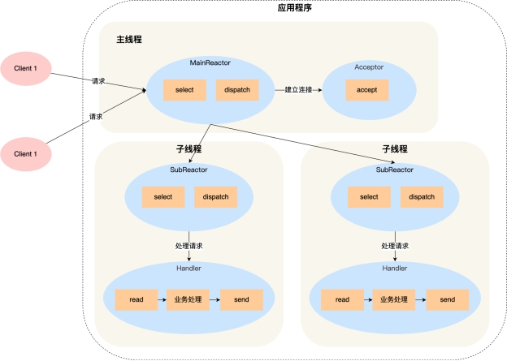

方案详细说明如下：

- 主线程中的 MainReactor 对象通过 select 监控连接建立事件，收到事件后通过 Acceptor 对象中的 accept 获取连接，将新的连接分配给某个子线程；

- 子线程中的 SubReactor 对象将 MainReactor 对象分配的连接加入 select 继续进行监听，并创建一个 Handler 用于处理连接的响应事件。

- 如果有新的事件发生时，SubReactor 对象会调用当前连接对应的 Handler 对象来进行响应。

- Handler 对象通过 read -> 业务处理 -> send 的流程来完成完整的业务流程。

多 Reactor 多线程的方案虽然看起来复杂的，但是实际实现时比单 Reactor 多线程的方案要简单的多，原因如下：

- 主线程和子线程分工明确，主线程只负责接收新连接，子线程负责完成后续的业务处理。

- 主线程和子线程的交互很简单，主线程只需要把新连接传给子线程，子线程无须返回数据，直接就可以在子线程将处理结果发送给客户端。

大名鼎鼎的两个开源软件 Netty 和 Memcache 都采用了「多 Reactor 多线程」的方案。

采用了「多 Reactor 多进程」方案的开源软件是 Nginx，不过方案与标准的多 Reactor 多进程有些差异。

具体差异表现在主进程中仅仅用来初始化 socket，并没有创建 mainReactor 来 accept 连接，而是由子进程的 Reactor 来 accept 连接，通过锁来控制一次只有一个子进程进行 accept（防止出现惊群现象），子进程 accept 新连接后就放到自己的 Reactor 进行处理，不会再分配给其他子进程。


### Proactor

前面提到的 Reactor 是非阻塞同步网络模式，而 Proactor 是异步网络模式。

这里先给大家复习下阻塞、非阻塞、同步、异步 I/O 的概念。

先来看看阻塞 I/O，当用户程序执行 read，线程会被阻塞，一直等到内核数据准备好，并把数据从内核缓冲区拷贝到应用程序的缓冲区中，当拷贝过程完成，read才会返回。

注意，阻塞等待的是「内核数据准备好」和「数据从内核态拷贝到用户态」这两个过程。过程如下图：


知道了阻塞 I/O ，来看看非阻塞 I/O，非阻塞的 read 请求在数据未准备好的情况下立即返回，可以继续往下执行，此时应用程序不断轮询内核，直到数据准备好，内核将数据拷贝到应用程序缓冲区，read调用才可以获取到结果。过程如下图：


注意，这里最后一次 read 调用，获取数据的过程，是一个同步的过程，是需要等待的过程。这里的同步指的是内核态的数据拷贝到用户程序的缓存区这个过程。

举个例子，如果 socket 设置了 O_NONBLOCK标志，那么就表示使用的是非阻塞 I/O 的方式访问，而不做任何设置的话，默认是阻塞 I/O。

因此，无论 read 和 send 是阻塞 I/O，还是非阻塞 I/O 都是同步调用。因为在 read 调用时，内核将数据从内核空间拷贝到用户空间的过程都是需要等待的，也就是说这个过程是同步的，如果内核实现的拷贝效率不高，read 调用就会在这个同步过程中等待比较长的时间。

而真正的异步 I/O 是「内核数据准备好」和「数据从内核态拷贝到用户态」这两个过程都不用等待。

当我们发起 aio_read（异步 I/O） 之后，就立即返回，内核自动将数据从内核空间拷贝到用户空间，这个拷贝过程同样是异步的，内核自动完成的，和前面的同步操作不一样，应用程序并不需要主动发起拷贝动作。过程如下图：


举个你去饭堂吃饭的例子，你好比应用程序，饭堂好比操作系统。

阻塞 I/O 好比，你去饭堂吃饭，但是饭堂的菜还没做好，然后你就一直在那里等啊等，等了好长一段时间终于等到饭堂阿姨把菜端了出来（数据准备的过程），但是你还得继续等阿姨把菜（内核空间）打到你的饭盒里（用户空间），经历完这两个过程，你才可以离开。

非阻塞 I/O 好比，你去了饭堂，问阿姨菜做好了没有，阿姨告诉你没，你就离开了，过几十分钟，你又来饭堂问阿姨，阿姨说做好了，于是阿姨帮你把菜打到你的饭盒里，这个过程你是得等待的。

异步 I/O 好比，你让饭堂阿姨将菜做好并把菜打到饭盒里后，把饭盒送到你面前，整个过程你都不需要任何等待。

很明显，异步 I/O 比同步 I/O 性能更好，因为异步 I/O 在「内核数据准备好」和「数据从内核空间拷贝到用户空间」这两个过程都不用等待。

Proactor 正是采用了异步 I/O 技术，所以被称为异步网络模型。

现在我们再来理解 Reactor 和 Proactor 的区别，就比较清晰了。

- Reactor 是非阻塞同步网络模式，感知的是就绪可读写事件。在每次感知到有事件发生（比如可读就绪事件）后，就需要应用进程主动调用 read 方法来完成数据的读取，也就是要应用进程主动将 socket 接收缓存中的数据读到应用进程内存中，这个过程是同步的，读取完数据后应用进程才能处理数据。

- Proactor 是异步网络模式， 感知的是已完成的读写事件。在发起异步读写请求时，需要传入数据缓冲区的地址（用来存放结果数据）等信息，这样系统内核才可以自动帮我们把数据的读写工作完成，这里的读写工作全程由操作系统来做，并不需要像 Reactor 那样还需要应用进程主动发起 read/write 来读写数据，操作系统完成读写工作后，就会通知应用进程直接处理数据。


因此，Reactor 可以理解为「来了事件操作系统通知应用进程，让应用进程来处理」，而 Proactor 可以理解为「来了事件操作系统来处理，处理完再通知应用进程」。这里的「事件」就是有新连接、有数据可读、有数据可写的这些 I/O 事件这里的「处理」包含从驱动读取到内核以及从内核读取到用户空间。

举个实际生活中的例子，Reactor 模式就是快递员在楼下，给你打电话告诉你快递到你家小区了，你需要自己下楼来拿快递。而在 Proactor 模式下，快递员直接将快递送到你家门口，然后通知你。

无论是 Reactor，还是 Proactor，都是一种基于「事件分发」的网络编程模式，区别在于 Reactor 模式是基于「待完成」的 I/O 事件，而 Proactor 模式则是基于「已完成」的 I/O 事件。

接下来，一起看看 Proactor 模式的示意图：

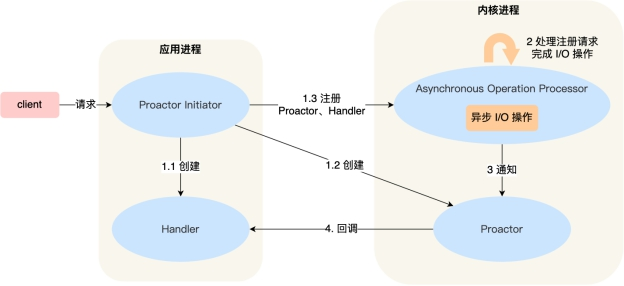

介绍一下 Proactor 模式的工作流程：

- Proactor Initiator 负责创建 Proactor 和 Handler 对象，并将 Proactor 和 Handler 都通过Asynchronous Operation Processor 注册到内核；

- Asynchronous Operation Processor 负责处理注册请求，并处理 I/O 操作；

- Asynchronous Operation Processor 完成 I/O 操作后通知 Proactor；

- Proactor 根据不同的事件类型回调不同的 Handler 进行业务处理；

- Handler 完成业务处理；

可惜的是，在 Linux 下的异步 I/O 是不完善的，aio系列函数是由 POSIX 定义的异步操作接口，不是真正的操作系统级别支持的，而是在用户空间模拟出来的异步，并且仅仅支持基于本地文件的 aio 异步操作，网络编程中的 socket 是不支持的，这也使得基于 Linux 的高性能网络程序都是使用 Reactor 方案。

而 Windows 里实现了一套完整的支持 socket 的异步编程接口，这套接口就是 IOCP，是由操作系统级别实现的异步 I/O，真正意义上异步 I/O，因此在 Windows 里实现高性能网络程序可以使用效率更高的 Proactor 方案。


### 总结

常见的 Reactor 实现方案有三种。

第一种方案单 Reactor 单进程 / 线程，不用考虑进程间通信以及数据同步的问题，因此实现起来比较简单，这种方案的缺陷在于无法充分利用多核 CPU，而且处理业务逻辑的时间不能太长，否则会延迟响应，所以不适用于计算机密集型的场景，适用于业务处理快速的场景，比如 Redis 采用的是单 Reactor 单进程的方案。

第二种方案单 Reactor 多线程，通过多线程的方式解决了方案一的缺陷，但它离高并发还差一点距离，差在只有一个 Reactor 对象来承担所有事件的监听和响应，而且只在主线程中运行，在面对瞬间高并发的场景时，容易成为性能的瓶颈的地方。

第三种方案多 Reactor 多进程 / 线程，通过多个 Reactor 来解决了方案二的缺陷，主 Reactor 只负责监听事件，响应事件的工作交给了从 Reactor，Netty 和 Memcache 都采用了「多 Reactor 多线程」的方案，Nginx 则采用了类似于 「多 Reactor 多进程」的方案。

Reactor 可以理解为「来了事件操作系统通知应用进程，让应用进程来处理」，而 Proactor 可以理解为「来了事件操作系统来处理，处理完再通知应用进程」。

因此，真正的大杀器还是 Proactor，它是采用异步 I/O 实现的异步网络模型，感知的是已完成的读写事件，而不需要像 Reactor 感知到事件后，还需要调用 read 来从内核中获取数据。

不过，无论是 Reactor，还是 Proactor，都是一种基于「事件分发」的网络编程模式，区别在于 Reactor 模式是基于「待完成」的 I/O 事件，而 Proactor 模式则是基于「已完成」的 I/O 事件。


# 九、Linux 命令


## 9.1 如何查看网络的性能指标？

Linux 网络协议栈是根据 TCP/IP 模型来实现的，TCP/IP 模型由应用层、传输层、网络层和网络接口层，共四层组成，每一层都有各自的职责。


应用程序要发送数据包时，通常是通过 socket 接口，于是就会发生系统调用，把应用层的数据拷贝到内核里的 socket 层，接着由网络协议栈从上到下逐层处理后，最后才会送到网卡发送出去。

而对于接收网络包时，同样也要经过网络协议逐层处理，不过处理的方向与发送数据时是相反的，也就是从下到上的逐层处理，最后才送到应用程序。

网络的速度往往跟用户体验是挂钩的，那我们又该用什么指标来衡量 Linux 的网络性能呢？以及如何分析网络问题呢？

这次，我们就来说这些。

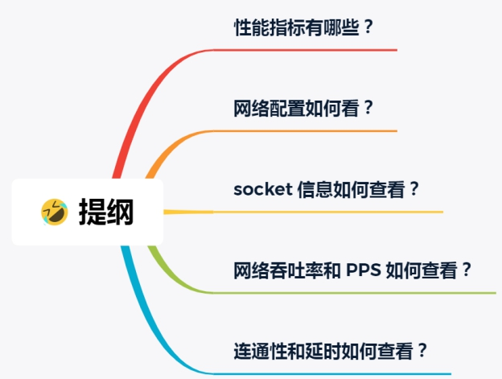


### 性能指标有哪些？

通常是以 4 个指标来衡量网络的性能，分别是带宽、延时、吞吐率、PPS（Packet Per Second），它们表示的意义如下：

- **带宽**，表示链路的最大传输速率，单位是 b/s （比特 / 秒），带宽越大，其传输能力就越强。

- **延时**，表示请求数据包发送后，收到对端响应，所需要的时间延迟。不同的场景有着不同的含义，比如可以表示建立 TCP 连接所需的时间延迟，或一个数据包往返所需的时间延迟。

- **吞吐率**，表示单位时间内成功传输的数据量，单位是 b/s（比特 / 秒）或者 B/s（字节 / 秒），吞吐受带宽限制，带宽越大，吞吐率的上限才可能越高。

- **PPS**，全称是 Packet Per Second（包 / 秒），表示以网络包为单位的传输速率，一般用来评估系统对于网络的转发能力。

当然，除了以上这四种基本的指标，还有一些其他常用的性能指标，比如：

- **网络的可用性**，表示网络能否正常通信；

- **并发连接数**，表示 TCP 连接数量；

- **丢包率**，表示所丢失数据包数量占所发送数据组的比率；

- **重传率**，表示重传网络包的比例；

你可能会问了，如何观测这些性能指标呢？不急，继续往下看。


### 网络配置如何看？

要想知道网络的配置和状态，我们可以使用 ifconfig或者 ip命令来查看。

这两个命令功能都差不多，不过它们属于不同的软件包，ifconfig属于 net-tools软件包，ip属于 iproute2软件包，我的印象中 net-tools软件包没有人继续维护了，而 iproute2软件包是有开发者依然在维护，所以更推荐你使用 ip工具。

学以致用，那就来使用这两个命令，来查看网口 eth0的配置等信息：

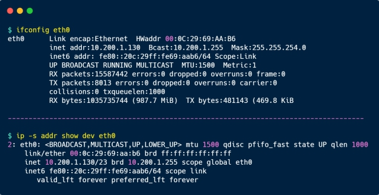

虽然这两个命令输出的格式不尽相同，但是输出的内容基本相同，比如都包含了 IP 地址、子网掩码、MAC 地址、网关地址、MTU 大小、网口的状态以及网路包收发的统计信息，下面就来说说这些信息，它们都与网络性能有一定的关系。

第一，网口的连接状态标志。其实也就是表示对应的网口是否连接到交换机或路由器等设备，如果 ifconfig输出中看到有 RUNNING，或者 ip输出中有 LOWER_UP，则说明物理网路是连通的，如果看不到，则表示网口没有接网线。

第二，MTU 大小。默认值是 1500字节，其作用主要是限制网络包的大小，如果 IP 层有一个数据报要传，而且数据帧的长度比链路层的 MTU 还大，那么 IP 层就需要进行分片，即把数据报分成干片，这样每一片就都小于 MTU。事实上，每个网络的链路层 MTU 可能会不一样，所以你可能需要调大或者调小 MTU 的数值。

第三，网口的 IP 地址、子网掩码、MAC 地址、网关地址。这些信息必须要配置正确，网络功能才能正常工作。

第四，网路包收发的统计信息。通常有网络收发的字节数、包数、错误数以及丢包情况的信息，如果 TX（发送） 和 RX（接收） 部分中 errors、dropped、overruns、carrier 以及 collisions 等指标不为 0 时，则说明网络发送或者接收出问题了，这些出错统计信息的指标意义如下：

- **errors** 表示发生错误的数据包数，比如校验错误、帧同步错误等；

- **dropped** 表示丢弃的数据包数，即数据包已经收到了 Ring Buffer（这个缓冲区是在内核内存中，更具体一点是在网卡驱动程序里），但因为系统内存不足等原因而发生的丢包；

- **overruns** 表示超限数据包数，即网络接收/发送速度过快，导致 Ring Buffer 中的数据包来不及处理，而导致的丢包，因为过多的数据包挤压在 Ring Buffer，这样 Ring Buffer 很容易就溢出了；

- **carrier** 表示发生 carrirer 错误的数据包数，比如双工模式不匹配、物理电缆出现问题等；

- **collisions** 表示冲突、碰撞数据包数；

ifconfig和 ip命令只显示的是网口的配置以及收发数据包的统计信息，而看不到协议栈里的信息，那接下来就来看看如何查看协议栈里的信息。


### socket 信息如何查看？

我们可以使用 netstat或者 ss，这两个命令查看 socket、网络协议栈、网口以及路由表的信息。

虽然 netstat与 ss命令查看的信息都差不多，但是如果在生产环境中要查看这类信息的时候，尽量不要使用 netstat命令，因为它的性能不好，在系统比较繁忙的情况下，如果频繁使用 netstat命令则会对性能的开销雪上加霜，所以更推荐你使用性能更好的 ss命令。

从下面这张图，你可以看到这两个命令的输出内容：

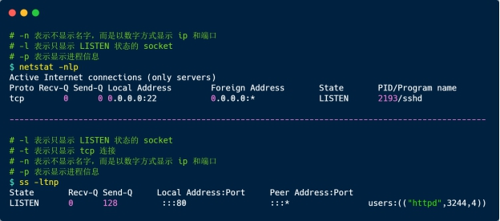


可以发现，输出的内容都差不多， 比如都包含了 socket 的状态（**State**）、接收队列（**Recv-Q**）、发送队列（**Send-Q**）、本地地址（**Local Address**）、远端地址（**Foreign Address**）、进程 PID 和进程名称（**PID/Program name**）等。

接收队列（**Recv-Q**）和发送队列（**Send-Q**）比较特殊，在不同的 socket 状态。它们表示的含义是不同的。

当 socket 状态处于 Established时：

- **Recv-Q** 表示 socket 缓冲区中还没有被应用程序读取的字节数；

- **Send-Q** 表示 socket 缓冲区中还没有被远端主机确认的字节数；

而当 socket 状态处于 Listen时：

- **Recv-Q** 表示全连接队列的长度；

- **Send-Q** 表示全连接队列的最大长度；

在 TCP 三次握手过程中，当服务器收到客户端的 SYN 包后，内核会把该连接存储到半连接队列，然后再向客户端发送 SYN+ACK 包，接着客户端会返回 ACK，服务端收到第三次握手的 ACK 后，内核会把连接从半连接队列移除，然后创建新的完全的连接，并将其增加到全连接队列 ，等待进程调用 accept()函数时把连接取出来。

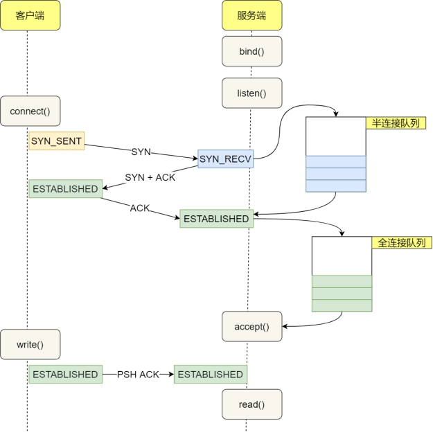

也就说，全连接队列指的是服务器与客户端完了 TCP 三次握手后，还没有被 accept()系统调用取走连接的队列。

那对于协议栈的统计信息，依然还是使用 netstat或 ss，它们查看统计信息的命令如下：

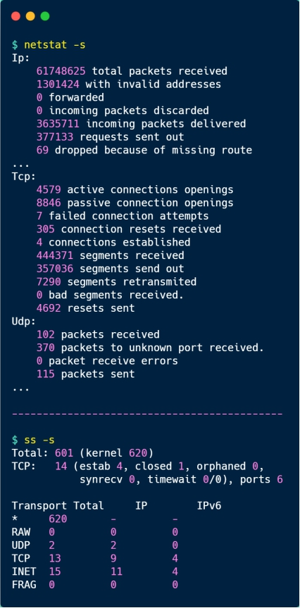

ss命令输出的统计信息相比 netsat比较少，ss只显示已经连接（**estab**）、关闭（**closed**）、孤儿（**orphaned**） socket 等简要统计。

而 netstat则有更详细的网络协议栈信息，比如上面显示了 TCP 协议的主动连接（**active connections openings**）、被动连接（**passive connection openings**）、失败重试（**failed connection attempts**）、发送（**segments send out**）和接收（**segments received**）的分段数量等各种信息。


### 网络吞吐率和 PPS 如何查看？

可以使用 sar命令当前网络的吞吐率和 PPS，用法是给 sar增加 -n参数就可以查看网络的统计信息，比如

- sar -n DEV，显示网口的统计数据；

- sar -n EDEV，显示关于网络错误的统计数据；

- sar -n TCP，显示 TCP 的统计数据

比如，我通过 sar命令获取了网口的统计信息：

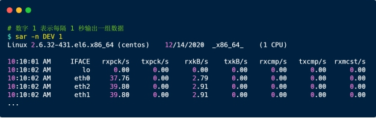

它们的含义：

- rxpck/s和 txpck/s 分别是接收和发送的 PPS，单位为包 / 秒。

- rxkB/s和 txkB/s 分别是接收和发送的吞吐率，单位是 KB/ 秒。

- rxcmp/s和 txcmp/s 分别是接收和发送的压缩数据包数，单位是包 / 秒。

对于带宽，我们可以使用 ethtool命令来查询，它的单位通常是 Gb/s或者 Mb/s
，不过注意这里小写字母 b，表示比特而不是字节。我们通常提到的千兆网卡、万兆网卡等，单位也都是比特（**bit**）。如下你可以看到， eth0 网卡就是一个千兆网卡：

$ ethtool eth0 | grep SpeedSpeed: 1000Mb/s


### 连通性和延时如何查看？

要测试本机与远程主机的连通性和延时，通常是使用 ping命令，它是基于 ICMP 协议的，工作在网络层。

比如，如果要测试本机到 192.168.12.20IP 地址的连通性和延时：

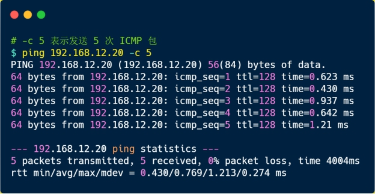

显示的内容主要包含 icmp_seq（ICMP 序列号）、TTL（生存时间，或者跳数）以及 time（往返延时），而且最后会汇总本次测试的情况，如果网络没有丢包，packet loss的百分比就是 0。

不过，需要注意的是，ping不通服务器并不代表 HTTP 请求也不通，因为有的服务器的防火墙是会禁用 ICMP 协议的。


## 9.2 如何从日志分析 PV、UV？

很多时候，我们观察程序是否如期运行，或者是否有错误，最直接的方式就是看运行日志，当然要想从日志快速查到我们想要的信息，前提是程序打印的日志要精炼、精准。

但日志涵盖的信息远不止于此，比如对于 nginx 的 access.log 日志，我们可以根据日志信息分析用户行为。

什么用户行为呢？比如分析出哪个页面访问次数（**PV**）最多，访问人数（**UV**）最多，以及哪天访问量最多，哪个请求访问最多等等。

这次，将用一个大概几万条记录的 nginx 日志文件作为案例，一起来看看如何分析出「用户信息」。


### 别急着开始

当我们要分析日志的时候，先用 ls -lh命令查看日志文件的大小，如果日志文件大小非常大，最好不要在线上环境做。

比如我下面这个日志就 6.5M，不算大，在线上环境分析问题不大。


如果日志文件数据量太大，你直接一个 cat命令一执行，是会影响线上环境，加重服务器的负载，严重的话，可能导致服务器无响应。

当发现日志很大的时候，我们可以使用 scp命令将文件传输到闲置的服务器再分析，scp 命令使用方式如下图：

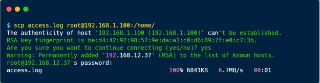


### 慎用 cat

大家都知道 cat命令是用来查看文件内容的，但是日志文件数据量有多少，它就读多少，很显然不适用大文件。

对于大文件，我们应该养成好习惯，用 less命令去读文件里的内容，因为 less 并不会加载整个文件，而是按需加载，先是输出一小页的内容，当你要往下看的时候，才会继续加载。


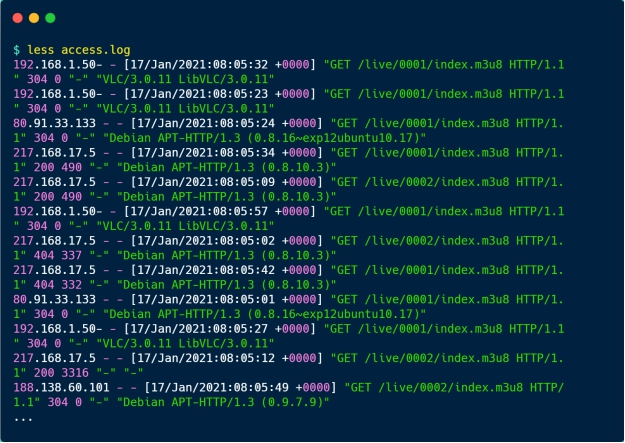


可以发现，nginx 的 access.log 日志每一行是一次用户访问的记录，从左到右分别包含如下信息：

- 客户端的 IP 地址；

- 访问时间；

- HTTP 请求的方法、路径、协议版本、协议版本、返回的状态码；

- User Agent，一般是客户端使用的操作系统以及版本、浏览器及版本等；

不过，有时候我们想看日志最新部分的内容，可以使用 tail命令，比如当你想查看倒数 5 行的内容，你可以使用这样的命令：

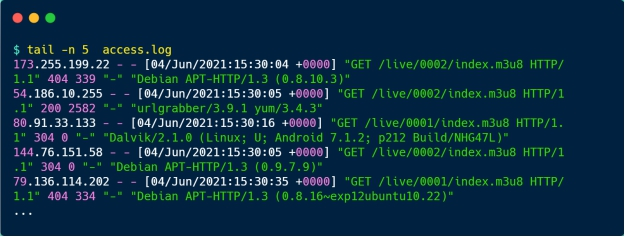


如果你想实时看日志打印的内容，你可以使用 tail -f命令，这样你看日志的时候，就会是阻塞状态，有新日志输出的时候，就会实时显示出来。


### PV 分析

PV 的全称叫 **Page View**，用户访问一个页面就是一次 PV，比如大多数博客平台，点击一次页面，阅读量就加 1，所以说 PV 的数量并不代表真实的用户数量，只是个点击量。

对于 nginx 的 acess.log日志文件来说，分析 PV 还是比较容易的，既然日志里的内容是访问记录，那有多少条日志记录就有多少 PV。

我们直接使用 wc -l命令，就可以查看整体的 PV 了，如下图一共有 49903 条 PV。


### PV 分组

nginx 的 acess.log日志文件有访问时间的信息，因此我们可以根据访问时间进行分组，比如按天分组，查看每天的总 PV，这样可以得到更加直观的数据。

要按时间分组，首先我们先「访问时间」过滤出来，这里可以使用 awk 命令来处理，awk 是一个处理文本的利器。

awk 命令默认是以「空格」为分隔符，由于访问时间在日志里的第 4 列，因此可以使用 awk '{print $4}' access.log命令把访问时间的信息过滤出来，结果如下：

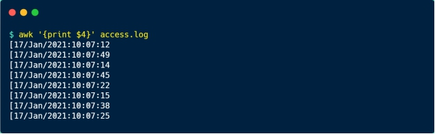


上面的信息还包含了时分秒，如果只想显示年月日的信息，可以使用 awk的 substr函数，从第 2 个字符开始，截取 11 个字符。


接着，我们可以使用 sort对日期进行排序，然后使用 uniq -c进行统计，于是按天分组的 PV 就出来了。

可以看到，每天的 PV 量大概在 2000-2800：

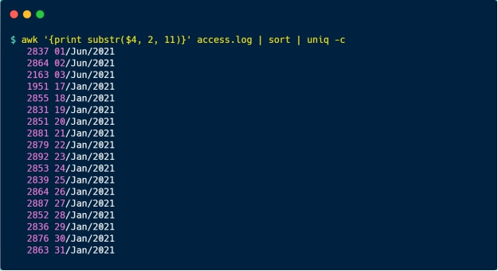

注意，使用 uniq -c命令前，先要进行 sort排序，因为 uniq 去重的原理是比较相邻的行，然后除去第二行和该行的后续副本，因此在使用 uniq 命令之前，请使用 sort 命令使所有重复行相邻。


### UV 分析

UV 的全称是 **Uniq Visitor**，它代表访问人数，比如公众号的阅读量就是以 UV 统计的，不管单个用户点击了多少次，最终只算 1 次阅读量。

access.log 日志里虽然没有用户的身份信息，但是我们可以用「客户端 IP 地址」来近似统计 UV。


该命令的输出结果是 2589，也就说明 UV 的量为 2589。上图中，从左到右的命令意思如下：

- awk '{print $1}' access.log，取日志的第 1 列内容，客户端的 IP 地址正是第 1 列；

- sort，对信息排序；

- uniq，去除重复的记录；

- wc -l，查看记录条数；


### UV 分组

假设我们按天来分组分析每天的 UV 数量，这种情况就稍微比较复杂，需要比较多的命令来实现。

既然要按天统计 UV，那就得把「日期 + IP地址」过滤出来，并去重，命令如下：

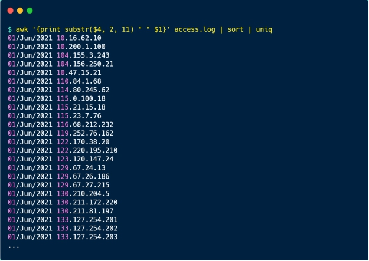

具体分析如下：

- 第一次 ack是将第 4 列的日期和第 1 列的客户端 IP 地址过滤出来，并用空格拼接起来；

- 然后 sort对第一次 ack 输出的内容进行排序；

- 接着用 uniq去除重复的记录，也就说日期 +IP 相同的行就只保留一个；

上面只是把 UV 的数据列了出来，但是并没有统计出次数。

如果需要对当天的 UV 统计，在上面的命令再拼接 awk '{uv[$1]++;next}END{for (ip in uv) print ip, uv[ip]}'命令就可以了，结果如下图：

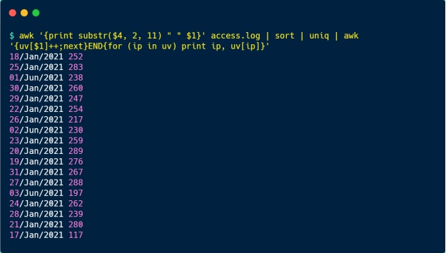

awk 本身是「逐行」进行处理的，当执行完一行后，我们可以用 next关键字来告诉 awk 跳转到下一行，把下一行作为输入。

对每一行输入，awk 会根据第 1 列的字符串（也就是日期）进行累加，这样相同日期的 ip 地址，就会累加起来，作为当天的 uv 数量。

之后的 END关键字代表一个触发器，就是当前面的输入全部完成后，才会执行 END {} 中的语句，END 的语句是通过 foreach 遍历 uv 中所有的 key，打印出按天分组的 uv 数量。


### 终端分析

nginx 的 access.log 日志最末尾关于 User Agent 的信息，主要是客户端访问服务器使用的工具，可能是手机、浏览器等。

因此，我们可以利用这一信息来分析有哪些终端访问了服务器。

User Agent 的信息在日志里的第 12 列，因此我们先使用 awk过滤出第 12 列的内容后，进行 sort排序，再用 uniq -c去重并统计，最后再使用 sort -rn（**r 表示逆向排序， n 表示按数值排序**） 对统计的结果排序，结果如下图：

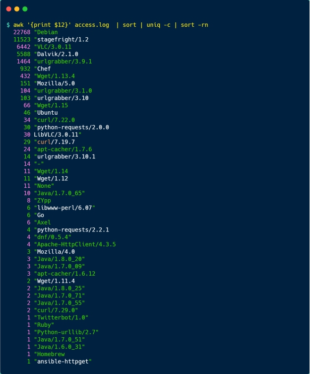


### 分析 TOP3 的请求

access.log 日志中，第 7 列是客户端请求的路径，先使用 awk过滤出第 7 列的内容后，进行 sort排序，再用 uniq -c去重并统计，然后再使用 sort -rn对统计的结果排序，最后使用 head -n 3分析 TOP3 的请求，结果如下图：


# 十、学习心得

最近收到不少读者留言，关于怎么学「操作系统」和「计算机网络」的留言，小林写这一块的内容也有半年多了，啃非常多的书，也看了很多视频，有好的有差的，今天就掏心掏肺地分享给大家。

操作系统和计算机网络有多重要呢？如果没有操作系统，我们的手机和电脑可以说是废铁了，自然它们都没有使用价值了，另外如果没有计算机网络，我们的手机和电脑就是一座「孤岛」了，孤岛的世界很单调，也没有什么色彩，也正是因为计算机网络，才创造出这么丰富多彩的互联网世界。

身为程序员的我们，那更应该深刻理解和掌握它们，虽然我们日常 CURD的工作中，即使不熟悉它们，也不妨碍我们写代码，但是当出现问题时，没有这些基础知识，你是无厘头的，根本没有思路下手，这时候和别人差距就显现出来了，可以说是程序员之间的分水岭。

事实上，我们工作中会有大量的时间都是在排查和解决问题，编码的时间其实比较少，如果计算机基础学的很扎实，虽然不敢保证我们能 100% 解决，但是至少遇到问题时，我们有一个排查的方向，或者直接就定位到问题所在，然后再一步一步尝试解决，解决了问题，自然就体现了我们自身的实力和价值，职场也会越走越远。

我自己工作中就深刻体会到了它们多重要性，我最近项目就遇到 TCP 比较底层的问题，我们的一个 Web 服务运行久之后，就无法与客户端正常建立连接了，使用 tcpdump 抓包发现 TCP 三次握手过程中，服务端把客户端握手过程中最后 1 个 ack 给丢掉了。

刚开始觉得非常的莫名奇妙，后面想起自己写过一篇 [TCP 半连接和全连接队列](https://mp.weixin.qq.com/s/2qN0ulyBtO2I67NB_RnJbg)的文章，就往这个方向排查问题，于是执行 netstat -s 命令查看 TCP error 相关的信息，发现 TCP 全连接队列溢出了，接着再通过 ss -lnt 命令进一步确认，当前 TCP 全连接队列确实超过了 TCP 全连接队列最大值，这个问题就很快定位出来了。

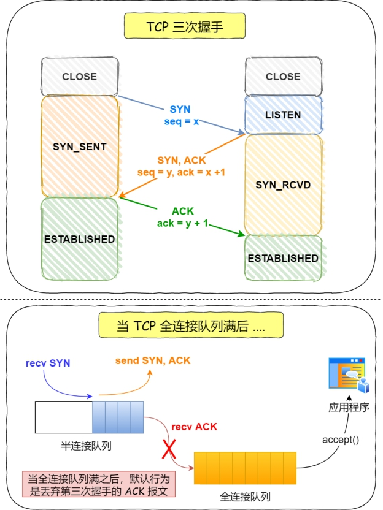

另外，当 TCP 全连接队列溢出后，由于 tcp_abort_on_overflow内核参数默认为 0，所以服务端会丢掉客户端发过来的 ack，如果你把该参数设置为 1，那现象将变成，服务端会给客户端发送 RST 报文，废弃掉连接。

那要扩大全连接队列也不难，TCP 全连接队列最大值取决于 somaxconn 和 backlog 之间的最小值，也就是 min(somaxconn, backlog)
，其中 somaxconn 是内核参数，而 backlog 是我们程序 listen 方法中指定的参数。

上面这个小例子，很明显是无法通过看应用层的代码来解决的，必须了解 TCP 的机制，才能找到解决之道。

铺垫了那么多，接下里进入正题。


## 10.1 计算机网络怎么学？

计算机网络相比操作系统好学非常多，因为计算机网络不抽象，你要想知道网络中的细节，你都可以通过抓包来分析，而且不管是手机、个人电脑和服务器，它们所使用的计算网络协议是一致的。

也就是说，计算机网络不会因为设备的不同而不同，大家都遵循这一套「规则」来相互通信，这套规则就是 TCP/IP 网络模型。

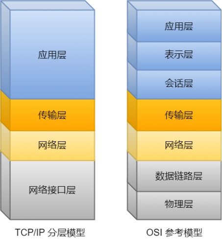

TCP/IP 网络参考模型共有 4层，其中需要我们熟练掌握的是应用层、传输层和网络层，至于网络接口层（数据链路层和物理层）我们只需要做简单的了解就可以了。

对于应用层，当然重点要熟悉最常见的 [HTTP 和 HTTPS](https://mp.weixin.qq.com/s/bUy220-ect00N4gnO0697A)，传输层 TCP 和 UDP 都要熟悉，网络层要熟悉 [IPv4](https://mp.weixin.qq.com/s/bUy220-ect00N4gnO0697A)，IPv6 可以做简单点了解。

我觉得学习一个东西，就从我们常见的事情开始着手。

比如， ping 命令可以说在我们判断网络环境的时候，最常使用的了，你可以先把你电脑 ping 你舍友或同事的电脑的过程中发生的事情都搞明白，这样就基本知道一个数据包是怎么转发的了，于是你就知道了网络层、数据链路层和物理层之间是如何工作，如何相互配合的了。

搞明白了 [ping 过程](https://mp.weixin.qq.com/s/leE2DgDOl5z90hG2gG1Urw)，我相信你学起 HTTP 请求过程的时候，会很快就能掌握了，因为网络层以下的工作方式，你在学习 ping 的时候就已经明白了，这时就只需要认真掌握传输层中的 TCP 和应用层中的 HTTP 协议，就能搞明白[访问网页的整个过程](https://mp.weixin.qq.com/s/iSZp41SRmh5b2bXIvzemIw)了，这也是面试常见的题目了，毕竟它能考察你网络知识的全面性。

重中之重的知识就是 TCP 了，TCP 不管是[建立连接、断开连接](https://mp.weixin.qq.com/s/tH8RFmjrveOmgLvk9hmrkw)的过程，还是数据传输的过程，都不能放过，针对数据可靠传输的特性，又可以拆解为[超时重新、流量控制、滑动窗口、拥塞控制](https://mp.weixin.qq.com/s/Tc09ovdNacOtnMOMeRc_uA)等等知识点，学完这些只能算对 TCP 有个「感性」的认识，另外我们还得知道 Linux 提供的 [TCP 内核的参数](https://mp.weixin.qq.com/s/fjnChU3MKNc_x-Wk7evLhg)的作用，这样才能从容地应对工作中遇到的问题。

接下来，推荐我看过并觉得不错的计算机网络相关的书籍和视频。


### 入门系列

此系列针对没有任何计算机基础的朋友，如果已经对计算机轻车熟路的大佬，也不要忽略，不妨看看我推荐的正确吗。

如果你要入门 HTTP，首先最好书籍就是《图解 HTTP》了，作者真的做到完完全全的「图解」，小林的图解功夫还是从这里偷学到不少，书籍不厚，相信优秀的你，几天就可以看完了。


如果要入门 TCP/IP 网络模型，我推荐的是《图解 TCP/IP》，这本书也是以大量的图文来介绍了 TCP/IP 网络模式的每一层，但是这个书籍的顺序不是从「应用层 —> 物理层」，而是从「物理层 -> 应用层」顺序开始讲的，这一点我觉得不太好，这样一上来就把最枯燥的部分讲了，很容易就被劝退了，所以我建议先跳过前面几个章节，先看网络层和传输层的章节，然后再回头看前面的这几个章节。


另外，你想了解网络是怎么传输，那我推荐《网络是怎样连接的》，这本书相对比较全面的把访问一个网页的发生的过程讲解了一遍，其中关于电信等运营商是怎么传输的，这部分你可以跳过，当然你感兴趣也可以看，只是我觉得没必要看。


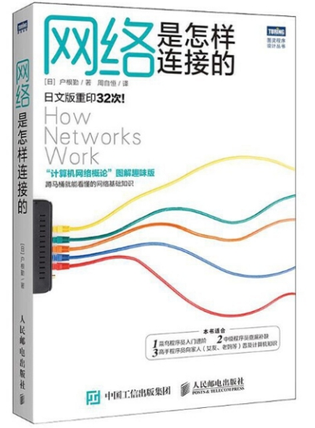

如果你觉得书籍过于枯燥，你可以结合 B 站《计算机网络微课堂》视频一起学习，这个视频是湖南科技大学老师制作的，PPT 的动图是我见过做的最用心的了，一看就懂的佳作。

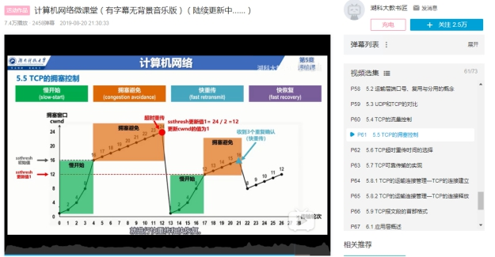

B 站视频地址：https://www.bilibili.com/video/BV1c4411d7jb?p=1


### 深入学习系列

看完入门系列，相信你对计算机网络已经有个大体的认识了，接下来我们也不能放慢脚步，快马加鞭，借此机会继续深入学习，因为隐藏在背后的细节还是很多的。

对于 TCP/IP 网络模型深入学习的话，推荐《计算机网络 - 自顶向下方法》，这本书是从我们最熟悉 HTTP 开始说起，一层一层的说到最后物理层的，有种挖地洞的感觉，这样的内容编排顺序相对是比较合理的。

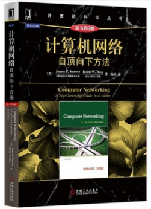


但如果要深入 TCP，前面的这些书还远远不够，赋有计算机网络圣经的之说的《TCP/IP 详解 卷一：协议》这本书，是进一步深入学习的好资料，这本书的作者用各种实验的方式来细说各种协议，但不得不说，这本书真的很枯燥，当时我也啃的很难受，但是它质量是真的很高，这本书我只看了 TCP 部分，其他部分你可以选择性看，但是你一定要过几遍这本书的 TCP 部分，涵盖的内容非常全且细。


要说我看过最好的 TCP 资料，那必定是《The TCP/IP GUIDE》这本书了，目前只有英文版本的，而且有个专门的网址可以白嫖看这本书的内容，图片都是彩色，看起来很舒服很鲜明，小林之前写的 TCP 文章不少案例和图片都是参考这里的，这本书精华部分就是把 TCP 滑动窗口和流量控制说的超级明白，很可惜拥塞控制部分说的不多。

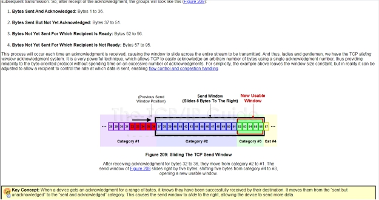


白嫖站点：http://www.tcpipguide.com/free/t_TCPSlidingWindowAcknowledgmentSystemForDataTranspo-6.htm


当然，计算机网络最牛逼的资料，那必定 RFC 文档，它可以称为计算机网络世界的「法规」，也是最新、最权威和最正确的地方了，困惑大家的 TCP 为什么三次握手和四次挥手，其实在 RFC 文档几句话就说明白了。

TCP 协议的 RFC 文档：https://datatracker.ietf.org/doc/rfc1644/


### 实战系列

在学习书籍资料的时候，不管是 TCP、UDP、ICMP、DNS、HTTP、HTTPS 等协议，最好都可以亲手尝试抓数据报，接着可以用 [Wireshark 工具](https://mp.weixin.qq.com/s/bHZ2_hgNQTKFZpWMCfUH9A)看每一个数据报文的信息，这样你会觉得计算机网络没有想象中那么抽象了，因为它们被你「抓」出来了，并毫无保留地显现在你面前了，于是你就可以肆无忌惮地「扒开」它们，看清它们每一个头信息。

那在这里，我也给你推荐 2 本关于 Wireshark 网络分析的书，这两本书都是同一个作者，书中的案例都是源于作者工作中的实际的案例，作者的文笔相当有趣，看起来堪比小说一样爽，相信你不用一个星期 2 本都能看完了。


### 最后

文中推荐的书，小林都已经把电子书整理好给大家了，只需要在小林的公众号后台回复「我要学习」，即可获取百度网盘下载链接。


## 10.2 操作系统怎么学？

操作系统真的可以说是 Super Man，它为了我们做了非常厉害的事情，以至于我们根本察觉不到，只有通过学习它，我们才能深刻体会到它的精妙之处，甚至会被计算机科学家设计思想所震撼，有些思想实际上也是可以应用于我们工作开发中。

操作系统比较重要的四大模块，分别是[内存管理](https://mp.weixin.qq.com/s/HJB_ATQFNqG82YBCRr97CA)、[进程管理](https://mp.weixin.qq.com/s/YXl6WZVzRKCfxzerJWyfrg)、[文件系统管理](https://mp.weixin.qq.com/s/qJdoXTv_XS_4ts9YuzMNIw)、[输入输出设备管理](https://mp.weixin.qq.com/s/04BkLtnPBmmx6CtdQPXiRA)。这是我学习操作系统的顺序，也是我推荐给大家的学习顺序，因为内存管理不仅是最重要、最难的模块，也是和其他模块关联性最大的模块，先把它搞定，后续的模块学起来我认为会相对轻松一些。

学习的过程中，你可能会遇到很多「虚拟」的概念，比如虚拟内存、虚拟文件系统，实际上它们的本质上都是一样的，都是向下屏蔽差异，向上提供统一的东西，以方便我们程序员使用。

还有，你也遇到各种各样的[调度算法](https://mp.weixin.qq.com/s/JWj6_BF9Xc84kQcyx6Nf_g)，在这里你可以看到数据结构与算法的魅力，重要的是我们要理解为什么要提出那么多调度算法，你当然可以说是为了更快更有效率，但是因什么问题而因此引入新算法的这个过程，更是我们重点学习的地方。

你也会开始明白进程与线程最大的区别在于上下文切换过程中，线程不用切换虚拟内存，因为同一个进程内的线程都是共享虚拟内存空间的，线程就单这一点不用切换，就相比进程上下文切换的性能开销减少了很多。由于虚拟内存与物理内存的映射关系需要查询页表，页表的查询是很慢的过程，因此会把常用的地址映射关系缓存在 TLB 里的，这样便可以提高页表的查询速度，如果发生了进程切换，那 TLB 缓存的地址映射关系就会失效，缓存失效就意味着命中率降低，于是虚拟地址转为物理地址这一过程就会很慢。

你也开始不会傻傻的认为 read 或 write 之后数据就直接写到硬盘了，更不会觉得多次操作 read 或 write 方法性能会很低，因为你发现操作系统会有个「磁盘高速缓冲区」，它已经帮我们做了缓存的工作，它会预读数据、缓存最近访问的数据，以及使用 I/O 调度算法来合并和排队磁盘调度 I/O，这些都是为了减少操作系统对磁盘的访问频率。

……

还有太多太多了，我在这里就不赘述了，剩下的就交给你们在学习操作系统的途中去探索和发现了。

还有一点需要注意，学操作系统的时候，不要误以为它是在说 Linux 操作系统，这也是我初学的时候犯的一个错误，操作系统是集合大多数操作系统实现的思想，跟实际具体实现的 Linux 操作系统多少都会有点差别，如果要想 Linux 操作系统的具体实现方式，可以选择看 Linux 内核相关的资料，但是在这之前你先掌握了操作系统的基本知识，这样学起来才能事半功倍。


### 入门系列

对于没学过操作系统的小白，我建议学的时候，不要直接闷头看书。相信我，你不用几分钟就会打退堂鼓，然后就把厚厚的书拿去垫显示器了，从此再无后续，毕竟直接看书太特喵的枯燥了，当然不如用来垫显示器玩游戏来着香。

B 站关于操作系统课程资源很多，我在里面也看了不同老师讲的课程，觉得比较好的入门级课程是《操作系统 - 清华大学》，该课程由清华大学老师向勇和陈渝授课，虽然我们上不了清华大学，但是至少我们可以在网上选择听清华大学的课嘛。课程授课的顺序，就如我前面推荐的学习顺序：「内存管理 -> 进程管理 -> 文件系统管理 -> 输入输出设备管理」。

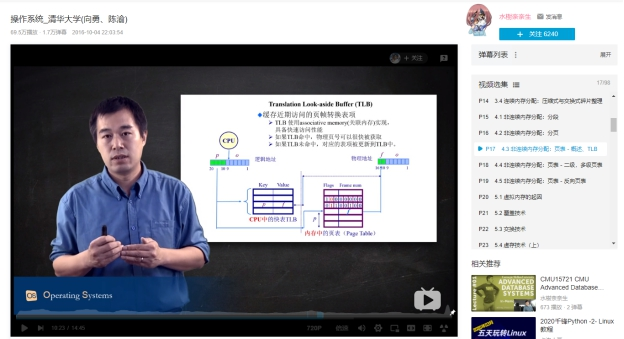

B 站清华大学操作系统视频地址：https://www.bilibili.com/video/BV1js411b7vg?from=search&seid=2361361014547524697

该清华大学的视频教学搭配的书应该是《现代操作系统》，你可以视频和书籍两者结合一起学，比如看完视频的内存管理，然后就看书上对应的章节，这样相比直接啃书相对会比较好。

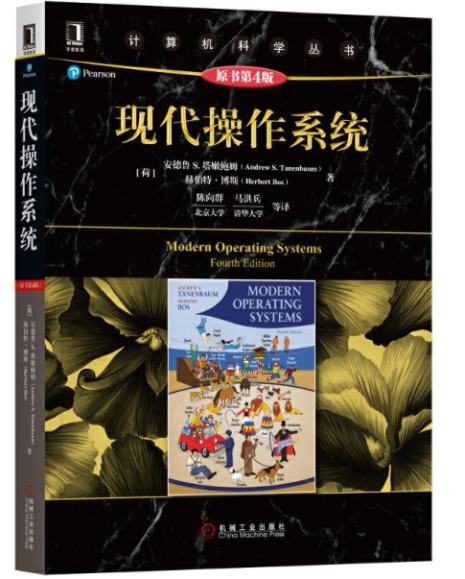

清华大学的操作系统视频课讲的比较精炼，涉及到的内容没有那么细，《操作系统 - 哈工大》李治军老师授课的视频课程相对就会比较细节，老师会用 Linux 内核代码的角度带你进一步理解操作系统，也会用生活小例子帮助你理解。

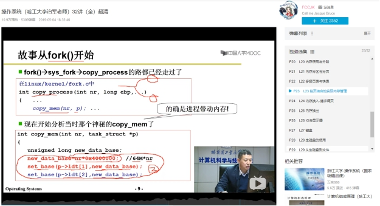

B 站哈工大操作系统视频地址：https://www.bilibili.com/video/BV1d4411v7u7?from=search&seid=2361361014547524697


### 深入学习系列

《现代操作系统》这本书我感觉缺少比较多细节，说的还是比较笼统，而且书也好无聊。

推荐一个说的更细的操作系统书 —— 《操作系统导论》，这本书不仅告诉你 What，还会告诉你 How，书的内容都是循序渐进，层层递进的，阅读起来还是觉得挺有意思的，这本书的内存管理和并发这两个部分说的很棒，这本书的中文版本我也没找到资源，不过微信读书可以免费看这本书。

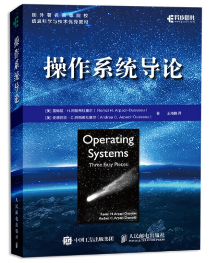

当然，少不了这本被称为神书的《深入理解计算机系统》，豆瓣评分高达 9.8分，这本书严格来说不算操作系统书，它是以程序员视角理解计算机系统，不只是涉及到操作系统，还涉及到了计算机组成、C 语言、汇编语言等知识，是一本综合性比较强的书。


它告诉我们计算机是如何设计和工作的，操作系统有哪些重点，它们的作用又是什么，这本书的目标其实便是要讲清楚原理，但并不会把某个话题挖掘地过于深入，过于细节。看看这本书后，我们就可以对计算机系统各组件的工作方式有了理性的认识。在一定程度上，其实它是在锻炼一种思维方式 —— 计算思维。


### 最后

文中推荐的书，小林都已经把电子书整理好给大家了，只需要在小林的公众号后台回复「我要学习」，即可获取百度网盘下载链接。


# 十一、画图经验

小林写这么多篇图解文章，你们猜我收到的最多的读者问题是什么？没错，就是问我是使用什么画图工具，看来对这一点大家都相当好奇，那干脆不如写一篇介绍下我是怎么画图的。

如果我的文章缺少了自己画的图片，相当于失去了灵魂，技术文章本身就很枯燥，如果文章中没有几张图片，读者被劝退的概率飙飙升，剩下没被劝退的估计看着看着就睡着了。所以，精美的图片可以说是必不可少的一部分，不仅在阅读时能带来视觉的冲击，而且图片相比文字能涵盖更多的信息，不然怎会有一图胜千言的说法呢？

这时，可能有的读者会说自己不写文章呀，是不是没有必要了解画图了？我觉得这是不对，画图在我们工作中其实也是有帮助的，比如如果你想跟领导汇报一个业务流程的问题，把业务流程画出来，肯定用图的方式比用文字的方式交流起来会更有效率，更轻松些；如果你参与了一个比较复杂的项目开发，你也可以把代码的流程图给画出来，不仅能帮助自己加深理解，也能帮助后面参与的同事能更快的接手这个项目；甚至如果你要晋升级别了，演讲 PTT 里的配图也是必不可少的。

不过很多人都是纠结用什么画图工具，其实小林觉得再烂的画图工具，只要你思路清晰，确定自己要表达出什么信息，也是能把图画好的，所以不必纠结哪款画图工具，挑一款自己画起来舒服的就行了。

"小林，你说的我都懂，我就是喜欢你的画图风格嘛，你就说说你用啥画的？"

咳咳，没问题，直接坦白讲，我用的是一个在线的画图网址，地址是：

- **https://draw.io**

用它的原因是使用方便和简单，当然最重要的是它完全免费，没有什么限制，甚至还能直接把图片保存到 GoogleDrive 、 OneDrive 和 Github，我就是保存到 Github，然后用 Github 作为我的图床。

既然要认识它，那就先来看看它长什么样子，它主要分为三个区域，从左往右的顺序是「图形选择区域、绘图区域、属性设置区域」。

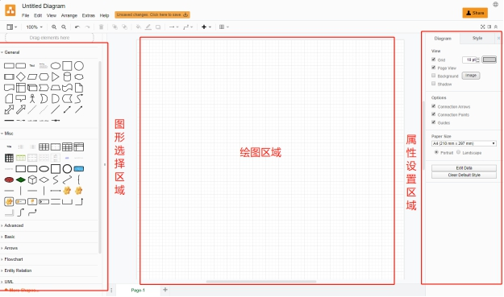

其中，最左边的「图形选择区域」可以选择的图案有很多种，常见的流程图、时序图、表格图都有，甚至还可以在最左下角的「更多图形」找到其他种类的图形，比如网络设备图标等。


再来，最右边「属性设置区域」可以设置文字的大小，图片颜色、线条形状等，而我最常用颜色板块是下面这三种，都是比较浅色的，这样看起来舒服些。


我最近常用的一个图形是圆角方块图，它的位置如下图，但是它默认的颜色过于深色，如果要在方框图中描述文字，则可能看不清楚，这时我会在最右侧的「属性设置区域」把方块颜色设置成浅色系列的。另外，还有一点需要注意的是，默认的字体大小比较小，我一般会调成 16px大小。

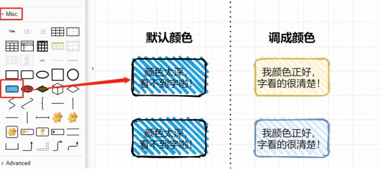

如果你不喜欢上图的带有「划痕」的圆角方块图形，可以选择下图中这个最简洁的圆角方框图形。


这个简洁的圆角方框图形，再搭配颜色，能组合成很多结构图，比如我用过它组成过 CPU Cache 的结构图。


那直角方框图形，我主要是用来组成「表格」，原因自带的表格不好看，也不方便调。

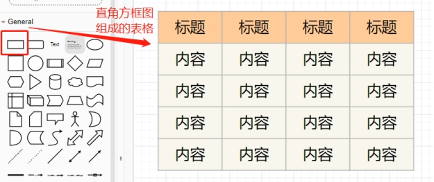

如果觉得直直的线条太死板，你可以把图片属性中的「**Comic**」勾上，于是就会变成歪歪扭扭的效果啦，有点像手绘风格，挺多人喜欢这种风格。

比如，我用过这种风格画过 TCP 三次握手流程的图。

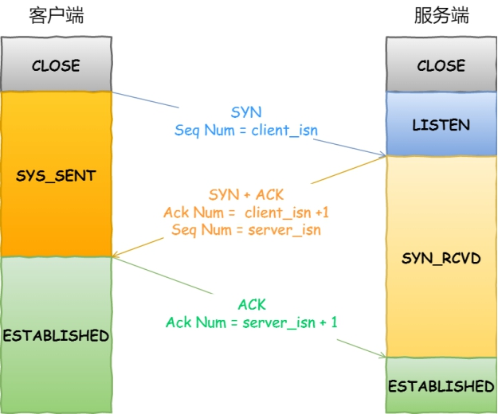

方块图形再加上菱形，就可以组合成简单程序流程图了，比如我画过存储器缓存流程图。

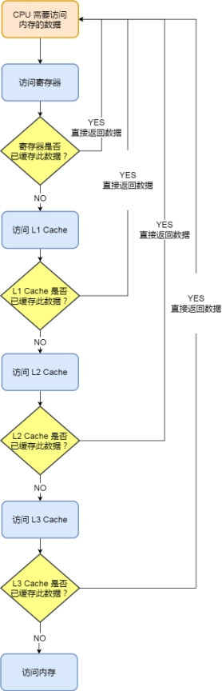

所以，不要小看这些基本图形，只要构思清晰，再基本的图形，也是能构成层次分明并且好看的图。

基本的图形介绍完后，相信你画一些简单程序流程图等图形是没问题的了，接下来就是各种图形 + 线条的组合的了。

通过一些基本的图形组合，你还可以画出时序图，时序图可以用来描述多个对象之间的交互流程，比如我画过多个线程获取互斥锁的时序图。


再来，为了更好表达零拷贝技术的过程，那么用图的方式会更清晰。


前面也提到，图形不只是简单图形，还有其他自带的设备类图形，比如我用网络设备图画过单播、广播、多播通信的区别图。

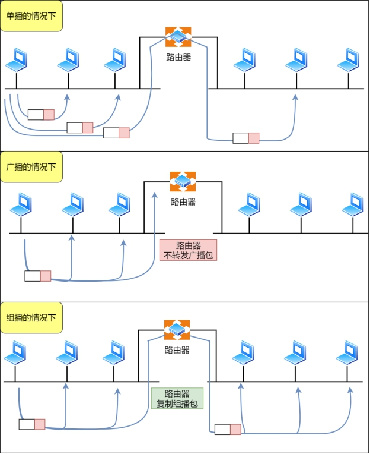

你要说，我画过最复杂的图，那就是写 TCP 流量控制的时候，把整个交互过程 + 文字描述 + 滑动窗口状况都画出来了，现在回想起来还是觉得累人。

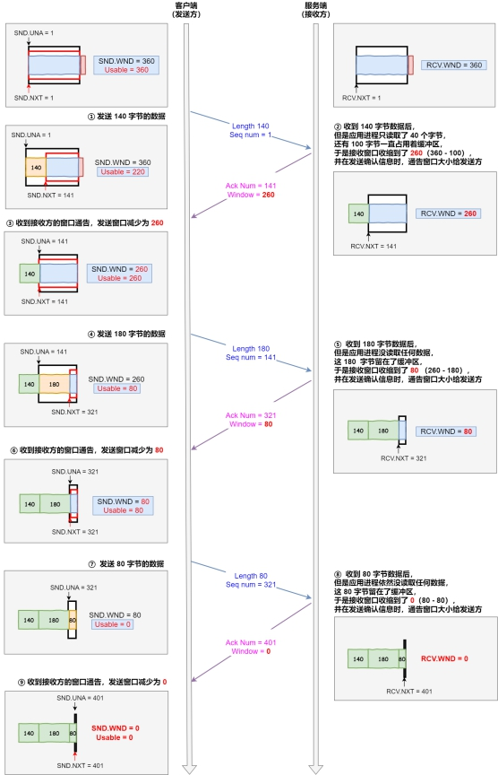

还有好多好多，我就比一一列举，这半年下来，小林至少画了 500+张图了，每一张图其实还是挺费时间的，相信画过图的朋友后，都能体会到这种感觉了。但没办法，谁叫小林是图解工具人呢，画图可以更好的诠释文章内容，但最重要的是，把你们吸引过来了，这是件让我非常高兴的事情，也是让我感觉画图这个事情值得认真做。

另外，细心的读者也发现了，小林贴代码的时候，使用的是图片的形式，原因是代码通常都是比较长，在手机看文章用图片的呈现的方式会更舒服清晰。

在这里也推荐下这个代码截图网址：

- **https://carbon.now.sh/**

网站页面如下图，代码显示的效果是不是很美观？

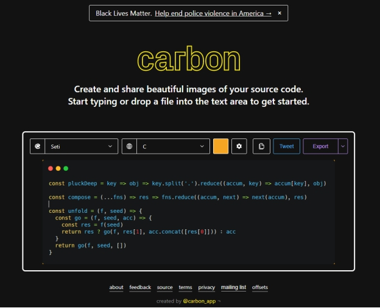

文字的分享有局限性，关键还是要你自己动手摸索摸索，形成自己一套画图的方法论，练习的时候可以先从模仿画起，后面再结合工作或文章的需求画出自己心中的那个图。

